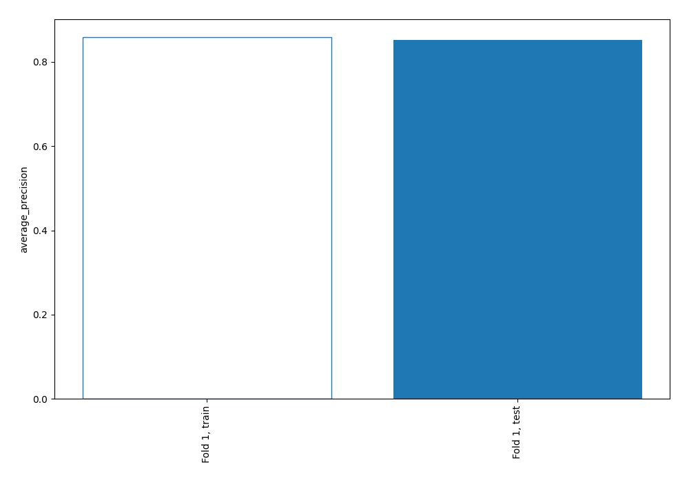
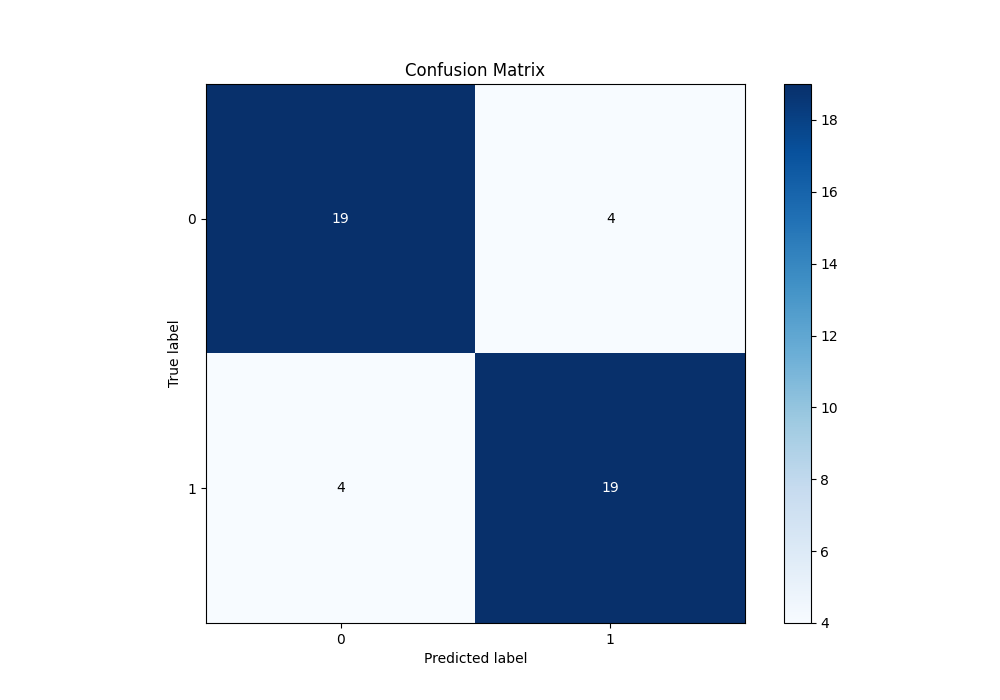
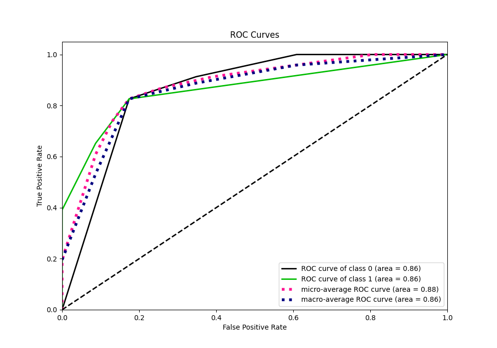
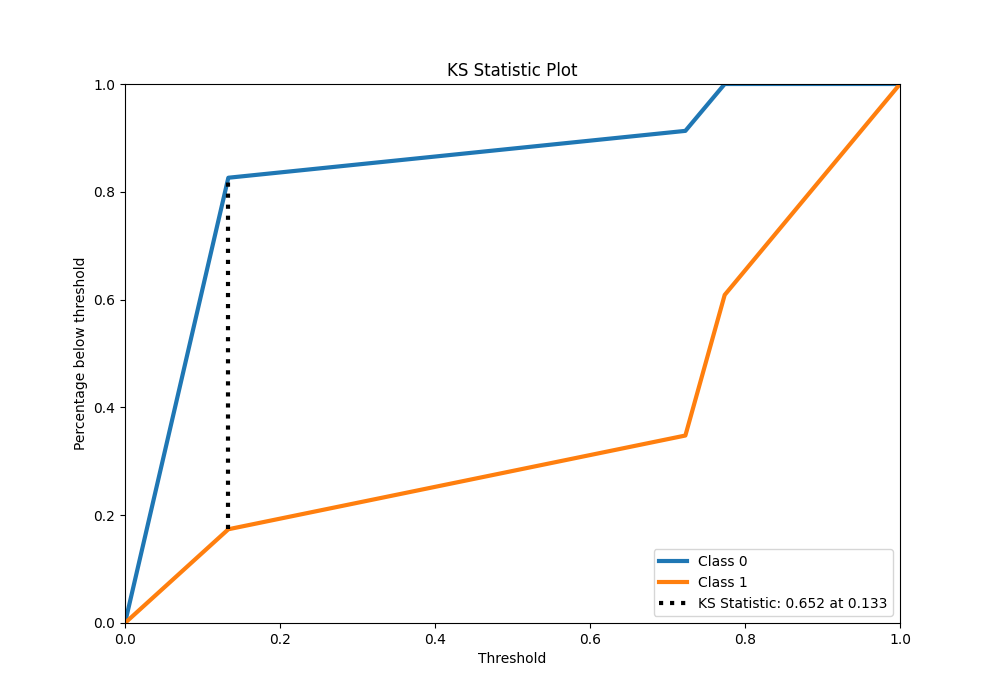
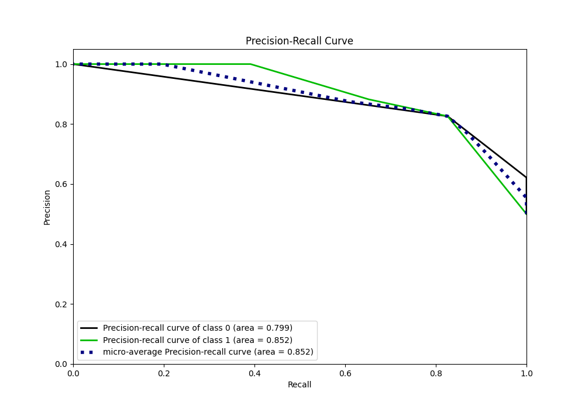
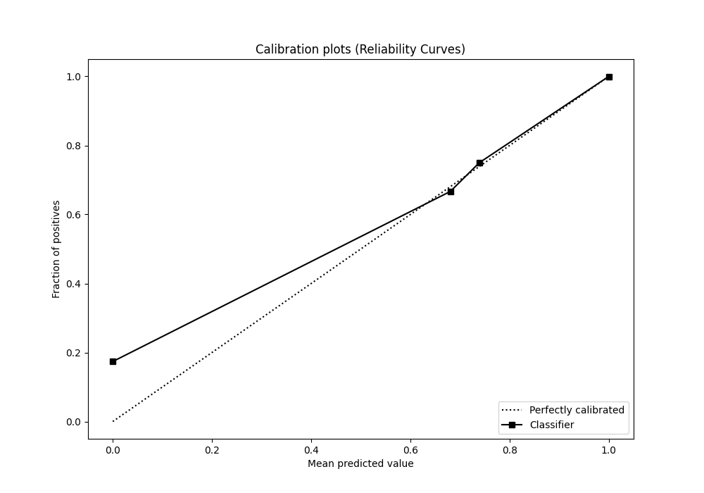
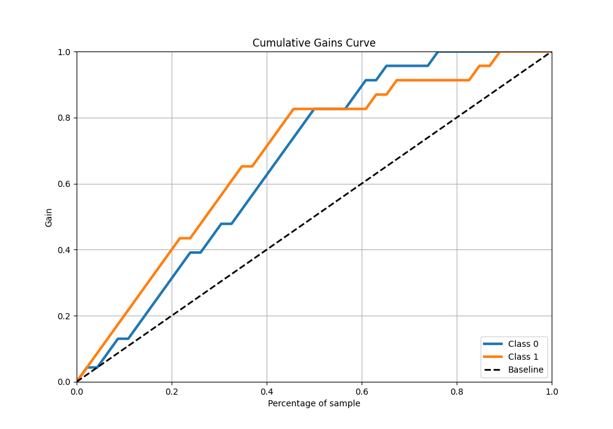
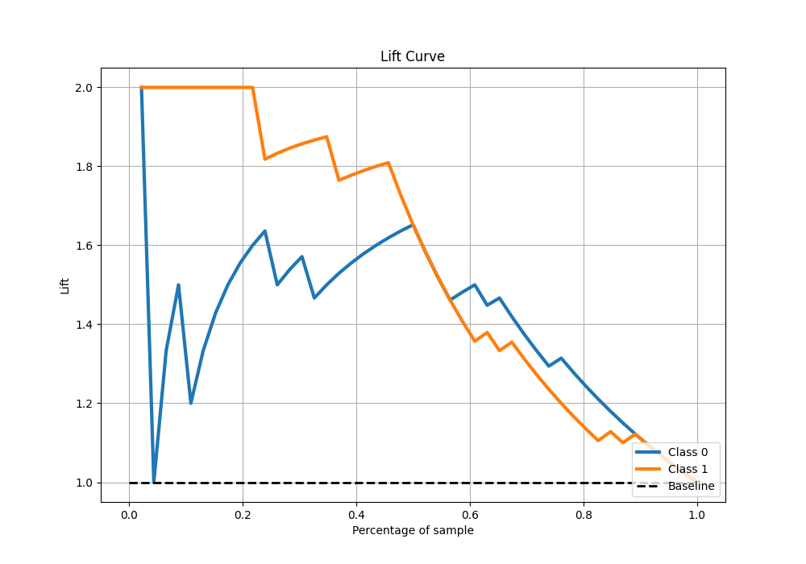

# Summary of 97_DecisionTree

[<< Go back](../README.md)

## Decision Tree
- **n_jobs**: -1
- **criterion**: gini
- **max_depth**: 2
- **explain_level**: 0

## Validation
 - **validation_type**: split
 - **train_ratio**: 0.9
 - **shuffle**: True
 - **stratify**: True

## Optimized metric
average_precision

## Training time

5.0 seconds

## Metric details
|           |    score |   threshold |
|:----------|---------:|------------:|
| logloss   | 0.41641  |  nan        |
| auc       | 0.863894 |  nan        |
| f1        | 0.826087 |    0.133333 |
| accuracy  | 0.826087 |    0.133333 |
| precision | 1        |    0.77381  |
| recall    | 1        |    0.12     |
| mcc       | 0.652174 |    0.133333 |

## Metric details with threshold from accuracy metric
|           |    score |   threshold |
|:----------|---------:|------------:|
| logloss   | 0.41641  |  nan        |
| auc       | 0.863894 |  nan        |
| f1        | 0.826087 |    0.133333 |
| accuracy  | 0.826087 |    0.133333 |
| precision | 0.826087 |    0.133333 |
| recall    | 0.826087 |    0.133333 |
| mcc       | 0.652174 |    0.133333 |

## Confusion matrix (at threshold=0.133333)
|              |   Predicted as 0 |   Predicted as 1 |
|:-------------|-----------------:|-----------------:|
| Labeled as 0 |               19 |                4 |
| Labeled as 1 |                4 |               19 |

## Learning curves

## Confusion Matrix

## Normalized Confusion Matrix

## ROC Curve

## Kolmogorov-Smirnov Statistic

## Precision-Recall Curve

## Calibration Curve

## Cumulative Gains Curve

## Lift Curve

[<< Go back](../README.md)
