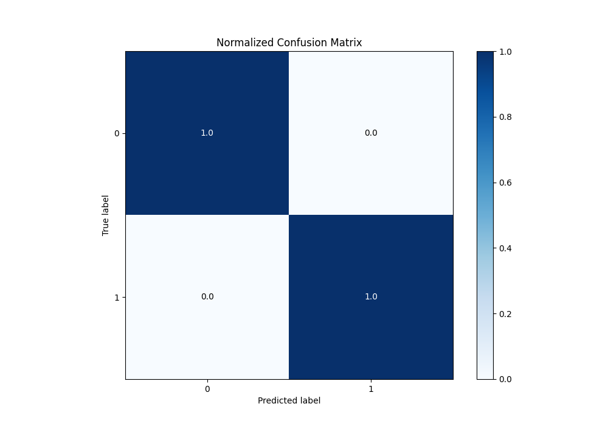
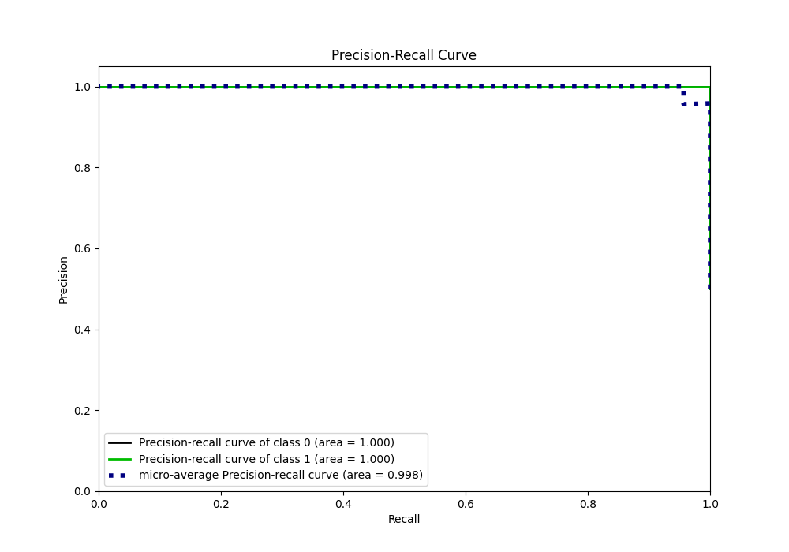

# Summary of 99_LightGBM

[<< Go back](../README.md)

## LightGBM
- **n_jobs**: -1
- **objective**: binary
- **num_leaves**: 31
- **learning_rate**: 0.1
- **feature_fraction**: 0.9
- **bagging_fraction**: 0.9
- **min_data_in_leaf**: 5
- **metric**: custom
- **custom_eval_metric_name**: average_precision
- **explain_level**: 0

## Validation
 - **validation_type**: split
 - **train_ratio**: 0.9
 - **shuffle**: True
 - **stratify**: True

## Optimized metric
average_precision

## Training time

5.9 seconds

## Metric details
|           |    score |   threshold |
|:----------|---------:|------------:|
| logloss   | 0.236564 |  nan        |
| auc       | 1        |  nan        |
| f1        | 1        |    0.361802 |
| accuracy  | 1        |    0.361802 |
| precision | 1        |    0.361802 |
| recall    | 1        |    0.144842 |
| mcc       | 1        |    0.361802 |

## Metric details with threshold from accuracy metric
|           |    score |   threshold |
|:----------|---------:|------------:|
| logloss   | 0.236564 |  nan        |
| auc       | 1        |  nan        |
| f1        | 1        |    0.361802 |
| accuracy  | 1        |    0.361802 |
| precision | 1        |    0.361802 |
| recall    | 1        |    0.361802 |
| mcc       | 1        |    0.361802 |

## Confusion matrix (at threshold=0.361802)
|              |   Predicted as 0 |   Predicted as 1 |
|:-------------|-----------------:|-----------------:|
| Labeled as 0 |               23 |                0 |
| Labeled as 1 |                0 |               23 |

## Learning curves

## Confusion Matrix

## Normalized Confusion Matrix

## ROC Curve

## Kolmogorov-Smirnov Statistic

## Precision-Recall Curve

## Calibration Curve

## Cumulative Gains Curve

## Lift Curve

[<< Go back](../README.md)
