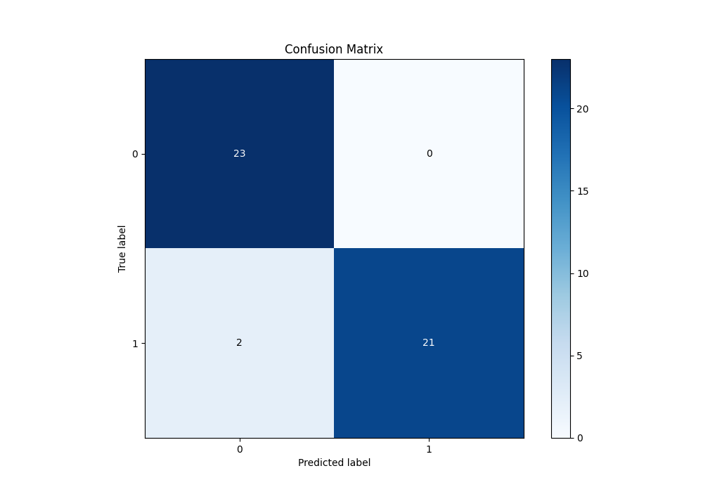

# Summary of 9_Default_RandomForest

[<< Go back](../README.md)

## Random Forest
- **n_jobs**: -1
- **criterion**: gini
- **max_features**: 0.9
- **min_samples_split**: 30
- **max_depth**: 4
- **eval_metric_name**: average_precision
- **explain_level**: 0

## Validation
 - **validation_type**: split
 - **train_ratio**: 0.9
 - **shuffle**: True
 - **stratify**: True

## Optimized metric
average_precision

## Training time

2.6 seconds

## Metric details
|           |    score |   threshold |
|:----------|---------:|------------:|
| logloss   | 0.198581 | nan         |
| auc       | 0.988658 | nan         |
| f1        | 0.954545 |   0.539741  |
| accuracy  | 0.956522 |   0.539741  |
| precision | 1        |   0.539741  |
| recall    | 1        |   0.0150749 |
| mcc       | 0.916515 |   0.539741  |

## Metric details with threshold from accuracy metric
|           |    score |   threshold |
|:----------|---------:|------------:|
| logloss   | 0.198581 |  nan        |
| auc       | 0.988658 |  nan        |
| f1        | 0.954545 |    0.539741 |
| accuracy  | 0.956522 |    0.539741 |
| precision | 1        |    0.539741 |
| recall    | 0.913043 |    0.539741 |
| mcc       | 0.916515 |    0.539741 |

## Confusion matrix (at threshold=0.539741)
|              |   Predicted as 0 |   Predicted as 1 |
|:-------------|-----------------:|-----------------:|
| Labeled as 0 |               23 |                0 |
| Labeled as 1 |                2 |               21 |

## Learning curves

## Confusion Matrix

## Normalized Confusion Matrix

## ROC Curve

## Kolmogorov-Smirnov Statistic

## Precision-Recall Curve

## Calibration Curve

## Cumulative Gains Curve

## Lift Curve

[<< Go back](../README.md)
