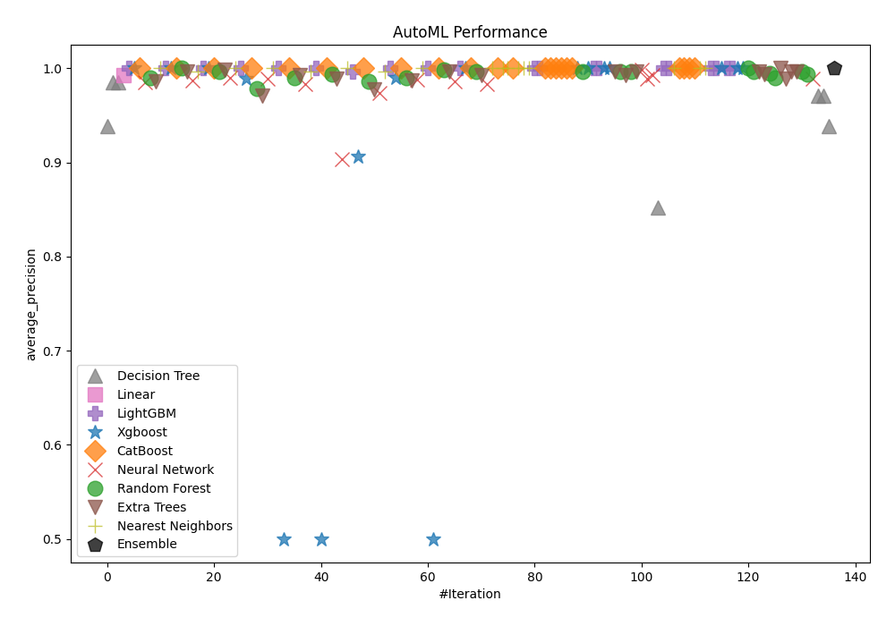
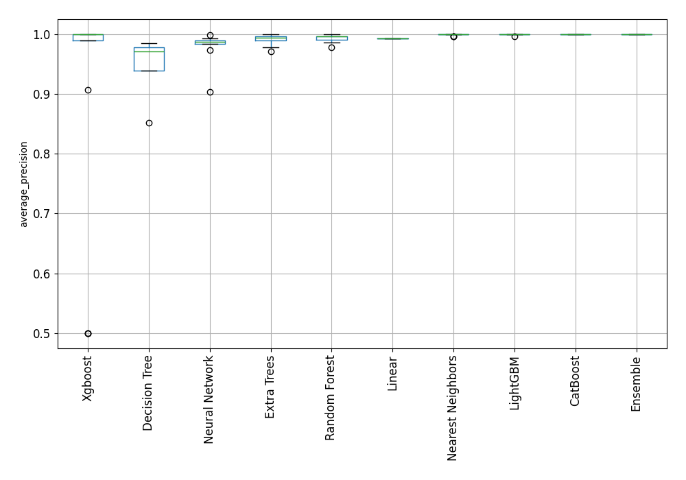
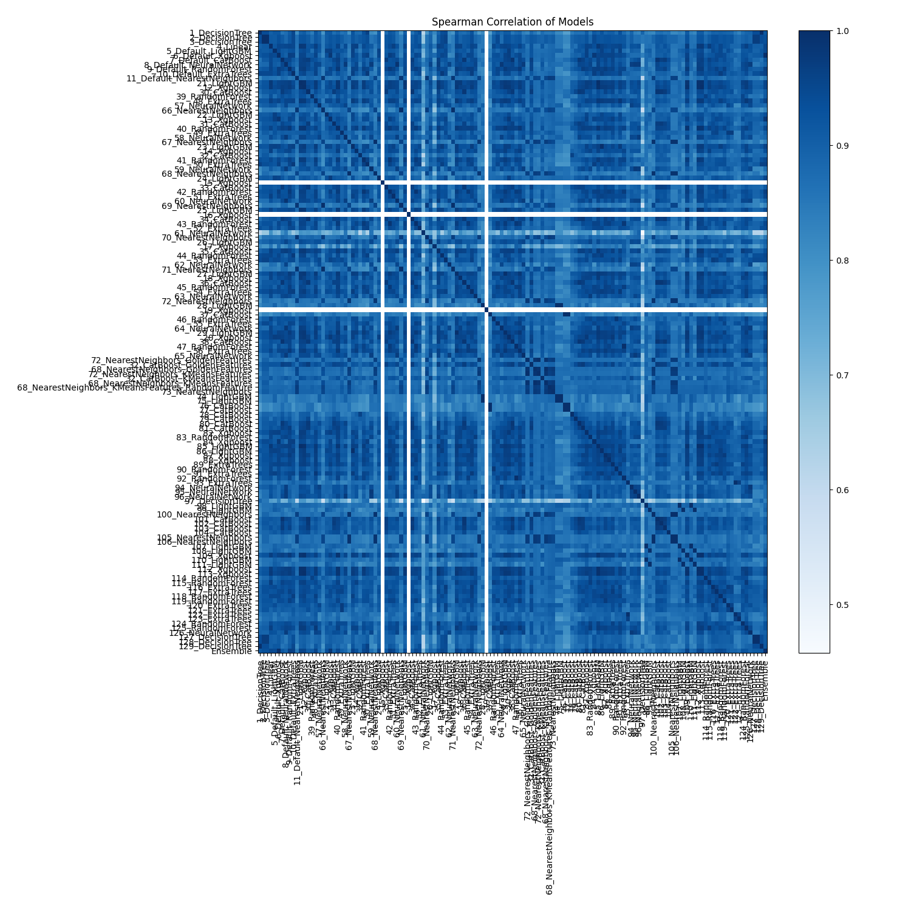

# AutoML Leaderboard

| Best model   | name                                                                                                           | model_type        | metric_type       |   metric_value |   train_time |
|:-------------|:---------------------------------------------------------------------------------------------------------------|:------------------|:------------------|---------------:|-------------:|
|              | [1_DecisionTree](1_DecisionTree/README.md)                                                                     | Decision Tree     | average_precision |       0.938491 |        10.73 |
|              | [2_DecisionTree](2_DecisionTree/README.md)                                                                     | Decision Tree     | average_precision |       0.98499  |         2.06 |
|              | [3_DecisionTree](3_DecisionTree/README.md)                                                                     | Decision Tree     | average_precision |       0.98499  |         2.22 |
|              | [4_Linear](4_Linear/README.md)                                                                                 | Linear            | average_precision |       0.992899 |         5.19 |
|              | [5_Default_LightGBM](5_Default_LightGBM/README.md)                                                             | LightGBM          | average_precision |       1        |         3.3  |
| **the best** | [6_Default_Xgboost](6_Default_Xgboost/README.md)                                                               | Xgboost           | average_precision |       1        |         3.4  |
|              | [7_Default_CatBoost](7_Default_CatBoost/README.md)                                                             | CatBoost          | average_precision |       1        |         4.45 |
|              | [8_Default_NeuralNetwork](8_Default_NeuralNetwork/README.md)                                                   | Neural Network    | average_precision |       0.985157 |         2.94 |
|              | [9_Default_RandomForest](9_Default_RandomForest/README.md)                                                     | Random Forest     | average_precision |       0.989936 |         3.51 |
|              | [10_Default_ExtraTrees](10_Default_ExtraTrees/README.md)                                                       | Extra Trees       | average_precision |       0.986155 |         3.23 |
|              | [11_Default_NearestNeighbors](11_Default_NearestNeighbors/README.md)                                           | Nearest Neighbors | average_precision |       1        |         2.6  |
|              | [21_LightGBM](21_LightGBM/README.md)                                                                           | LightGBM          | average_precision |       1        |         3.26 |
|              | [12_Xgboost](12_Xgboost/README.md)                                                                             | Xgboost           | average_precision |       1        |         3.49 |
|              | [30_CatBoost](30_CatBoost/README.md)                                                                           | CatBoost          | average_precision |       1        |         4.06 |
|              | [39_RandomForest](39_RandomForest/README.md)                                                                   | Random Forest     | average_precision |       1        |         4.79 |
|              | [48_ExtraTrees](48_ExtraTrees/README.md)                                                                       | Extra Trees       | average_precision |       0.996522 |         7.05 |
|              | [57_NeuralNetwork](57_NeuralNetwork/README.md)                                                                 | Neural Network    | average_precision |       0.98687  |         5.64 |
|              | [66_NearestNeighbors](66_NearestNeighbors/README.md)                                                           | Nearest Neighbors | average_precision |       0.996377 |         4.88 |
|              | [22_LightGBM](22_LightGBM/README.md)                                                                           | LightGBM          | average_precision |       1        |         5.6  |
|              | [13_Xgboost](13_Xgboost/README.md)                                                                             | Xgboost           | average_precision |       1        |         5.15 |
|              | [31_CatBoost](31_CatBoost/README.md)                                                                           | CatBoost          | average_precision |       1        |         6.14 |
|              | [40_RandomForest](40_RandomForest/README.md)                                                                   | Random Forest     | average_precision |       0.996522 |         5.76 |
|              | [49_ExtraTrees](49_ExtraTrees/README.md)                                                                       | Extra Trees       | average_precision |       0.998188 |         5.72 |
|              | [58_NeuralNetwork](58_NeuralNetwork/README.md)                                                                 | Neural Network    | average_precision |       0.989855 |         5.65 |
|              | [67_NearestNeighbors](67_NearestNeighbors/README.md)                                                           | Nearest Neighbors | average_precision |       1        |         4.31 |
|              | [23_LightGBM](23_LightGBM/README.md)                                                                           | LightGBM          | average_precision |       1        |         5.91 |
|              | [14_Xgboost](14_Xgboost/README.md)                                                                             | Xgboost           | average_precision |       0.989118 |         5.69 |
|              | [32_CatBoost](32_CatBoost/README.md)                                                                           | CatBoost          | average_precision |       1        |         6.64 |
|              | [41_RandomForest](41_RandomForest/README.md)                                                                   | Random Forest     | average_precision |       0.97825  |         6.08 |
|              | [50_ExtraTrees](50_ExtraTrees/README.md)                                                                       | Extra Trees       | average_precision |       0.97118  |         5.51 |
|              | [59_NeuralNetwork](59_NeuralNetwork/README.md)                                                                 | Neural Network    | average_precision |       0.988613 |         5.67 |
|              | [68_NearestNeighbors](68_NearestNeighbors/README.md)                                                           | Nearest Neighbors | average_precision |       1        |         4.44 |
|              | [24_LightGBM](24_LightGBM/README.md)                                                                           | LightGBM          | average_precision |       1        |         5.69 |
|              | [15_Xgboost](15_Xgboost/README.md)                                                                             | Xgboost           | average_precision |       0.5      |         3.95 |
|              | [33_CatBoost](33_CatBoost/README.md)                                                                           | CatBoost          | average_precision |       1        |         6.83 |
|              | [42_RandomForest](42_RandomForest/README.md)                                                                   | Random Forest     | average_precision |       0.989936 |         6.79 |
|              | [51_ExtraTrees](51_ExtraTrees/README.md)                                                                       | Extra Trees       | average_precision |       0.992899 |         5.98 |
|              | [60_NeuralNetwork](60_NeuralNetwork/README.md)                                                                 | Neural Network    | average_precision |       0.983202 |         5.31 |
|              | [69_NearestNeighbors](69_NearestNeighbors/README.md)                                                           | Nearest Neighbors | average_precision |       0.996377 |         4.8  |
|              | [25_LightGBM](25_LightGBM/README.md)                                                                           | LightGBM          | average_precision |       1        |         5.57 |
|              | [16_Xgboost](16_Xgboost/README.md)                                                                             | Xgboost           | average_precision |       0.5      |         3.87 |
|              | [34_CatBoost](34_CatBoost/README.md)                                                                           | CatBoost          | average_precision |       1        |         7.08 |
|              | [43_RandomForest](43_RandomForest/README.md)                                                                   | Random Forest     | average_precision |       0.993559 |         6.93 |
|              | [52_ExtraTrees](52_ExtraTrees/README.md)                                                                       | Extra Trees       | average_precision |       0.989118 |         6.66 |
|              | [61_NeuralNetwork](61_NeuralNetwork/README.md)                                                                 | Neural Network    | average_precision |       0.90367  |         6.62 |
|              | [70_NearestNeighbors](70_NearestNeighbors/README.md)                                                           | Nearest Neighbors | average_precision |       1        |         5.73 |
|              | [26_LightGBM](26_LightGBM/README.md)                                                                           | LightGBM          | average_precision |       0.996522 |         6.71 |
|              | [17_Xgboost](17_Xgboost/README.md)                                                                             | Xgboost           | average_precision |       0.906251 |         5.93 |
|              | [35_CatBoost](35_CatBoost/README.md)                                                                           | CatBoost          | average_precision |       1        |         7.04 |
|              | [44_RandomForest](44_RandomForest/README.md)                                                                   | Random Forest     | average_precision |       0.986312 |         5.57 |
|              | [53_ExtraTrees](53_ExtraTrees/README.md)                                                                       | Extra Trees       | average_precision |       0.977986 |         5.61 |
|              | [62_NeuralNetwork](62_NeuralNetwork/README.md)                                                                 | Neural Network    | average_precision |       0.973521 |         5.84 |
|              | [71_NearestNeighbors](71_NearestNeighbors/README.md)                                                           | Nearest Neighbors | average_precision |       0.996377 |         4.74 |
|              | [27_LightGBM](27_LightGBM/README.md)                                                                           | LightGBM          | average_precision |       1        |         5.67 |
|              | [18_Xgboost](18_Xgboost/README.md)                                                                             | Xgboost           | average_precision |       0.989936 |         5.67 |
|              | [36_CatBoost](36_CatBoost/README.md)                                                                           | CatBoost          | average_precision |       1        |         7.27 |
|              | [45_RandomForest](45_RandomForest/README.md)                                                                   | Random Forest     | average_precision |       0.989936 |         5.91 |
|              | [54_ExtraTrees](54_ExtraTrees/README.md)                                                                       | Extra Trees       | average_precision |       0.98687  |         5.57 |
|              | [63_NeuralNetwork](63_NeuralNetwork/README.md)                                                                 | Neural Network    | average_precision |       0.987965 |         5.79 |
|              | [72_NearestNeighbors](72_NearestNeighbors/README.md)                                                           | Nearest Neighbors | average_precision |       1        |         4.75 |
|              | [28_LightGBM](28_LightGBM/README.md)                                                                           | LightGBM          | average_precision |       1        |         5.56 |
|              | [19_Xgboost](19_Xgboost/README.md)                                                                             | Xgboost           | average_precision |       0.5      |         4.32 |
|              | [37_CatBoost](37_CatBoost/README.md)                                                                           | CatBoost          | average_precision |       1        |         6.88 |
|              | [46_RandomForest](46_RandomForest/README.md)                                                                   | Random Forest     | average_precision |       0.998188 |         6.81 |
|              | [55_ExtraTrees](55_ExtraTrees/README.md)                                                                       | Extra Trees       | average_precision |       0.996522 |         5.51 |
|              | [64_NeuralNetwork](64_NeuralNetwork/README.md)                                                                 | Neural Network    | average_precision |       0.985934 |         5.42 |
|              | [29_LightGBM](29_LightGBM/README.md)                                                                           | LightGBM          | average_precision |       1        |         5.55 |
|              | [20_Xgboost](20_Xgboost/README.md)                                                                             | Xgboost           | average_precision |       1        |         5.91 |
|              | [38_CatBoost](38_CatBoost/README.md)                                                                           | CatBoost          | average_precision |       1        |         7.52 |
|              | [47_RandomForest](47_RandomForest/README.md)                                                                   | Random Forest     | average_precision |       0.996522 |         7.34 |
|              | [56_ExtraTrees](56_ExtraTrees/README.md)                                                                       | Extra Trees       | average_precision |       0.992899 |         6.81 |
|              | [65_NeuralNetwork](65_NeuralNetwork/README.md)                                                                 | Neural Network    | average_precision |       0.983562 |         7.38 |
|              | [72_NearestNeighbors_GoldenFeatures](72_NearestNeighbors_GoldenFeatures/README.md)                             | Nearest Neighbors | average_precision |       1        |        16.74 |
|              | [32_CatBoost_GoldenFeatures](32_CatBoost_GoldenFeatures/README.md)                                             | CatBoost          | average_precision |       1        |         8.01 |
|              | [68_NearestNeighbors_GoldenFeatures](68_NearestNeighbors_GoldenFeatures/README.md)                             | Nearest Neighbors | average_precision |       1        |         5.65 |
|              | [72_NearestNeighbors_KMeansFeatures](72_NearestNeighbors_KMeansFeatures/README.md)                             | Nearest Neighbors | average_precision |       1        |         5.82 |
|              | [32_CatBoost_KMeansFeatures](32_CatBoost_KMeansFeatures/README.md)                                             | CatBoost          | average_precision |       1        |         9.01 |
|              | [68_NearestNeighbors_KMeansFeatures](68_NearestNeighbors_KMeansFeatures/README.md)                             | Nearest Neighbors | average_precision |       1        |         6.93 |
|              | [68_NearestNeighbors_KMeansFeatures_RandomFeature](68_NearestNeighbors_KMeansFeatures_RandomFeature/README.md) | Nearest Neighbors | average_precision |       1        |         7.15 |
|              | [73_NearestNeighbors](73_NearestNeighbors/README.md)                                                           | Nearest Neighbors | average_precision |       1        |         7.21 |
|              | [74_LightGBM](74_LightGBM/README.md)                                                                           | LightGBM          | average_precision |       1        |         7.08 |
|              | [75_LightGBM](75_LightGBM/README.md)                                                                           | LightGBM          | average_precision |       1        |         6.54 |
|              | [76_CatBoost](76_CatBoost/README.md)                                                                           | CatBoost          | average_precision |       1        |         7.25 |
|              | [77_CatBoost](77_CatBoost/README.md)                                                                           | CatBoost          | average_precision |       1        |         7.42 |
|              | [78_CatBoost](78_CatBoost/README.md)                                                                           | CatBoost          | average_precision |       1        |         7.47 |
|              | [79_CatBoost](79_CatBoost/README.md)                                                                           | CatBoost          | average_precision |       1        |         7.75 |
|              | [80_CatBoost](80_CatBoost/README.md)                                                                           | CatBoost          | average_precision |       1        |         7.94 |
|              | [81_CatBoost](81_CatBoost/README.md)                                                                           | CatBoost          | average_precision |       1        |         8.21 |
|              | [82_Xgboost](82_Xgboost/README.md)                                                                             | Xgboost           | average_precision |       1        |         6.87 |
|              | [83_RandomForest](83_RandomForest/README.md)                                                                   | Random Forest     | average_precision |       0.996522 |         6.99 |
|              | [84_Xgboost](84_Xgboost/README.md)                                                                             | Xgboost           | average_precision |       1        |         6.75 |
|              | [85_LightGBM](85_LightGBM/README.md)                                                                           | LightGBM          | average_precision |       1        |         6.79 |
|              | [86_LightGBM](86_LightGBM/README.md)                                                                           | LightGBM          | average_precision |       1        |         6.89 |
|              | [87_Xgboost](87_Xgboost/README.md)                                                                             | Xgboost           | average_precision |       1        |         6.59 |
|              | [88_Xgboost](88_Xgboost/README.md)                                                                             | Xgboost           | average_precision |       1        |         6.87 |
|              | [89_ExtraTrees](89_ExtraTrees/README.md)                                                                       | Extra Trees       | average_precision |       0.996522 |         7.24 |
|              | [90_RandomForest](90_RandomForest/README.md)                                                                   | Random Forest     | average_precision |       0.996522 |         6.68 |
|              | [91_ExtraTrees](91_ExtraTrees/README.md)                                                                       | Extra Trees       | average_precision |       0.992899 |         7.29 |
|              | [92_RandomForest](92_RandomForest/README.md)                                                                   | Random Forest     | average_precision |       0.996522 |         7.28 |
|              | [93_ExtraTrees](93_ExtraTrees/README.md)                                                                       | Extra Trees       | average_precision |       0.996522 |         7.4  |
|              | [94_NeuralNetwork](94_NeuralNetwork/README.md)                                                                 | Neural Network    | average_precision |       0.998188 |         7.29 |
|              | [95_NeuralNetwork](95_NeuralNetwork/README.md)                                                                 | Neural Network    | average_precision |       0.98878  |         7.28 |
|              | [96_NeuralNetwork](96_NeuralNetwork/README.md)                                                                 | Neural Network    | average_precision |       0.992899 |         7.01 |
|              | [97_DecisionTree](97_DecisionTree/README.md)                                                                   | Decision Tree     | average_precision |       0.852107 |         6.22 |
|              | [98_LightGBM](98_LightGBM/README.md)                                                                           | LightGBM          | average_precision |       1        |         7.72 |
|              | [99_LightGBM](99_LightGBM/README.md)                                                                           | LightGBM          | average_precision |       1        |         7.2  |
|              | [100_NearestNeighbors](100_NearestNeighbors/README.md)                                                         | Nearest Neighbors | average_precision |       1        |         5.9  |
|              | [101_CatBoost](101_CatBoost/README.md)                                                                         | CatBoost          | average_precision |       1        |         7.88 |
|              | [102_CatBoost](102_CatBoost/README.md)                                                                         | CatBoost          | average_precision |       1        |         7.99 |
|              | [103_CatBoost](103_CatBoost/README.md)                                                                         | CatBoost          | average_precision |       1        |         7.66 |
|              | [104_CatBoost](104_CatBoost/README.md)                                                                         | CatBoost          | average_precision |       1        |         8.84 |
|              | [105_NearestNeighbors](105_NearestNeighbors/README.md)                                                         | Nearest Neighbors | average_precision |       1        |         6.74 |
|              | [106_NearestNeighbors](106_NearestNeighbors/README.md)                                                         | Nearest Neighbors | average_precision |       1        |         6.74 |
|              | [107_LightGBM](107_LightGBM/README.md)                                                                         | LightGBM          | average_precision |       1        |         7.8  |
|              | [108_LightGBM](108_LightGBM/README.md)                                                                         | LightGBM          | average_precision |       1        |         8.05 |
|              | [109_Xgboost](109_Xgboost/README.md)                                                                           | Xgboost           | average_precision |       1        |         7.77 |
|              | [110_LightGBM](110_LightGBM/README.md)                                                                         | LightGBM          | average_precision |       1        |         7.49 |
|              | [111_LightGBM](111_LightGBM/README.md)                                                                         | LightGBM          | average_precision |       1        |         7.46 |
|              | [112_Xgboost](112_Xgboost/README.md)                                                                           | Xgboost           | average_precision |       1        |         7.78 |
|              | [113_Xgboost](113_Xgboost/README.md)                                                                           | Xgboost           | average_precision |       1        |         7.86 |
|              | [114_RandomForest](114_RandomForest/README.md)                                                                 | Random Forest     | average_precision |       1        |         7.86 |
|              | [115_RandomForest](115_RandomForest/README.md)                                                                 | Random Forest     | average_precision |       0.996522 |         8.12 |
|              | [116_ExtraTrees](116_ExtraTrees/README.md)                                                                     | Extra Trees       | average_precision |       0.996522 |         7.99 |
|              | [117_ExtraTrees](117_ExtraTrees/README.md)                                                                     | Extra Trees       | average_precision |       0.993559 |         7.48 |
|              | [118_RandomForest](118_RandomForest/README.md)                                                                 | Random Forest     | average_precision |       0.994631 |         7.97 |
|              | [119_RandomForest](119_RandomForest/README.md)                                                                 | Random Forest     | average_precision |       0.989936 |         8.13 |
|              | [120_ExtraTrees](120_ExtraTrees/README.md)                                                                     | Extra Trees       | average_precision |       1        |         7.56 |
|              | [121_ExtraTrees](121_ExtraTrees/README.md)                                                                     | Extra Trees       | average_precision |       0.988613 |         8    |
|              | [122_ExtraTrees](122_ExtraTrees/README.md)                                                                     | Extra Trees       | average_precision |       0.996522 |         7.81 |
|              | [123_ExtraTrees](123_ExtraTrees/README.md)                                                                     | Extra Trees       | average_precision |       0.996522 |         8    |
|              | [124_RandomForest](124_RandomForest/README.md)                                                                 | Random Forest     | average_precision |       0.996522 |         8.51 |
|              | [125_RandomForest](125_RandomForest/README.md)                                                                 | Random Forest     | average_precision |       0.993559 |         8.71 |
|              | [126_NeuralNetwork](126_NeuralNetwork/README.md)                                                               | Neural Network    | average_precision |       0.98878  |         8.63 |
|              | [127_DecisionTree](127_DecisionTree/README.md)                                                                 | Decision Tree     | average_precision |       0.971014 |         7.46 |
|              | [128_DecisionTree](128_DecisionTree/README.md)                                                                 | Decision Tree     | average_precision |       0.971014 |         6.91 |
|              | [129_DecisionTree](129_DecisionTree/README.md)                                                                 | Decision Tree     | average_precision |       0.938491 |         7.39 |
|              | [Ensemble](Ensemble/README.md)                                                                                 | Ensemble          | average_precision |       1        |        33.77 |

### AutoML Performance

### AutoML Performance Boxplot

### Spearman Correlation of Models

