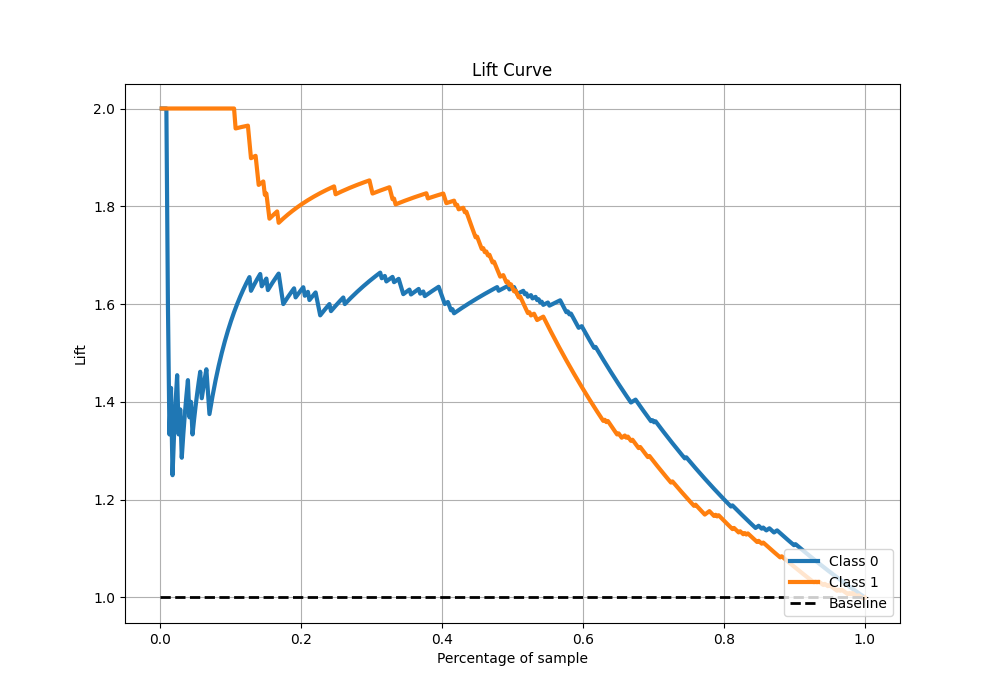

# Summary of 13_Xgboost_SelectedFeatures

[<< Go back](../README.md)

## Extreme Gradient Boosting (Xgboost)
- **n_jobs**: -1
- **objective**: binary:logistic
- **eta**: 0.1
- **max_depth**: 8
- **min_child_weight**: 1
- **subsample**: 1.0
- **colsample_bytree**: 1.0
- **eval_metric**: f1
- **explain_level**: 0

## Validation
 - **validation_type**: kfold
 - **shuffle**: True
 - **stratify**: True
 - **k_folds**: 5

## Optimized metric
f1

## Training time

13.0 seconds

## Metric details
|           |    score |   threshold |
|:----------|---------:|------------:|
| logloss   | 0.541363 | nan         |
| auc       | 0.856143 | nan         |
| f1        | 0.830986 |   0.507616  |
| accuracy  | 0.842795 |   0.507616  |
| precision | 0.95     |   0.864547  |
| recall    | 1        |   0.0337425 |
| mcc       | 0.692383 |   0.507616  |

## Metric details with threshold from accuracy metric
|           |    score |   threshold |
|:----------|---------:|------------:|
| logloss   | 0.541363 |  nan        |
| auc       | 0.856143 |  nan        |
| f1        | 0.830986 |    0.507616 |
| accuracy  | 0.842795 |    0.507616 |
| precision | 0.898477 |    0.507616 |
| recall    | 0.772926 |    0.507616 |
| mcc       | 0.692383 |    0.507616 |

## Confusion matrix (at threshold=0.507616)
|              |   Predicted as 0 |   Predicted as 1 |
|:-------------|-----------------:|-----------------:|
| Labeled as 0 |              209 |               20 |
| Labeled as 1 |               52 |              177 |

## Learning curves

## Confusion Matrix

## Normalized Confusion Matrix

## ROC Curve

## Kolmogorov-Smirnov Statistic

## Precision-Recall Curve

## Calibration Curve

## Cumulative Gains Curve

## Lift Curve

[<< Go back](../README.md)
