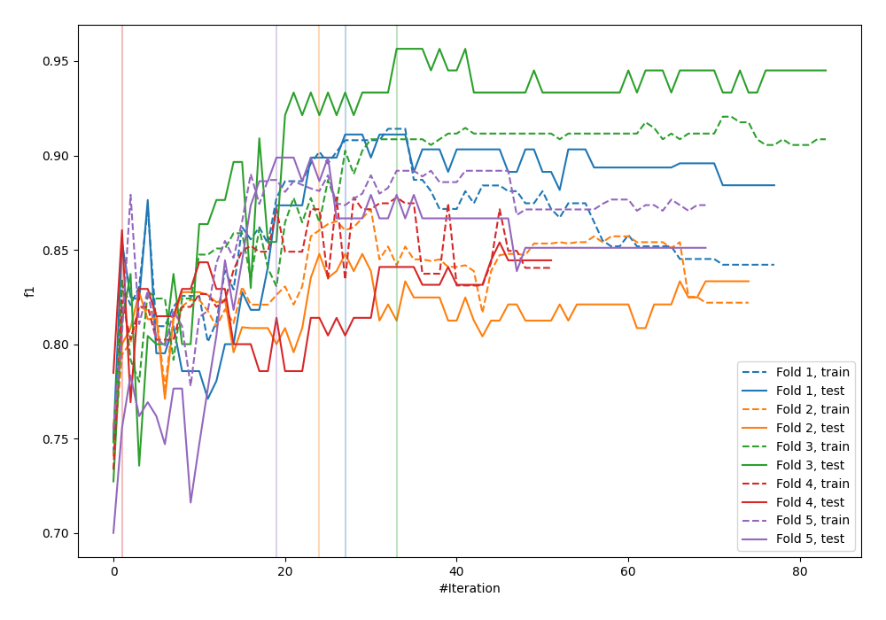

# Summary of 14_Xgboost

[<< Go back](../README.md)

## Extreme Gradient Boosting (Xgboost)
- **n_jobs**: -1
- **objective**: binary:logistic
- **eta**: 0.1
- **max_depth**: 7
- **min_child_weight**: 25
- **subsample**: 0.9
- **colsample_bytree**: 0.6
- **eval_metric**: f1
- **explain_level**: 0

## Validation
 - **validation_type**: kfold
 - **shuffle**: True
 - **stratify**: True
 - **k_folds**: 5

## Optimized metric
f1

## Training time

6.9 seconds

## Metric details
|           |    score |   threshold |
|:----------|---------:|------------:|
| logloss   | 0.474809 |  nan        |
| auc       | 0.91213  |  nan        |
| f1        | 0.895323 |    0.491758 |
| accuracy  | 0.89738  |    0.491758 |
| precision | 0.927632 |    0.562244 |
| recall    | 1        |    0.180071 |
| mcc       | 0.795374 |    0.491758 |

## Metric details with threshold from accuracy metric
|           |    score |   threshold |
|:----------|---------:|------------:|
| logloss   | 0.474809 |  nan        |
| auc       | 0.91213  |  nan        |
| f1        | 0.895323 |    0.491758 |
| accuracy  | 0.89738  |    0.491758 |
| precision | 0.913636 |    0.491758 |
| recall    | 0.877729 |    0.491758 |
| mcc       | 0.795374 |    0.491758 |

## Confusion matrix (at threshold=0.491758)
|              |   Predicted as 0 |   Predicted as 1 |
|:-------------|-----------------:|-----------------:|
| Labeled as 0 |              210 |               19 |
| Labeled as 1 |               28 |              201 |

## Learning curves

## Confusion Matrix

## Normalized Confusion Matrix

## ROC Curve

## Kolmogorov-Smirnov Statistic

## Precision-Recall Curve

## Calibration Curve

## Cumulative Gains Curve

## Lift Curve

[<< Go back](../README.md)
