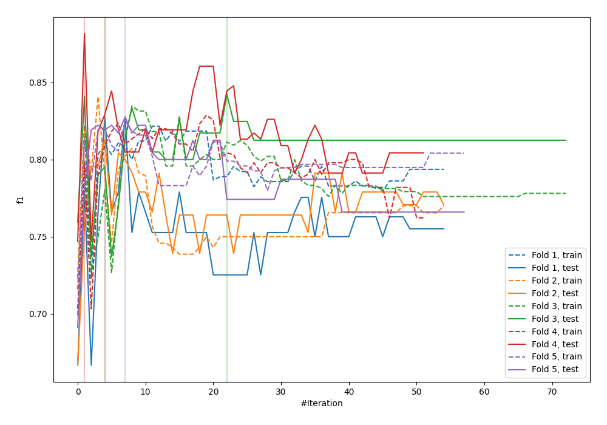
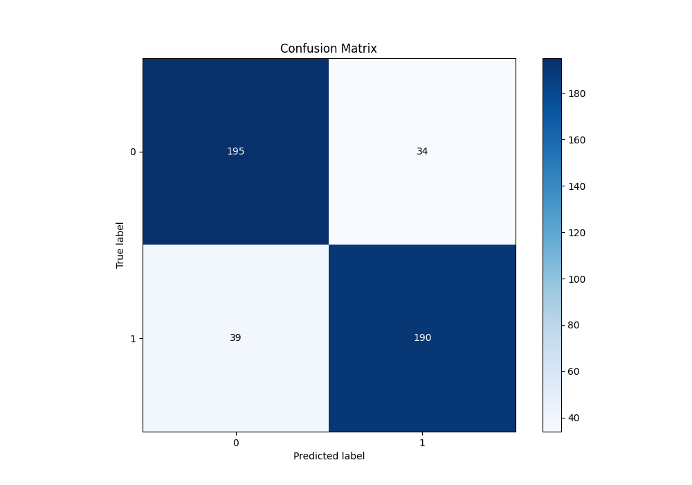
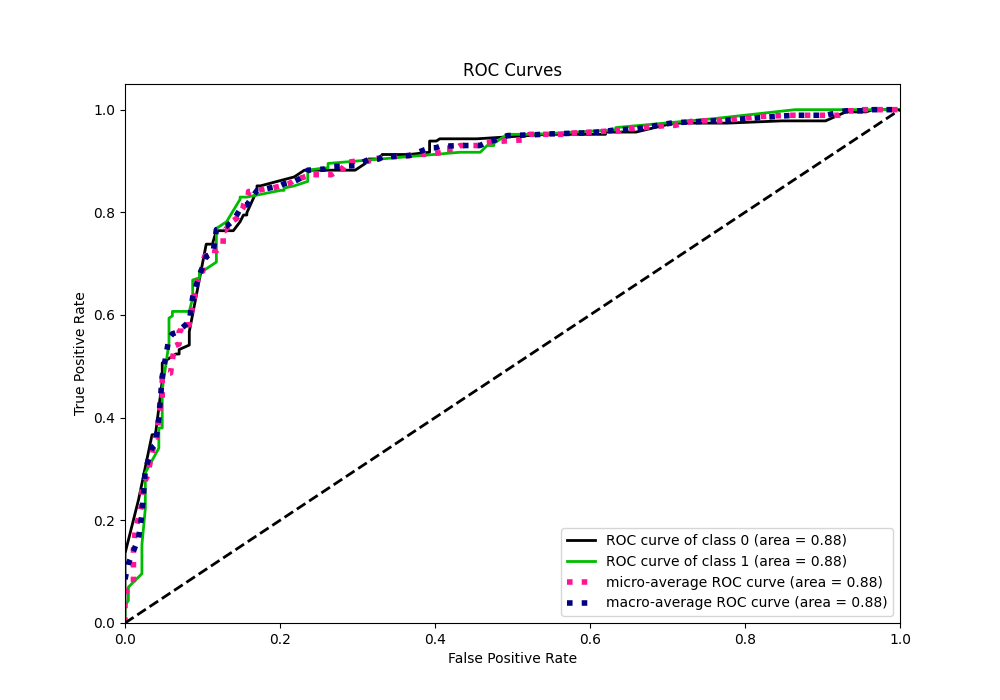
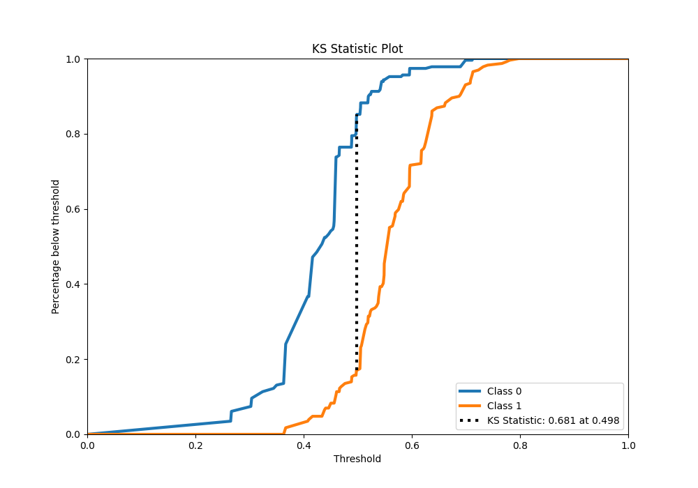
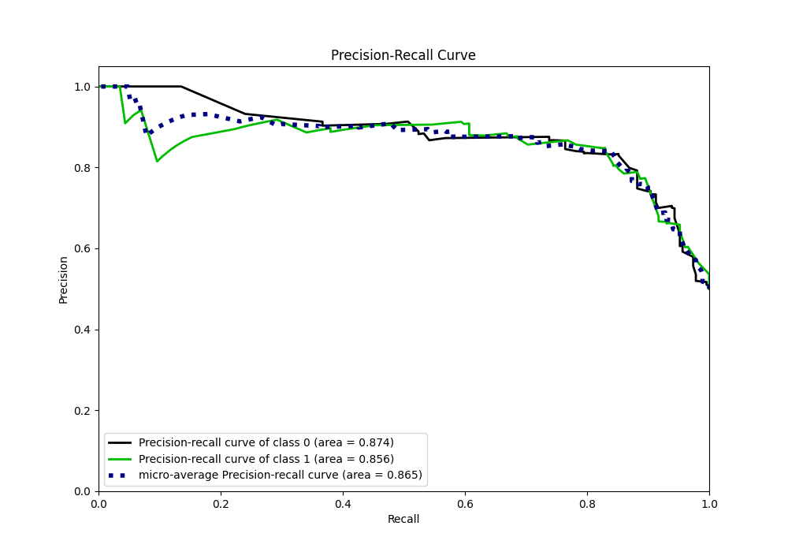
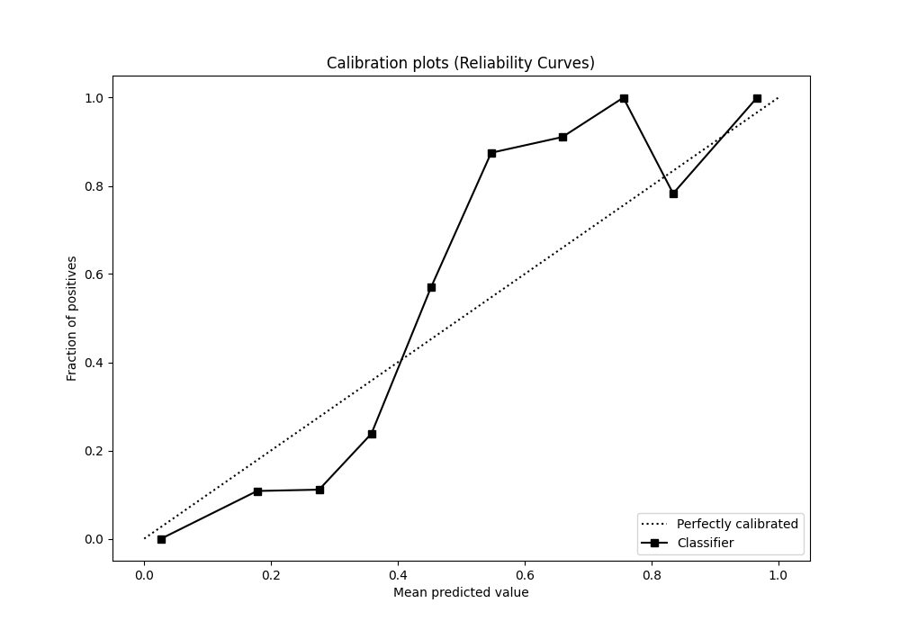
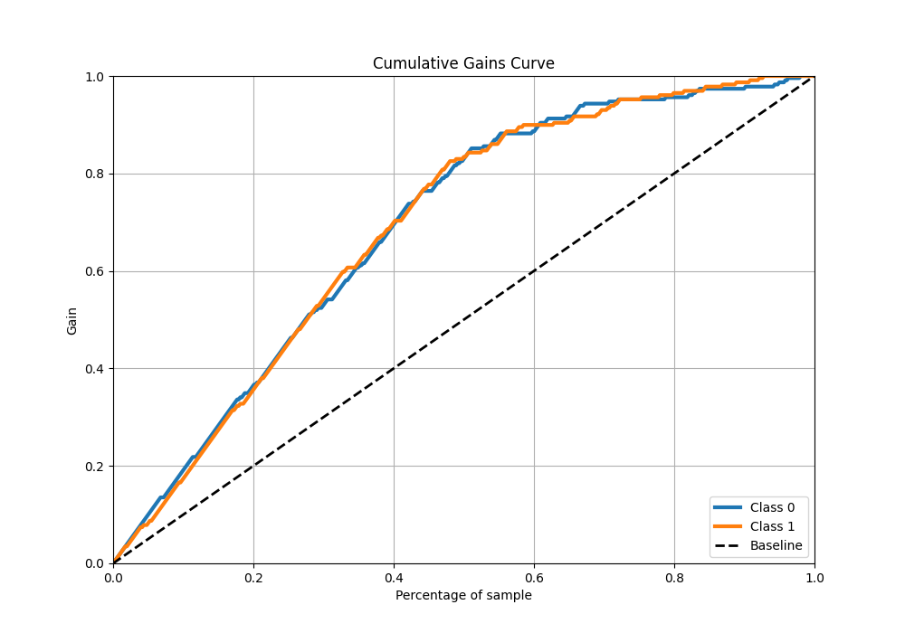
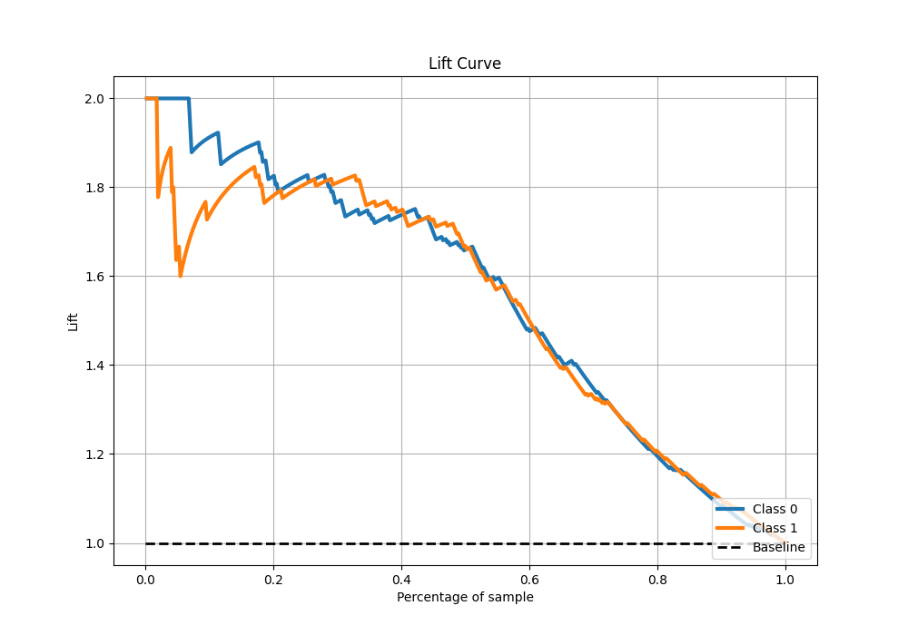

# Summary of 17_Xgboost

[<< Go back](../README.md)

## Extreme Gradient Boosting (Xgboost)
- **n_jobs**: -1
- **objective**: binary:logistic
- **eta**: 0.1
- **max_depth**: 4
- **min_child_weight**: 25
- **subsample**: 0.7
- **colsample_bytree**: 0.7
- **eval_metric**: f1
- **explain_level**: 0

## Validation
 - **validation_type**: kfold
 - **shuffle**: True
 - **stratify**: True
 - **k_folds**: 5

## Optimized metric
f1

## Training time

8.9 seconds

## Metric details
|           |    score |   threshold |
|:----------|---------:|------------:|
| logloss   | 0.581115 |  nan        |
| auc       | 0.881495 |  nan        |
| f1        | 0.838852 |    0.49832  |
| accuracy  | 0.840611 |    0.49832  |
| precision | 0.917808 |    0.596048 |
| recall    | 1        |    0.238619 |
| mcc       | 0.681385 |    0.49832  |

## Metric details with threshold from accuracy metric
|           |    score |   threshold |
|:----------|---------:|------------:|
| logloss   | 0.581115 |   nan       |
| auc       | 0.881495 |   nan       |
| f1        | 0.838852 |     0.49832 |
| accuracy  | 0.840611 |     0.49832 |
| precision | 0.848214 |     0.49832 |
| recall    | 0.829694 |     0.49832 |
| mcc       | 0.681385 |     0.49832 |

## Confusion matrix (at threshold=0.49832)
|              |   Predicted as 0 |   Predicted as 1 |
|:-------------|-----------------:|-----------------:|
| Labeled as 0 |              195 |               34 |
| Labeled as 1 |               39 |              190 |

## Learning curves

## Confusion Matrix

## Normalized Confusion Matrix

## ROC Curve

## Kolmogorov-Smirnov Statistic

## Precision-Recall Curve

## Calibration Curve

## Cumulative Gains Curve

## Lift Curve

[<< Go back](../README.md)
