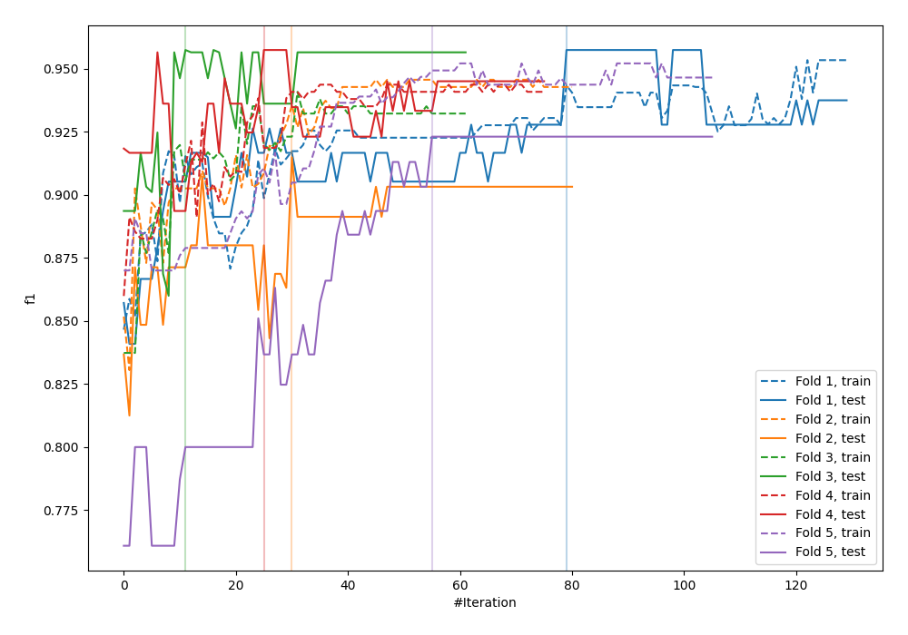
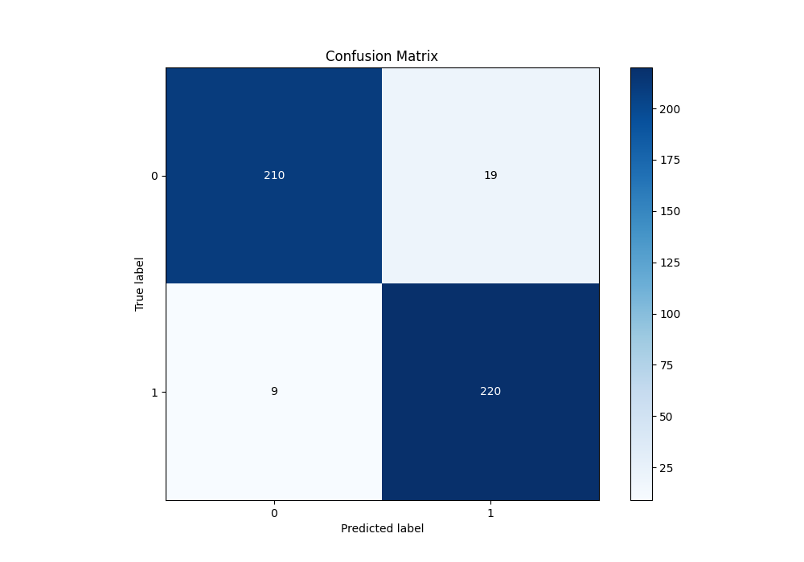
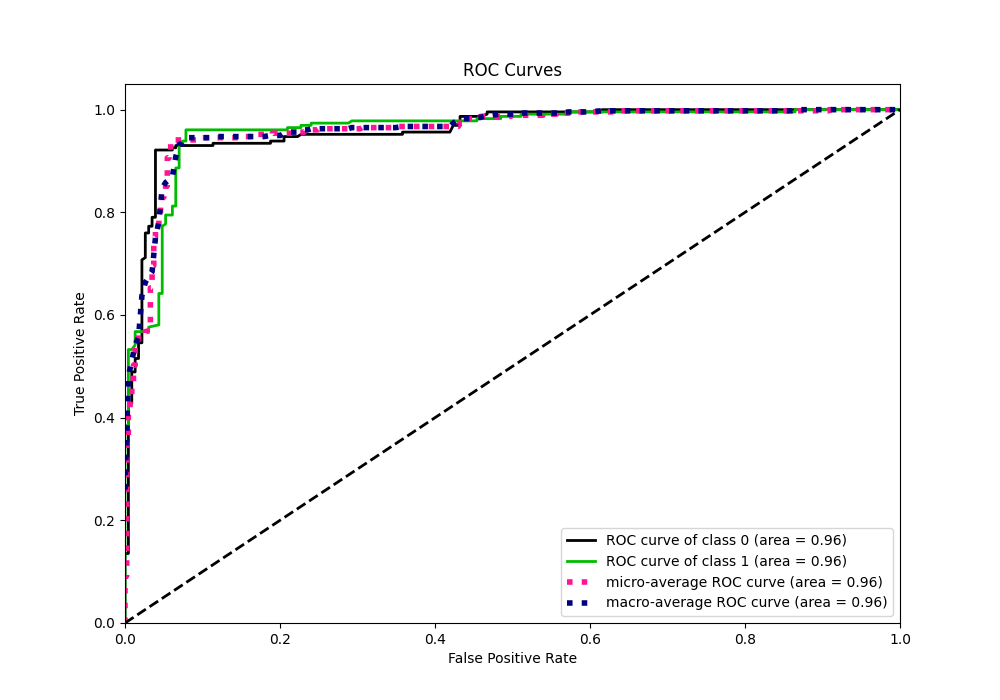
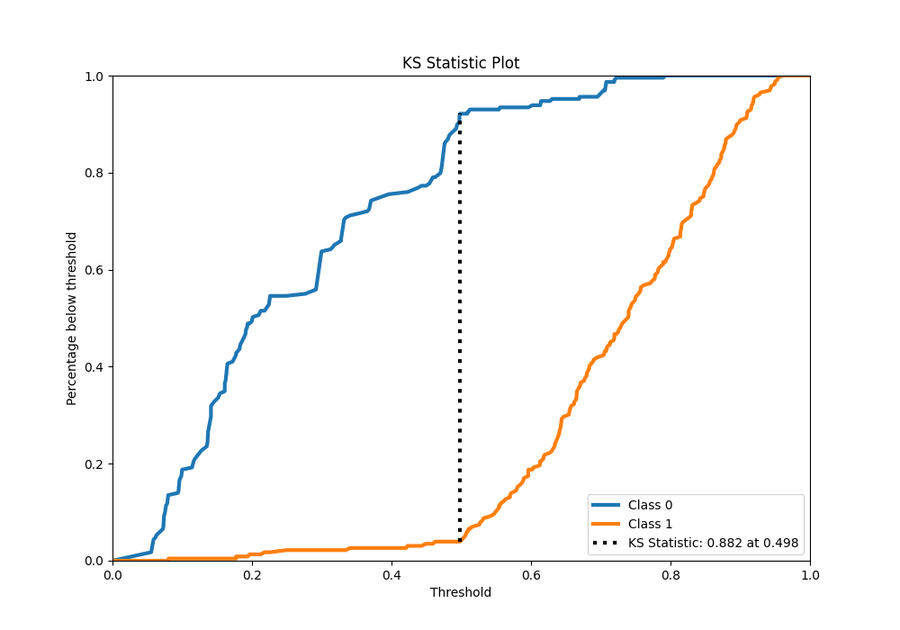
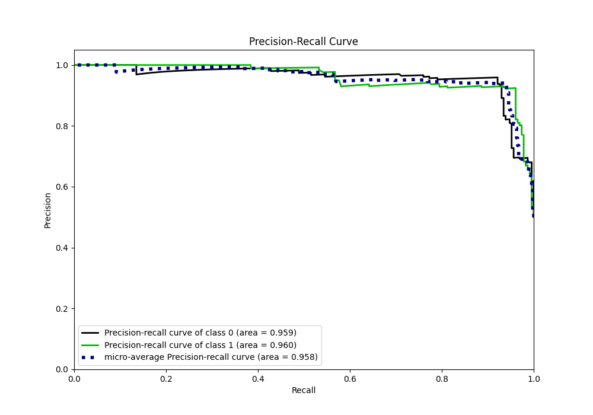
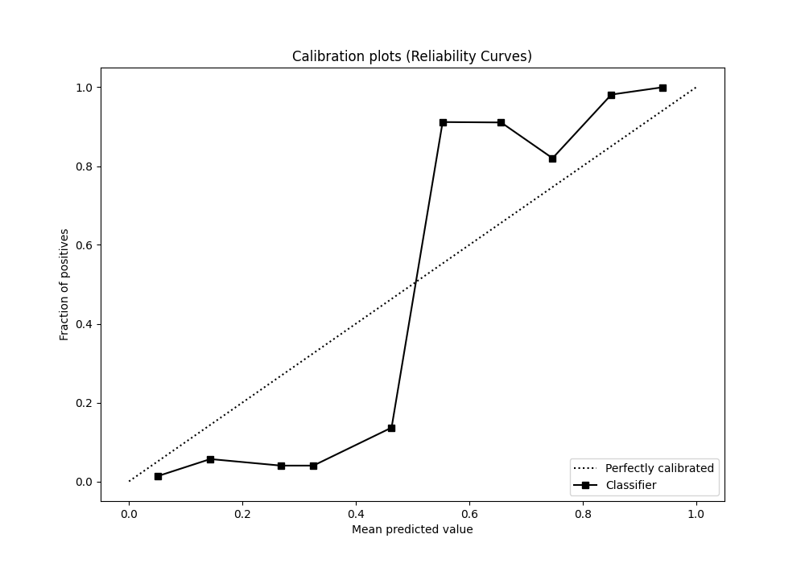
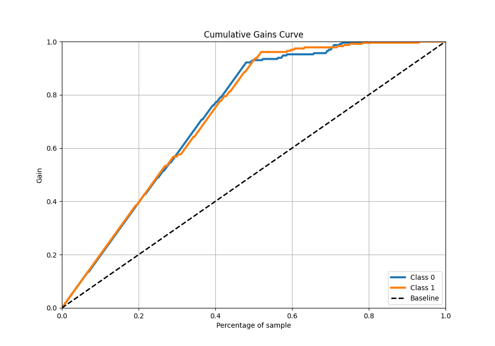
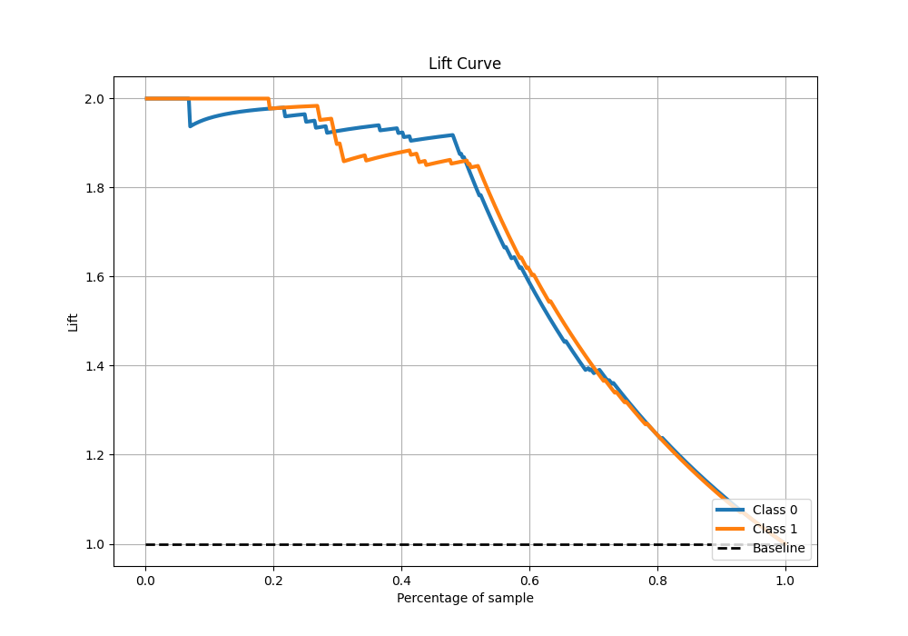

# Summary of 18_Xgboost

[<< Go back](../README.md)

## Extreme Gradient Boosting (Xgboost)
- **n_jobs**: -1
- **objective**: binary:logistic
- **eta**: 0.05
- **max_depth**: 8
- **min_child_weight**: 5
- **subsample**: 0.5
- **colsample_bytree**: 0.8
- **eval_metric**: f1
- **explain_level**: 0

## Validation
 - **validation_type**: kfold
 - **shuffle**: True
 - **stratify**: True
 - **k_folds**: 5

## Optimized metric
f1

## Training time

11.2 seconds

## Metric details
|           |    score |   threshold |
|:----------|---------:|------------:|
| logloss   | 0.355082 | nan         |
| auc       | 0.960231 | nan         |
| f1        | 0.940171 |   0.497497  |
| accuracy  | 0.938865 |   0.497497  |
| precision | 1        |   0.797272  |
| recall    | 1        |   0.0499093 |
| mcc       | 0.878567 |   0.497497  |

## Metric details with threshold from accuracy metric
|           |    score |   threshold |
|:----------|---------:|------------:|
| logloss   | 0.355082 |  nan        |
| auc       | 0.960231 |  nan        |
| f1        | 0.940171 |    0.497497 |
| accuracy  | 0.938865 |    0.497497 |
| precision | 0.920502 |    0.497497 |
| recall    | 0.960699 |    0.497497 |
| mcc       | 0.878567 |    0.497497 |

## Confusion matrix (at threshold=0.497497)
|              |   Predicted as 0 |   Predicted as 1 |
|:-------------|-----------------:|-----------------:|
| Labeled as 0 |              210 |               19 |
| Labeled as 1 |                9 |              220 |

## Learning curves

## Confusion Matrix

## Normalized Confusion Matrix

## ROC Curve

## Kolmogorov-Smirnov Statistic

## Precision-Recall Curve

## Calibration Curve

## Cumulative Gains Curve

## Lift Curve

[<< Go back](../README.md)
