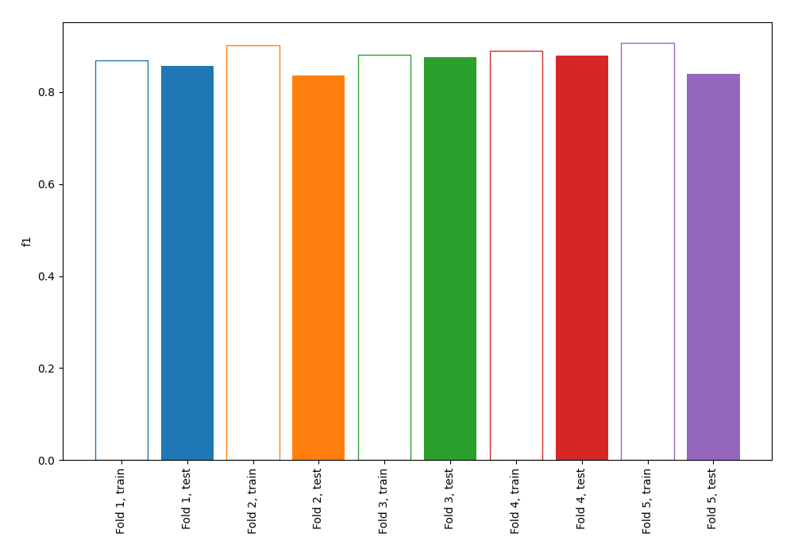
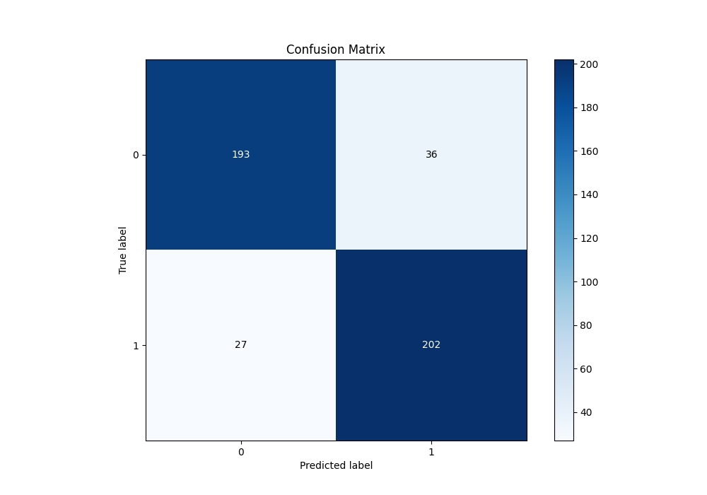
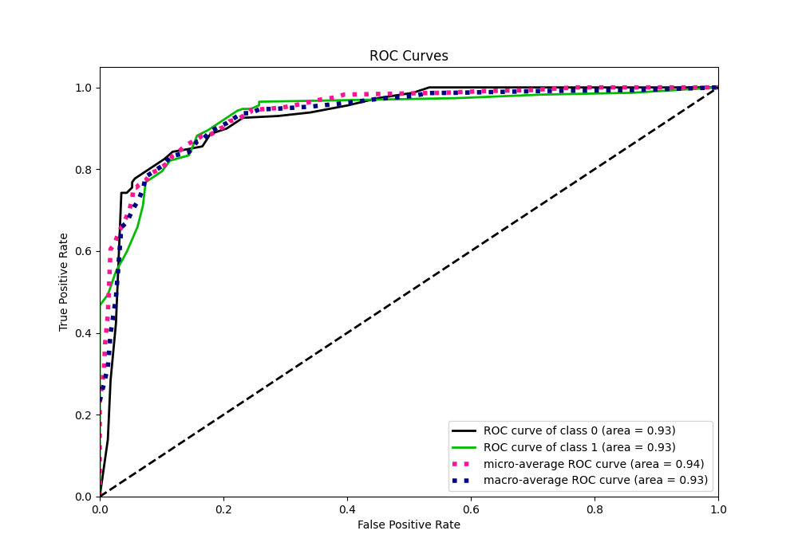
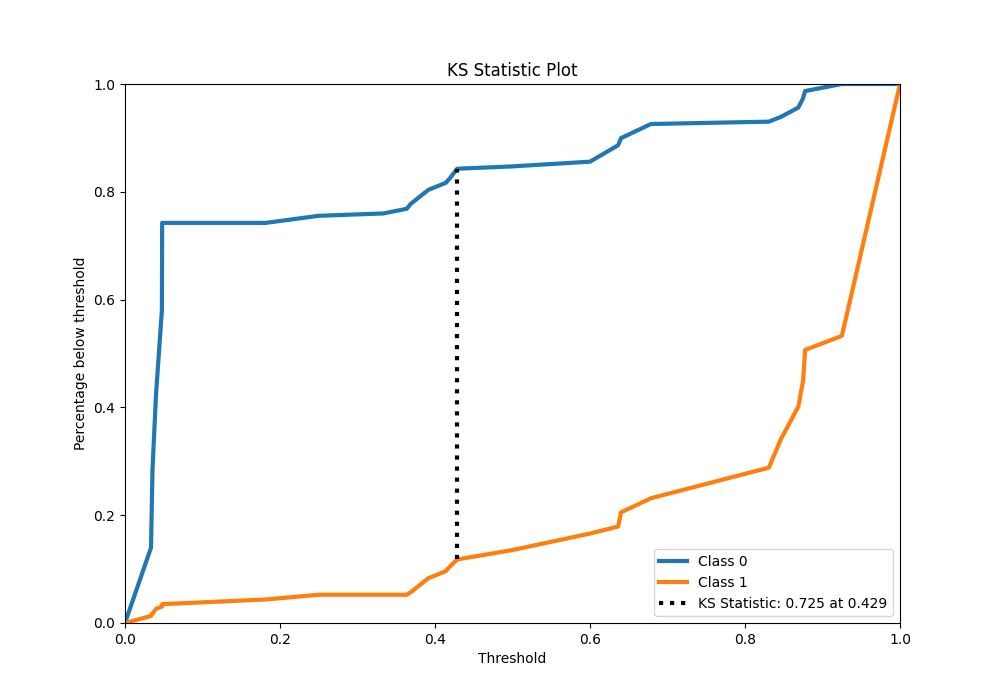
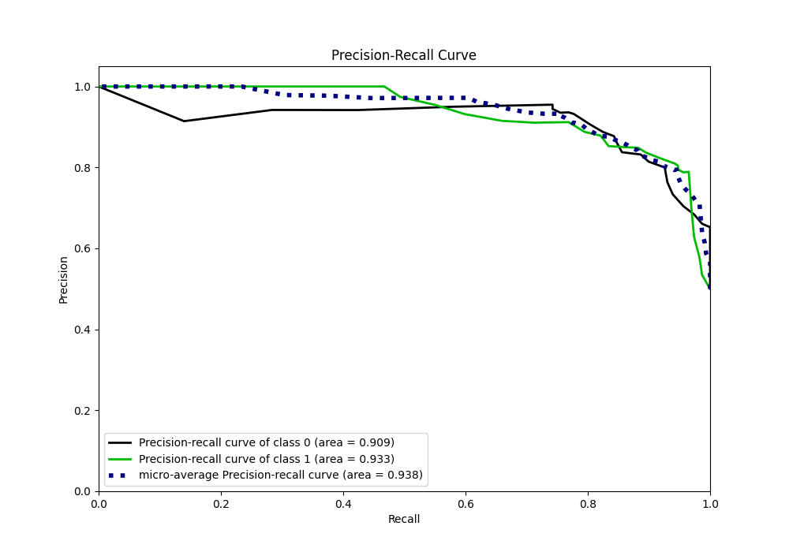
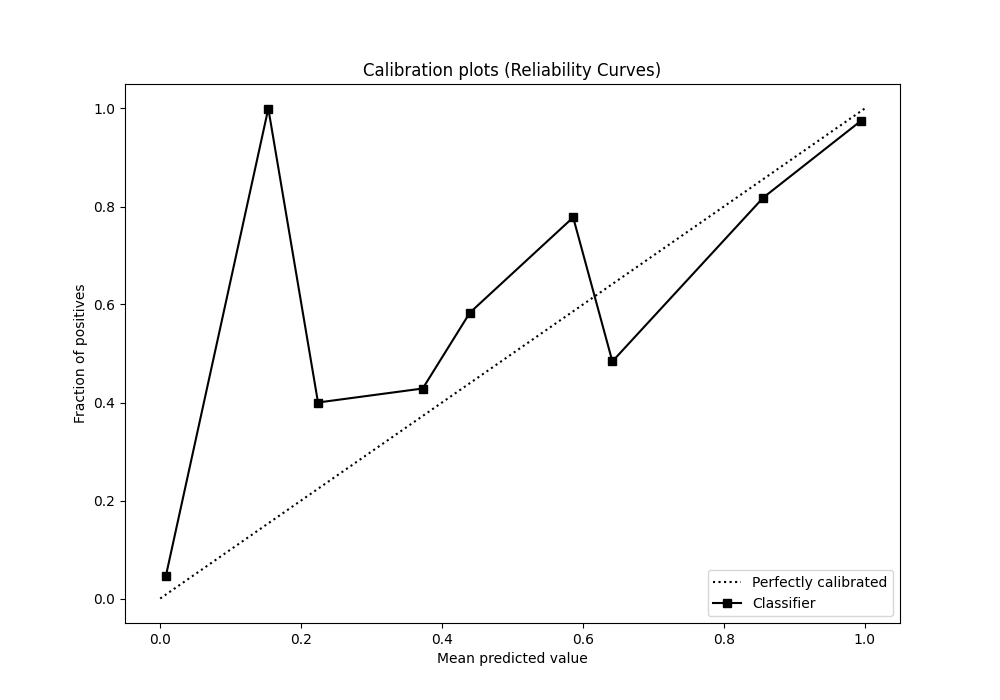
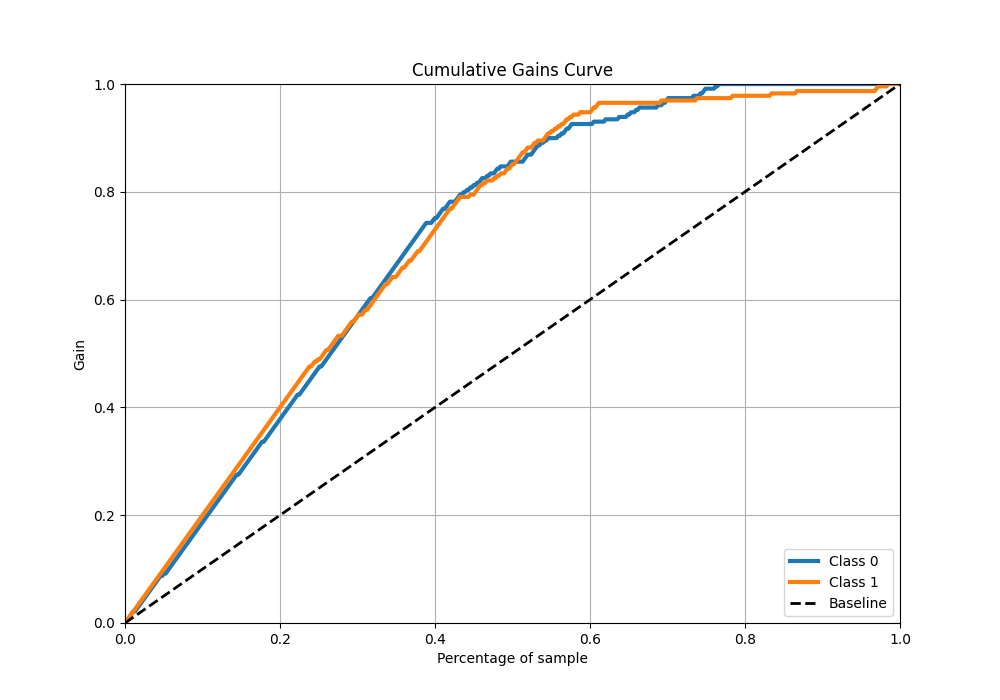
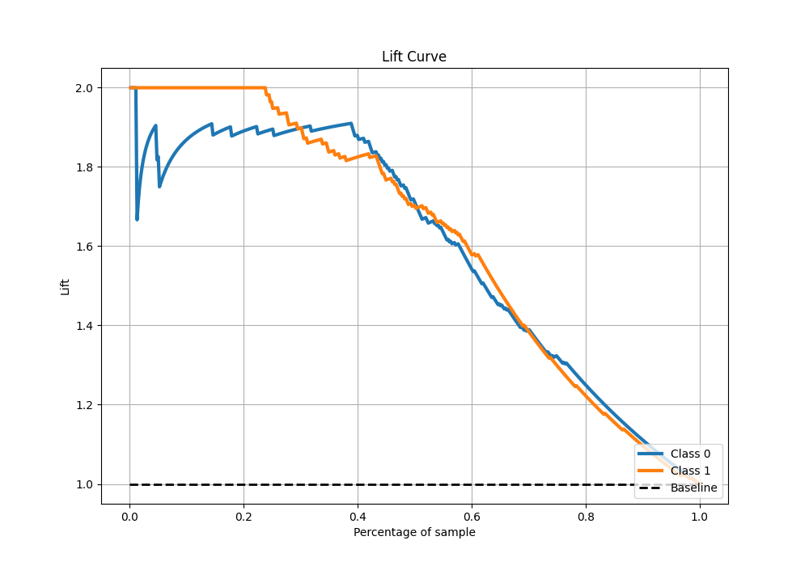

# Summary of 1_DecisionTree

[<< Go back](../README.md)

## Decision Tree
- **n_jobs**: -1
- **criterion**: gini
- **max_depth**: 3
- **explain_level**: 0

## Validation
 - **validation_type**: kfold
 - **shuffle**: True
 - **stratify**: True
 - **k_folds**: 5

## Optimized metric
f1

## Training time

3.4 seconds

## Metric details
|           |    score |   threshold |
|:----------|---------:|------------:|
| logloss   | 0.310448 | nan         |
| auc       | 0.930207 | nan         |
| f1        | 0.870968 |   0.368421  |
| accuracy  | 0.862445 |   0.428571  |
| precision | 1        |   0.925     |
| recall    | 1        |   0.0302013 |
| mcc       | 0.730654 |   0.368421  |

## Metric details with threshold from accuracy metric
|           |    score |   threshold |
|:----------|---------:|------------:|
| logloss   | 0.310448 |  nan        |
| auc       | 0.930207 |  nan        |
| f1        | 0.865096 |    0.428571 |
| accuracy  | 0.862445 |    0.428571 |
| precision | 0.848739 |    0.428571 |
| recall    | 0.882096 |    0.428571 |
| mcc       | 0.725451 |    0.428571 |

## Confusion matrix (at threshold=0.428571)
|              |   Predicted as 0 |   Predicted as 1 |
|:-------------|-----------------:|-----------------:|
| Labeled as 0 |              193 |               36 |
| Labeled as 1 |               27 |              202 |

## Learning curves

## Confusion Matrix

## Normalized Confusion Matrix

## ROC Curve

## Kolmogorov-Smirnov Statistic

## Precision-Recall Curve

## Calibration Curve

## Cumulative Gains Curve

## Lift Curve

[<< Go back](../README.md)
