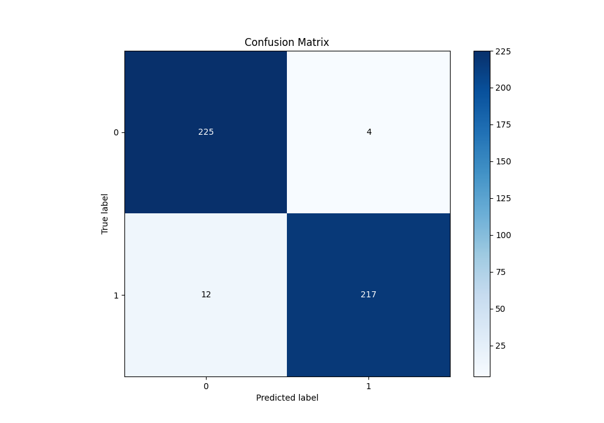

# Summary of 23_LightGBM

[<< Go back](../README.md)

## LightGBM
- **n_jobs**: -1
- **objective**: binary
- **num_leaves**: 63
- **learning_rate**: 0.05
- **feature_fraction**: 0.9
- **bagging_fraction**: 1.0
- **min_data_in_leaf**: 20
- **metric**: custom
- **custom_eval_metric_name**: f1
- **explain_level**: 0

## Validation
 - **validation_type**: kfold
 - **shuffle**: True
 - **stratify**: True
 - **k_folds**: 5

## Optimized metric
f1

## Training time

7.9 seconds

## Metric details
|           |    score |    threshold |
|:----------|---------:|-------------:|
| logloss   | 0.239979 | nan          |
| auc       | 0.979482 | nan          |
| f1        | 0.964444 |   0.503711   |
| accuracy  | 0.965066 |   0.503711   |
| precision | 0.994083 |   0.757501   |
| recall    | 1        |   0.00133263 |
| mcc       | 0.930699 |   0.503711   |

## Metric details with threshold from accuracy metric
|           |    score |   threshold |
|:----------|---------:|------------:|
| logloss   | 0.239979 |  nan        |
| auc       | 0.979482 |  nan        |
| f1        | 0.964444 |    0.503711 |
| accuracy  | 0.965066 |    0.503711 |
| precision | 0.9819   |    0.503711 |
| recall    | 0.947598 |    0.503711 |
| mcc       | 0.930699 |    0.503711 |

## Confusion matrix (at threshold=0.503711)
|              |   Predicted as 0 |   Predicted as 1 |
|:-------------|-----------------:|-----------------:|
| Labeled as 0 |              225 |                4 |
| Labeled as 1 |               12 |              217 |

## Learning curves

## Confusion Matrix

## Normalized Confusion Matrix

## ROC Curve

## Kolmogorov-Smirnov Statistic

## Precision-Recall Curve

## Calibration Curve

## Cumulative Gains Curve

## Lift Curve

[<< Go back](../README.md)
