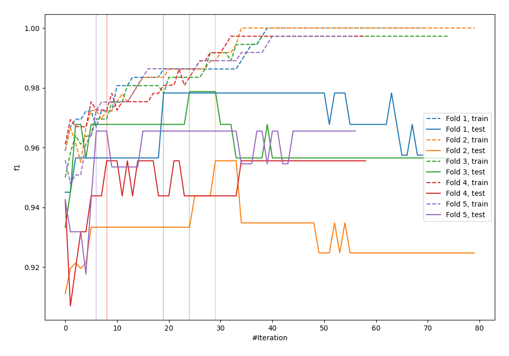
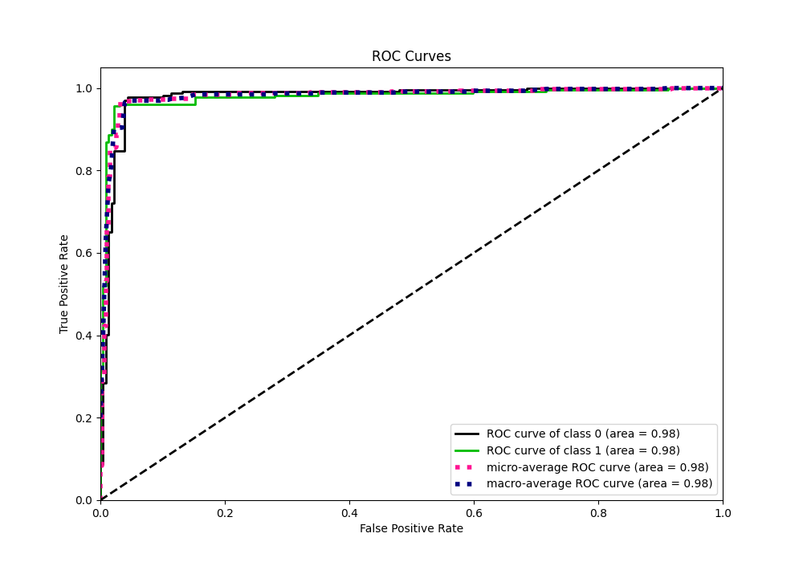
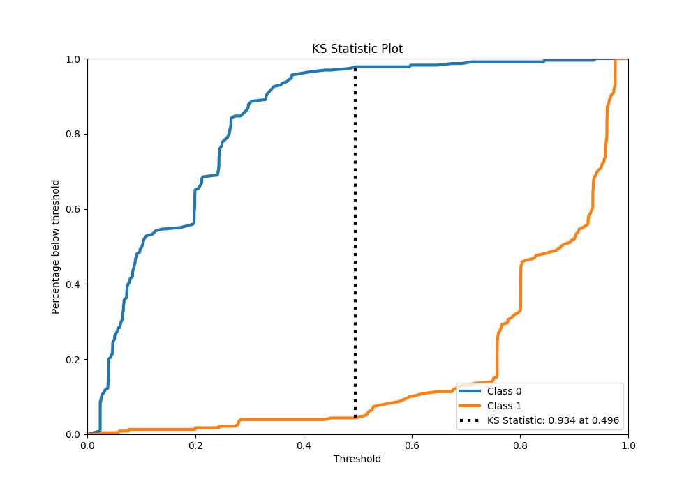
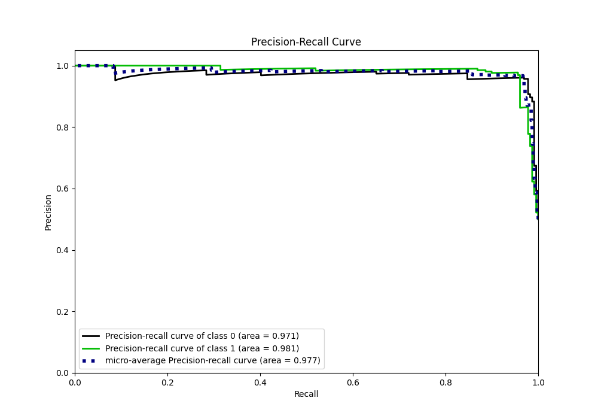
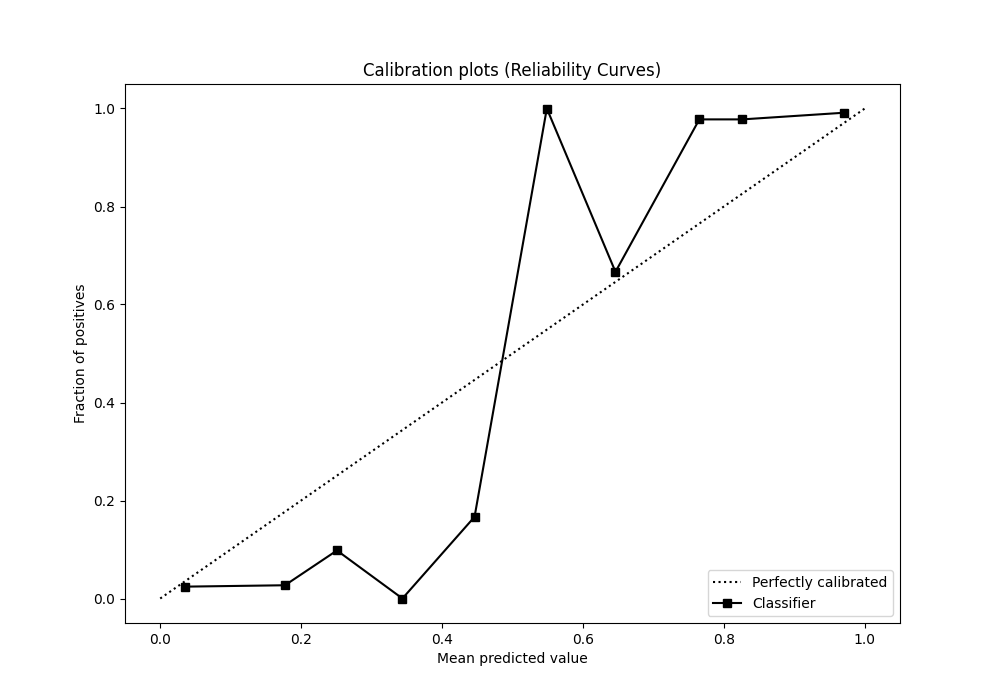
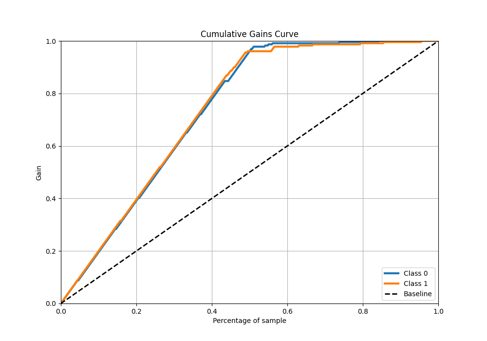
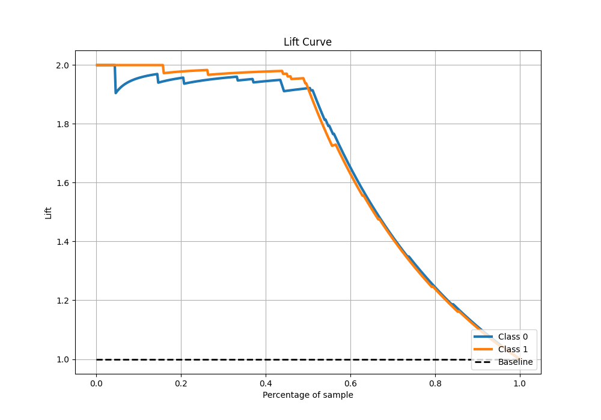

# Summary of 28_LightGBM_GoldenFeatures

[<< Go back](../README.md)

## LightGBM
- **n_jobs**: -1
- **objective**: binary
- **num_leaves**: 31
- **learning_rate**: 0.1
- **feature_fraction**: 0.8
- **bagging_fraction**: 0.8
- **min_data_in_leaf**: 5
- **metric**: custom
- **custom_eval_metric_name**: f1
- **explain_level**: 0

## Validation
 - **validation_type**: kfold
 - **shuffle**: True
 - **stratify**: True
 - **k_folds**: 5

## Optimized metric
f1

## Training time

18.9 seconds

## Metric details
|           |    score |   threshold |
|:----------|---------:|------------:|
| logloss   | 0.222482 | nan         |
| auc       | 0.979081 | nan         |
| f1        | 0.964758 |   0.49043   |
| accuracy  | 0.965066 |   0.49043   |
| precision | 1        |   0.945141  |
| recall    | 1        |   0.0213647 |
| mcc       | 0.930273 |   0.49043   |

## Metric details with threshold from accuracy metric
|           |    score |   threshold |
|:----------|---------:|------------:|
| logloss   | 0.222482 |   nan       |
| auc       | 0.979081 |   nan       |
| f1        | 0.964758 |     0.49043 |
| accuracy  | 0.965066 |     0.49043 |
| precision | 0.973333 |     0.49043 |
| recall    | 0.956332 |     0.49043 |
| mcc       | 0.930273 |     0.49043 |

## Confusion matrix (at threshold=0.49043)
|              |   Predicted as 0 |   Predicted as 1 |
|:-------------|-----------------:|-----------------:|
| Labeled as 0 |              223 |                6 |
| Labeled as 1 |               10 |              219 |

## Learning curves

## Confusion Matrix

## Normalized Confusion Matrix

## ROC Curve

## Kolmogorov-Smirnov Statistic

## Precision-Recall Curve

## Calibration Curve

## Cumulative Gains Curve

## Lift Curve

[<< Go back](../README.md)
