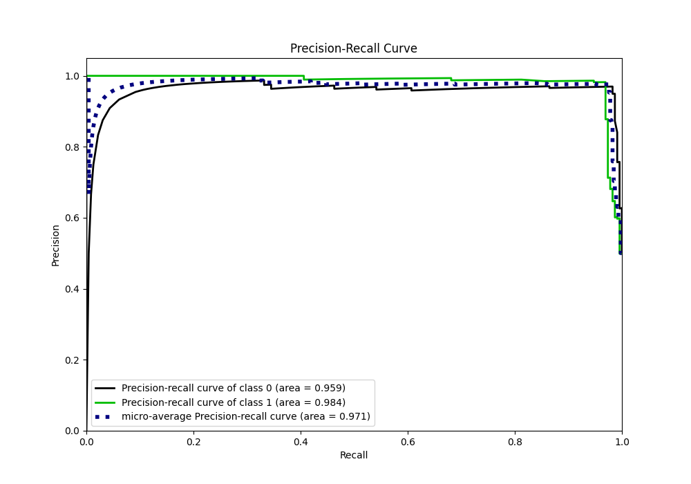

# Summary of 28_LightGBM_KMeansFeatures_RandomFeature

[<< Go back](../README.md)

## LightGBM
- **n_jobs**: -1
- **objective**: binary
- **num_leaves**: 31
- **learning_rate**: 0.1
- **feature_fraction**: 0.8
- **bagging_fraction**: 0.8
- **min_data_in_leaf**: 5
- **metric**: custom
- **custom_eval_metric_name**: f1
- **explain_level**: 1

## Validation
 - **validation_type**: kfold
 - **shuffle**: True
 - **stratify**: True
 - **k_folds**: 5

## Optimized metric
f1

## Training time

15.0 seconds

## Metric details
|           |    score |   threshold |
|:----------|---------:|------------:|
| logloss   | 0.195772 | nan         |
| auc       | 0.978795 | nan         |
| f1        | 0.973568 |   0.506571  |
| accuracy  | 0.973799 |   0.506571  |
| precision | 1        |   0.908609  |
| recall    | 1        |   0.0231089 |
| mcc       | 0.947743 |   0.506571  |

## Metric details with threshold from accuracy metric
|           |    score |   threshold |
|:----------|---------:|------------:|
| logloss   | 0.195772 |  nan        |
| auc       | 0.978795 |  nan        |
| f1        | 0.973568 |    0.506571 |
| accuracy  | 0.973799 |    0.506571 |
| precision | 0.982222 |    0.506571 |
| recall    | 0.965066 |    0.506571 |
| mcc       | 0.947743 |    0.506571 |

## Confusion matrix (at threshold=0.506571)
|              |   Predicted as 0 |   Predicted as 1 |
|:-------------|-----------------:|-----------------:|
| Labeled as 0 |              225 |                4 |
| Labeled as 1 |                8 |              221 |

## Learning curves

## Permutation-based Importance

## Confusion Matrix

## Normalized Confusion Matrix

## ROC Curve

## Kolmogorov-Smirnov Statistic

## Precision-Recall Curve

## Calibration Curve

## Cumulative Gains Curve

## Lift Curve

[<< Go back](../README.md)
