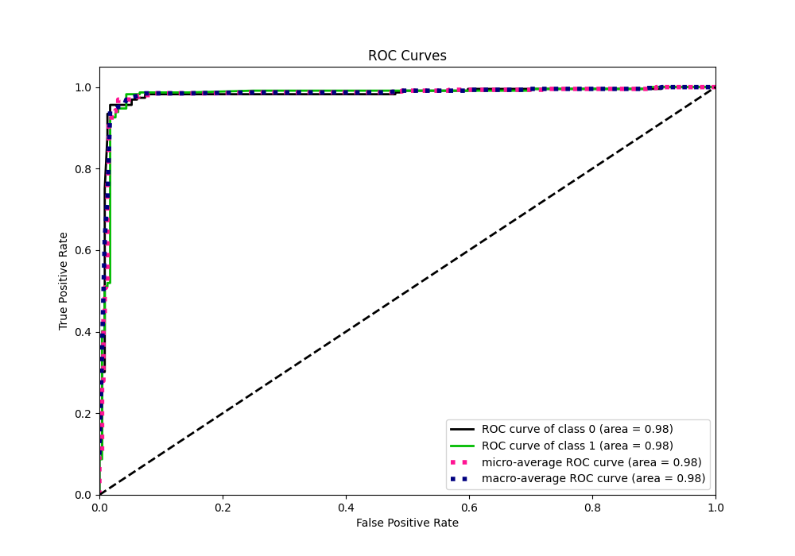

# Summary of 28_LightGBM_KMeansFeatures_SelectedFeatures

[<< Go back](../README.md)

## LightGBM
- **n_jobs**: -1
- **objective**: binary
- **num_leaves**: 31
- **learning_rate**: 0.1
- **feature_fraction**: 0.8
- **bagging_fraction**: 0.8
- **min_data_in_leaf**: 5
- **metric**: custom
- **custom_eval_metric_name**: f1
- **explain_level**: 0

## Validation
 - **validation_type**: kfold
 - **shuffle**: True
 - **stratify**: True
 - **k_folds**: 5

## Optimized metric
f1

## Training time

13.7 seconds

## Metric details
|           |    score |   threshold |
|:----------|---------:|------------:|
| logloss   | 0.281943 |  nan        |
| auc       | 0.980244 |  nan        |
| f1        | 0.965665 |    0.467066 |
| accuracy  | 0.965066 |    0.467066 |
| precision | 0.989247 |    0.891725 |
| recall    | 1        |    0.043427 |
| mcc       | 0.930699 |    0.467066 |

## Metric details with threshold from accuracy metric
|           |    score |   threshold |
|:----------|---------:|------------:|
| logloss   | 0.281943 |  nan        |
| auc       | 0.980244 |  nan        |
| f1        | 0.965665 |    0.467066 |
| accuracy  | 0.965066 |    0.467066 |
| precision | 0.949367 |    0.467066 |
| recall    | 0.982533 |    0.467066 |
| mcc       | 0.930699 |    0.467066 |

## Confusion matrix (at threshold=0.467066)
|              |   Predicted as 0 |   Predicted as 1 |
|:-------------|-----------------:|-----------------:|
| Labeled as 0 |              217 |               12 |
| Labeled as 1 |                4 |              225 |

## Learning curves

## Confusion Matrix

## Normalized Confusion Matrix

## ROC Curve

## Kolmogorov-Smirnov Statistic

## Precision-Recall Curve

## Calibration Curve

## Cumulative Gains Curve

## Lift Curve

[<< Go back](../README.md)
