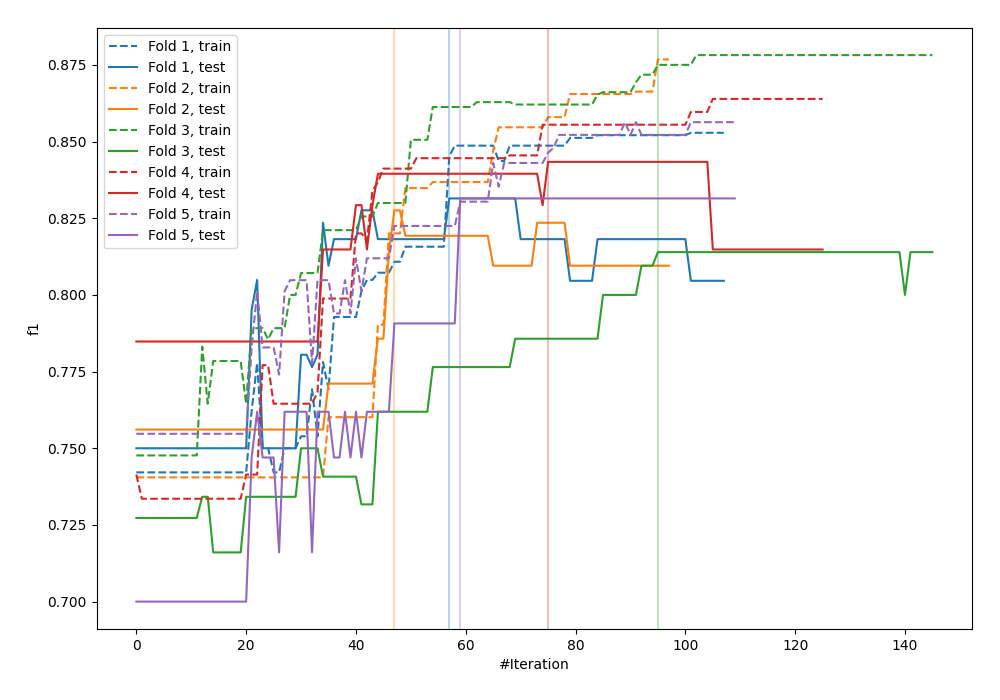
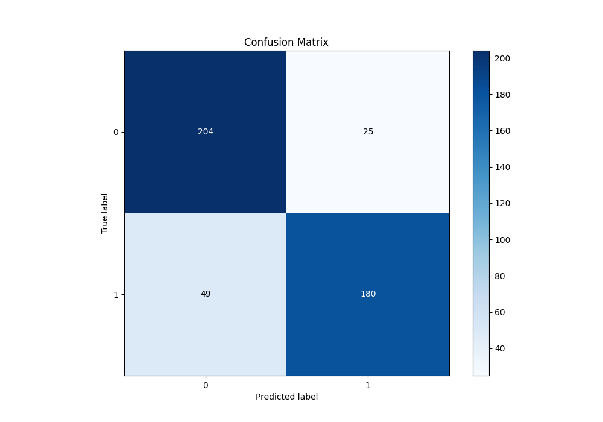
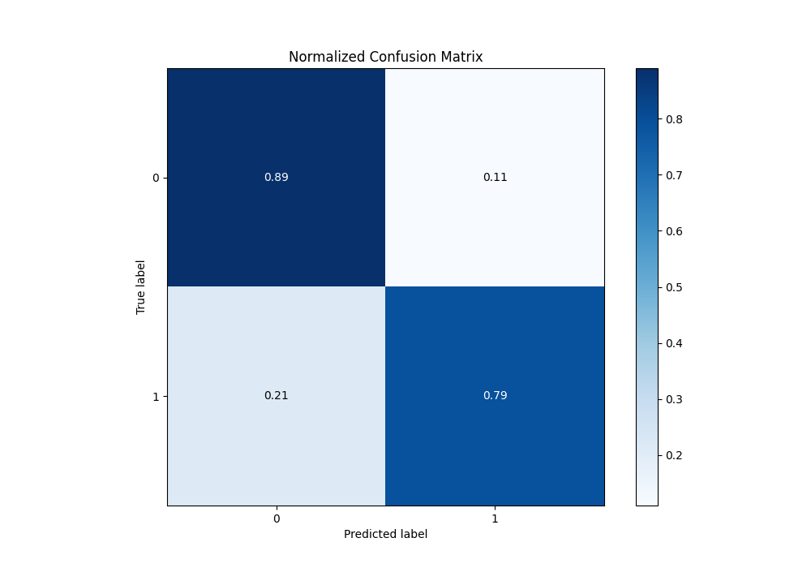
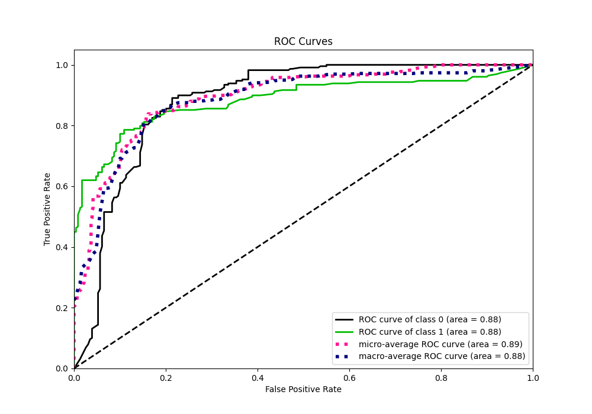
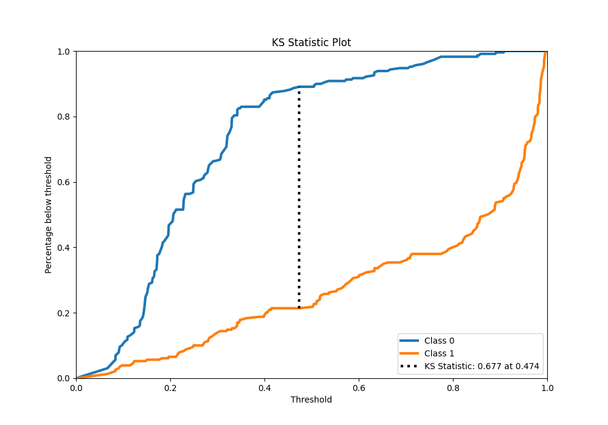
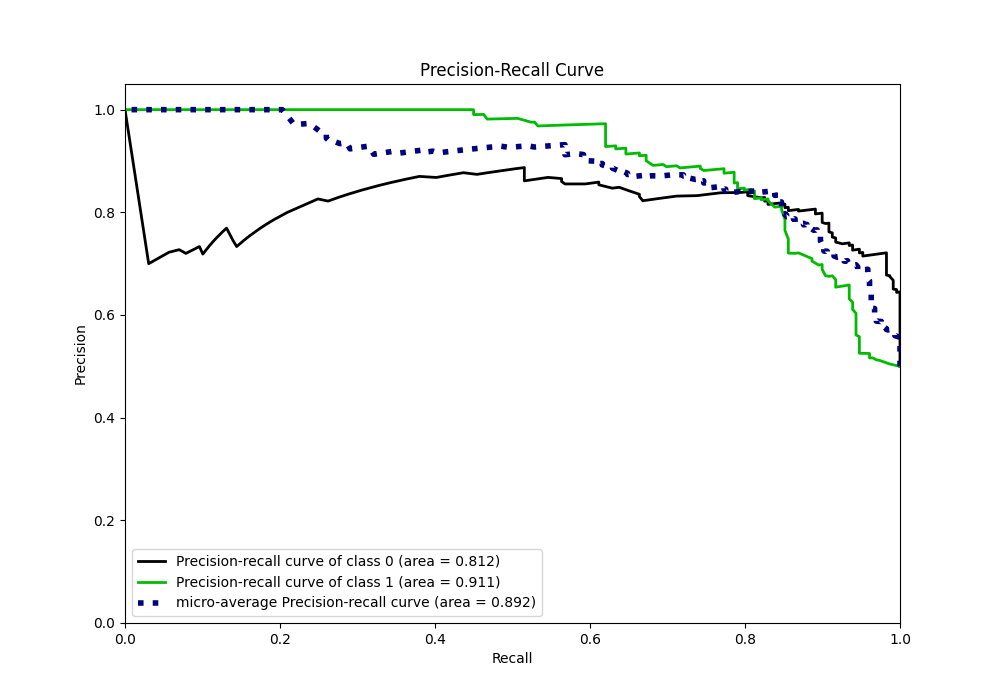
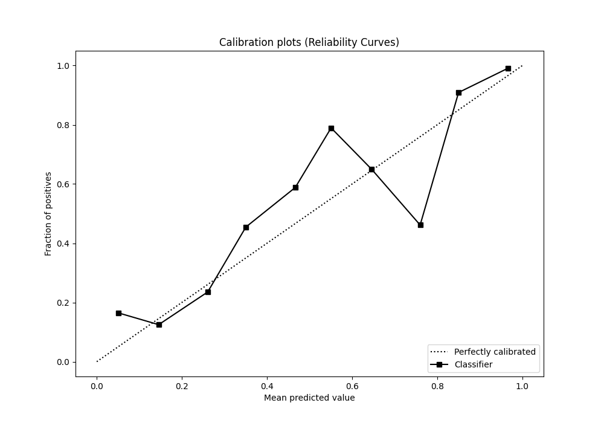
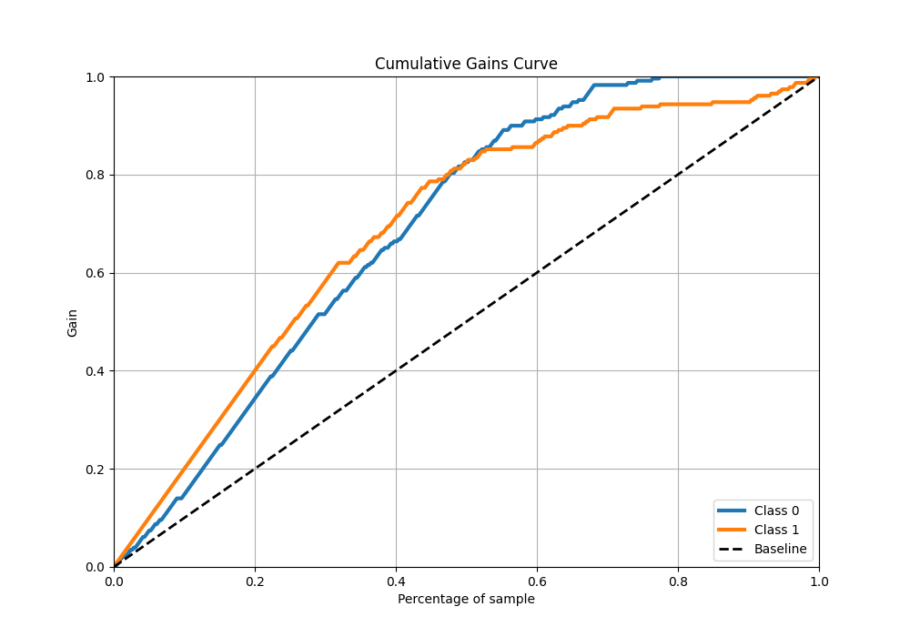
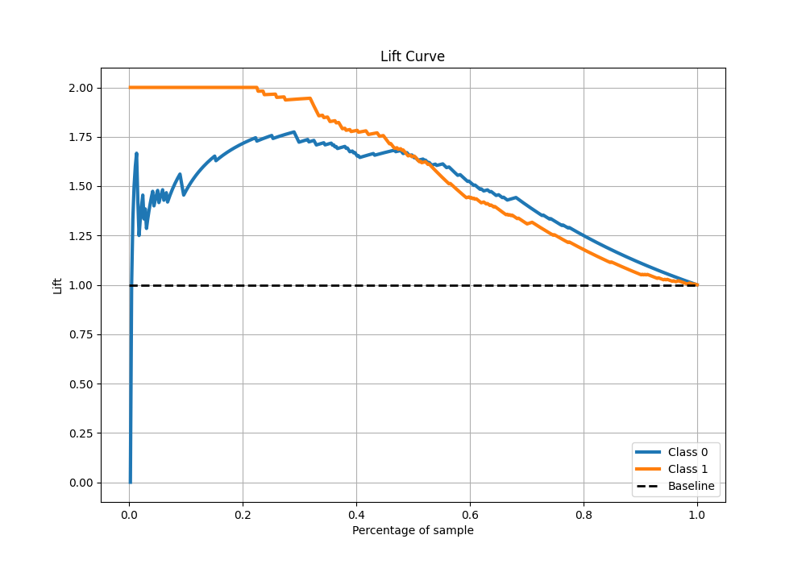

# Summary of 34_CatBoost_SelectedFeatures

[<< Go back](../README.md)

## CatBoost
- **n_jobs**: -1
- **learning_rate**: 0.1
- **depth**: 6
- **rsm**: 0.7
- **loss_function**: Logloss
- **eval_metric**: F1
- **explain_level**: 0

## Validation
 - **validation_type**: kfold
 - **shuffle**: True
 - **stratify**: True
 - **k_folds**: 5

## Optimized metric
f1

## Training time

12.1 seconds

## Metric details
|           |    score |   threshold |
|:----------|---------:|------------:|
| logloss   | 0.409139 | nan         |
| auc       | 0.883393 | nan         |
| f1        | 0.829493 |   0.488048  |
| accuracy  | 0.838428 |   0.488048  |
| precision | 1        |   0.921227  |
| recall    | 1        |   0.0599727 |
| mcc       | 0.680604 |   0.488048  |

## Metric details with threshold from accuracy metric
|           |    score |   threshold |
|:----------|---------:|------------:|
| logloss   | 0.409139 |  nan        |
| auc       | 0.883393 |  nan        |
| f1        | 0.829493 |    0.488048 |
| accuracy  | 0.838428 |    0.488048 |
| precision | 0.878049 |    0.488048 |
| recall    | 0.786026 |    0.488048 |
| mcc       | 0.680604 |    0.488048 |

## Confusion matrix (at threshold=0.488048)
|              |   Predicted as 0 |   Predicted as 1 |
|:-------------|-----------------:|-----------------:|
| Labeled as 0 |              204 |               25 |
| Labeled as 1 |               49 |              180 |

## Learning curves

## Confusion Matrix

## Normalized Confusion Matrix

## ROC Curve

## Kolmogorov-Smirnov Statistic

## Precision-Recall Curve

## Calibration Curve

## Cumulative Gains Curve

## Lift Curve

[<< Go back](../README.md)
