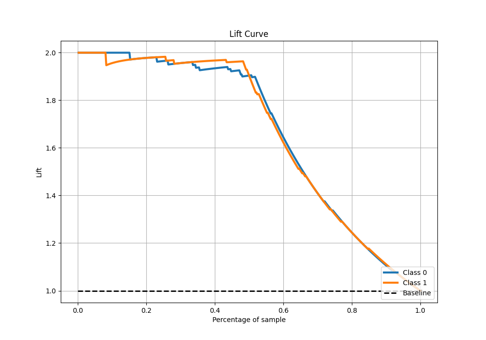

# Summary of 38_CatBoost

[<< Go back](../README.md)

## CatBoost
- **n_jobs**: -1
- **learning_rate**: 0.025
- **depth**: 7
- **rsm**: 0.7
- **loss_function**: Logloss
- **eval_metric**: F1
- **explain_level**: 0

## Validation
 - **validation_type**: kfold
 - **shuffle**: True
 - **stratify**: True
 - **k_folds**: 5

## Optimized metric
f1

## Training time

11.5 seconds

## Metric details
|           |    score |   threshold |
|:----------|---------:|------------:|
| logloss   | 0.453428 | nan         |
| auc       | 0.978004 | nan         |
| f1        | 0.964444 |   0.501673  |
| accuracy  | 0.965066 |   0.501673  |
| precision | 0.991453 |   0.571299  |
| recall    | 1        |   0.0334174 |
| mcc       | 0.930699 |   0.501673  |

## Metric details with threshold from accuracy metric
|           |    score |   threshold |
|:----------|---------:|------------:|
| logloss   | 0.453428 |  nan        |
| auc       | 0.978004 |  nan        |
| f1        | 0.964444 |    0.501673 |
| accuracy  | 0.965066 |    0.501673 |
| precision | 0.9819   |    0.501673 |
| recall    | 0.947598 |    0.501673 |
| mcc       | 0.930699 |    0.501673 |

## Confusion matrix (at threshold=0.501673)
|              |   Predicted as 0 |   Predicted as 1 |
|:-------------|-----------------:|-----------------:|
| Labeled as 0 |              225 |                4 |
| Labeled as 1 |               12 |              217 |

## Learning curves

## Confusion Matrix

## Normalized Confusion Matrix

## ROC Curve

## Kolmogorov-Smirnov Statistic

## Precision-Recall Curve

## Calibration Curve

## Cumulative Gains Curve

## Lift Curve

[<< Go back](../README.md)
