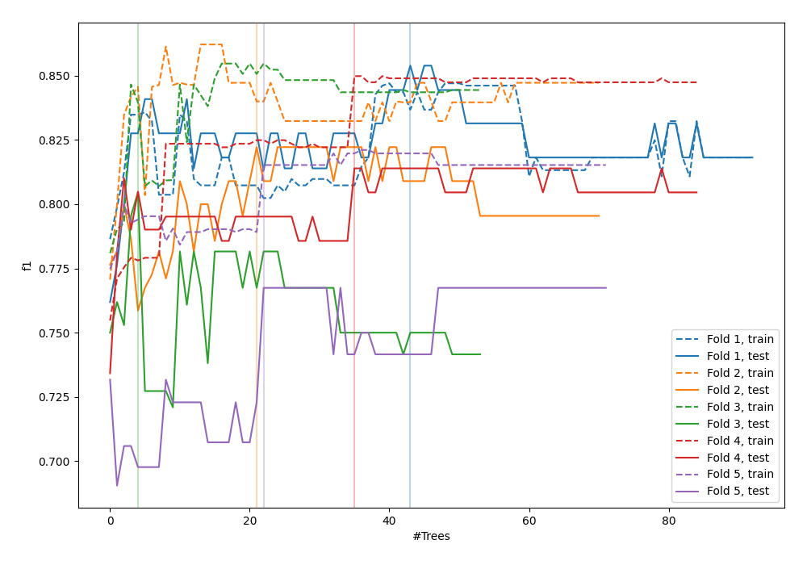
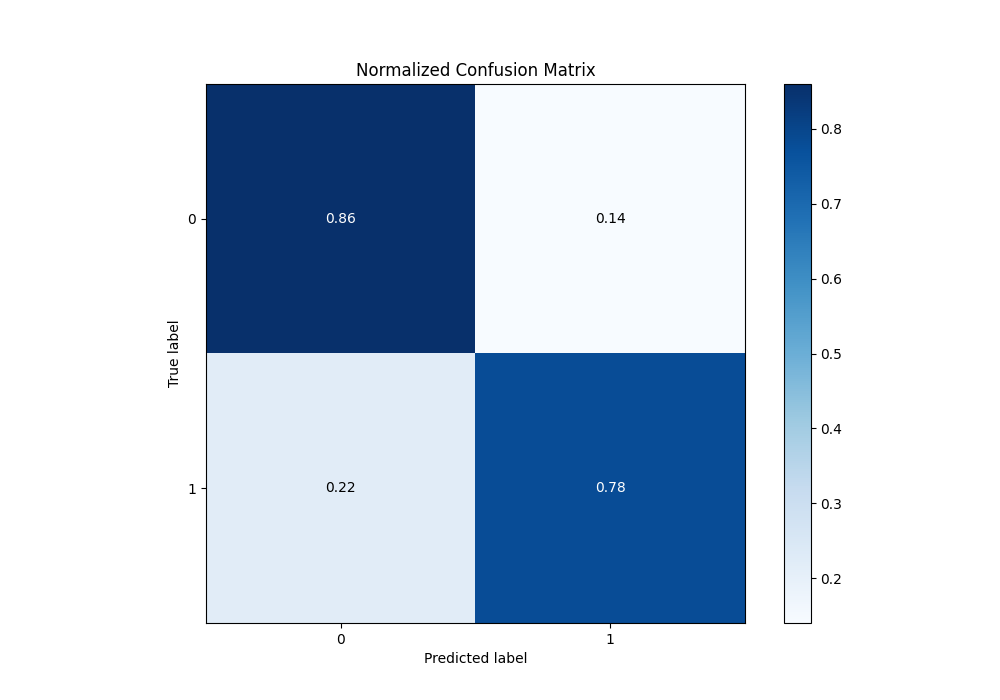
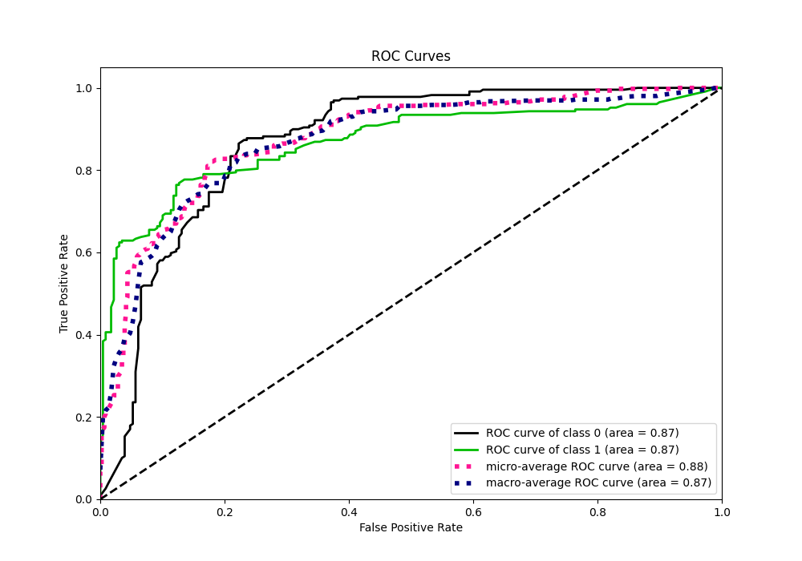
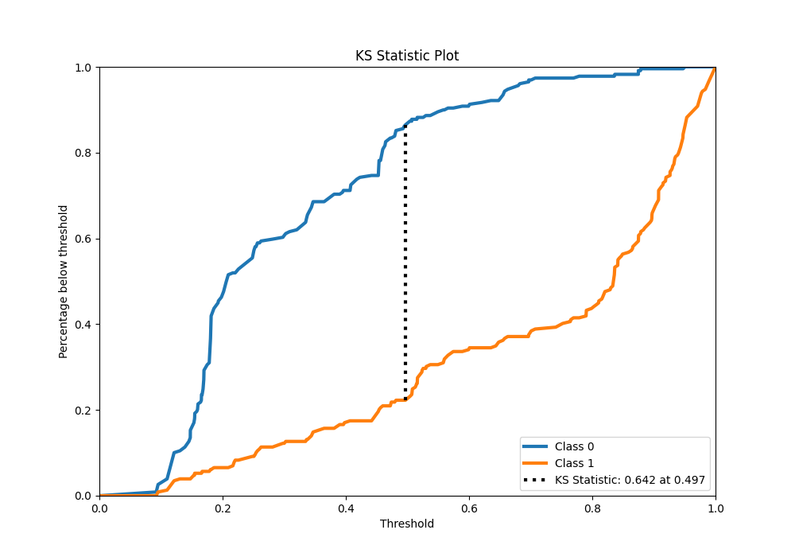
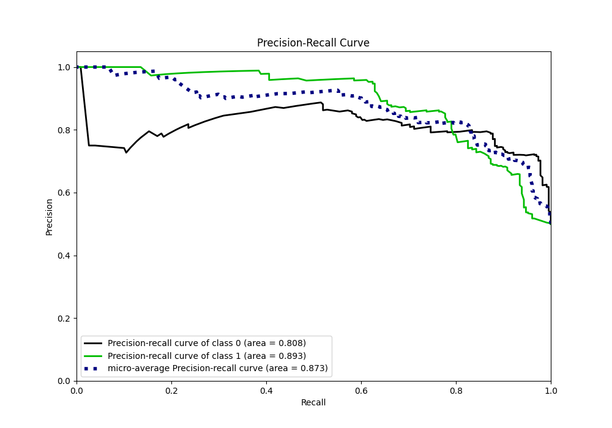
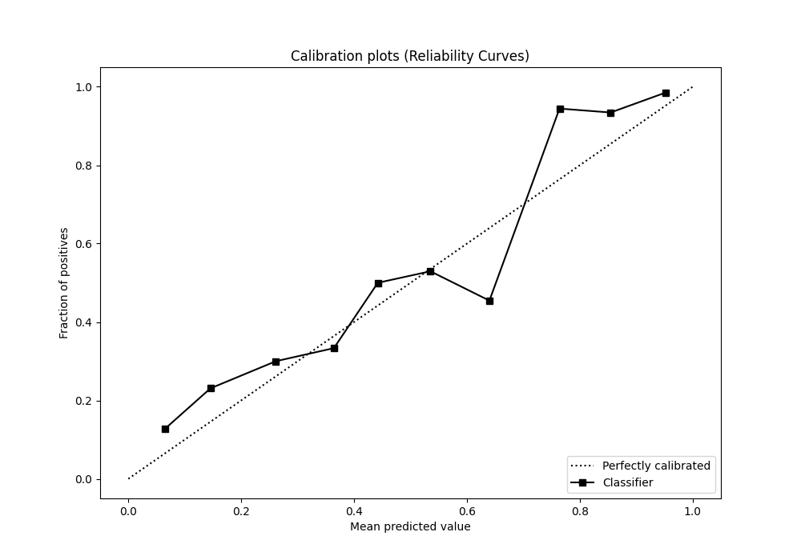
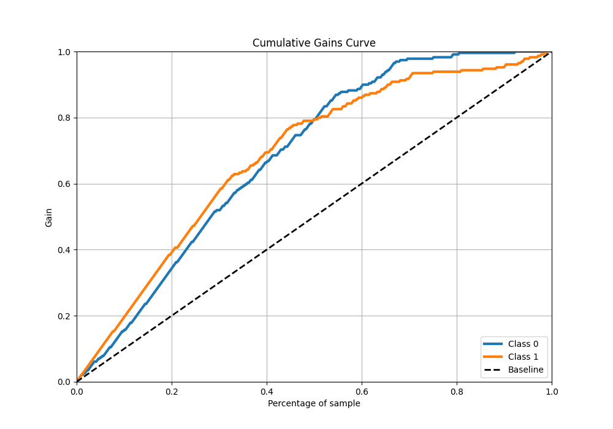
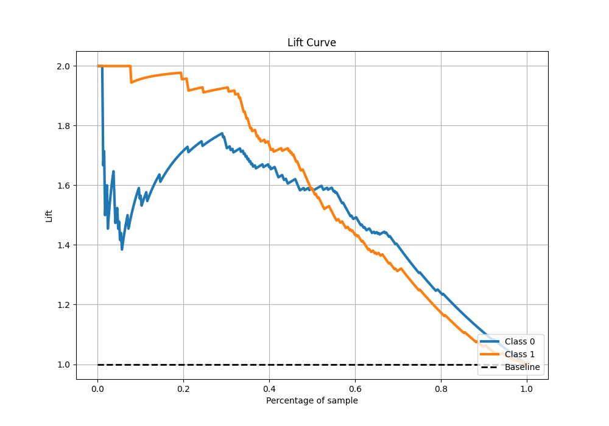

# Summary of 39_RandomForest_SelectedFeatures

[<< Go back](../README.md)

## Random Forest
- **n_jobs**: -1
- **criterion**: gini
- **max_features**: 0.5
- **min_samples_split**: 20
- **max_depth**: 4
- **eval_metric_name**: f1
- **explain_level**: 0

## Validation
 - **validation_type**: kfold
 - **shuffle**: True
 - **stratify**: True
 - **k_folds**: 5

## Optimized metric
f1

## Training time

14.1 seconds

## Metric details
|           |    score |   threshold |
|:----------|---------:|------------:|
| logloss   | 0.439467 | nan         |
| auc       | 0.869253 | nan         |
| f1        | 0.812785 |   0.500279  |
| accuracy  | 0.820961 |   0.500279  |
| precision | 0.988764 |   0.880872  |
| recall    | 1        |   0.0830311 |
| mcc       | 0.645476 |   0.505443  |

## Metric details with threshold from accuracy metric
|           |    score |   threshold |
|:----------|---------:|------------:|
| logloss   | 0.439467 |  nan        |
| auc       | 0.869253 |  nan        |
| f1        | 0.812785 |    0.500279 |
| accuracy  | 0.820961 |    0.500279 |
| precision | 0.851675 |    0.500279 |
| recall    | 0.777293 |    0.500279 |
| mcc       | 0.644384 |    0.500279 |

## Confusion matrix (at threshold=0.500279)
|              |   Predicted as 0 |   Predicted as 1 |
|:-------------|-----------------:|-----------------:|
| Labeled as 0 |              198 |               31 |
| Labeled as 1 |               51 |              178 |

## Learning curves

## Confusion Matrix

## Normalized Confusion Matrix

## ROC Curve

## Kolmogorov-Smirnov Statistic

## Precision-Recall Curve

## Calibration Curve

## Cumulative Gains Curve

## Lift Curve

[<< Go back](../README.md)
