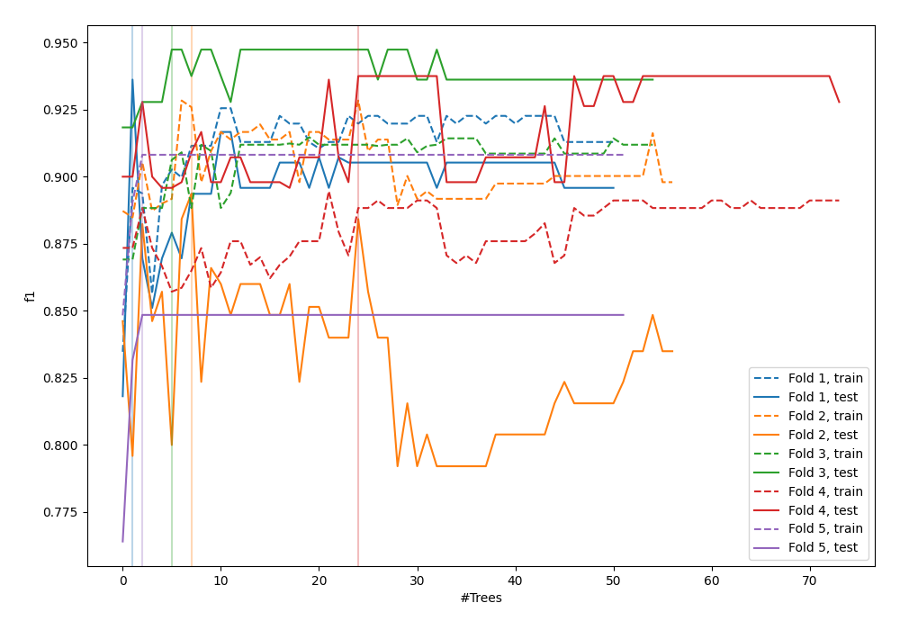
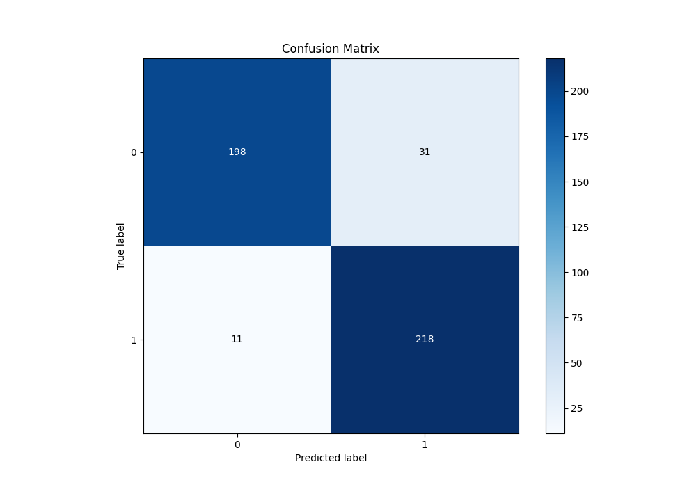
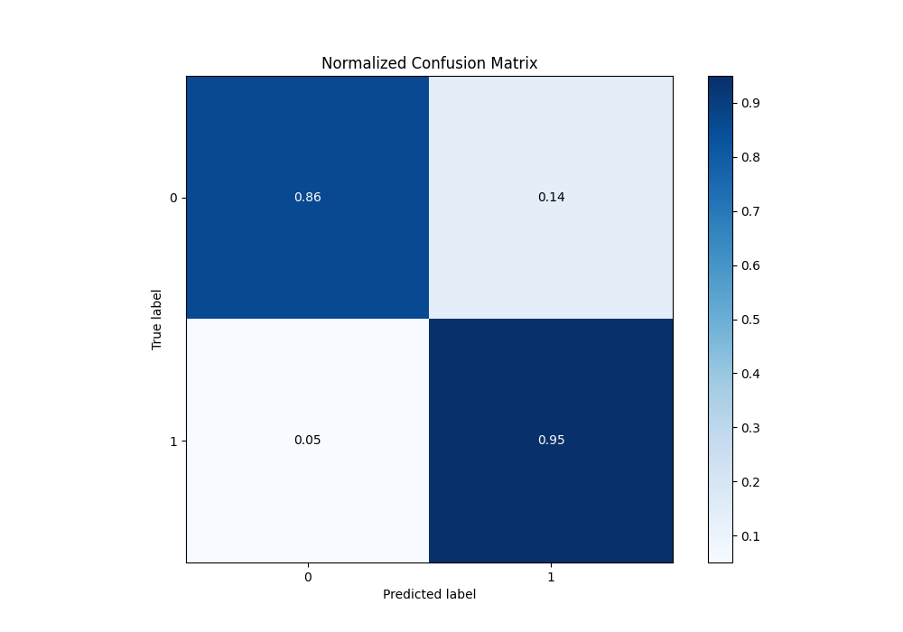
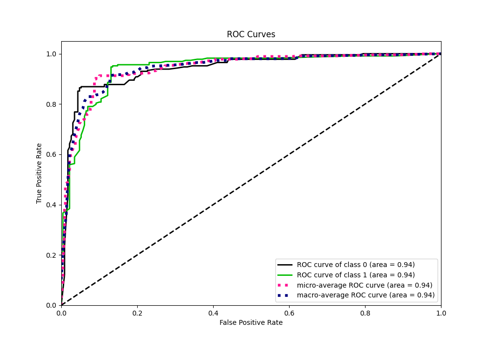
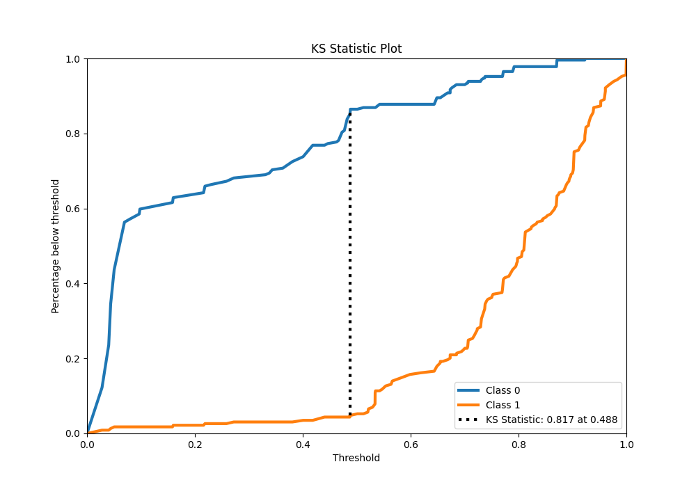
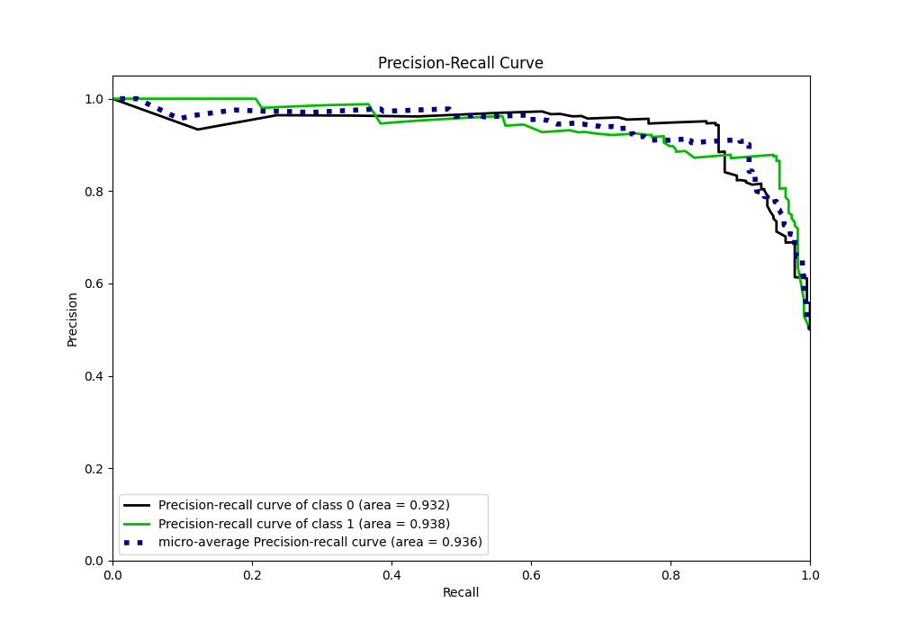
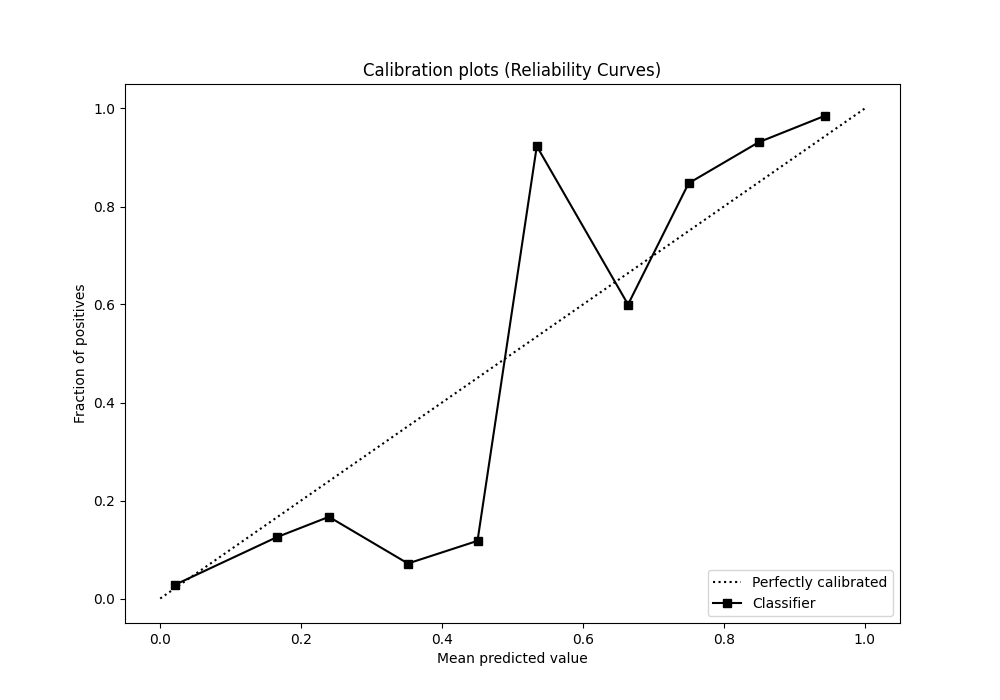
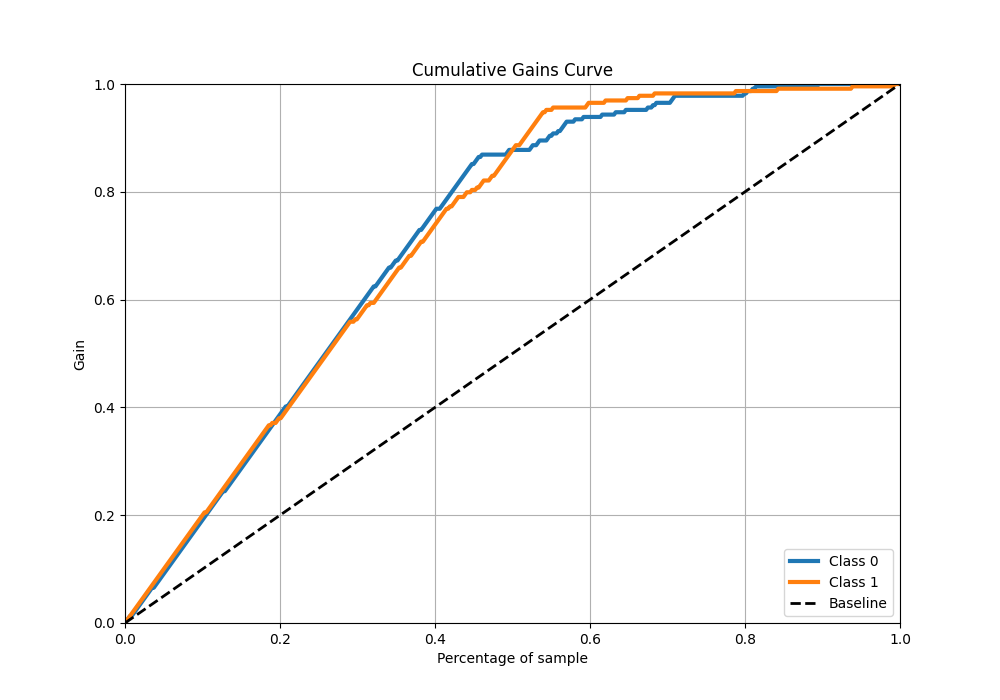
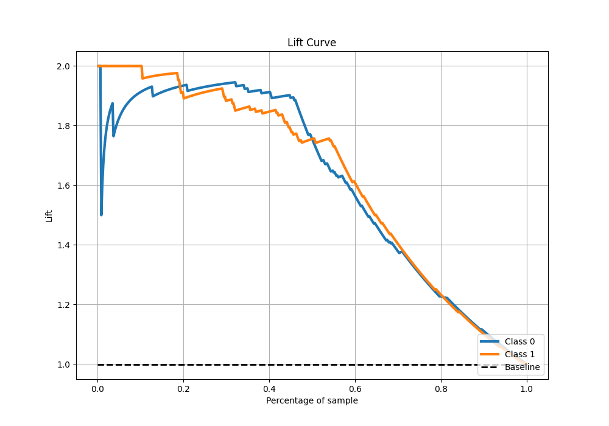

# Summary of 43_RandomForest

[<< Go back](../README.md)

## Random Forest
- **n_jobs**: -1
- **criterion**: gini
- **max_features**: 0.7
- **min_samples_split**: 50
- **max_depth**: 3
- **eval_metric_name**: f1
- **explain_level**: 0

## Validation
 - **validation_type**: kfold
 - **shuffle**: True
 - **stratify**: True
 - **k_folds**: 5

## Optimized metric
f1

## Training time

9.7 seconds

## Metric details
|           |    score |   threshold |
|:----------|---------:|------------:|
| logloss   | 0.323967 | nan         |
| auc       | 0.941315 | nan         |
| f1        | 0.912134 |   0.494737  |
| accuracy  | 0.908297 |   0.494737  |
| precision | 0.988235 |   0.871278  |
| recall    | 1        |   0.0250603 |
| mcc       | 0.819726 |   0.494737  |

## Metric details with threshold from accuracy metric
|           |    score |   threshold |
|:----------|---------:|------------:|
| logloss   | 0.323967 |  nan        |
| auc       | 0.941315 |  nan        |
| f1        | 0.912134 |    0.494737 |
| accuracy  | 0.908297 |    0.494737 |
| precision | 0.875502 |    0.494737 |
| recall    | 0.951965 |    0.494737 |
| mcc       | 0.819726 |    0.494737 |

## Confusion matrix (at threshold=0.494737)
|              |   Predicted as 0 |   Predicted as 1 |
|:-------------|-----------------:|-----------------:|
| Labeled as 0 |              198 |               31 |
| Labeled as 1 |               11 |              218 |

## Learning curves

## Confusion Matrix

## Normalized Confusion Matrix

## ROC Curve

## Kolmogorov-Smirnov Statistic

## Precision-Recall Curve

## Calibration Curve

## Cumulative Gains Curve

## Lift Curve

[<< Go back](../README.md)
