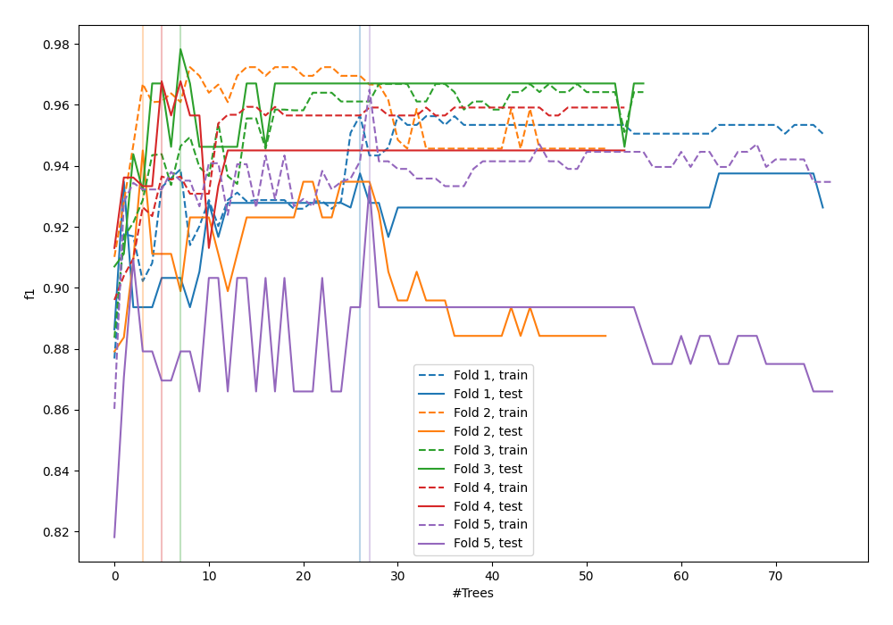
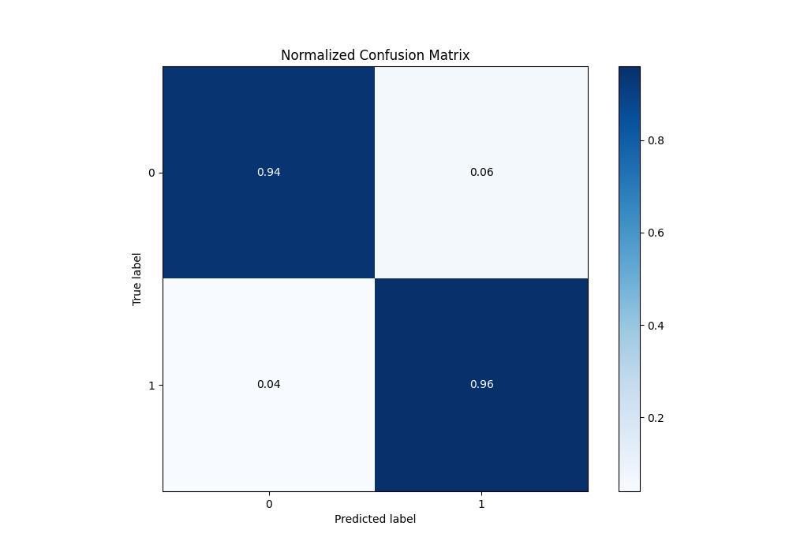
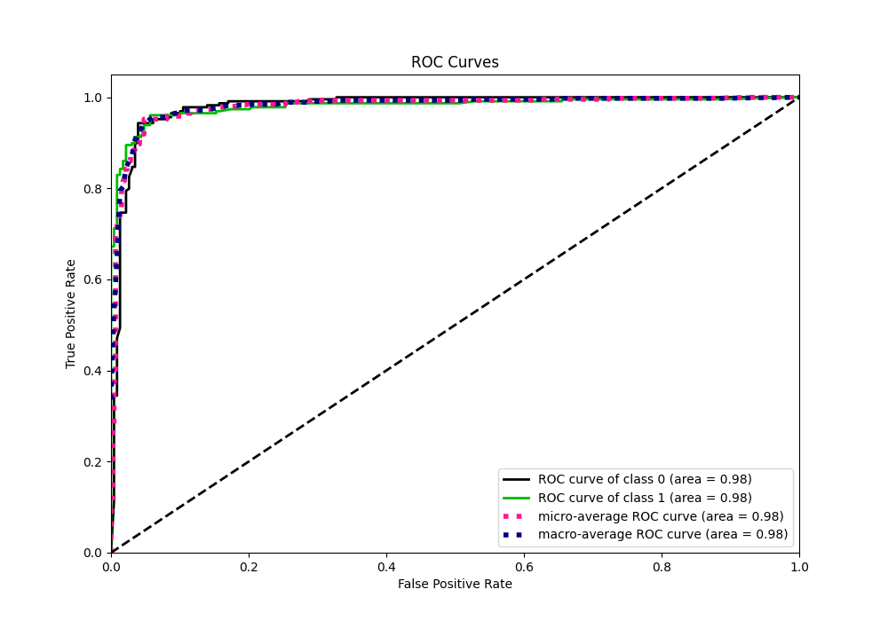
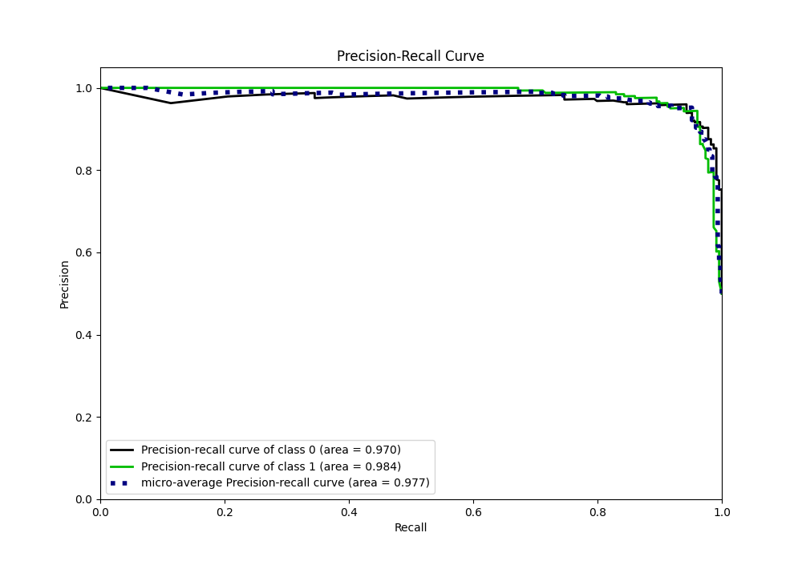
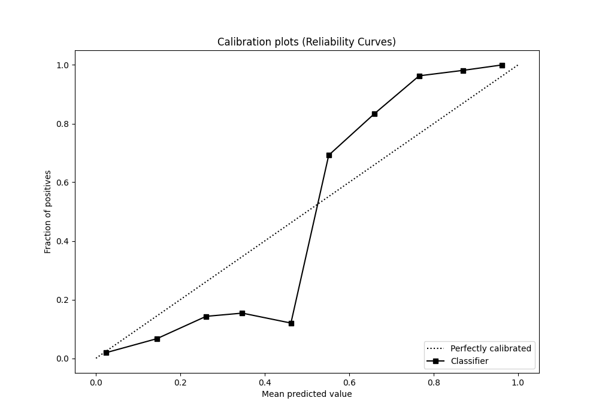
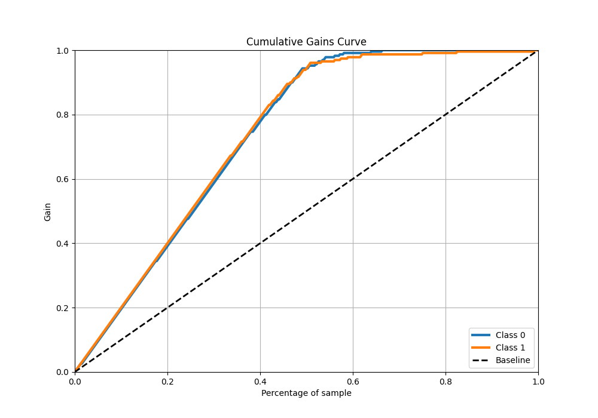
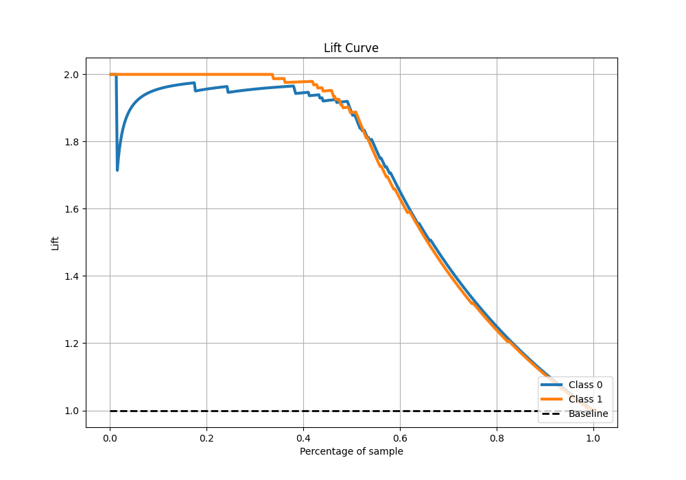

# Summary of 46_RandomForest

[<< Go back](../README.md)

## Random Forest
- **n_jobs**: -1
- **criterion**: gini
- **max_features**: 0.6
- **min_samples_split**: 20
- **max_depth**: 4
- **eval_metric_name**: f1
- **explain_level**: 0

## Validation
 - **validation_type**: kfold
 - **shuffle**: True
 - **stratify**: True
 - **k_folds**: 5

## Optimized metric
f1

## Training time

12.1 seconds

## Metric details
|           |    score |   threshold |
|:----------|---------:|------------:|
| logloss   | 0.214625 | nan         |
| auc       | 0.98033  | nan         |
| f1        | 0.952381 |   0.503063  |
| accuracy  | 0.951965 |   0.503063  |
| precision | 1        |   0.838433  |
| recall    | 1        |   0.0123228 |
| mcc       | 0.904068 |   0.503063  |

## Metric details with threshold from accuracy metric
|           |    score |   threshold |
|:----------|---------:|------------:|
| logloss   | 0.214625 |  nan        |
| auc       | 0.98033  |  nan        |
| f1        | 0.952381 |    0.503063 |
| accuracy  | 0.951965 |    0.503063 |
| precision | 0.944206 |    0.503063 |
| recall    | 0.960699 |    0.503063 |
| mcc       | 0.904068 |    0.503063 |

## Confusion matrix (at threshold=0.503063)
|              |   Predicted as 0 |   Predicted as 1 |
|:-------------|-----------------:|-----------------:|
| Labeled as 0 |              216 |               13 |
| Labeled as 1 |                9 |              220 |

## Learning curves

## Confusion Matrix

## Normalized Confusion Matrix

## ROC Curve

## Kolmogorov-Smirnov Statistic

## Precision-Recall Curve

## Calibration Curve

## Cumulative Gains Curve

## Lift Curve

[<< Go back](../README.md)
