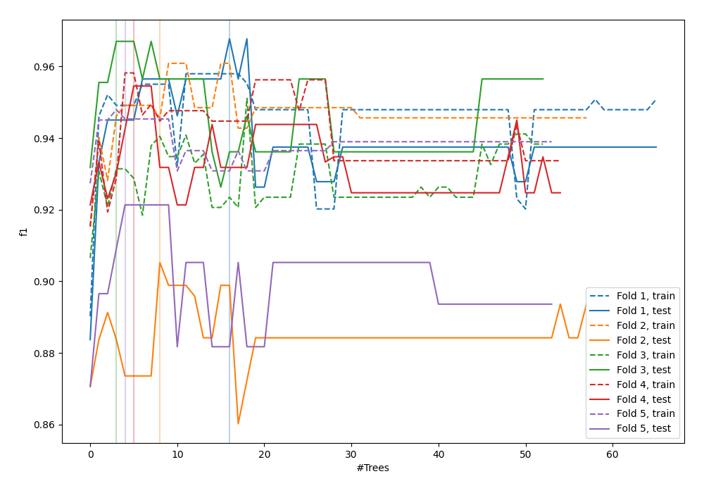
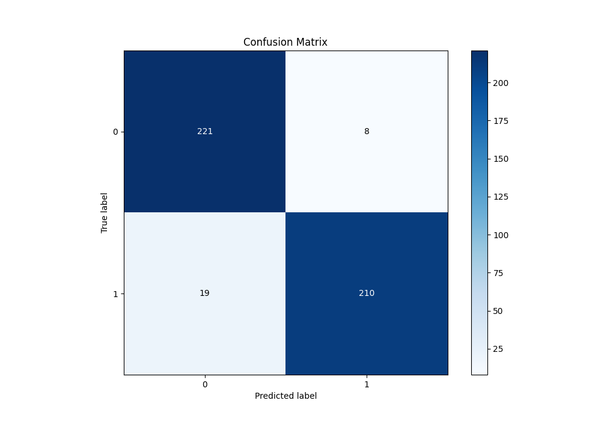
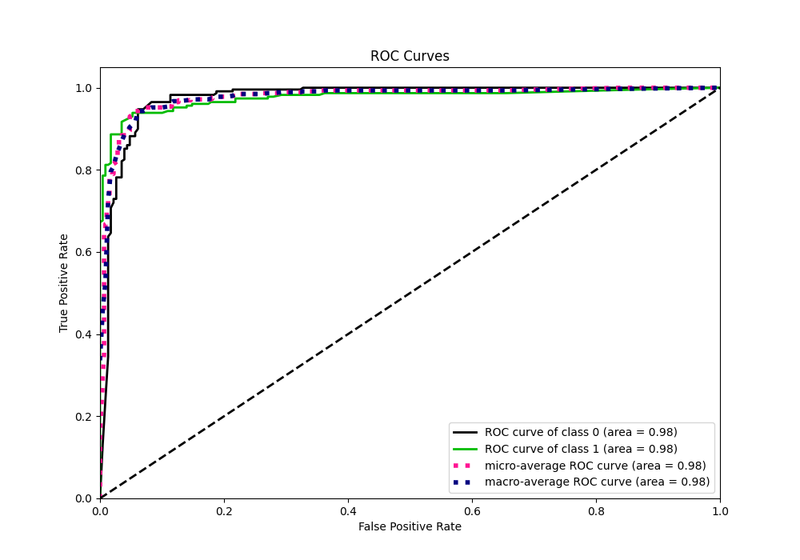
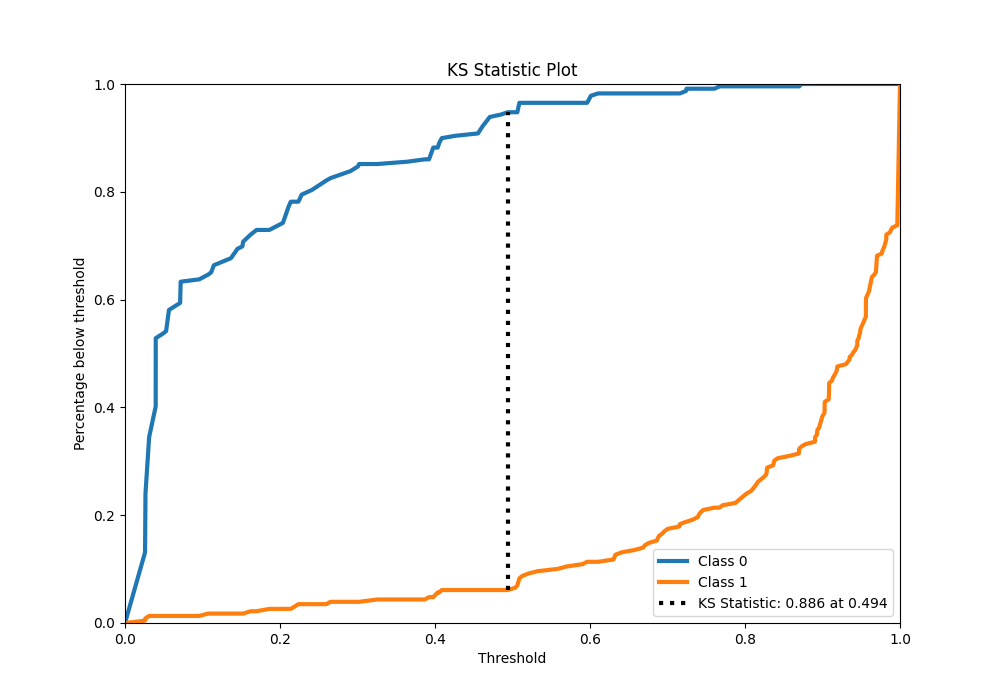
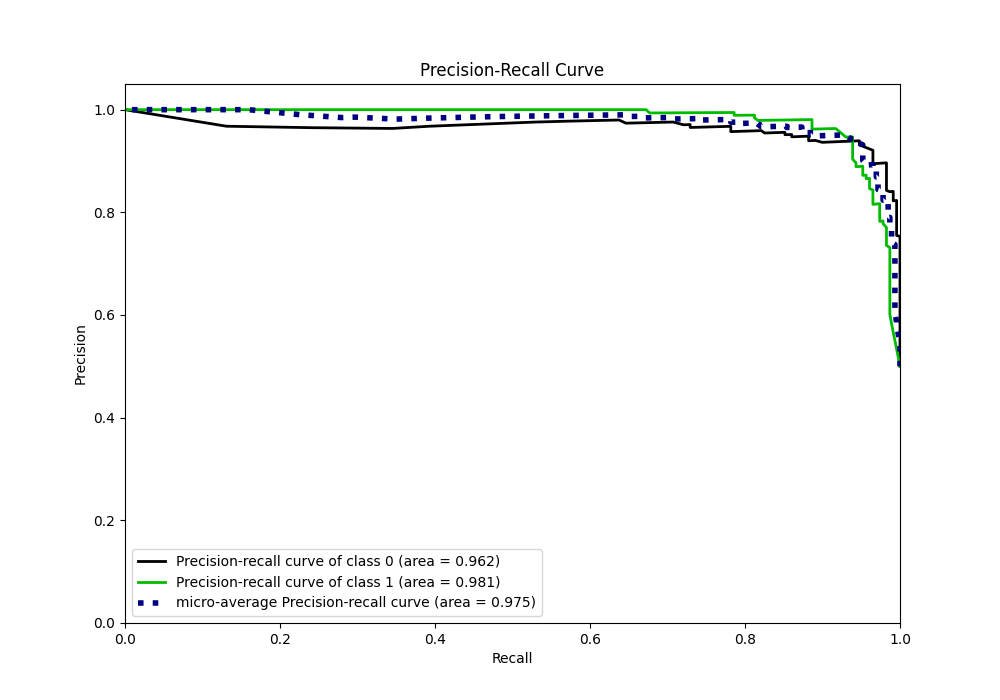
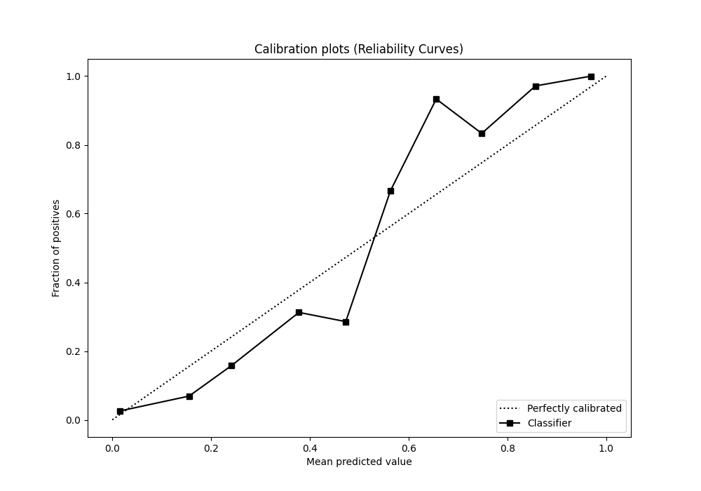
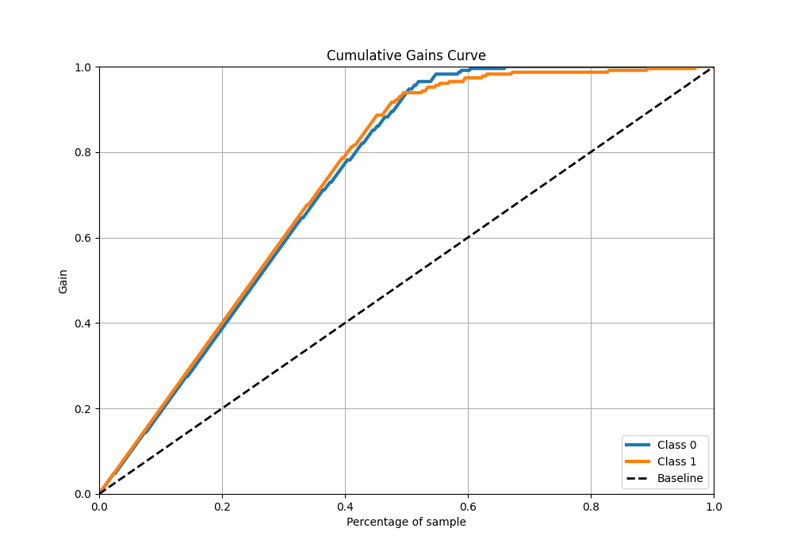
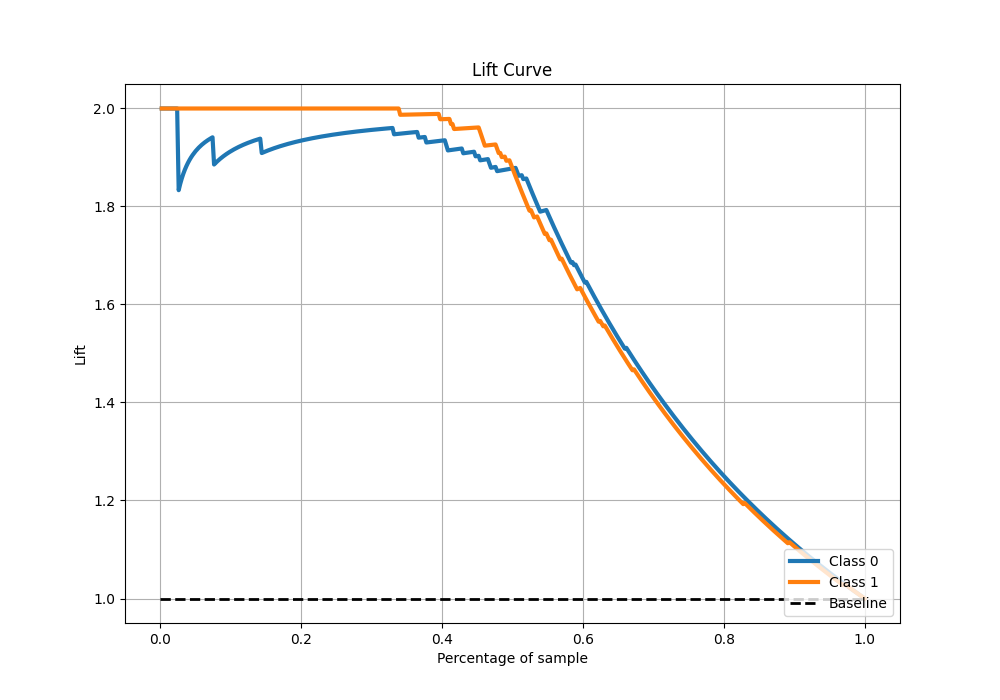

# Summary of 48_ExtraTrees

[<< Go back](../README.md)

## Extra Trees Classifier (Extra Trees)
- **n_jobs**: -1
- **criterion**: gini
- **max_features**: 0.5
- **min_samples_split**: 20
- **max_depth**: 4
- **eval_metric_name**: f1
- **explain_level**: 0

## Validation
 - **validation_type**: kfold
 - **shuffle**: True
 - **stratify**: True
 - **k_folds**: 5

## Optimized metric
f1

## Training time

6.7 seconds

## Metric details
|           |    score |   threshold |
|:----------|---------:|------------:|
| logloss   | 0.205226 | nan         |
| auc       | 0.975754 | nan         |
| f1        | 0.939597 |   0.508896  |
| accuracy  | 0.941048 |   0.508896  |
| precision | 1        |   0.884233  |
| recall    | 1        |   0.0232776 |
| mcc       | 0.883115 |   0.508896  |

## Metric details with threshold from accuracy metric
|           |    score |   threshold |
|:----------|---------:|------------:|
| logloss   | 0.205226 |  nan        |
| auc       | 0.975754 |  nan        |
| f1        | 0.939597 |    0.508896 |
| accuracy  | 0.941048 |    0.508896 |
| precision | 0.963303 |    0.508896 |
| recall    | 0.917031 |    0.508896 |
| mcc       | 0.883115 |    0.508896 |

## Confusion matrix (at threshold=0.508896)
|              |   Predicted as 0 |   Predicted as 1 |
|:-------------|-----------------:|-----------------:|
| Labeled as 0 |              221 |                8 |
| Labeled as 1 |               19 |              210 |

## Learning curves

## Confusion Matrix

## Normalized Confusion Matrix

## ROC Curve

## Kolmogorov-Smirnov Statistic

## Precision-Recall Curve

## Calibration Curve

## Cumulative Gains Curve

## Lift Curve

[<< Go back](../README.md)
