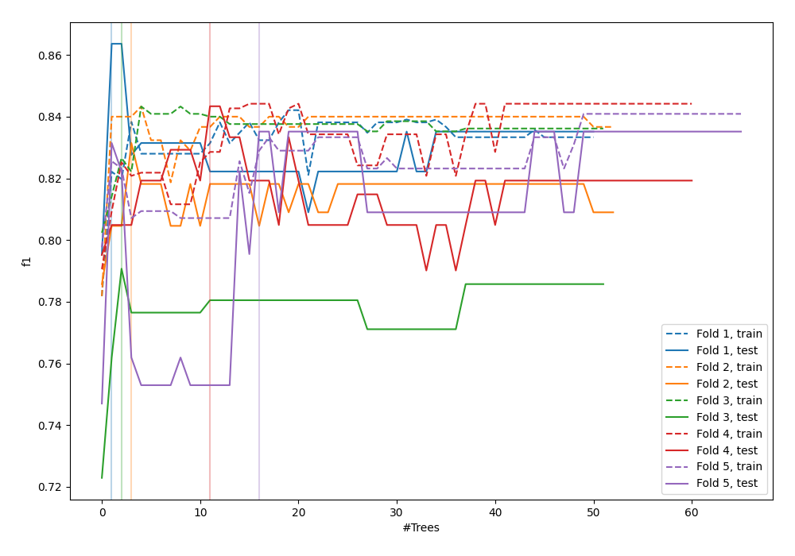
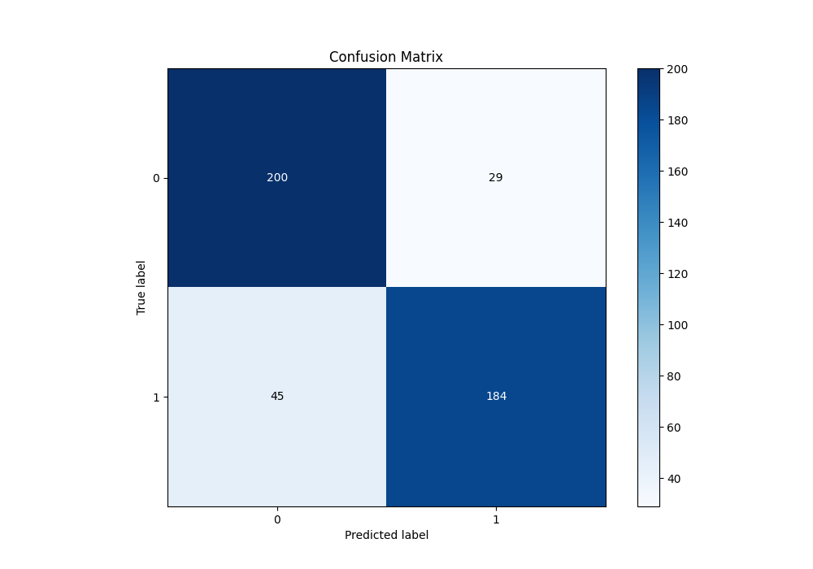
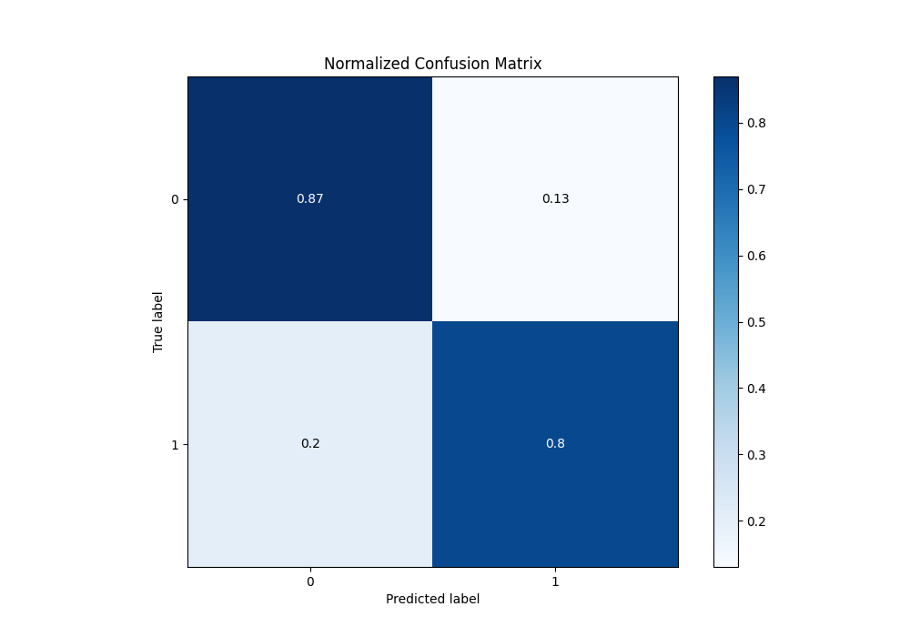
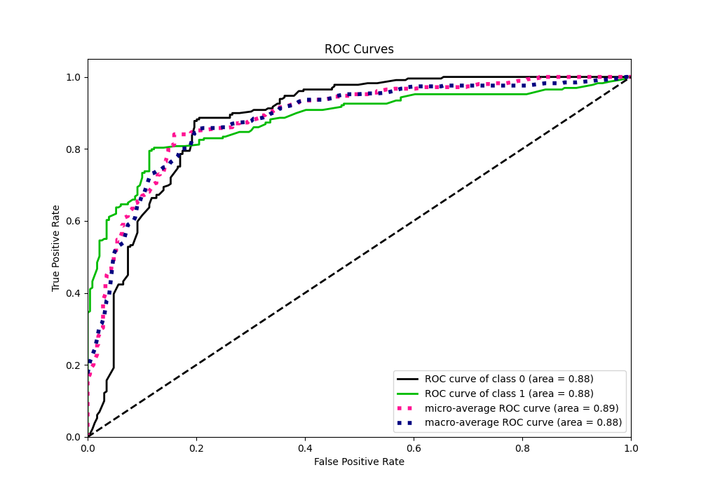
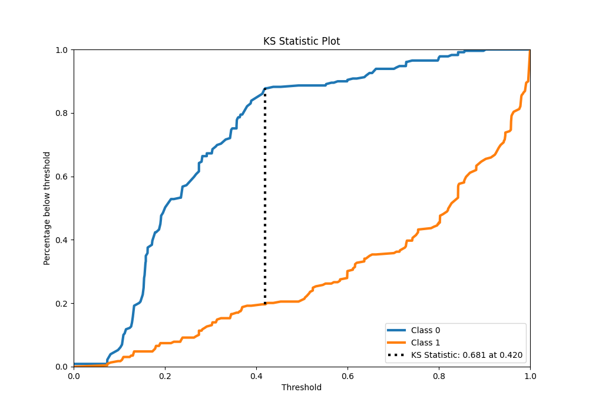
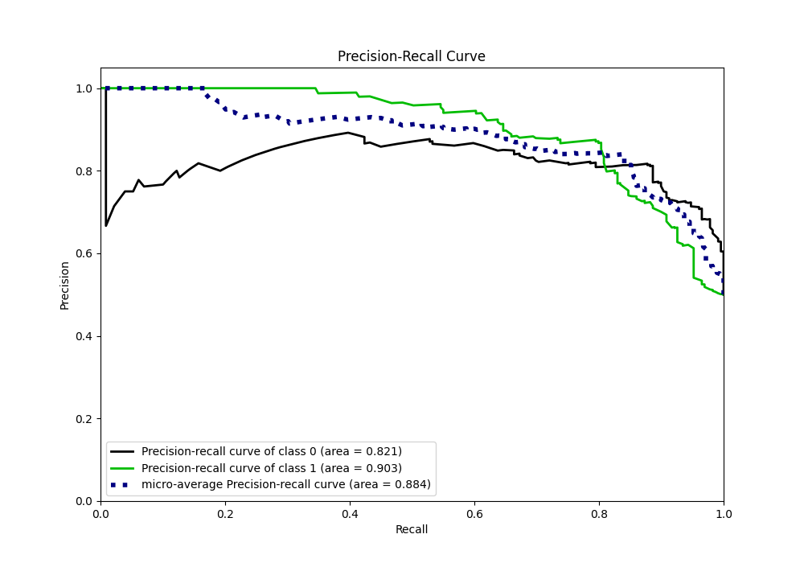
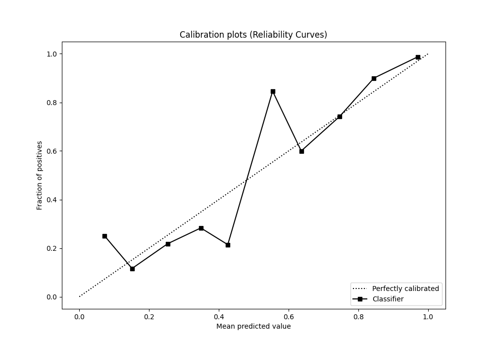
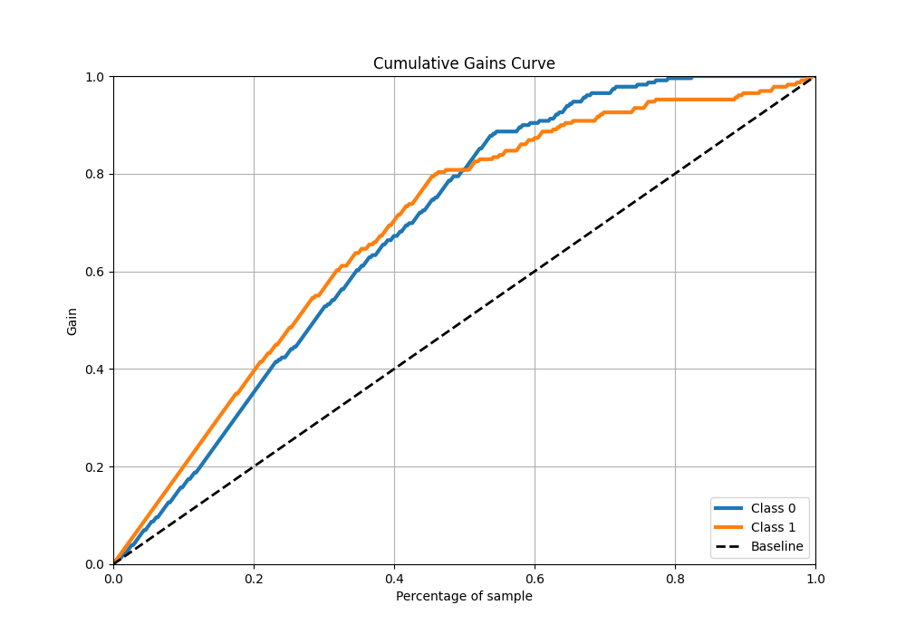
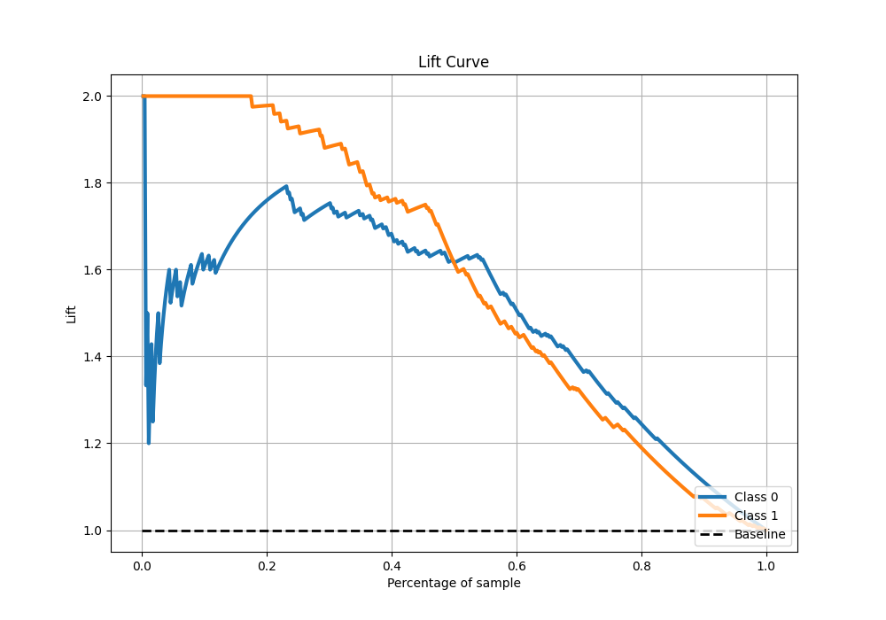

# Summary of 49_ExtraTrees_SelectedFeatures

[<< Go back](../README.md)

## Extra Trees Classifier (Extra Trees)
- **n_jobs**: -1
- **criterion**: gini
- **max_features**: 0.7
- **min_samples_split**: 30
- **max_depth**: 7
- **eval_metric_name**: f1
- **explain_level**: 0

## Validation
 - **validation_type**: kfold
 - **shuffle**: True
 - **stratify**: True
 - **k_folds**: 5

## Optimized metric
f1

## Training time

14.0 seconds

## Metric details
|           |    score |   threshold |
|:----------|---------:|------------:|
| logloss   | 0.417987 |  nan        |
| auc       | 0.879875 |  nan        |
| f1        | 0.832579 |    0.418712 |
| accuracy  | 0.838428 |    0.418712 |
| precision | 1        |    0.92273  |
| recall    | 1        |    0        |
| mcc       | 0.679452 |    0.473127 |

## Metric details with threshold from accuracy metric
|           |    score |   threshold |
|:----------|---------:|------------:|
| logloss   | 0.417987 |  nan        |
| auc       | 0.879875 |  nan        |
| f1        | 0.832579 |    0.418712 |
| accuracy  | 0.838428 |    0.418712 |
| precision | 0.86385  |    0.418712 |
| recall    | 0.803493 |    0.418712 |
| mcc       | 0.678514 |    0.418712 |

## Confusion matrix (at threshold=0.418712)
|              |   Predicted as 0 |   Predicted as 1 |
|:-------------|-----------------:|-----------------:|
| Labeled as 0 |              200 |               29 |
| Labeled as 1 |               45 |              184 |

## Learning curves

## Confusion Matrix

## Normalized Confusion Matrix

## ROC Curve

## Kolmogorov-Smirnov Statistic

## Precision-Recall Curve

## Calibration Curve

## Cumulative Gains Curve

## Lift Curve

[<< Go back](../README.md)
