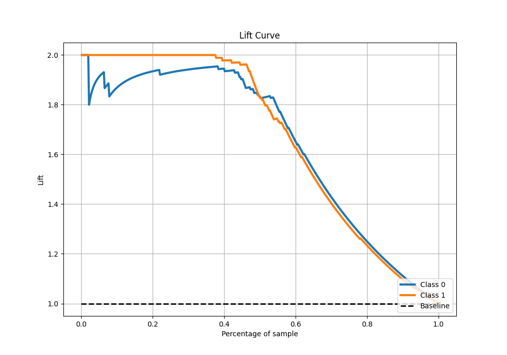

# Summary of 4_Linear

[<< Go back](../README.md)

## Logistic Regression (Linear)
- **n_jobs**: -1
- **explain_level**: 0

## Validation
 - **validation_type**: kfold
 - **shuffle**: True
 - **stratify**: True
 - **k_folds**: 5

## Optimized metric
f1

## Training time

9.1 seconds

## Metric details
|           |    score |    threshold |
|:----------|---------:|-------------:|
| logloss   | 0.192042 | nan          |
| auc       | 0.974028 | nan          |
| f1        | 0.941176 |   0.538017   |
| accuracy  | 0.943231 |   0.538017   |
| precision | 1        |   0.88594    |
| recall    | 1        |   0.00697453 |
| mcc       | 0.888635 |   0.538017   |

## Metric details with threshold from accuracy metric
|           |    score |   threshold |
|:----------|---------:|------------:|
| logloss   | 0.192042 |  nan        |
| auc       | 0.974028 |  nan        |
| f1        | 0.941176 |    0.538017 |
| accuracy  | 0.943231 |    0.538017 |
| precision | 0.976526 |    0.538017 |
| recall    | 0.908297 |    0.538017 |
| mcc       | 0.888635 |    0.538017 |

## Confusion matrix (at threshold=0.538017)
|              |   Predicted as 0 |   Predicted as 1 |
|:-------------|-----------------:|-----------------:|
| Labeled as 0 |              224 |                5 |
| Labeled as 1 |               21 |              208 |

## Learning curves

## Confusion Matrix

## Normalized Confusion Matrix

## ROC Curve

## Kolmogorov-Smirnov Statistic

## Precision-Recall Curve

## Calibration Curve

## Cumulative Gains Curve

## Lift Curve

[<< Go back](../README.md)
