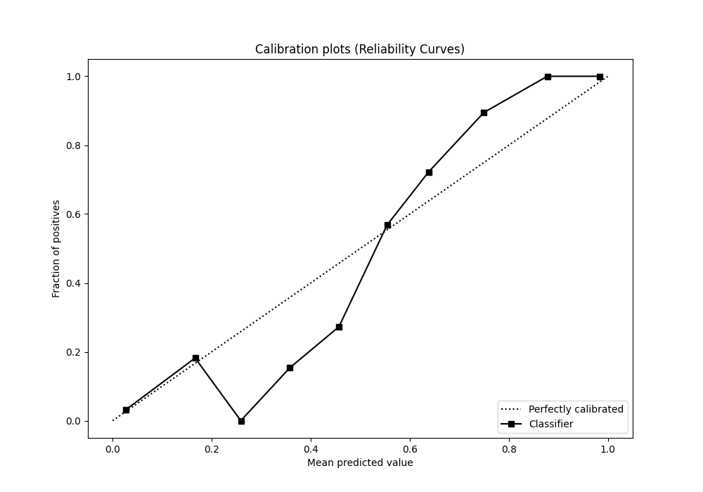

# Summary of 54_ExtraTrees

[<< Go back](../README.md)

## Extra Trees Classifier (Extra Trees)
- **n_jobs**: -1
- **criterion**: gini
- **max_features**: 0.9
- **min_samples_split**: 40
- **max_depth**: 5
- **eval_metric_name**: f1
- **explain_level**: 0

## Validation
 - **validation_type**: kfold
 - **shuffle**: True
 - **stratify**: True
 - **k_folds**: 5

## Optimized metric
f1

## Training time

11.0 seconds

## Metric details
|           |    score |    threshold |
|:----------|---------:|-------------:|
| logloss   | 0.242493 | nan          |
| auc       | 0.966286 | nan          |
| f1        | 0.905908 |   0.515266   |
| accuracy  | 0.908297 |   0.56917    |
| precision | 1        |   0.783437   |
| recall    | 1        |   0.00313853 |
| mcc       | 0.820389 |   0.56917    |

## Metric details with threshold from accuracy metric
|           |    score |   threshold |
|:----------|---------:|------------:|
| logloss   | 0.242493 |   nan       |
| auc       | 0.966286 |   nan       |
| f1        | 0.90367  |     0.56917 |
| accuracy  | 0.908297 |     0.56917 |
| precision | 0.951691 |     0.56917 |
| recall    | 0.860262 |     0.56917 |
| mcc       | 0.820389 |     0.56917 |

## Confusion matrix (at threshold=0.56917)
|              |   Predicted as 0 |   Predicted as 1 |
|:-------------|-----------------:|-----------------:|
| Labeled as 0 |              219 |               10 |
| Labeled as 1 |               32 |              197 |

## Learning curves

## Confusion Matrix

## Normalized Confusion Matrix

## ROC Curve

## Kolmogorov-Smirnov Statistic

## Precision-Recall Curve

## Calibration Curve

## Cumulative Gains Curve

## Lift Curve

[<< Go back](../README.md)
