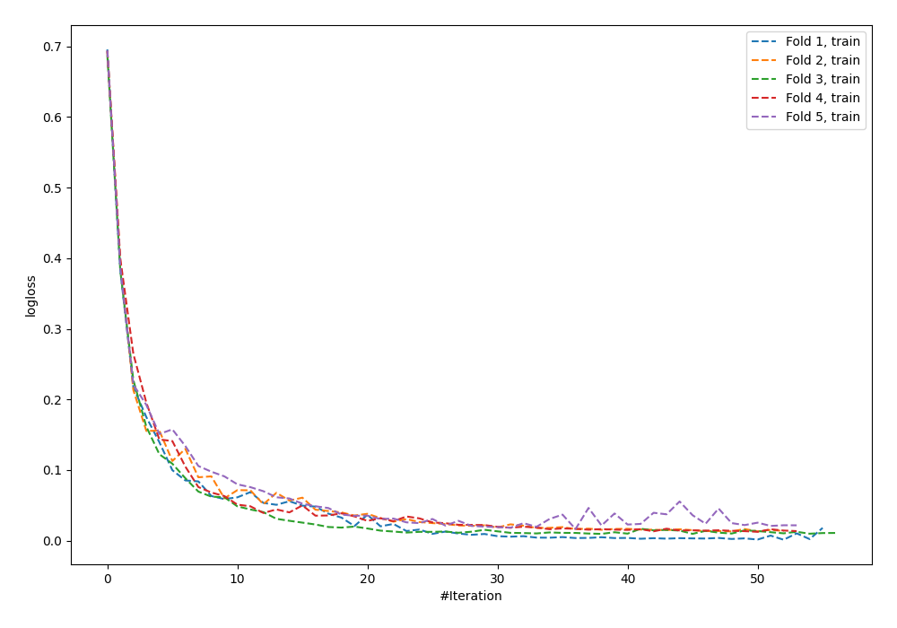
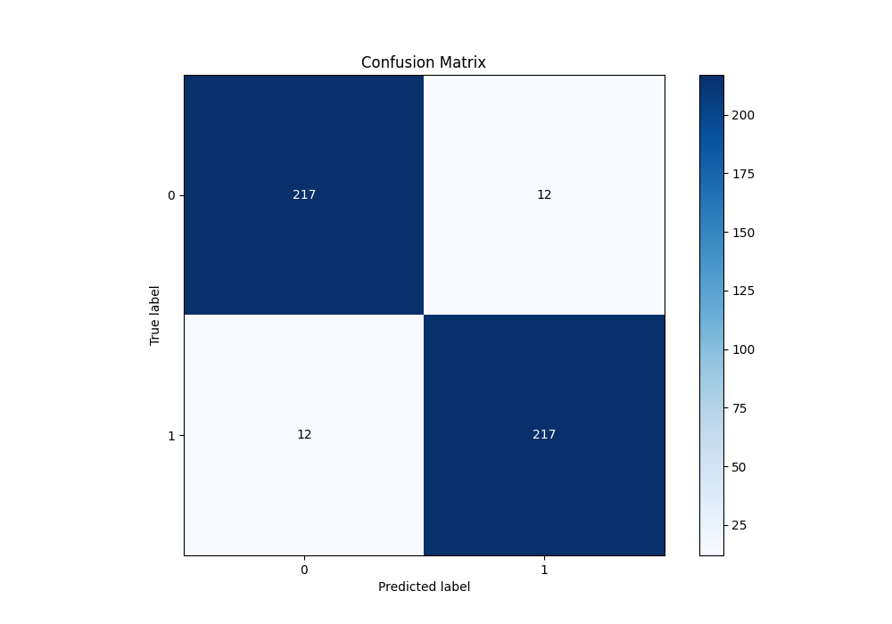
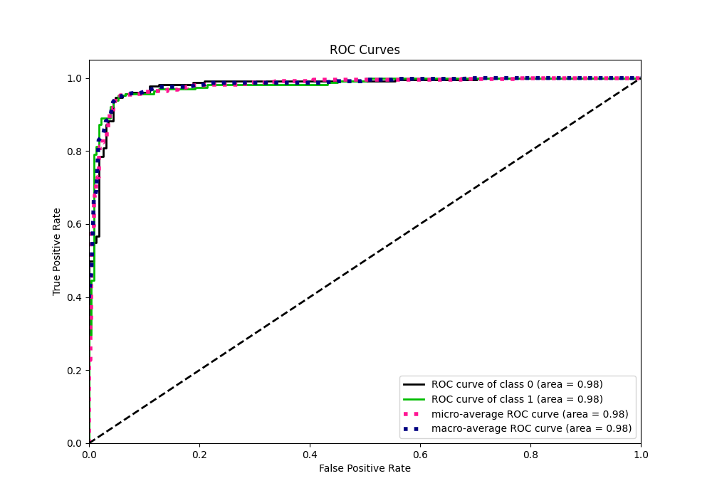
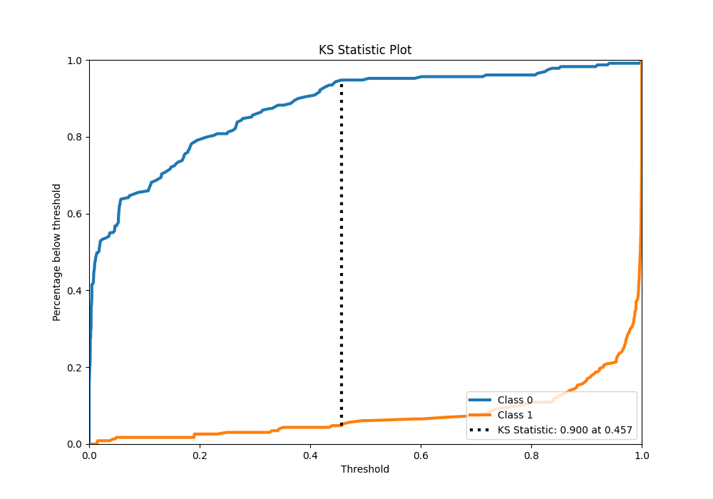
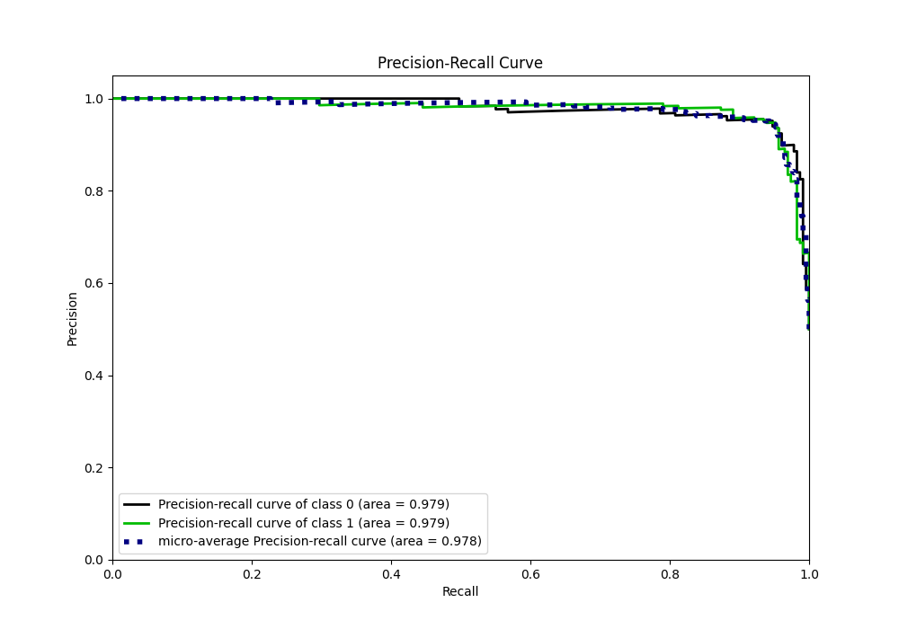
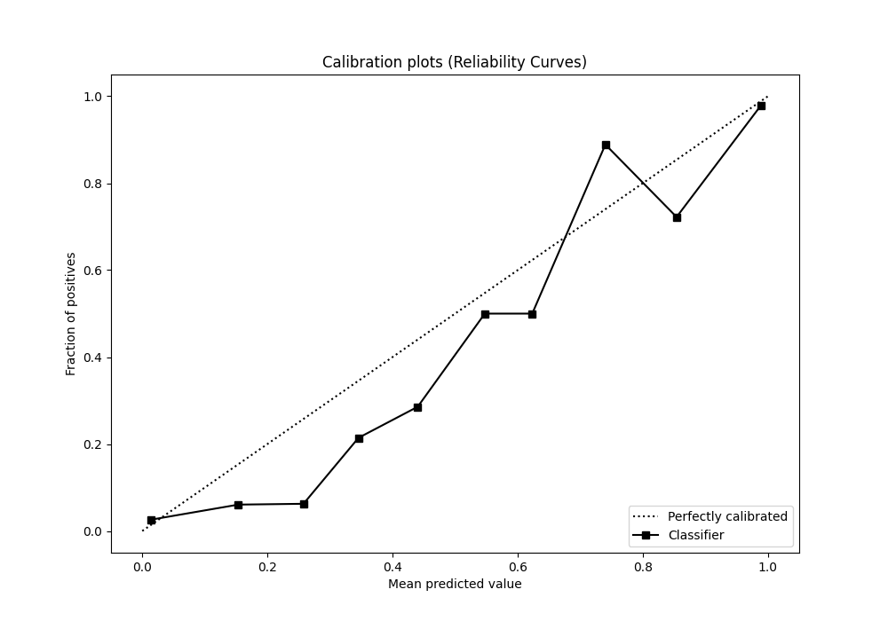
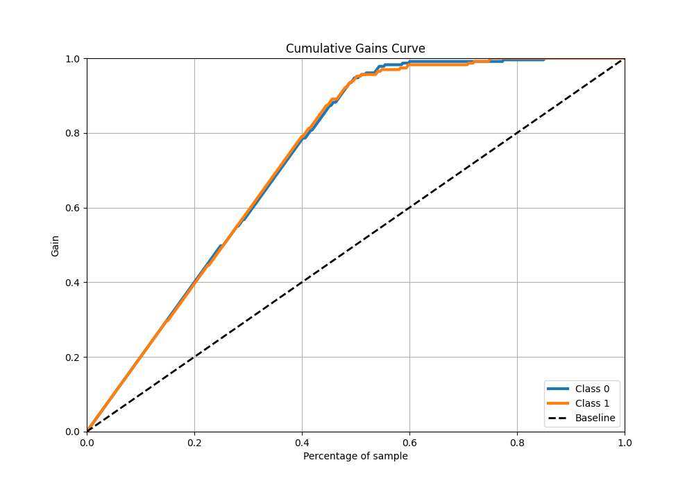
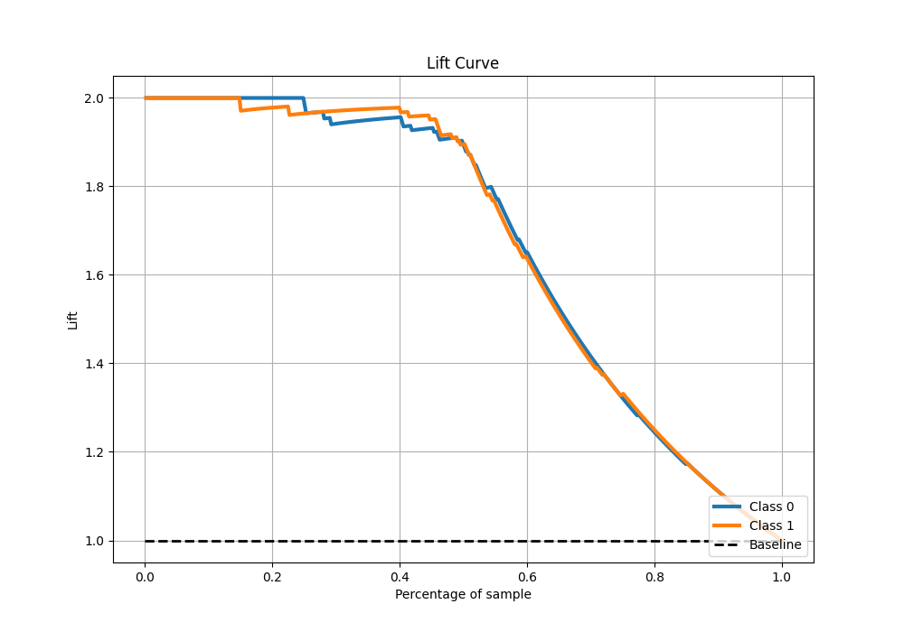

# Summary of 60_NeuralNetwork

[<< Go back](../README.md)

## Neural Network
- **n_jobs**: -1
- **dense_1_size**: 32
- **dense_2_size**: 32
- **learning_rate**: 0.05
- **explain_level**: 0

## Validation
 - **validation_type**: kfold
 - **shuffle**: True
 - **stratify**: True
 - **k_folds**: 5

## Optimized metric
f1

## Training time

7.8 seconds

## Metric details
|           |    score |     threshold |
|:----------|---------:|--------------:|
| logloss   | 0.190663 | nan           |
| auc       | 0.979119 | nan           |
| f1        | 0.947598 |   0.46477     |
| accuracy  | 0.947598 |   0.46477     |
| precision | 1        |   0.999892    |
| recall    | 1        |   4.76882e-06 |
| mcc       | 0.895197 |   0.46477     |

## Metric details with threshold from accuracy metric
|           |    score |   threshold |
|:----------|---------:|------------:|
| logloss   | 0.190663 |   nan       |
| auc       | 0.979119 |   nan       |
| f1        | 0.947598 |     0.46477 |
| accuracy  | 0.947598 |     0.46477 |
| precision | 0.947598 |     0.46477 |
| recall    | 0.947598 |     0.46477 |
| mcc       | 0.895197 |     0.46477 |

## Confusion matrix (at threshold=0.46477)
|              |   Predicted as 0 |   Predicted as 1 |
|:-------------|-----------------:|-----------------:|
| Labeled as 0 |              217 |               12 |
| Labeled as 1 |               12 |              217 |

## Learning curves

## Confusion Matrix

## Normalized Confusion Matrix

## ROC Curve

## Kolmogorov-Smirnov Statistic

## Precision-Recall Curve

## Calibration Curve

## Cumulative Gains Curve

## Lift Curve

[<< Go back](../README.md)
