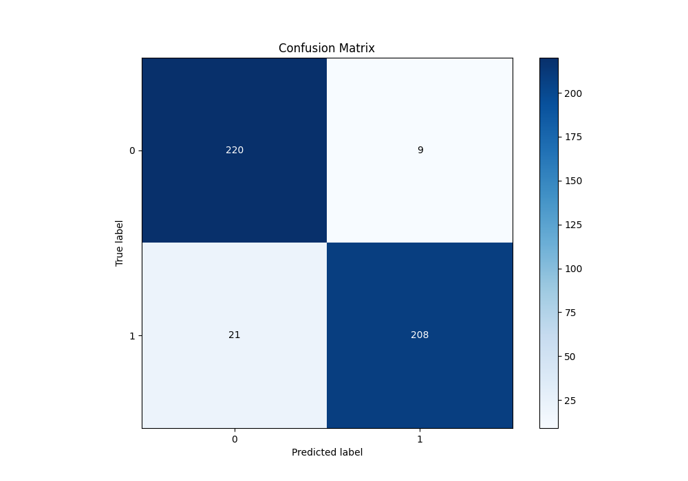

# Summary of 63_NeuralNetwork

[<< Go back](../README.md)

## Neural Network
- **n_jobs**: -1
- **dense_1_size**: 16
- **dense_2_size**: 16
- **learning_rate**: 0.01
- **explain_level**: 0

## Validation
 - **validation_type**: kfold
 - **shuffle**: True
 - **stratify**: True
 - **k_folds**: 5

## Optimized metric
f1

## Training time

10.1 seconds

## Metric details
|           |    score |     threshold |
|:----------|---------:|--------------:|
| logloss   | 0.231378 | nan           |
| auc       | 0.966419 | nan           |
| f1        | 0.932735 |   0.539948    |
| accuracy  | 0.934498 |   0.539948    |
| precision | 1        |   0.988988    |
| recall    | 1        |   4.64323e-05 |
| mcc       | 0.870191 |   0.539948    |

## Metric details with threshold from accuracy metric
|           |    score |   threshold |
|:----------|---------:|------------:|
| logloss   | 0.231378 |  nan        |
| auc       | 0.966419 |  nan        |
| f1        | 0.932735 |    0.539948 |
| accuracy  | 0.934498 |    0.539948 |
| precision | 0.958525 |    0.539948 |
| recall    | 0.908297 |    0.539948 |
| mcc       | 0.870191 |    0.539948 |

## Confusion matrix (at threshold=0.539948)
|              |   Predicted as 0 |   Predicted as 1 |
|:-------------|-----------------:|-----------------:|
| Labeled as 0 |              220 |                9 |
| Labeled as 1 |               21 |              208 |

## Learning curves

## Confusion Matrix

## Normalized Confusion Matrix

## ROC Curve

## Kolmogorov-Smirnov Statistic

## Precision-Recall Curve

## Calibration Curve

## Cumulative Gains Curve

## Lift Curve

[<< Go back](../README.md)
