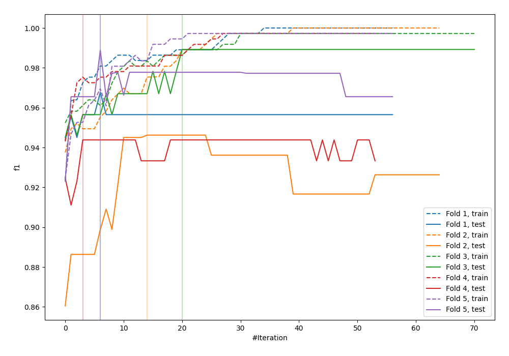
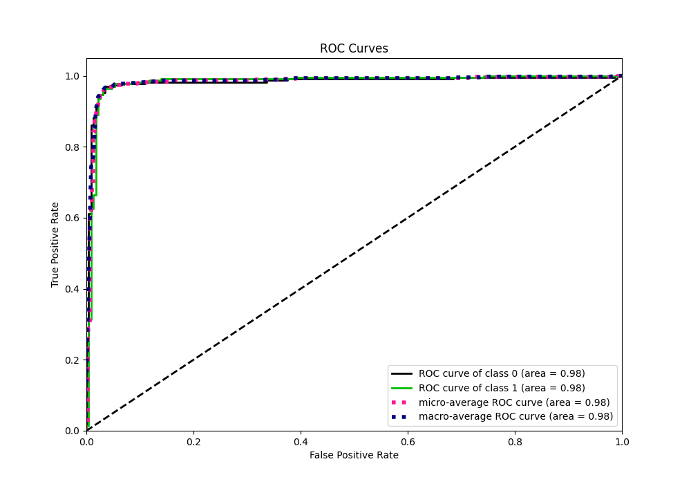
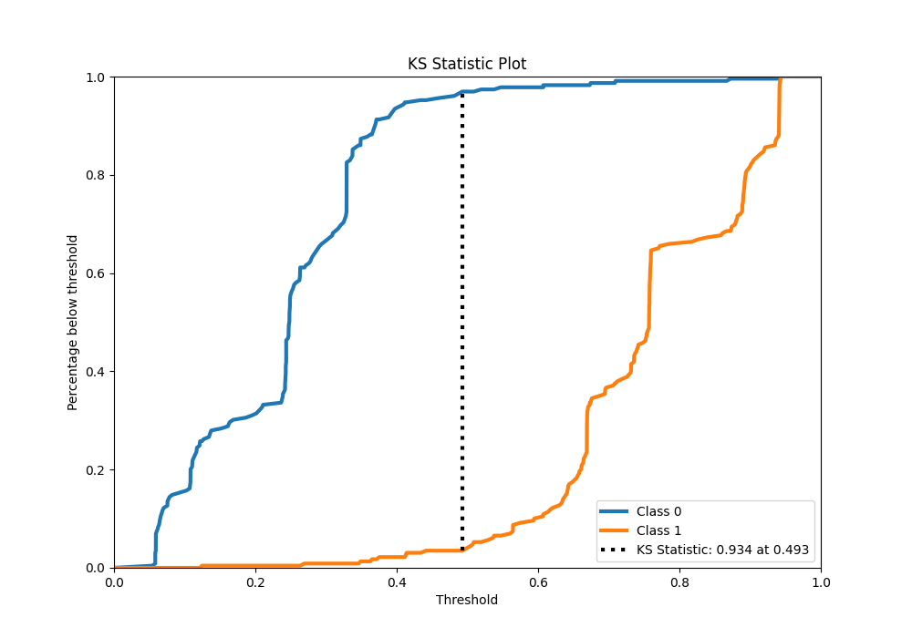
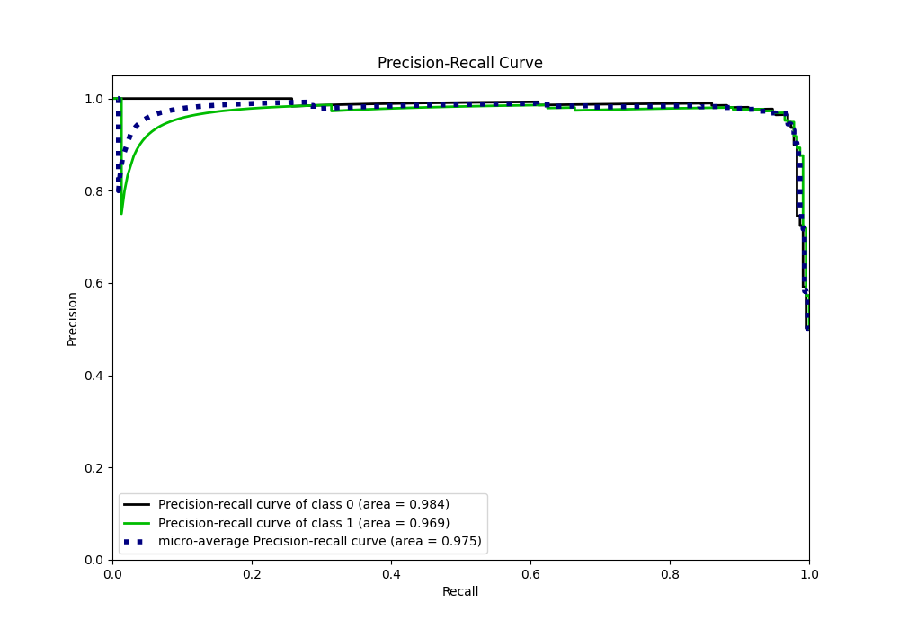
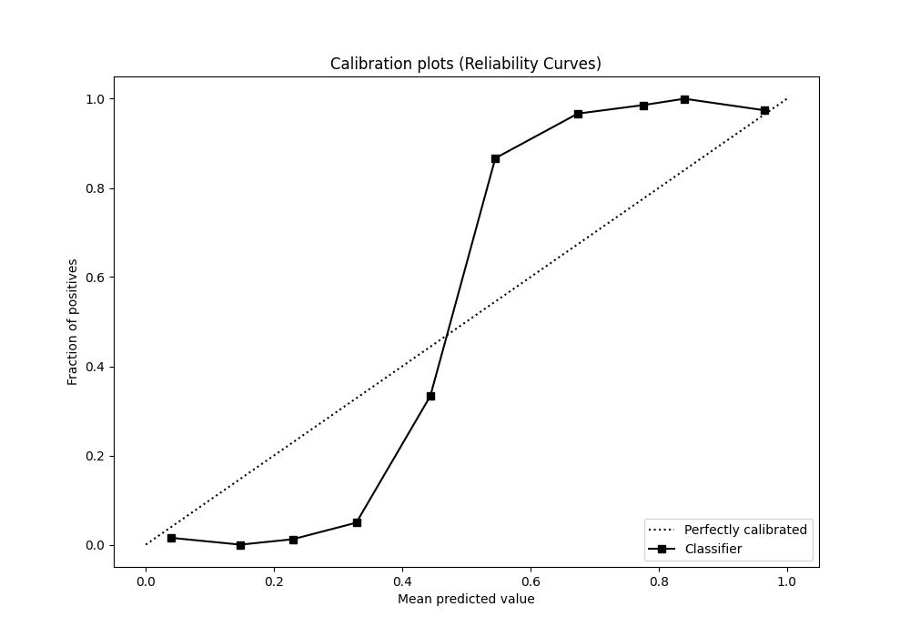
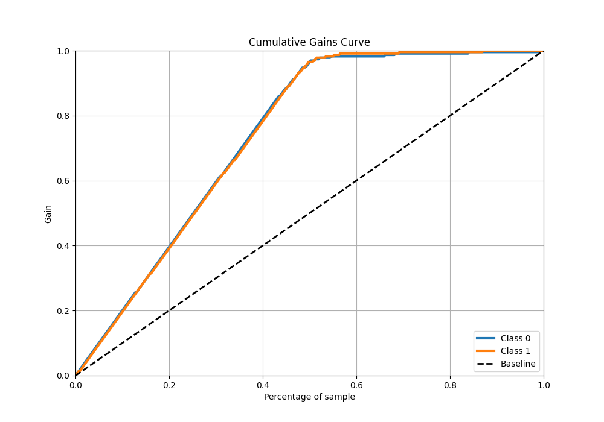
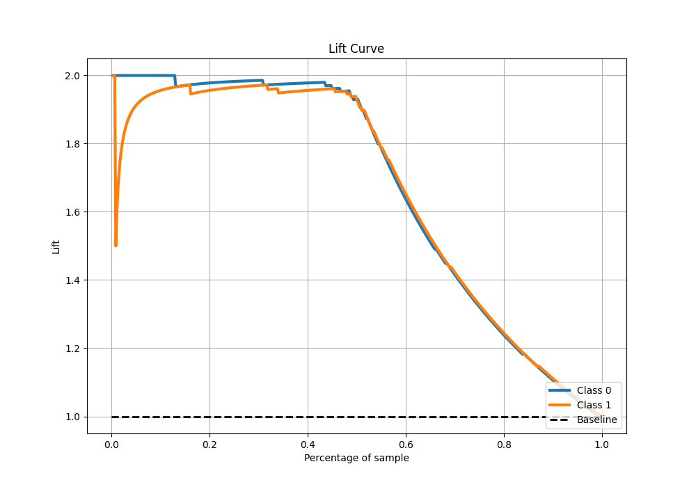

# Summary of 73_LightGBM

[<< Go back](../README.md)

## LightGBM
- **n_jobs**: -1
- **objective**: binary
- **num_leaves**: 31
- **learning_rate**: 0.1
- **feature_fraction**: 0.8
- **bagging_fraction**: 0.8
- **min_data_in_leaf**: 10
- **metric**: custom
- **custom_eval_metric_name**: f1
- **explain_level**: 0

## Validation
 - **validation_type**: kfold
 - **shuffle**: True
 - **stratify**: True
 - **k_folds**: 5

## Optimized metric
f1

## Training time

14.2 seconds

## Metric details
|           |    score |   threshold |
|:----------|---------:|------------:|
| logloss   | 0.308288 | nan         |
| auc       | 0.982552 | nan         |
| f1        | 0.967177 |   0.492658  |
| accuracy  | 0.967249 |   0.492658  |
| precision | 0.986301 |   0.872942  |
| recall    | 1        |   0.0488265 |
| mcc       | 0.934507 |   0.492658  |

## Metric details with threshold from accuracy metric
|           |    score |   threshold |
|:----------|---------:|------------:|
| logloss   | 0.308288 |  nan        |
| auc       | 0.982552 |  nan        |
| f1        | 0.967177 |    0.492658 |
| accuracy  | 0.967249 |    0.492658 |
| precision | 0.969298 |    0.492658 |
| recall    | 0.965066 |    0.492658 |
| mcc       | 0.934507 |    0.492658 |

## Confusion matrix (at threshold=0.492658)
|              |   Predicted as 0 |   Predicted as 1 |
|:-------------|-----------------:|-----------------:|
| Labeled as 0 |              222 |                7 |
| Labeled as 1 |                8 |              221 |

## Learning curves

## Confusion Matrix

## Normalized Confusion Matrix

## ROC Curve

## Kolmogorov-Smirnov Statistic

## Precision-Recall Curve

## Calibration Curve

## Cumulative Gains Curve

## Lift Curve

[<< Go back](../README.md)
