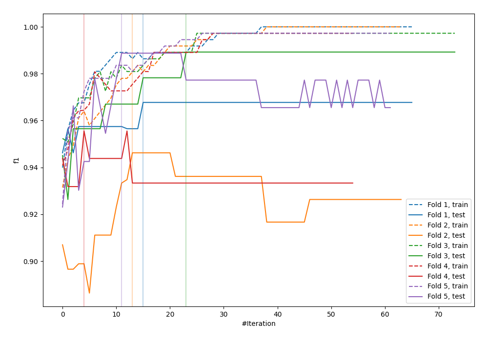
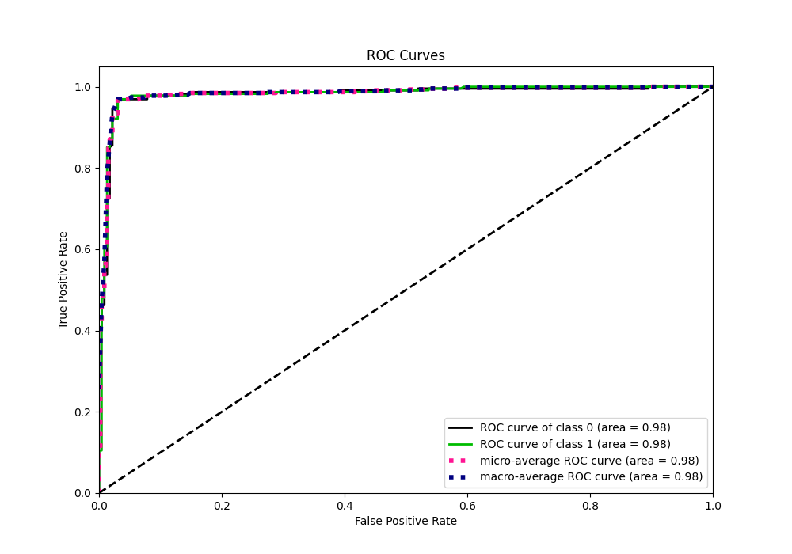
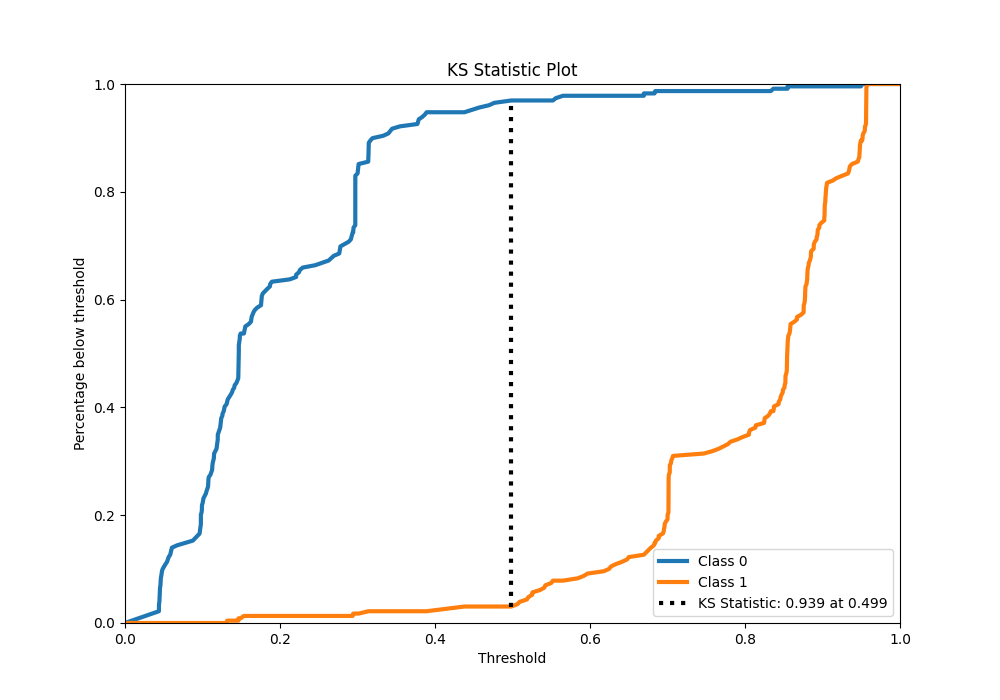
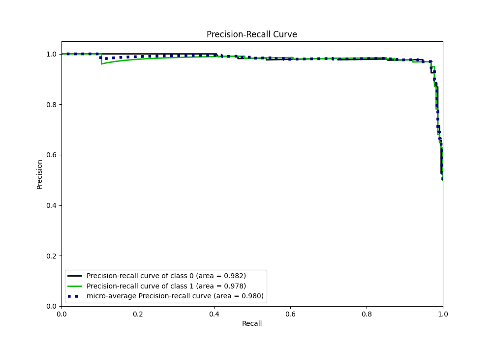
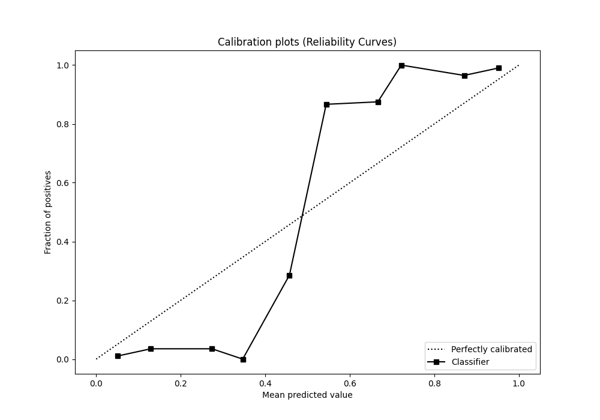
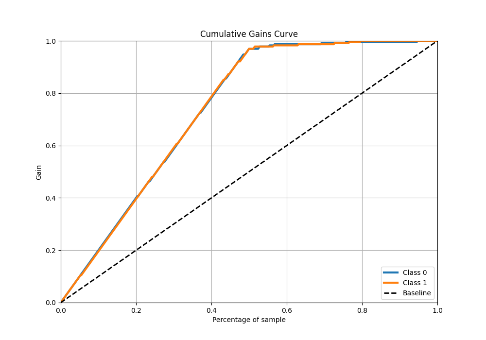
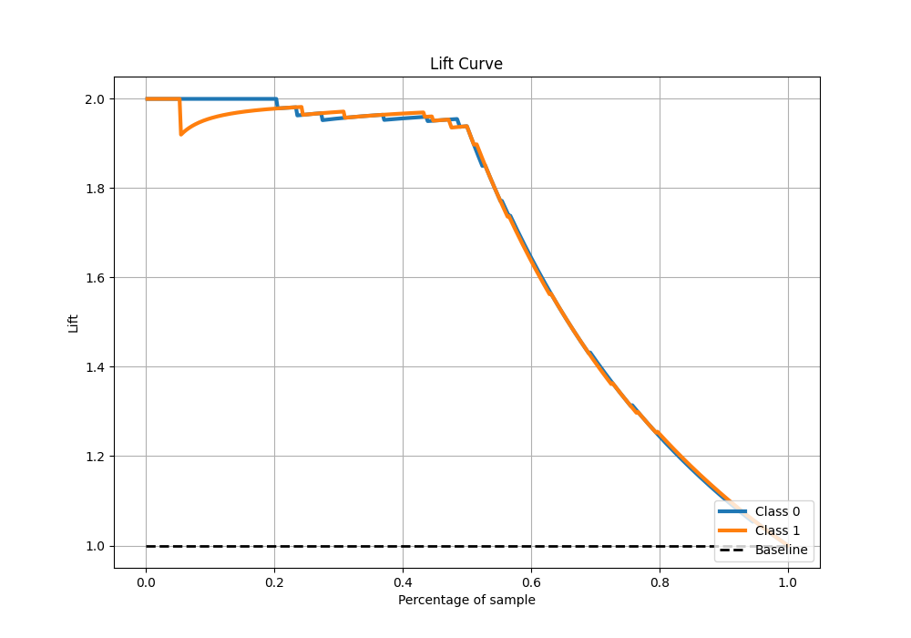

# Summary of 76_LightGBM_SelectedFeatures

[<< Go back](../README.md)

## LightGBM
- **n_jobs**: -1
- **objective**: binary
- **num_leaves**: 31
- **learning_rate**: 0.1
- **feature_fraction**: 0.8
- **bagging_fraction**: 0.8
- **min_data_in_leaf**: 10
- **metric**: custom
- **custom_eval_metric_name**: f1
- **explain_level**: 0

## Validation
 - **validation_type**: kfold
 - **shuffle**: True
 - **stratify**: True
 - **k_folds**: 5

## Optimized metric
f1

## Training time

15.1 seconds

## Metric details
|           |    score |   threshold |
|:----------|---------:|------------:|
| logloss   | 0.248457 | nan         |
| auc       | 0.981903 | nan         |
| f1        | 0.969432 |   0.502442  |
| accuracy  | 0.969432 |   0.502442  |
| precision | 0.990826 |   0.855733  |
| recall    | 1        |   0.0393989 |
| mcc       | 0.938865 |   0.502442  |

## Metric details with threshold from accuracy metric
|           |    score |   threshold |
|:----------|---------:|------------:|
| logloss   | 0.248457 |  nan        |
| auc       | 0.981903 |  nan        |
| f1        | 0.969432 |    0.502442 |
| accuracy  | 0.969432 |    0.502442 |
| precision | 0.969432 |    0.502442 |
| recall    | 0.969432 |    0.502442 |
| mcc       | 0.938865 |    0.502442 |

## Confusion matrix (at threshold=0.502442)
|              |   Predicted as 0 |   Predicted as 1 |
|:-------------|-----------------:|-----------------:|
| Labeled as 0 |              222 |                7 |
| Labeled as 1 |                7 |              222 |

## Learning curves

## Confusion Matrix

## Normalized Confusion Matrix

## ROC Curve

## Kolmogorov-Smirnov Statistic

## Precision-Recall Curve

## Calibration Curve

## Cumulative Gains Curve

## Lift Curve

[<< Go back](../README.md)
