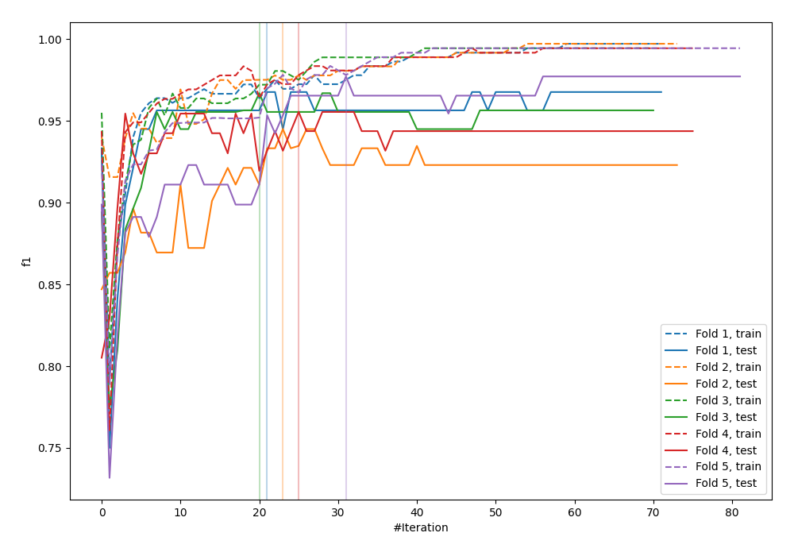
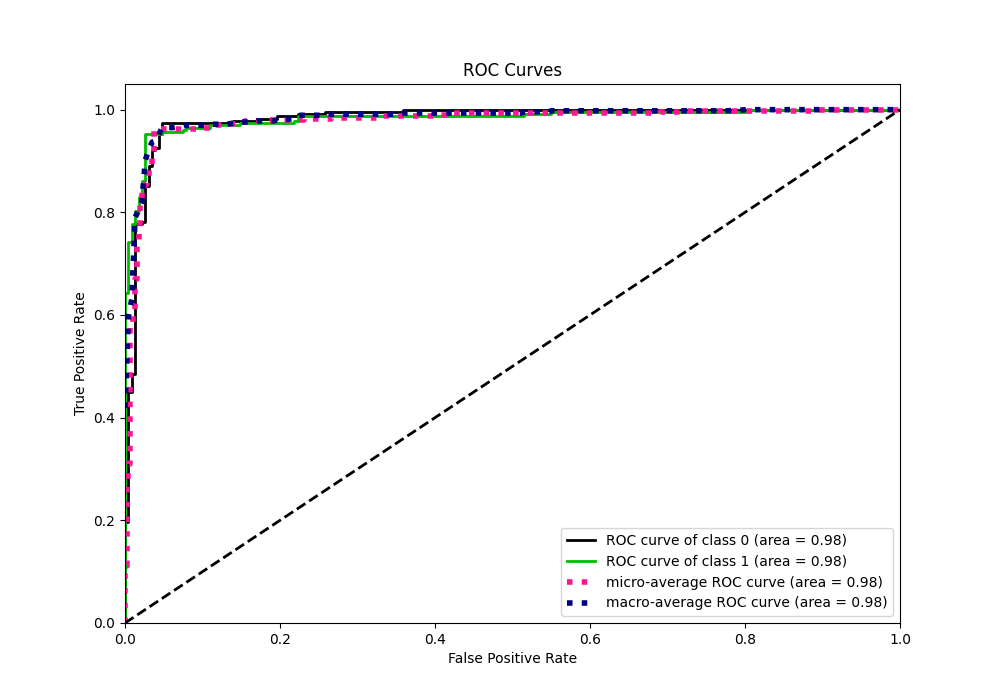
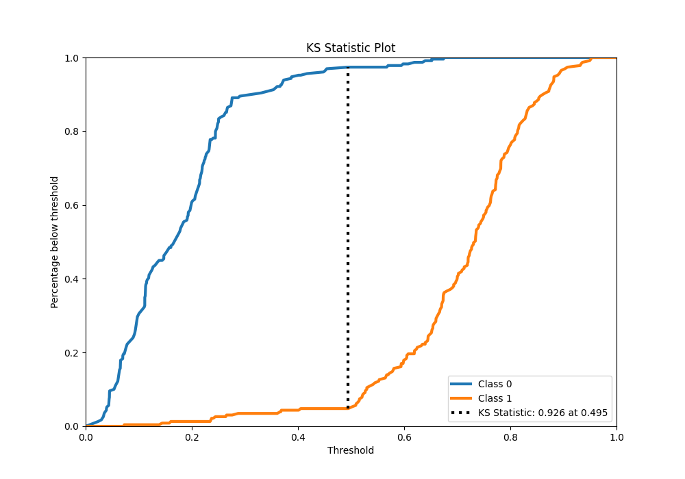
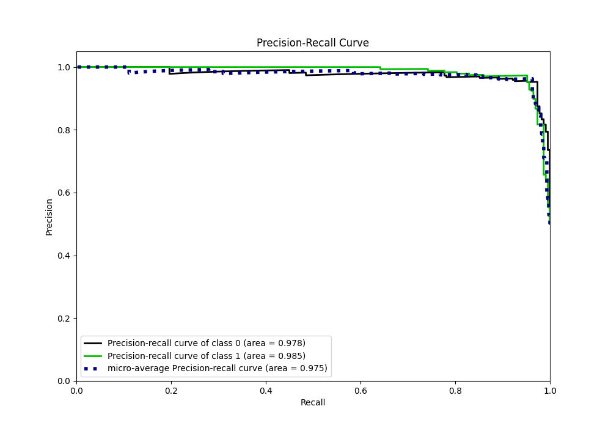
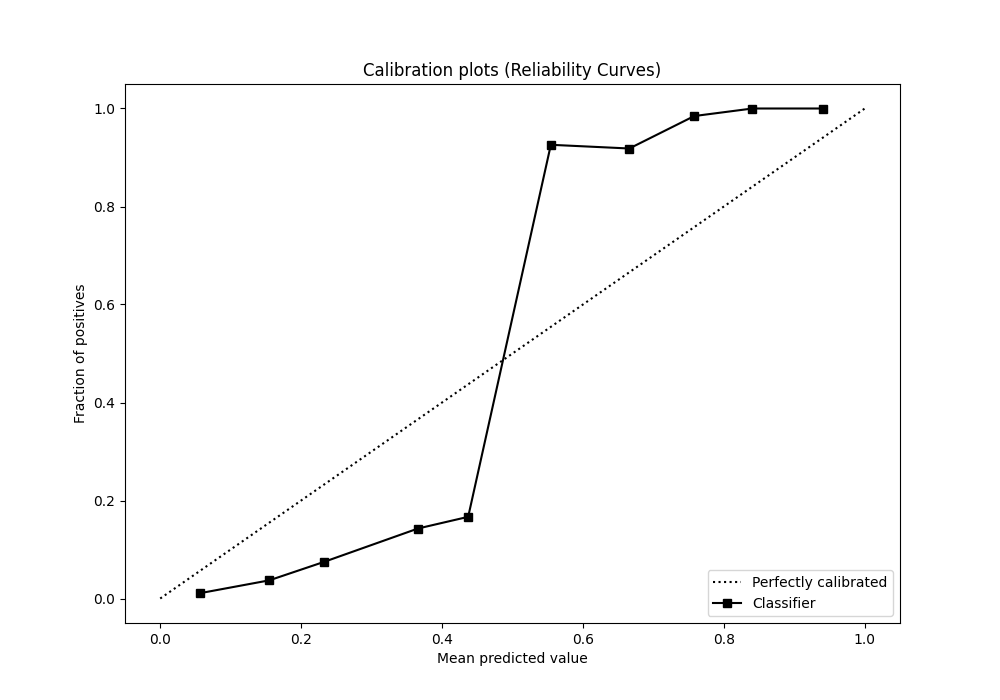
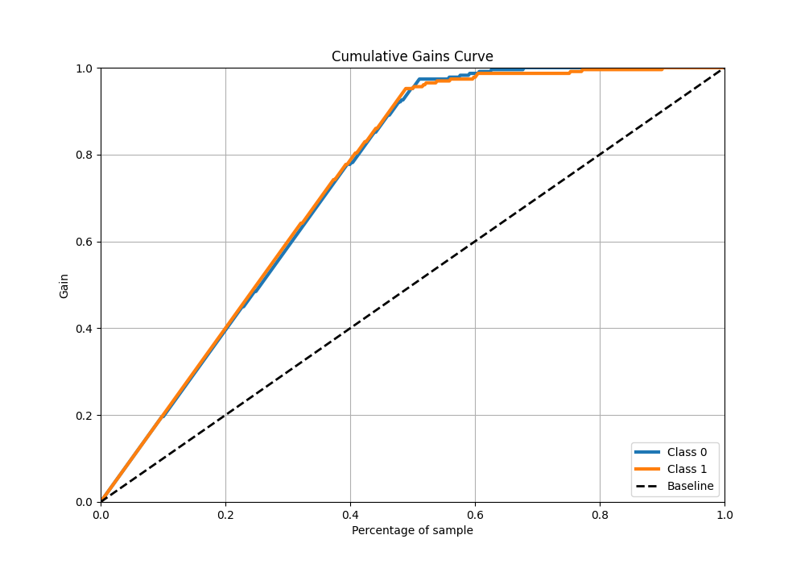
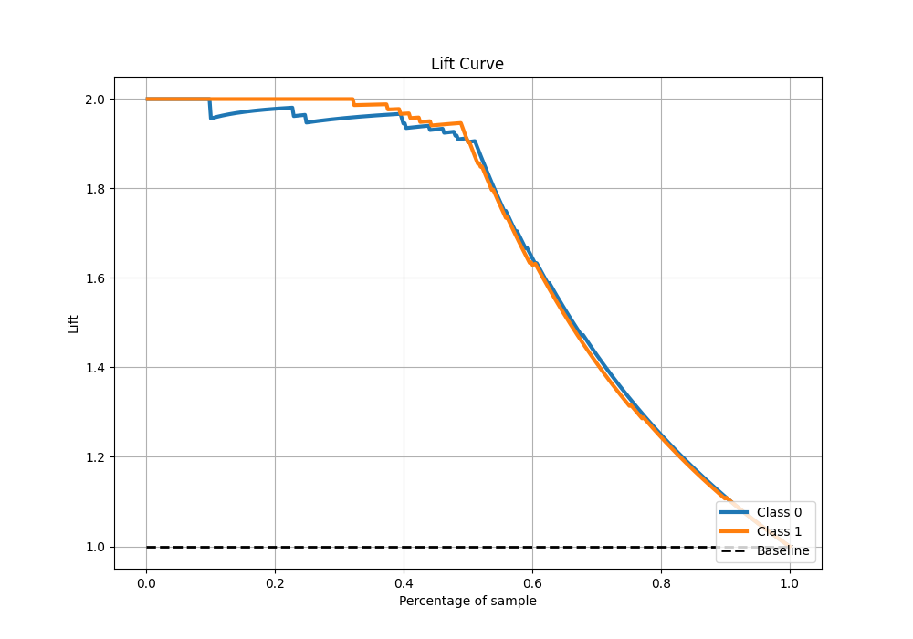

# Summary of 78_CatBoost

[<< Go back](../README.md)

## CatBoost
- **n_jobs**: -1
- **learning_rate**: 0.1
- **depth**: 7
- **rsm**: 0.7
- **loss_function**: Logloss
- **eval_metric**: F1
- **explain_level**: 0

## Validation
 - **validation_type**: kfold
 - **shuffle**: True
 - **stratify**: True
 - **k_folds**: 5

## Optimized metric
f1

## Training time

13.3 seconds

## Metric details
|           |    score |   threshold |
|:----------|---------:|------------:|
| logloss   | 0.297198 | nan         |
| auc       | 0.982323 | nan         |
| f1        | 0.960352 |   0.474288  |
| accuracy  | 0.960699 |   0.474288  |
| precision | 1        |   0.68363   |
| recall    | 1        |   0.0212633 |
| mcc       | 0.921538 |   0.474288  |

## Metric details with threshold from accuracy metric
|           |    score |   threshold |
|:----------|---------:|------------:|
| logloss   | 0.297198 |  nan        |
| auc       | 0.982323 |  nan        |
| f1        | 0.960352 |    0.474288 |
| accuracy  | 0.960699 |    0.474288 |
| precision | 0.968889 |    0.474288 |
| recall    | 0.951965 |    0.474288 |
| mcc       | 0.921538 |    0.474288 |

## Confusion matrix (at threshold=0.474288)
|              |   Predicted as 0 |   Predicted as 1 |
|:-------------|-----------------:|-----------------:|
| Labeled as 0 |              222 |                7 |
| Labeled as 1 |               11 |              218 |

## Learning curves

## Confusion Matrix

## Normalized Confusion Matrix

## ROC Curve

## Kolmogorov-Smirnov Statistic

## Precision-Recall Curve

## Calibration Curve

## Cumulative Gains Curve

## Lift Curve

[<< Go back](../README.md)
