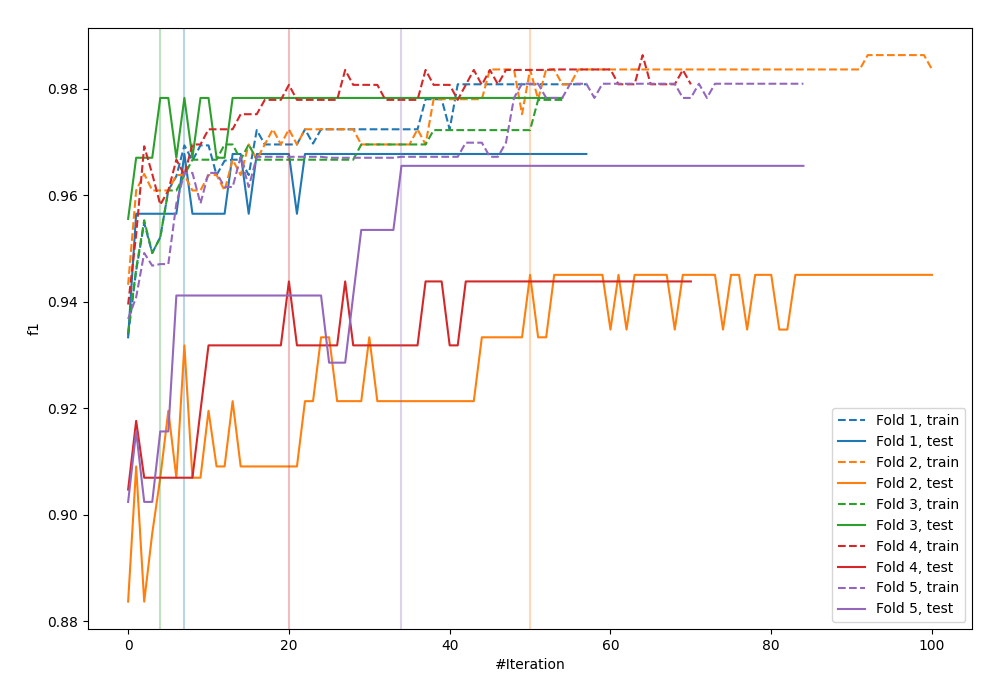
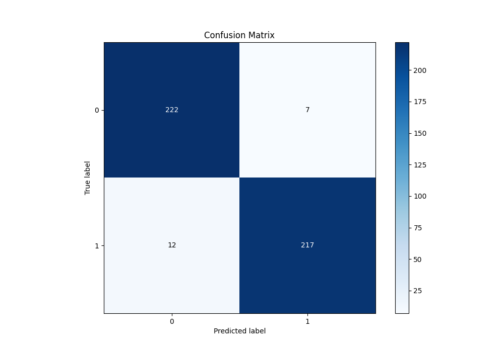
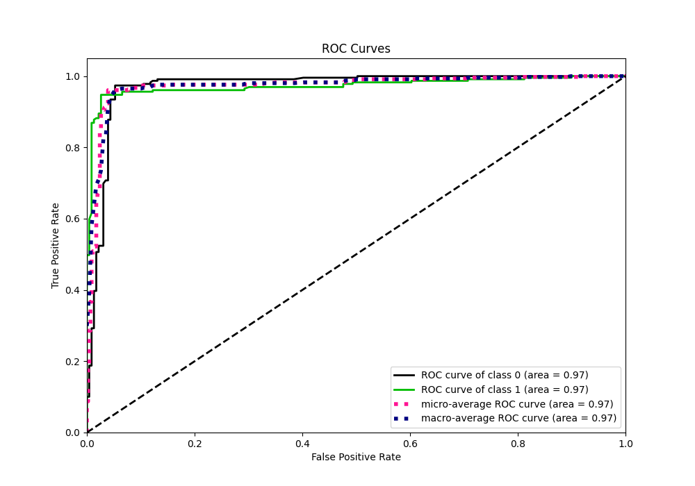
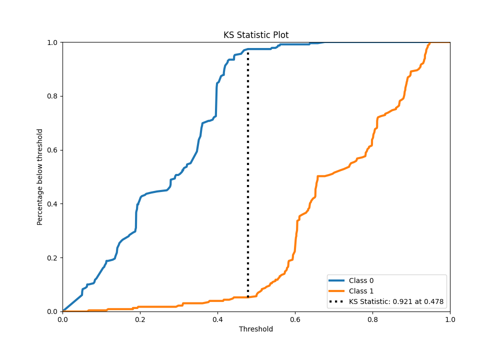
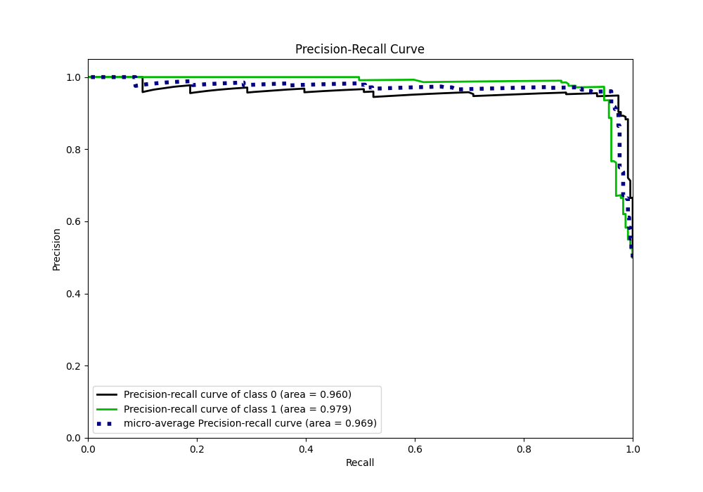
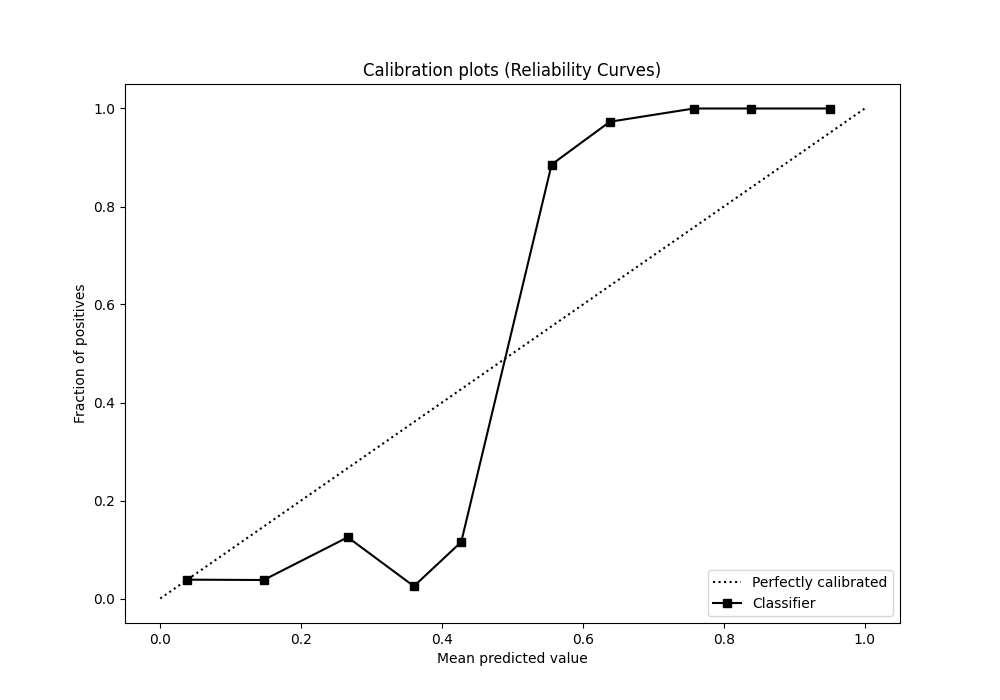
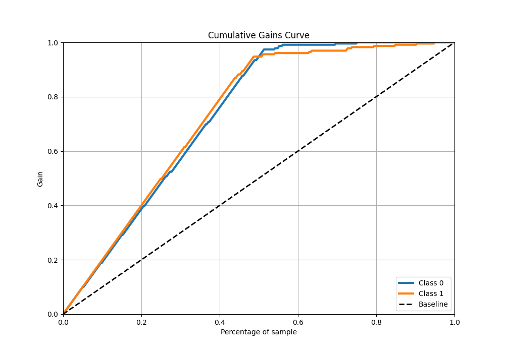
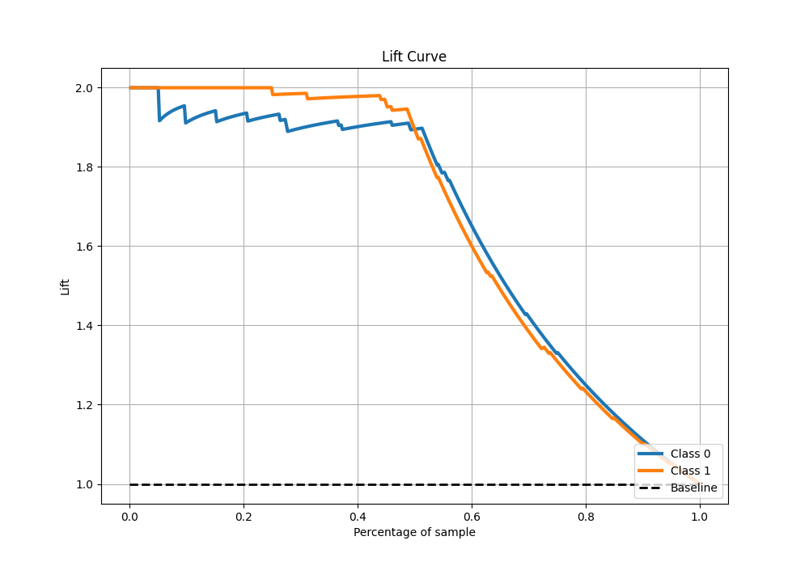

# Summary of 83_Xgboost

[<< Go back](../README.md)

## Extreme Gradient Boosting (Xgboost)
- **n_jobs**: -1
- **objective**: binary:logistic
- **eta**: 0.05
- **max_depth**: 7
- **min_child_weight**: 1
- **subsample**: 0.9
- **colsample_bytree**: 0.8
- **eval_metric**: f1
- **explain_level**: 0

## Validation
 - **validation_type**: kfold
 - **shuffle**: True
 - **stratify**: True
 - **k_folds**: 5

## Optimized metric
f1

## Training time

14.3 seconds

## Metric details
|           |    score |   threshold |
|:----------|---------:|------------:|
| logloss   | 0.360593 | nan         |
| auc       | 0.972207 | nan         |
| f1        | 0.958057 |   0.468491  |
| accuracy  | 0.958515 |   0.468491  |
| precision | 1        |   0.692468  |
| recall    | 1        |   0.0453092 |
| mcc       | 0.917249 |   0.468491  |

## Metric details with threshold from accuracy metric
|           |    score |   threshold |
|:----------|---------:|------------:|
| logloss   | 0.360593 |  nan        |
| auc       | 0.972207 |  nan        |
| f1        | 0.958057 |    0.468491 |
| accuracy  | 0.958515 |    0.468491 |
| precision | 0.96875  |    0.468491 |
| recall    | 0.947598 |    0.468491 |
| mcc       | 0.917249 |    0.468491 |

## Confusion matrix (at threshold=0.468491)
|              |   Predicted as 0 |   Predicted as 1 |
|:-------------|-----------------:|-----------------:|
| Labeled as 0 |              222 |                7 |
| Labeled as 1 |               12 |              217 |

## Learning curves

## Confusion Matrix

## Normalized Confusion Matrix

## ROC Curve

## Kolmogorov-Smirnov Statistic

## Precision-Recall Curve

## Calibration Curve

## Cumulative Gains Curve

## Lift Curve

[<< Go back](../README.md)
