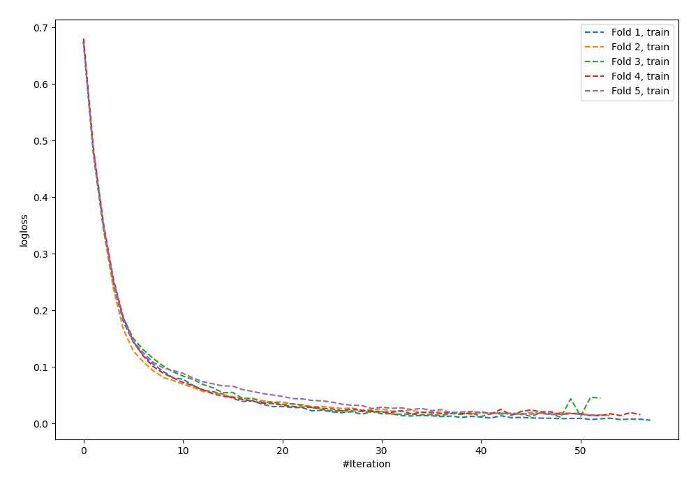
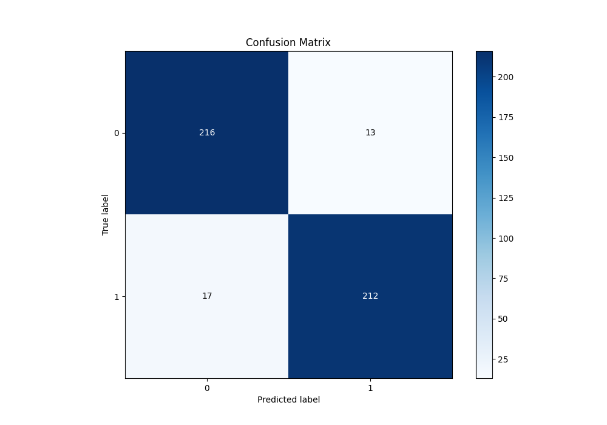
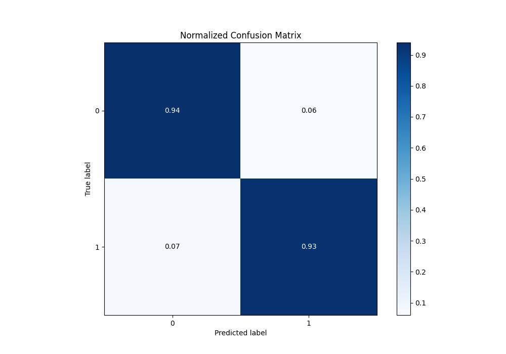
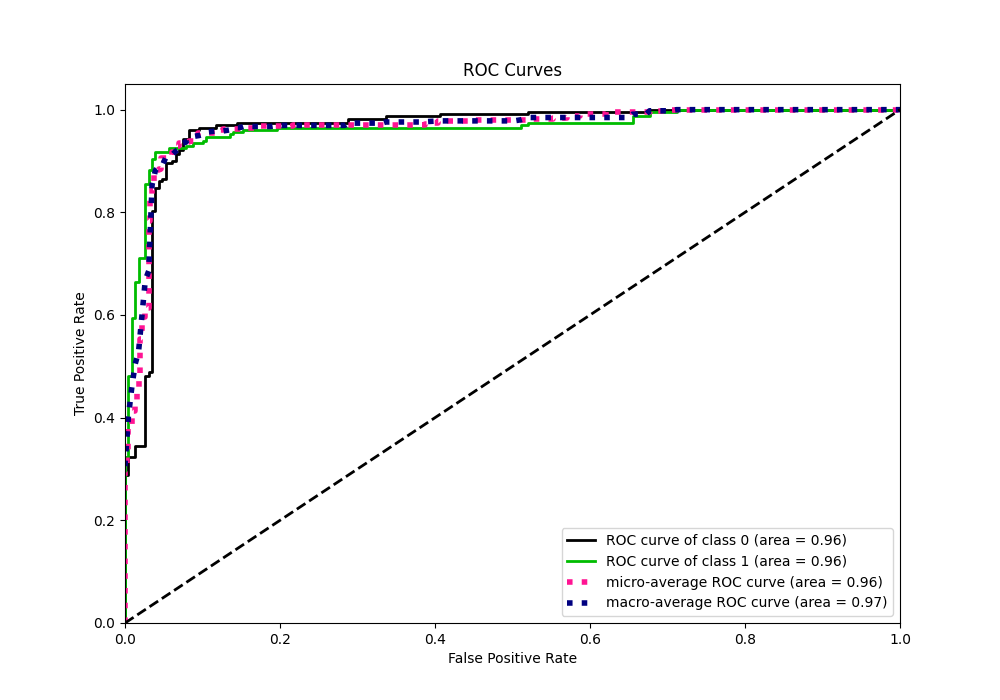
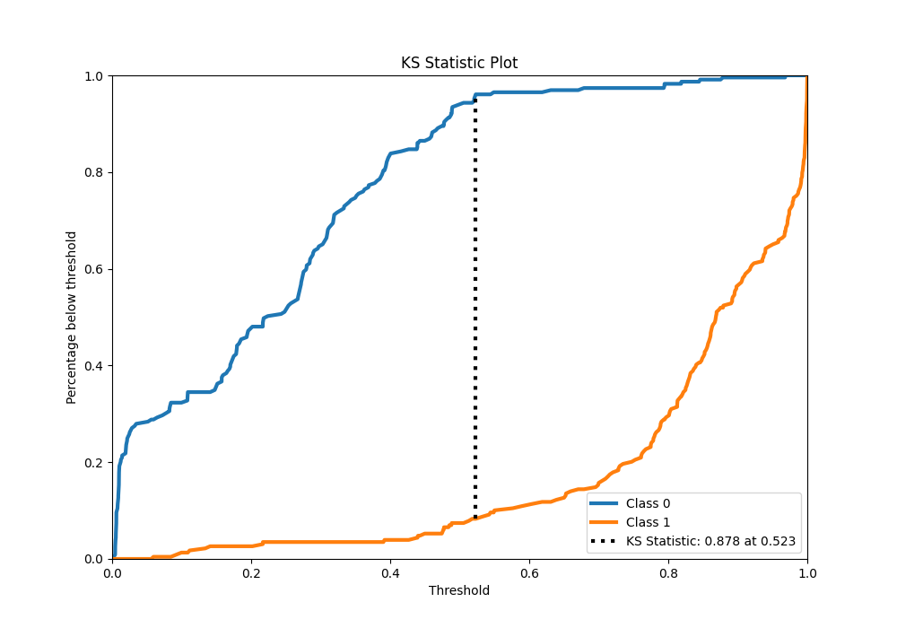
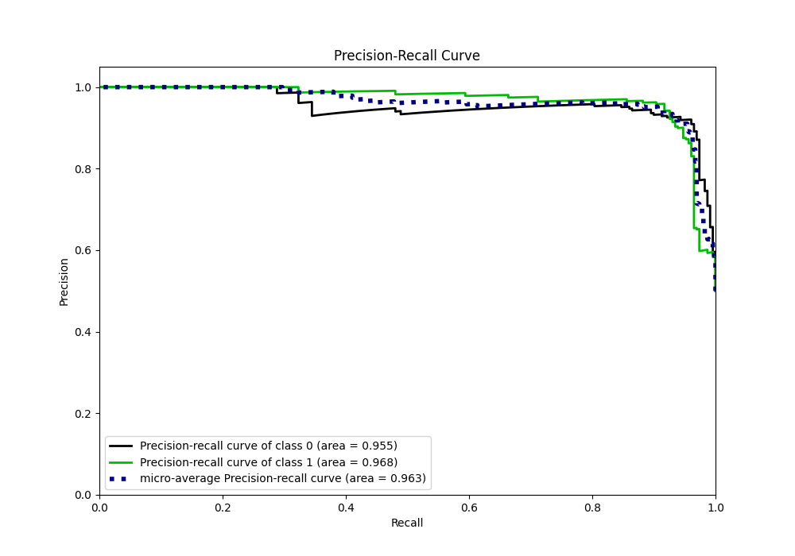
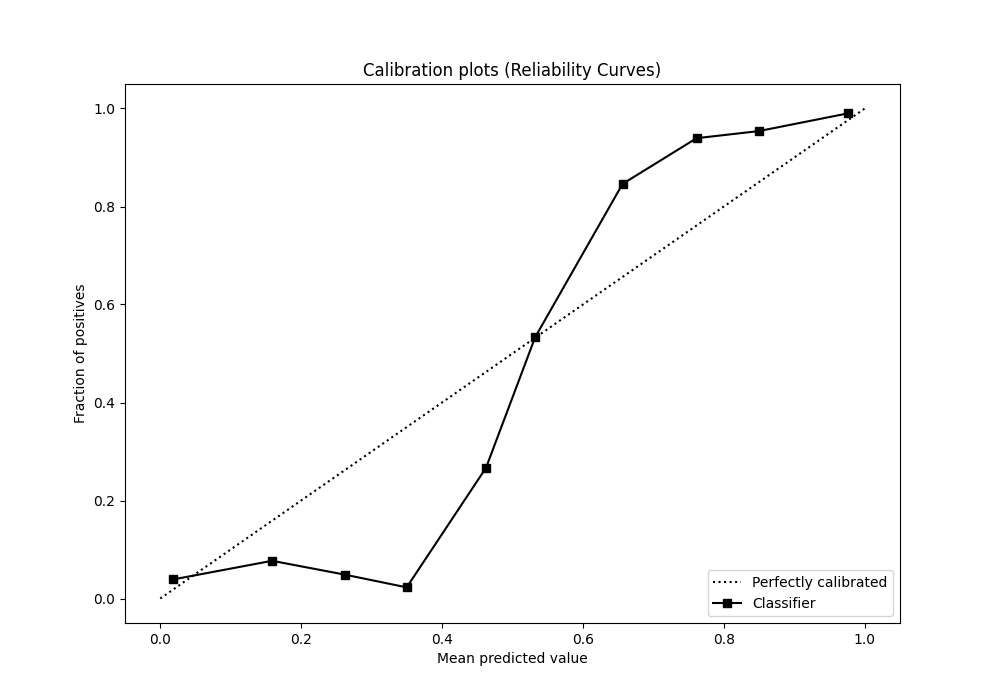
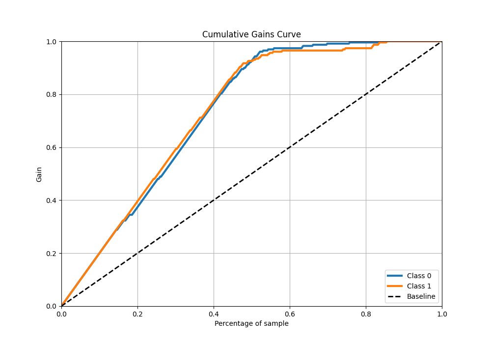
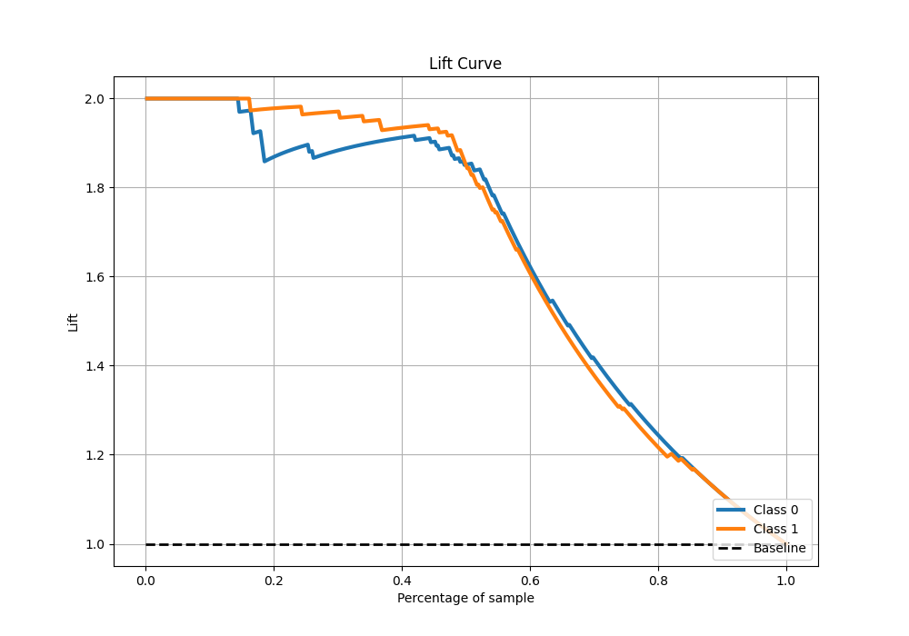

# Summary of 87_NeuralNetwork

[<< Go back](../README.md)

## Neural Network
- **n_jobs**: -1
- **dense_1_size**: 64
- **dense_2_size**: 32
- **learning_rate**: 0.01
- **explain_level**: 0

## Validation
 - **validation_type**: kfold
 - **shuffle**: True
 - **stratify**: True
 - **k_folds**: 5

## Optimized metric
f1

## Training time

14.4 seconds

## Metric details
|           |    score |    threshold |
|:----------|---------:|-------------:|
| logloss   | 0.276086 | nan          |
| auc       | 0.963311 | nan          |
| f1        | 0.933921 |   0.5092     |
| accuracy  | 0.934498 |   0.5092     |
| precision | 1        |   0.969095   |
| recall    | 1        |   0.00391026 |
| mcc       | 0.870191 |   0.543345   |

## Metric details with threshold from accuracy metric
|           |    score |   threshold |
|:----------|---------:|------------:|
| logloss   | 0.276086 |    nan      |
| auc       | 0.963311 |    nan      |
| f1        | 0.933921 |      0.5092 |
| accuracy  | 0.934498 |      0.5092 |
| precision | 0.942222 |      0.5092 |
| recall    | 0.925764 |      0.5092 |
| mcc       | 0.869128 |      0.5092 |

## Confusion matrix (at threshold=0.5092)
|              |   Predicted as 0 |   Predicted as 1 |
|:-------------|-----------------:|-----------------:|
| Labeled as 0 |              216 |               13 |
| Labeled as 1 |               17 |              212 |

## Learning curves

## Confusion Matrix

## Normalized Confusion Matrix

## ROC Curve

## Kolmogorov-Smirnov Statistic

## Precision-Recall Curve

## Calibration Curve

## Cumulative Gains Curve

## Lift Curve

[<< Go back](../README.md)
