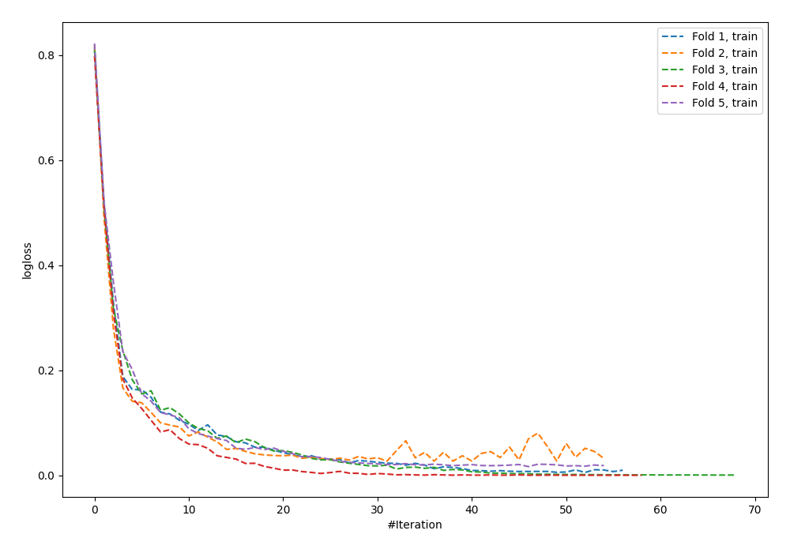
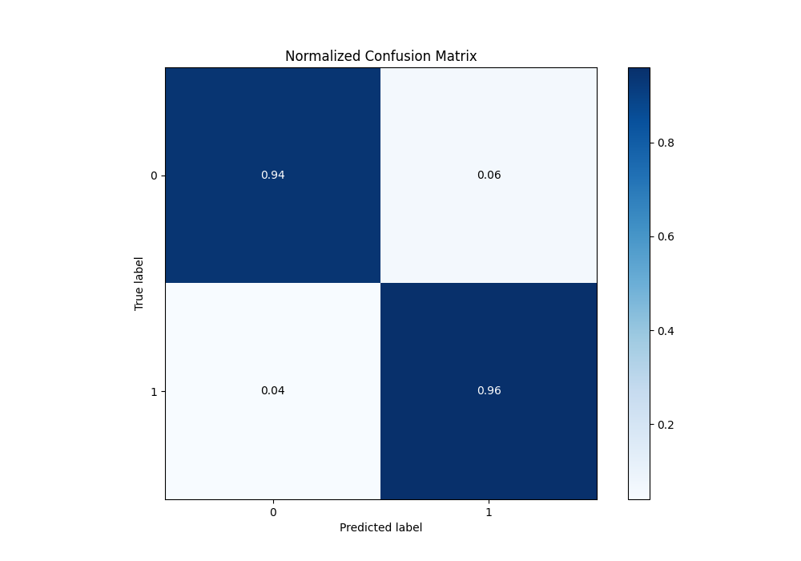
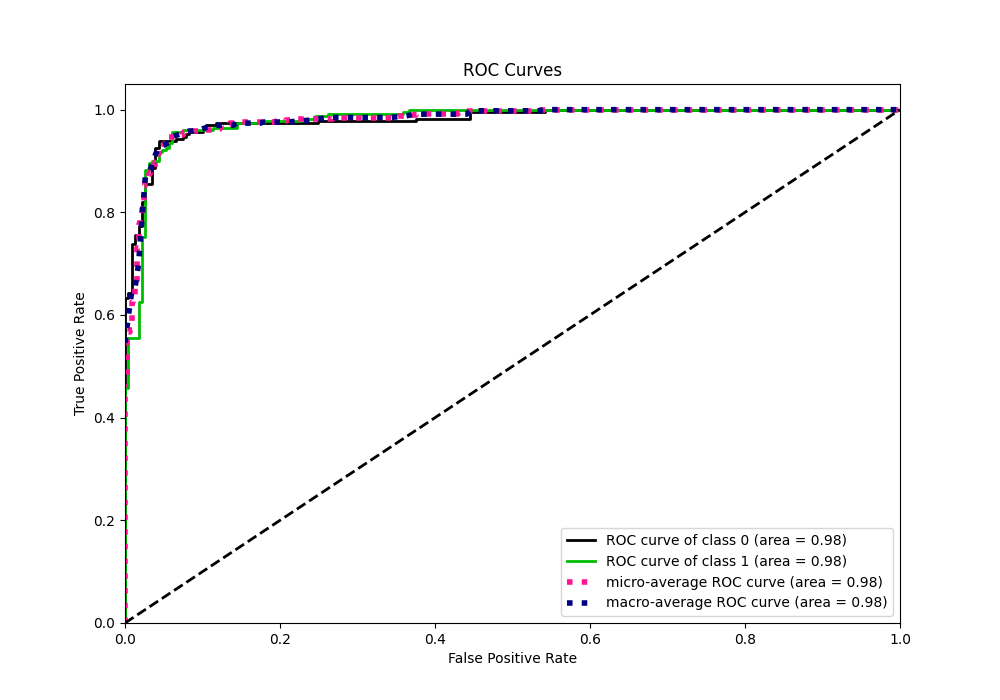
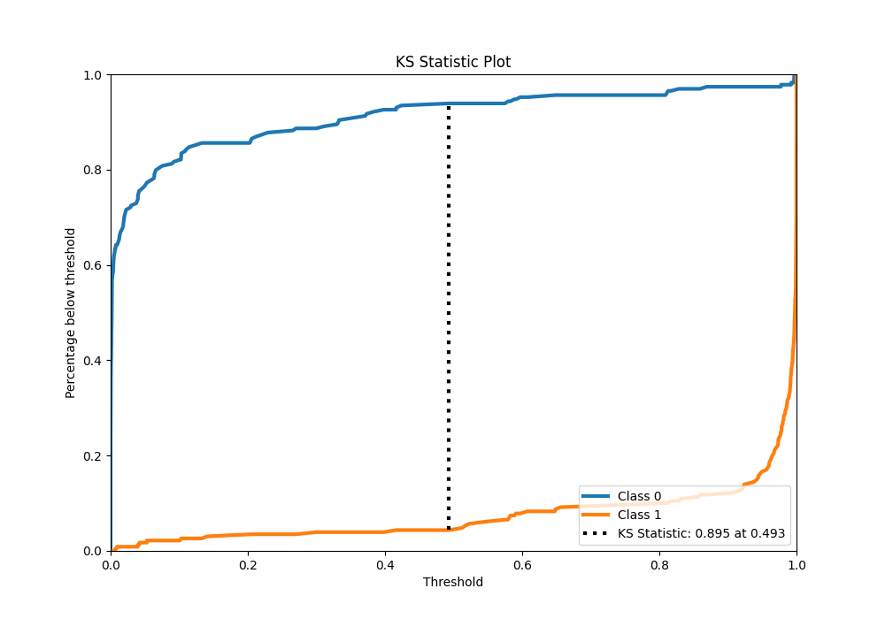
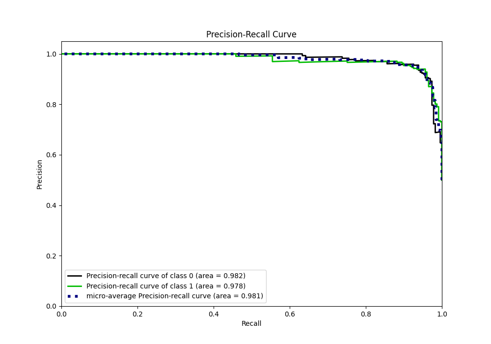
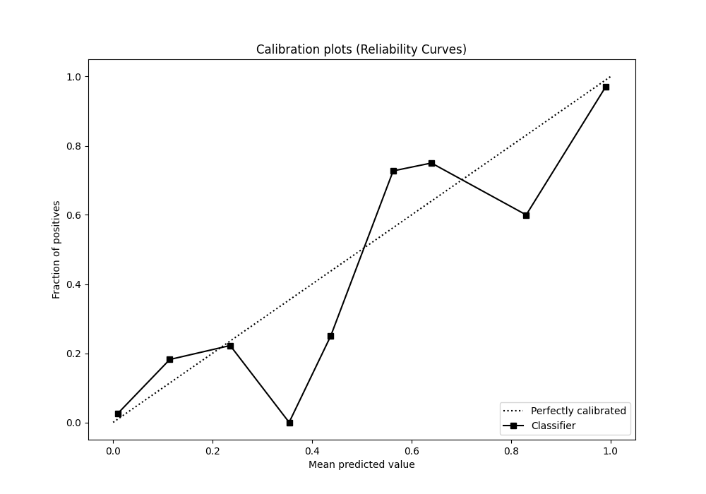
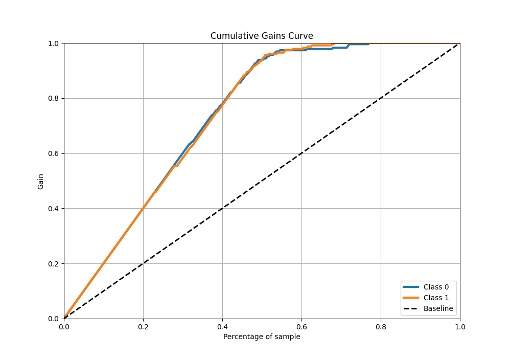
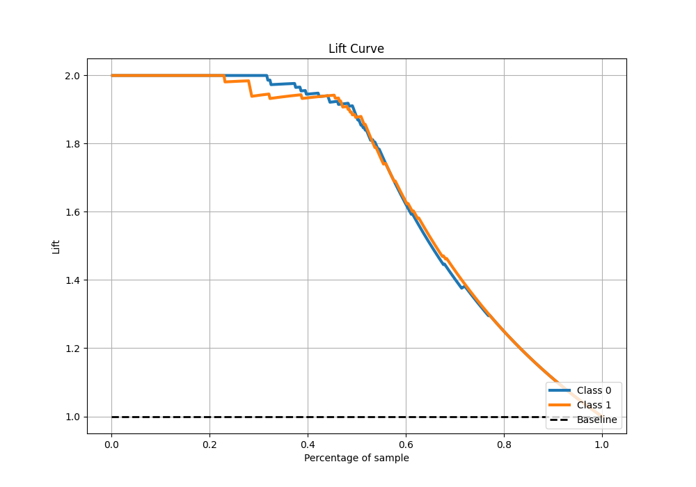

# Summary of 89_NeuralNetwork

[<< Go back](../README.md)

## Neural Network
- **n_jobs**: -1
- **dense_1_size**: 16
- **dense_2_size**: 16
- **learning_rate**: 0.08
- **explain_level**: 0

## Validation
 - **validation_type**: kfold
 - **shuffle**: True
 - **stratify**: True
 - **k_folds**: 5

## Optimized metric
f1

## Training time

12.7 seconds

## Metric details
|           |    score |     threshold |
|:----------|---------:|--------------:|
| logloss   | 0.195334 | nan           |
| auc       | 0.979348 | nan           |
| f1        | 0.948052 |   0.502742    |
| accuracy  | 0.947598 |   0.502742    |
| precision | 1        |   0.998715    |
| recall    | 1        |   5.93387e-09 |
| mcc       | 0.895333 |   0.502742    |

## Metric details with threshold from accuracy metric
|           |    score |   threshold |
|:----------|---------:|------------:|
| logloss   | 0.195334 |  nan        |
| auc       | 0.979348 |  nan        |
| f1        | 0.948052 |    0.502742 |
| accuracy  | 0.947598 |    0.502742 |
| precision | 0.939914 |    0.502742 |
| recall    | 0.956332 |    0.502742 |
| mcc       | 0.895333 |    0.502742 |

## Confusion matrix (at threshold=0.502742)
|              |   Predicted as 0 |   Predicted as 1 |
|:-------------|-----------------:|-----------------:|
| Labeled as 0 |              215 |               14 |
| Labeled as 1 |               10 |              219 |

## Learning curves

## Confusion Matrix

## Normalized Confusion Matrix

## ROC Curve

## Kolmogorov-Smirnov Statistic

## Precision-Recall Curve

## Calibration Curve

## Cumulative Gains Curve

## Lift Curve

[<< Go back](../README.md)
