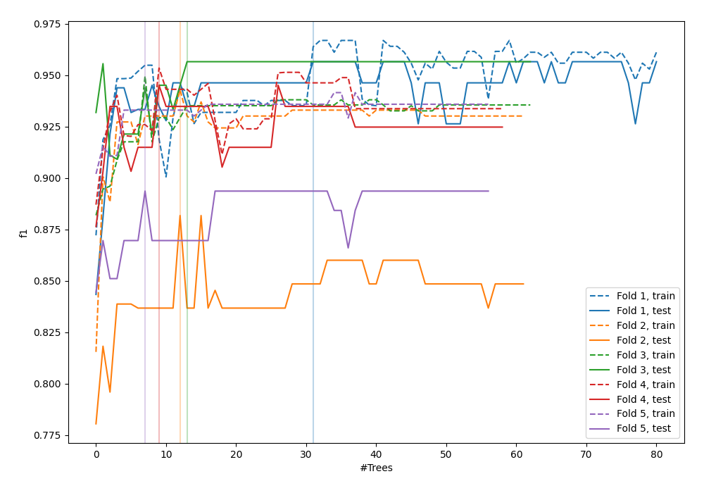
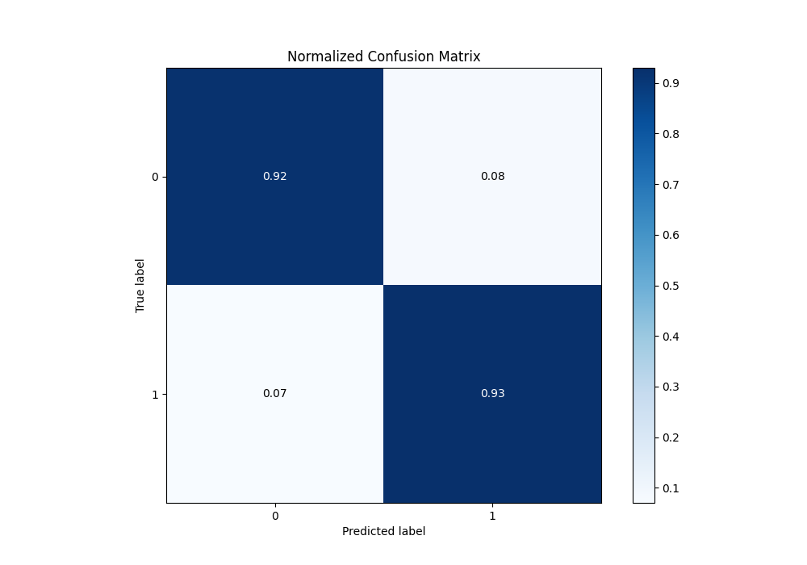
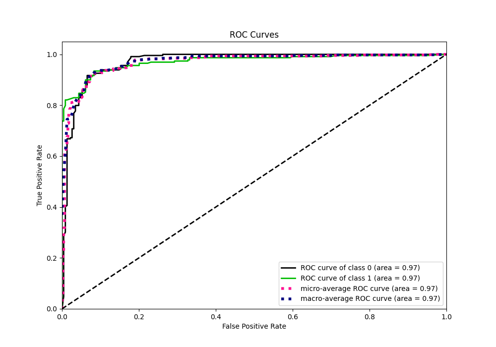
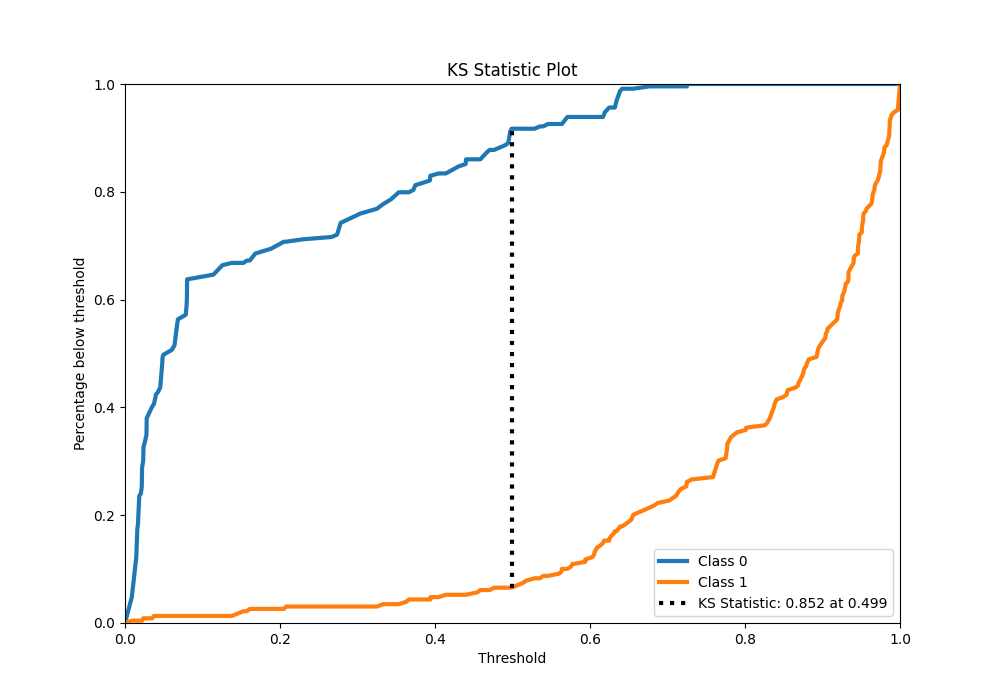
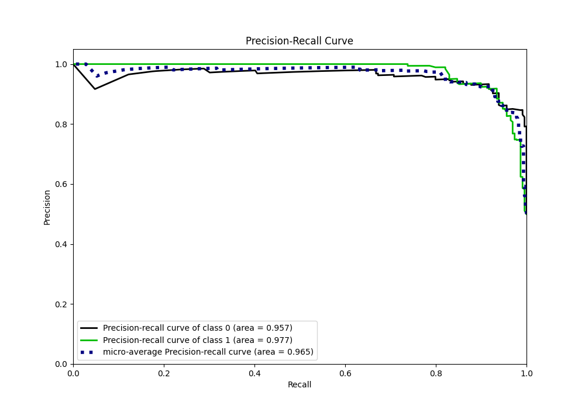
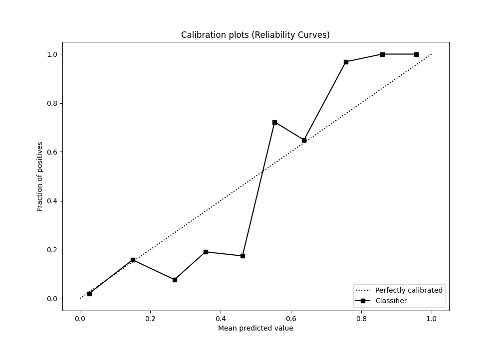
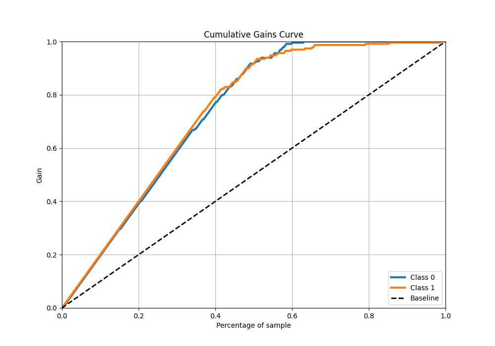
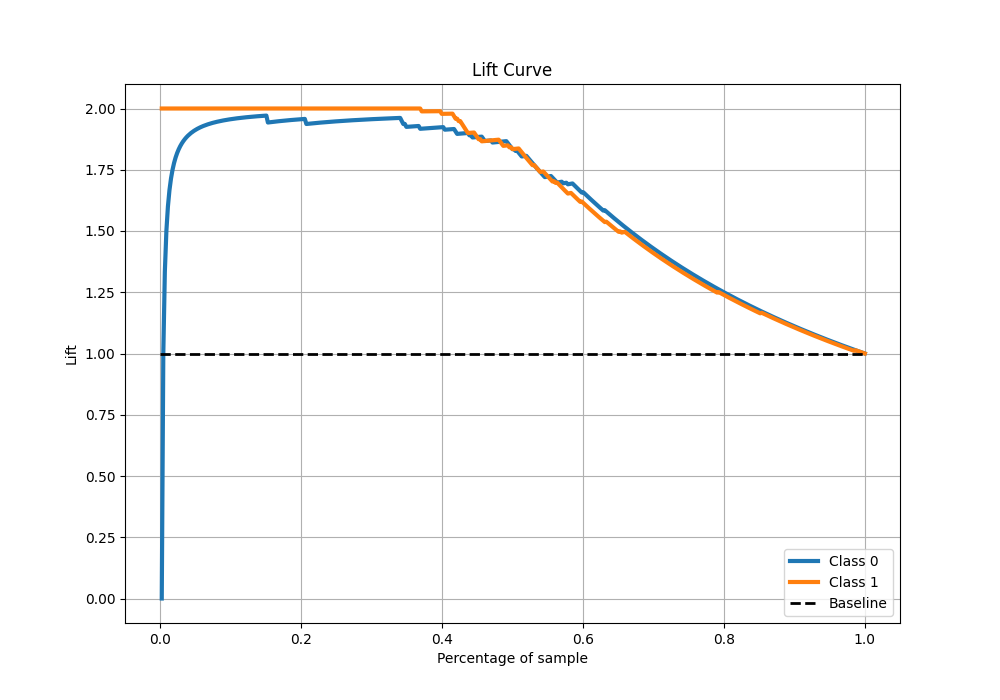

# Summary of 93_RandomForest

[<< Go back](../README.md)

## Random Forest
- **n_jobs**: -1
- **criterion**: gini
- **max_features**: 0.8
- **min_samples_split**: 30
- **max_depth**: 4
- **eval_metric_name**: f1
- **explain_level**: 0

## Validation
 - **validation_type**: kfold
 - **shuffle**: True
 - **stratify**: True
 - **k_folds**: 5

## Optimized metric
f1

## Training time

16.5 seconds

## Metric details
|           |    score |    threshold |
|:----------|---------:|-------------:|
| logloss   | 0.247564 | nan          |
| auc       | 0.971082 | nan          |
| f1        | 0.926407 |   0.506037   |
| accuracy  | 0.925764 |   0.506037   |
| precision | 1        |   0.728362   |
| recall    | 1        |   0.00790183 |
| mcc       | 0.851658 |   0.506037   |

## Metric details with threshold from accuracy metric
|           |    score |   threshold |
|:----------|---------:|------------:|
| logloss   | 0.247564 |  nan        |
| auc       | 0.971082 |  nan        |
| f1        | 0.926407 |    0.506037 |
| accuracy  | 0.925764 |    0.506037 |
| precision | 0.918455 |    0.506037 |
| recall    | 0.934498 |    0.506037 |
| mcc       | 0.851658 |    0.506037 |

## Confusion matrix (at threshold=0.506037)
|              |   Predicted as 0 |   Predicted as 1 |
|:-------------|-----------------:|-----------------:|
| Labeled as 0 |              210 |               19 |
| Labeled as 1 |               15 |              214 |

## Learning curves

## Confusion Matrix

## Normalized Confusion Matrix

## ROC Curve

## Kolmogorov-Smirnov Statistic

## Precision-Recall Curve

## Calibration Curve

## Cumulative Gains Curve

## Lift Curve

[<< Go back](../README.md)
