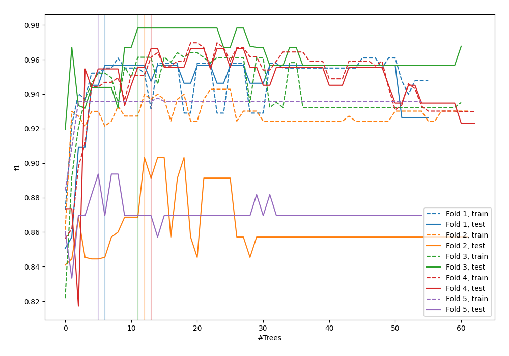
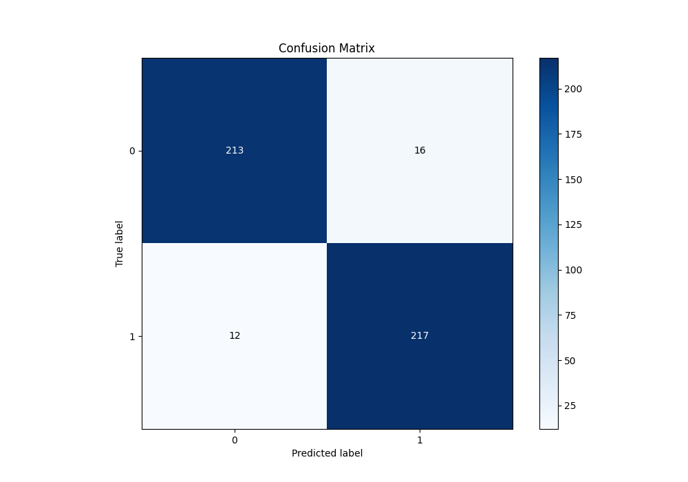
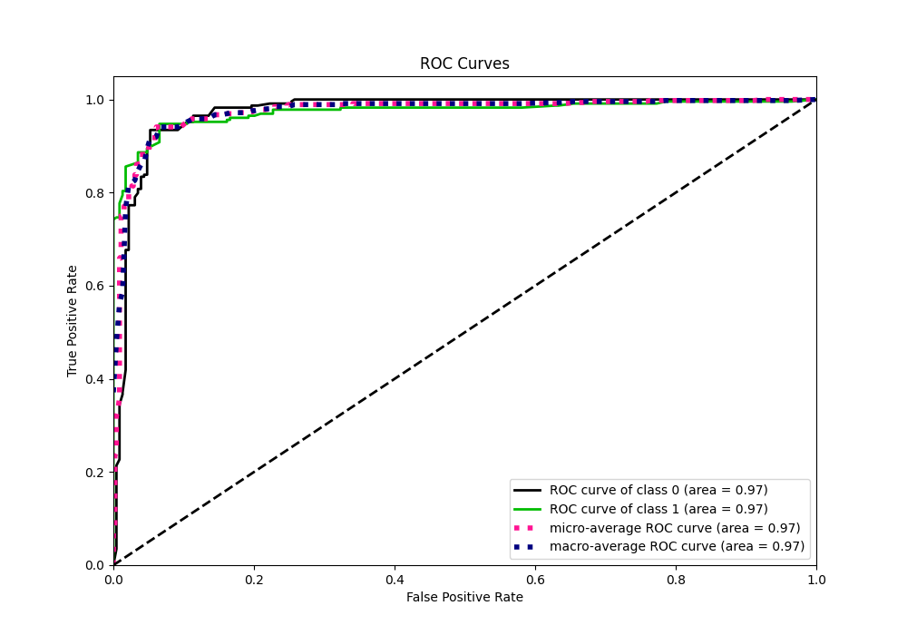
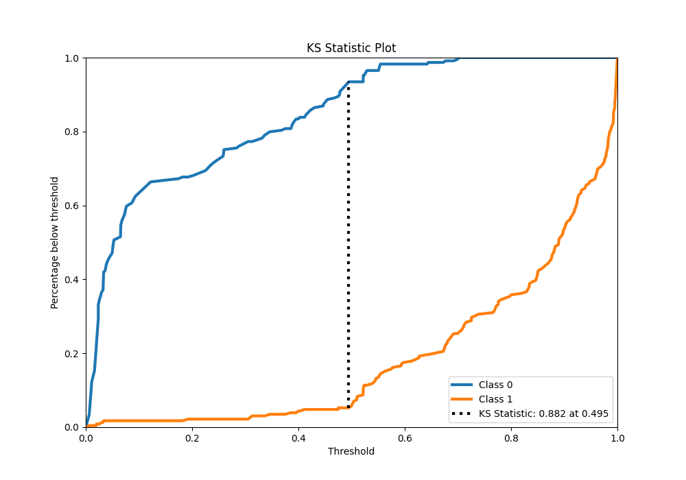
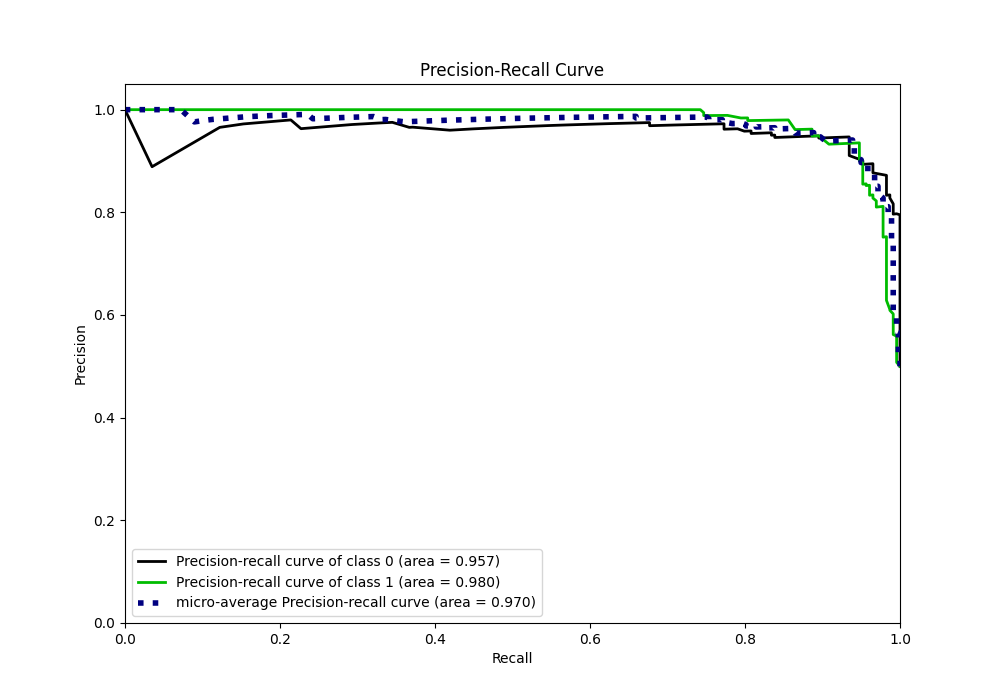
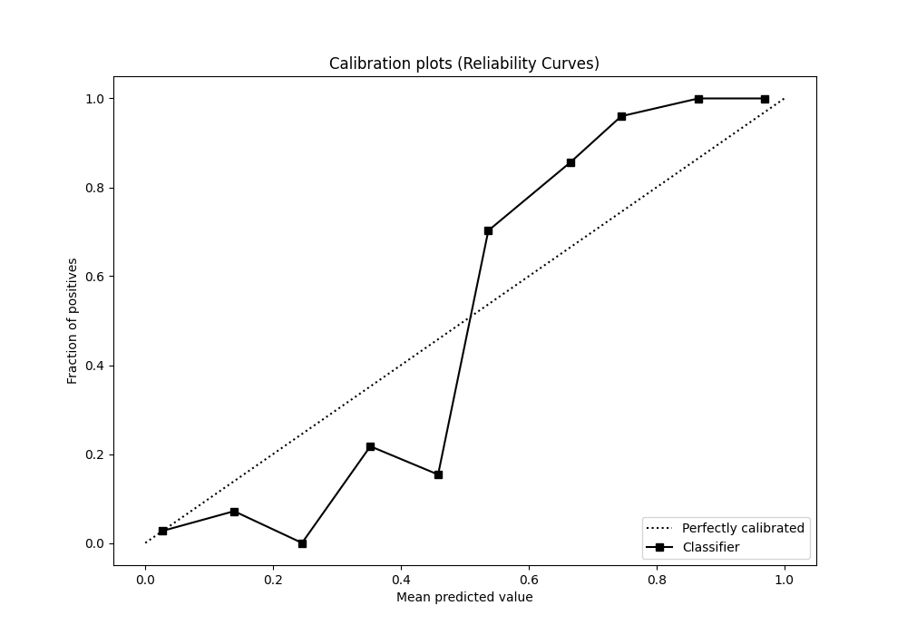
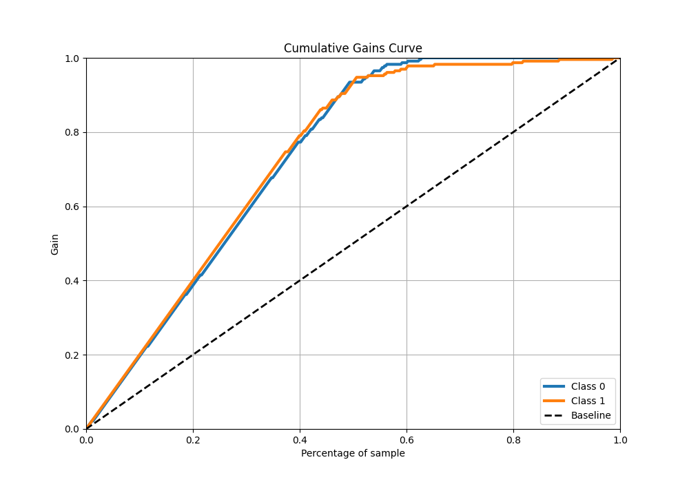
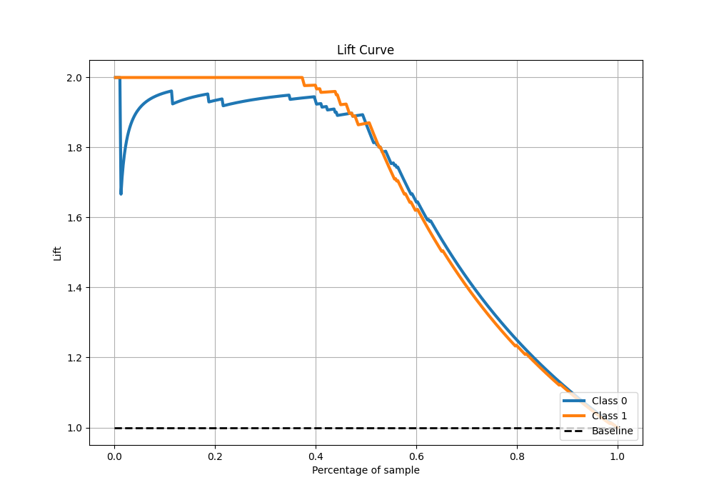

# Summary of 94_RandomForest

[<< Go back](../README.md)

## Random Forest
- **n_jobs**: -1
- **criterion**: gini
- **max_features**: 1.0
- **min_samples_split**: 30
- **max_depth**: 4
- **eval_metric_name**: f1
- **explain_level**: 0

## Validation
 - **validation_type**: kfold
 - **shuffle**: True
 - **stratify**: True
 - **k_folds**: 5

## Optimized metric
f1

## Training time

16.3 seconds

## Metric details
|           |    score |    threshold |
|:----------|---------:|-------------:|
| logloss   | 0.244192 | nan          |
| auc       | 0.973608 | nan          |
| f1        | 0.939394 |   0.492237   |
| accuracy  | 0.938865 |   0.492237   |
| precision | 1        |   0.708389   |
| recall    | 1        |   0.00595425 |
| mcc       | 0.877863 |   0.492237   |

## Metric details with threshold from accuracy metric
|           |    score |   threshold |
|:----------|---------:|------------:|
| logloss   | 0.244192 |  nan        |
| auc       | 0.973608 |  nan        |
| f1        | 0.939394 |    0.492237 |
| accuracy  | 0.938865 |    0.492237 |
| precision | 0.93133  |    0.492237 |
| recall    | 0.947598 |    0.492237 |
| mcc       | 0.877863 |    0.492237 |

## Confusion matrix (at threshold=0.492237)
|              |   Predicted as 0 |   Predicted as 1 |
|:-------------|-----------------:|-----------------:|
| Labeled as 0 |              213 |               16 |
| Labeled as 1 |               12 |              217 |

## Learning curves

## Confusion Matrix

## Normalized Confusion Matrix

## ROC Curve

## Kolmogorov-Smirnov Statistic

## Precision-Recall Curve

## Calibration Curve

## Cumulative Gains Curve

## Lift Curve

[<< Go back](../README.md)
