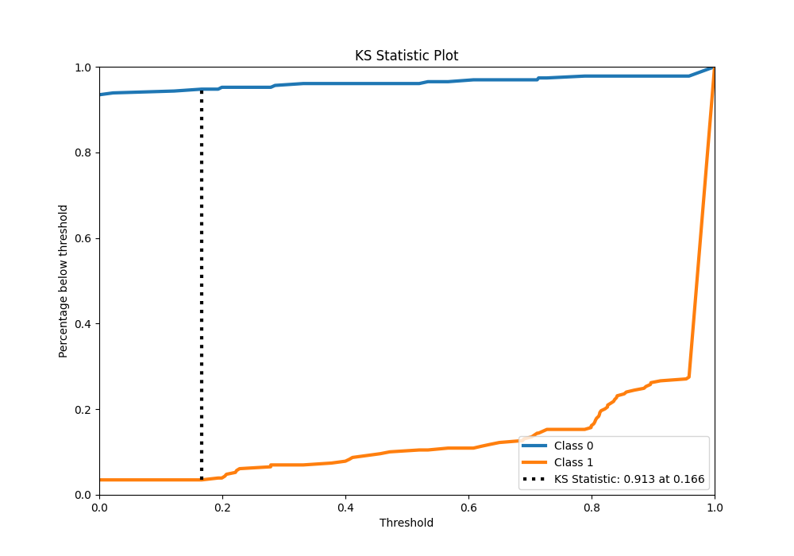

# Summary of 96_NearestNeighbors

[<< Go back](../README.md)

## k-Nearest Neighbors (Nearest Neighbors)
- **n_jobs**: -1
- **n_neighbors**: 5
- **weights**: distance
- **explain_level**: 0

## Validation
 - **validation_type**: kfold
 - **shuffle**: True
 - **stratify**: True
 - **k_folds**: 5

## Optimized metric
f1

## Training time

14.6 seconds

## Metric details
|           |    score |   threshold |
|:----------|---------:|------------:|
| logloss   | 0.52543  |  nan        |
| auc       | 0.966286 |  nan        |
| f1        | 0.95671  |    0.179755 |
| accuracy  | 0.956332 |    0.179755 |
| precision | 0.974619 |    0.801683 |
| recall    | 0.965066 |    0        |
| mcc       | 0.912803 |    0.179755 |

## Metric details with threshold from accuracy metric
|           |    score |   threshold |
|:----------|---------:|------------:|
| logloss   | 0.52543  |  nan        |
| auc       | 0.966286 |  nan        |
| f1        | 0.95671  |    0.179755 |
| accuracy  | 0.956332 |    0.179755 |
| precision | 0.948498 |    0.179755 |
| recall    | 0.965066 |    0.179755 |
| mcc       | 0.912803 |    0.179755 |

## Confusion matrix (at threshold=0.179755)
|              |   Predicted as 0 |   Predicted as 1 |
|:-------------|-----------------:|-----------------:|
| Labeled as 0 |              217 |               12 |
| Labeled as 1 |                8 |              221 |

## Learning curves

## Confusion Matrix

## Normalized Confusion Matrix

## ROC Curve

## Kolmogorov-Smirnov Statistic

## Precision-Recall Curve

## Calibration Curve

## Cumulative Gains Curve

## Lift Curve

[<< Go back](../README.md)
