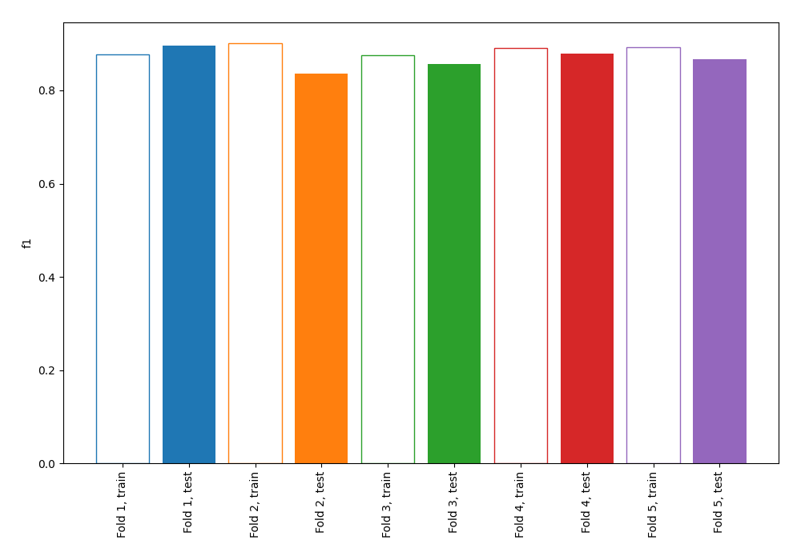
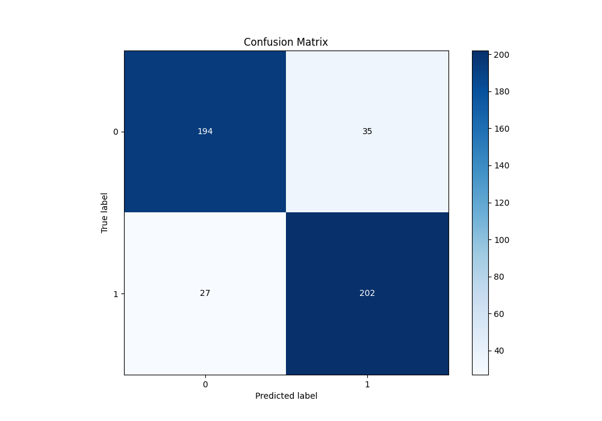
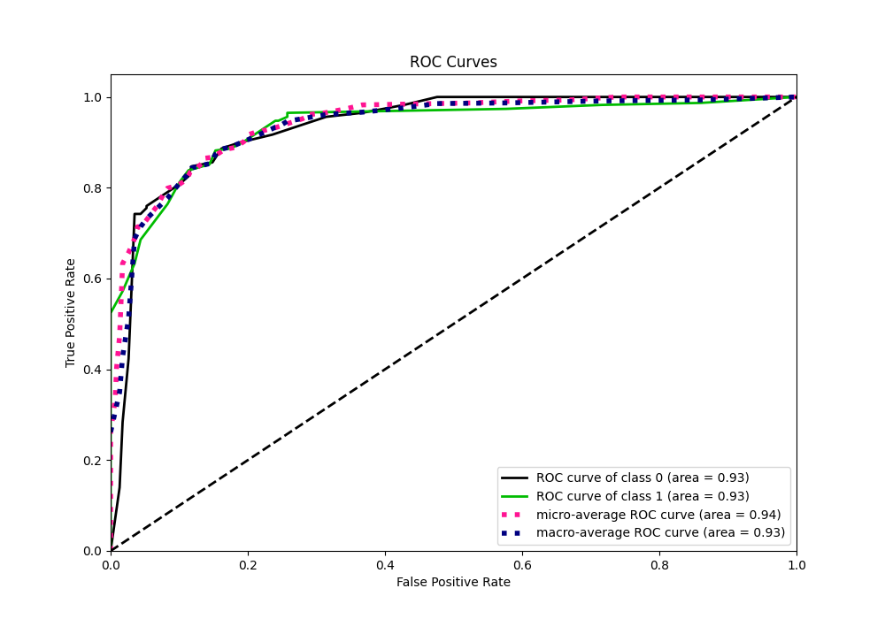
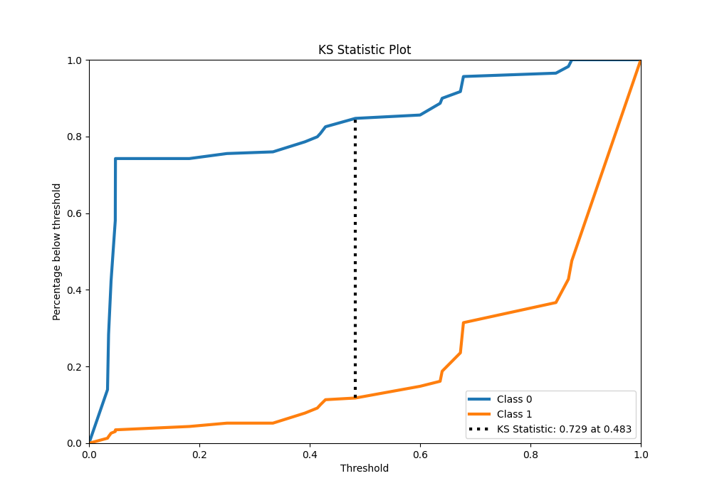
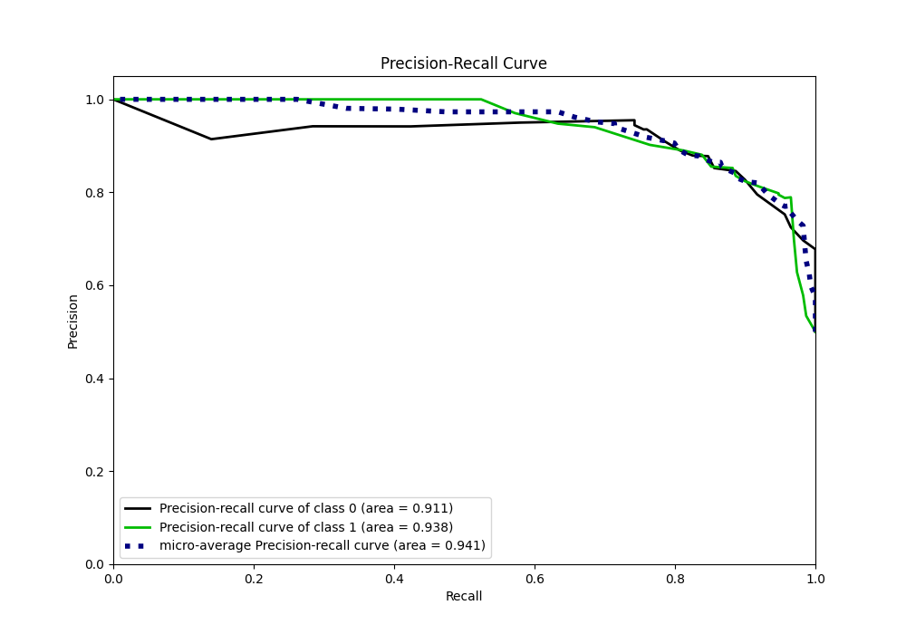
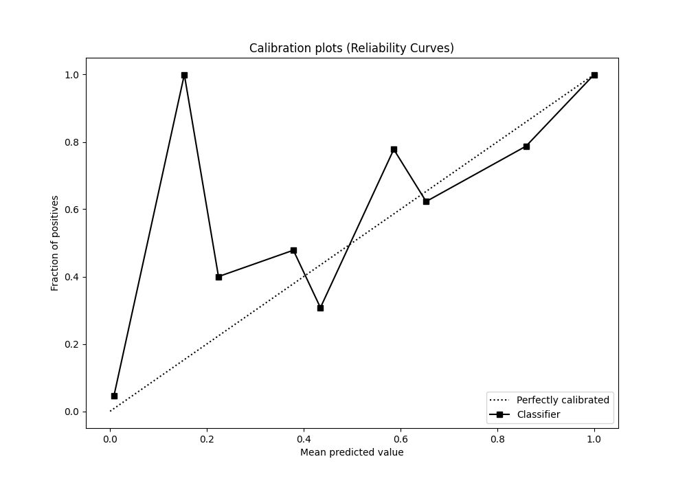
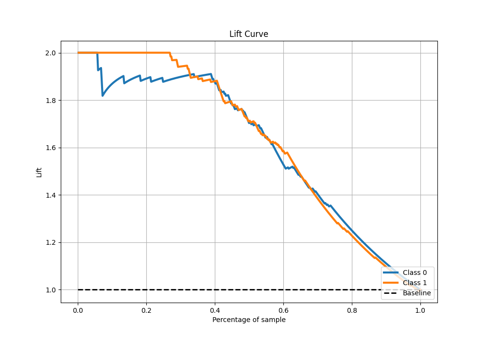

# Summary of 99_DecisionTree

[<< Go back](../README.md)

## Decision Tree
- **n_jobs**: -1
- **criterion**: entropy
- **max_depth**: 3
- **explain_level**: 0

## Validation
 - **validation_type**: kfold
 - **shuffle**: True
 - **stratify**: True
 - **k_folds**: 5

## Optimized metric
f1

## Training time

14.7 seconds

## Metric details
|           |    score |   threshold |
|:----------|---------:|------------:|
| logloss   | 0.297782 | nan         |
| auc       | 0.934641 | nan         |
| f1        | 0.868369 |   0.0479452 |
| accuracy  | 0.864629 |   0.482759  |
| precision | 1        |   0.875     |
| recall    | 1        |   0.0302013 |
| mcc       | 0.729703 |   0.482759  |

## Metric details with threshold from accuracy metric
|           |    score |   threshold |
|:----------|---------:|------------:|
| logloss   | 0.297782 |  nan        |
| auc       | 0.934641 |  nan        |
| f1        | 0.866953 |    0.482759 |
| accuracy  | 0.864629 |    0.482759 |
| precision | 0.852321 |    0.482759 |
| recall    | 0.882096 |    0.482759 |
| mcc       | 0.729703 |    0.482759 |

## Confusion matrix (at threshold=0.482759)
|              |   Predicted as 0 |   Predicted as 1 |
|:-------------|-----------------:|-----------------:|
| Labeled as 0 |              194 |               35 |
| Labeled as 1 |               27 |              202 |

## Learning curves

## Confusion Matrix

## Normalized Confusion Matrix

## ROC Curve

## Kolmogorov-Smirnov Statistic

## Precision-Recall Curve

## Calibration Curve

## Cumulative Gains Curve

## Lift Curve

[<< Go back](../README.md)
