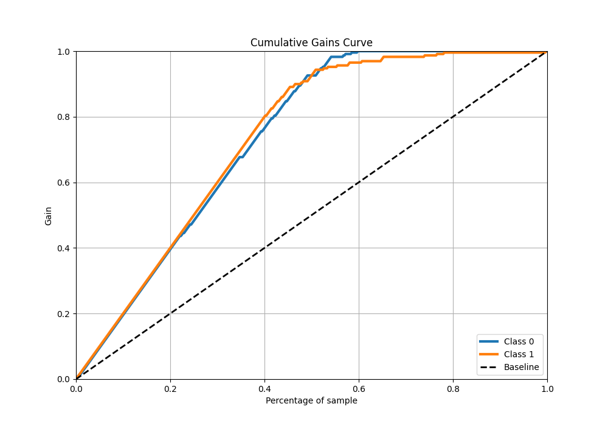

# Summary of 9_Default_RandomForest

[<< Go back](../README.md)

## Random Forest
- **n_jobs**: -1
- **criterion**: gini
- **max_features**: 0.9
- **min_samples_split**: 30
- **max_depth**: 4
- **eval_metric_name**: f1
- **explain_level**: 0

## Validation
 - **validation_type**: kfold
 - **shuffle**: True
 - **stratify**: True
 - **k_folds**: 5

## Optimized metric
f1

## Training time

6.3 seconds

## Metric details
|           |    score |    threshold |
|:----------|---------:|-------------:|
| logloss   | 0.240424 | nan          |
| auc       | 0.975696 | nan          |
| f1        | 0.935065 |   0.493939   |
| accuracy  | 0.936681 |   0.55712    |
| precision | 1        |   0.643564   |
| recall    | 1        |   0.00595425 |
| mcc       | 0.877058 |   0.55712    |

## Metric details with threshold from accuracy metric
|           |    score |   threshold |
|:----------|---------:|------------:|
| logloss   | 0.240424 |   nan       |
| auc       | 0.975696 |   nan       |
| f1        | 0.933638 |     0.55712 |
| accuracy  | 0.936681 |     0.55712 |
| precision | 0.980769 |     0.55712 |
| recall    | 0.89083  |     0.55712 |
| mcc       | 0.877058 |     0.55712 |

## Confusion matrix (at threshold=0.55712)
|              |   Predicted as 0 |   Predicted as 1 |
|:-------------|-----------------:|-----------------:|
| Labeled as 0 |              225 |                4 |
| Labeled as 1 |               25 |              204 |

## Learning curves

## Confusion Matrix

## Normalized Confusion Matrix

## ROC Curve

## Kolmogorov-Smirnov Statistic

## Precision-Recall Curve

## Calibration Curve

## Cumulative Gains Curve

## Lift Curve

[<< Go back](../README.md)
