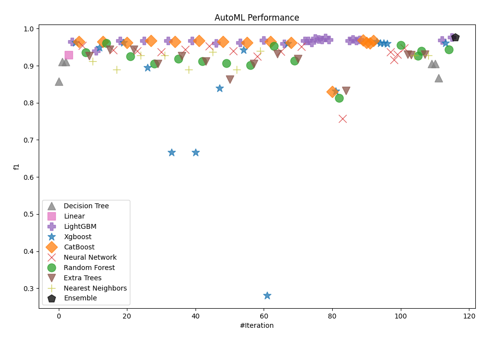
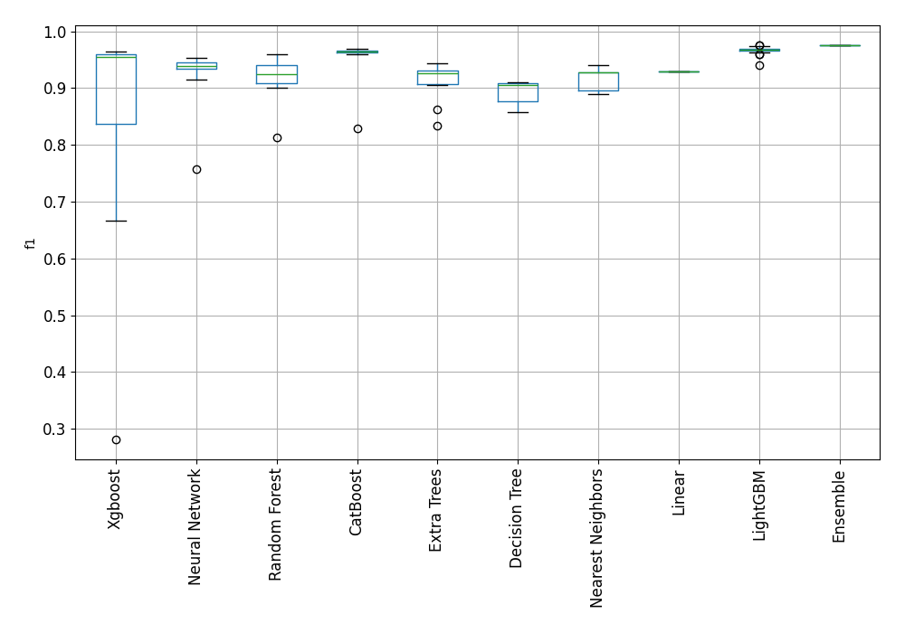
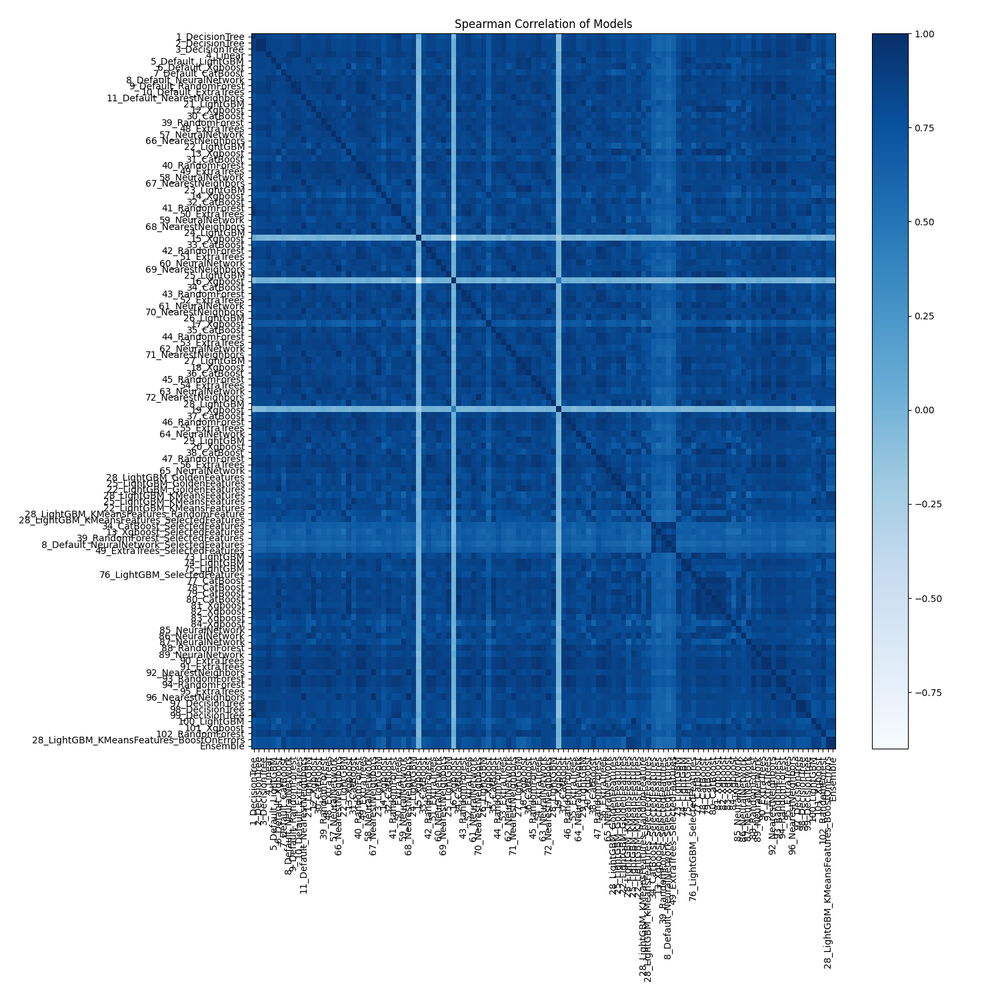

# AutoML Leaderboard

| Best model   | name                                                                                                 | model_type        | metric_type   |   metric_value |   train_time |
|:-------------|:-----------------------------------------------------------------------------------------------------|:------------------|:--------------|---------------:|-------------:|
|              | [1_DecisionTree](1_DecisionTree/README.md)                                                           | Decision Tree     | f1            |       0.857143 |         3.92 |
|              | [2_DecisionTree](2_DecisionTree/README.md)                                                           | Decision Tree     | f1            |       0.910284 |         3.54 |
|              | [3_DecisionTree](3_DecisionTree/README.md)                                                           | Decision Tree     | f1            |       0.910284 |         3.63 |
|              | [4_Linear](4_Linear/README.md)                                                                       | Linear            | f1            |       0.928889 |         9.62 |
|              | [5_Default_LightGBM](5_Default_LightGBM/README.md)                                                   | LightGBM          | f1            |       0.964602 |         6.37 |
|              | [6_Default_Xgboost](6_Default_Xgboost/README.md)                                                     | Xgboost           | f1            |       0.962306 |         5.76 |
|              | [7_Default_CatBoost](7_Default_CatBoost/README.md)                                                   | CatBoost          | f1            |       0.964758 |         5.6  |
|              | [8_Default_NeuralNetwork](8_Default_NeuralNetwork/README.md)                                         | Neural Network    | f1            |       0.953846 |         5.02 |
|              | [9_Default_RandomForest](9_Default_RandomForest/README.md)                                           | Random Forest     | f1            |       0.935065 |         6.95 |
|              | [10_Default_ExtraTrees](10_Default_ExtraTrees/README.md)                                             | Extra Trees       | f1            |       0.926407 |         6.33 |
|              | [11_Default_NearestNeighbors](11_Default_NearestNeighbors/README.md)                                 | Nearest Neighbors | f1            |       0.912442 |         4.62 |
|              | [21_LightGBM](21_LightGBM/README.md)                                                                 | LightGBM          | f1            |       0.940171 |         5.95 |
|              | [12_Xgboost](12_Xgboost/README.md)                                                                   | Xgboost           | f1            |       0.949227 |         6.78 |
|              | [30_CatBoost](30_CatBoost/README.md)                                                                 | CatBoost          | f1            |       0.964444 |         6.38 |
|              | [39_RandomForest](39_RandomForest/README.md)                                                         | Random Forest     | f1            |       0.960177 |         7.12 |
|              | [48_ExtraTrees](48_ExtraTrees/README.md)                                                             | Extra Trees       | f1            |       0.942982 |         7.19 |
|              | [57_NeuralNetwork](57_NeuralNetwork/README.md)                                                       | Neural Network    | f1            |       0.941964 |         5.63 |
|              | [66_NearestNeighbors](66_NearestNeighbors/README.md)                                                 | Nearest Neighbors | f1            |       0.88993  |         5.4  |
|              | [22_LightGBM](22_LightGBM/README.md)                                                                 | LightGBM          | f1            |       0.967177 |         7.03 |
|              | [13_Xgboost](13_Xgboost/README.md)                                                                   | Xgboost           | f1            |       0.962637 |         7.5  |
|              | [31_CatBoost](31_CatBoost/README.md)                                                                 | CatBoost          | f1            |       0.962306 |         7.3  |
|              | [40_RandomForest](40_RandomForest/README.md)                                                         | Random Forest     | f1            |       0.925054 |         8    |
|              | [49_ExtraTrees](49_ExtraTrees/README.md)                                                             | Extra Trees       | f1            |       0.943231 |         8.32 |
|              | [58_NeuralNetwork](58_NeuralNetwork/README.md)                                                       | Neural Network    | f1            |       0.940133 |         6.86 |
|              | [67_NearestNeighbors](67_NearestNeighbors/README.md)                                                 | Nearest Neighbors | f1            |       0.927273 |         6.18 |
|              | [23_LightGBM](23_LightGBM/README.md)                                                                 | LightGBM          | f1            |       0.966741 |         8.46 |
|              | [14_Xgboost](14_Xgboost/README.md)                                                                   | Xgboost           | f1            |       0.895323 |         7.52 |
|              | [32_CatBoost](32_CatBoost/README.md)                                                                 | CatBoost          | f1            |       0.966887 |         7.88 |
|              | [41_RandomForest](41_RandomForest/README.md)                                                         | Random Forest     | f1            |       0.904959 |         8.73 |
|              | [50_ExtraTrees](50_ExtraTrees/README.md)                                                             | Extra Trees       | f1            |       0.905172 |         9.32 |
|              | [59_NeuralNetwork](59_NeuralNetwork/README.md)                                                       | Neural Network    | f1            |       0.936819 |         7.8  |
|              | [68_NearestNeighbors](68_NearestNeighbors/README.md)                                                 | Nearest Neighbors | f1            |       0.927273 |         7.08 |
|              | [24_LightGBM](24_LightGBM/README.md)                                                                 | LightGBM          | f1            |       0.966887 |         9.78 |
|              | [15_Xgboost](15_Xgboost/README.md)                                                                   | Xgboost           | f1            |       0.666667 |         7.7  |
|              | [33_CatBoost](33_CatBoost/README.md)                                                                 | CatBoost          | f1            |       0.964758 |         8.9  |
|              | [42_RandomForest](42_RandomForest/README.md)                                                         | Random Forest     | f1            |       0.918919 |         9.72 |
|              | [51_ExtraTrees](51_ExtraTrees/README.md)                                                             | Extra Trees       | f1            |       0.926316 |         9.89 |
|              | [60_NeuralNetwork](60_NeuralNetwork/README.md)                                                       | Neural Network    | f1            |       0.942982 |         8.41 |
|              | [69_NearestNeighbors](69_NearestNeighbors/README.md)                                                 | Nearest Neighbors | f1            |       0.88993  |         7.88 |
|              | [25_LightGBM](25_LightGBM/README.md)                                                                 | LightGBM          | f1            |       0.96732  |         9.32 |
|              | [16_Xgboost](16_Xgboost/README.md)                                                                   | Xgboost           | f1            |       0.666667 |         8.53 |
|              | [34_CatBoost](34_CatBoost/README.md)                                                                 | CatBoost          | f1            |       0.967033 |         9.32 |
|              | [43_RandomForest](43_RandomForest/README.md)                                                         | Random Forest     | f1            |       0.912134 |        10.29 |
|              | [52_ExtraTrees](52_ExtraTrees/README.md)                                                             | Extra Trees       | f1            |       0.91134  |        10.35 |
|              | [61_NeuralNetwork](61_NeuralNetwork/README.md)                                                       | Neural Network    | f1            |       0.953437 |         9.03 |
|              | [70_NearestNeighbors](70_NearestNeighbors/README.md)                                                 | Nearest Neighbors | f1            |       0.936937 |         8.31 |
|              | [26_LightGBM](26_LightGBM/README.md)                                                                 | LightGBM          | f1            |       0.960177 |         9.49 |
|              | [17_Xgboost](17_Xgboost/README.md)                                                                   | Xgboost           | f1            |       0.838852 |         9.48 |
|              | [35_CatBoost](35_CatBoost/README.md)                                                                 | CatBoost          | f1            |       0.964912 |         9.6  |
|              | [44_RandomForest](44_RandomForest/README.md)                                                         | Random Forest     | f1            |       0.906122 |        11.21 |
|              | [53_ExtraTrees](53_ExtraTrees/README.md)                                                             | Extra Trees       | f1            |       0.862745 |        10.78 |
|              | [62_NeuralNetwork](62_NeuralNetwork/README.md)                                                       | Neural Network    | f1            |       0.939326 |         9.76 |
|              | [71_NearestNeighbors](71_NearestNeighbors/README.md)                                                 | Nearest Neighbors | f1            |       0.88993  |         9.33 |
|              | [27_LightGBM](27_LightGBM/README.md)                                                                 | LightGBM          | f1            |       0.962637 |        11.57 |
|              | [18_Xgboost](18_Xgboost/README.md)                                                                   | Xgboost           | f1            |       0.942184 |        11.72 |
|              | [36_CatBoost](36_CatBoost/README.md)                                                                 | CatBoost          | f1            |       0.962306 |        10.9  |
|              | [45_RandomForest](45_RandomForest/README.md)                                                         | Random Forest     | f1            |       0.901235 |        11.69 |
|              | [54_ExtraTrees](54_ExtraTrees/README.md)                                                             | Extra Trees       | f1            |       0.905579 |        11.57 |
|              | [63_NeuralNetwork](63_NeuralNetwork/README.md)                                                       | Neural Network    | f1            |       0.925439 |        10.65 |
|              | [72_NearestNeighbors](72_NearestNeighbors/README.md)                                                 | Nearest Neighbors | f1            |       0.939866 |         9.72 |
|              | [28_LightGBM](28_LightGBM/README.md)                                                                 | LightGBM          | f1            |       0.969163 |        11.77 |
|              | [19_Xgboost](19_Xgboost/README.md)                                                                   | Xgboost           | f1            |       0.28125  |        10.54 |
|              | [37_CatBoost](37_CatBoost/README.md)                                                                 | CatBoost          | f1            |       0.964758 |        11.39 |
|              | [46_RandomForest](46_RandomForest/README.md)                                                         | Random Forest     | f1            |       0.952381 |        12.63 |
|              | [55_ExtraTrees](55_ExtraTrees/README.md)                                                             | Extra Trees       | f1            |       0.93133  |        12.18 |
|              | [64_NeuralNetwork](64_NeuralNetwork/README.md)                                                       | Neural Network    | f1            |       0.937778 |        11.16 |
|              | [29_LightGBM](29_LightGBM/README.md)                                                                 | LightGBM          | f1            |       0.958785 |        12.26 |
|              | [20_Xgboost](20_Xgboost/README.md)                                                                   | Xgboost           | f1            |       0.96     |        12.06 |
|              | [38_CatBoost](38_CatBoost/README.md)                                                                 | CatBoost          | f1            |       0.962306 |        12.03 |
|              | [47_RandomForest](47_RandomForest/README.md)                                                         | Random Forest     | f1            |       0.913223 |        13.22 |
|              | [56_ExtraTrees](56_ExtraTrees/README.md)                                                             | Extra Trees       | f1            |       0.918239 |        13.2  |
|              | [65_NeuralNetwork](65_NeuralNetwork/README.md)                                                       | Neural Network    | f1            |       0.951754 |        11.71 |
|              | [28_LightGBM_GoldenFeatures](28_LightGBM_GoldenFeatures/README.md)                                   | LightGBM          | f1            |       0.966887 |        19.46 |
|              | [25_LightGBM_GoldenFeatures](25_LightGBM_GoldenFeatures/README.md)                                   | LightGBM          | f1            |       0.967177 |        12.52 |
|              | [22_LightGBM_GoldenFeatures](22_LightGBM_GoldenFeatures/README.md)                                   | LightGBM          | f1            |       0.962306 |        13.6  |
|              | [28_LightGBM_KMeansFeatures](28_LightGBM_KMeansFeatures/README.md)                                   | LightGBM          | f1            |       0.974026 |        14.32 |
|              | [25_LightGBM_KMeansFeatures](25_LightGBM_KMeansFeatures/README.md)                                   | LightGBM          | f1            |       0.971429 |        13.58 |
|              | [22_LightGBM_KMeansFeatures](22_LightGBM_KMeansFeatures/README.md)                                   | LightGBM          | f1            |       0.969432 |        14.14 |
|              | [28_LightGBM_KMeansFeatures_RandomFeature](28_LightGBM_KMeansFeatures_RandomFeature/README.md)       | LightGBM          | f1            |       0.975824 |        15.8  |
|              | [28_LightGBM_KMeansFeatures_SelectedFeatures](28_LightGBM_KMeansFeatures_SelectedFeatures/README.md) | LightGBM          | f1            |       0.969828 |        14.32 |
|              | [34_CatBoost_SelectedFeatures](34_CatBoost_SelectedFeatures/README.md)                               | CatBoost          | f1            |       0.829493 |        12.71 |
|              | [13_Xgboost_SelectedFeatures](13_Xgboost_SelectedFeatures/README.md)                                 | Xgboost           | f1            |       0.831776 |        13.6  |
|              | [39_RandomForest_SelectedFeatures](39_RandomForest_SelectedFeatures/README.md)                       | Random Forest     | f1            |       0.812785 |        14.66 |
|              | [8_Default_NeuralNetwork_SelectedFeatures](8_Default_NeuralNetwork_SelectedFeatures/README.md)       | Neural Network    | f1            |       0.757946 |        12.83 |
|              | [49_ExtraTrees_SelectedFeatures](49_ExtraTrees_SelectedFeatures/README.md)                           | Extra Trees       | f1            |       0.832952 |        14.56 |
|              | [73_LightGBM](73_LightGBM/README.md)                                                                 | LightGBM          | f1            |       0.967177 |        14.77 |
|              | [74_LightGBM](74_LightGBM/README.md)                                                                 | LightGBM          | f1            |       0.971302 |        14.63 |
|              | [75_LightGBM](75_LightGBM/README.md)                                                                 | LightGBM          | f1            |       0.966887 |        14.87 |
|              | [76_LightGBM_SelectedFeatures](76_LightGBM_SelectedFeatures/README.md)                               | LightGBM          | f1            |       0.969432 |        15.85 |
|              | [77_CatBoost](77_CatBoost/README.md)                                                                 | CatBoost          | f1            |       0.969298 |        12.29 |
|              | [78_CatBoost](78_CatBoost/README.md)                                                                 | CatBoost          | f1            |       0.962472 |        13.89 |
|              | [79_CatBoost](79_CatBoost/README.md)                                                                 | CatBoost          | f1            |       0.960177 |        13.77 |
|              | [80_CatBoost](80_CatBoost/README.md)                                                                 | CatBoost          | f1            |       0.967033 |        14.08 |
|              | [81_Xgboost](81_Xgboost/README.md)                                                                   | Xgboost           | f1            |       0.964758 |        15.14 |
|              | [82_Xgboost](82_Xgboost/README.md)                                                                   | Xgboost           | f1            |       0.960352 |        14.9  |
|              | [83_Xgboost](83_Xgboost/README.md)                                                                   | Xgboost           | f1            |       0.960177 |        14.93 |
|              | [84_Xgboost](84_Xgboost/README.md)                                                                   | Xgboost           | f1            |       0.96     |        14.96 |
|              | [85_NeuralNetwork](85_NeuralNetwork/README.md)                                                       | Neural Network    | f1            |       0.93722  |        14.36 |
|              | [86_NeuralNetwork](86_NeuralNetwork/README.md)                                                       | Neural Network    | f1            |       0.915556 |        14.56 |
|              | [87_NeuralNetwork](87_NeuralNetwork/README.md)                                                       | Neural Network    | f1            |       0.929825 |        14.92 |
|              | [88_RandomForest](88_RandomForest/README.md)                                                         | Random Forest     | f1            |       0.955947 |        16.59 |
|              | [89_NeuralNetwork](89_NeuralNetwork/README.md)                                                       | Neural Network    | f1            |       0.948052 |        13.17 |
|              | [90_ExtraTrees](90_ExtraTrees/README.md)                                                             | Extra Trees       | f1            |       0.930131 |        16.78 |
|              | [91_ExtraTrees](91_ExtraTrees/README.md)                                                             | Extra Trees       | f1            |       0.928889 |        16.59 |
|              | [92_NearestNeighbors](92_NearestNeighbors/README.md)                                                 | Nearest Neighbors | f1            |       0.927928 |        14.35 |
|              | [93_RandomForest](93_RandomForest/README.md)                                                         | Random Forest     | f1            |       0.926407 |        17.1  |
|              | [94_RandomForest](94_RandomForest/README.md)                                                         | Random Forest     | f1            |       0.93913  |        16.9  |
|              | [95_ExtraTrees](95_ExtraTrees/README.md)                                                             | Extra Trees       | f1            |       0.930131 |        16.56 |
|              | [96_NearestNeighbors](96_NearestNeighbors/README.md)                                                 | Nearest Neighbors | f1            |       0.927928 |        15.17 |
|              | [97_DecisionTree](97_DecisionTree/README.md)                                                         | Decision Tree     | f1            |       0.905579 |        14.93 |
|              | [98_DecisionTree](98_DecisionTree/README.md)                                                         | Decision Tree     | f1            |       0.905579 |        15.19 |
|              | [99_DecisionTree](99_DecisionTree/README.md)                                                         | Decision Tree     | f1            |       0.866953 |        15.2  |
|              | [100_LightGBM](100_LightGBM/README.md)                                                               | LightGBM          | f1            |       0.969027 |        18.08 |
|              | [101_Xgboost](101_Xgboost/README.md)                                                                 | Xgboost           | f1            |       0.960177 |        16.57 |
|              | [102_RandomForest](102_RandomForest/README.md)                                                       | Random Forest     | f1            |       0.942982 |        18.03 |
| **the best** | [28_LightGBM_KMeansFeatures_BoostOnErrors](28_LightGBM_KMeansFeatures_BoostOnErrors/README.md)       | LightGBM          | f1            |       0.976035 |        18.34 |
|              | [Ensemble](Ensemble/README.md)                                                                       | Ensemble          | f1            |       0.976035 |        19.4  |

### AutoML Performance

### AutoML Performance Boxplot

### Spearman Correlation of Models

