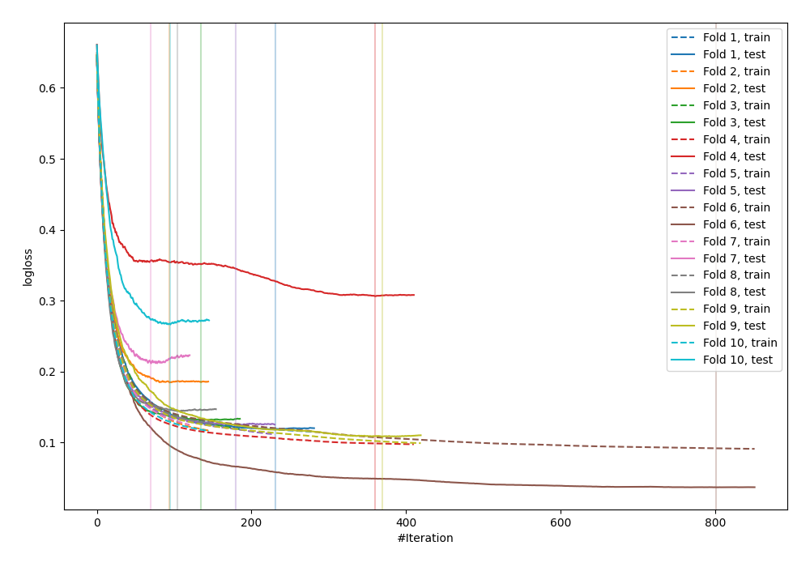
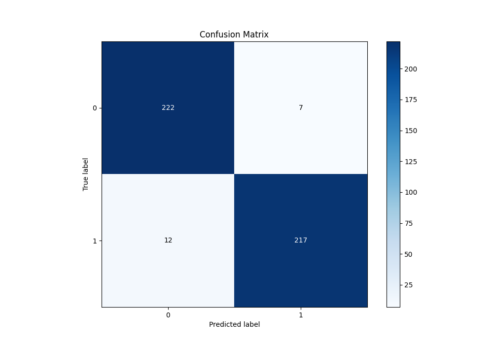
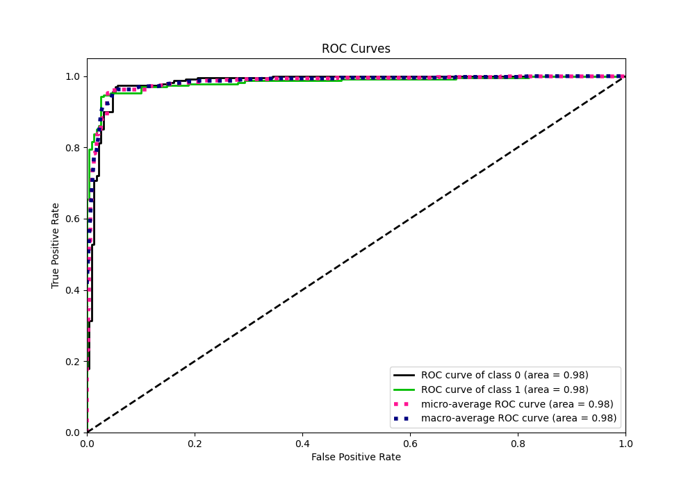
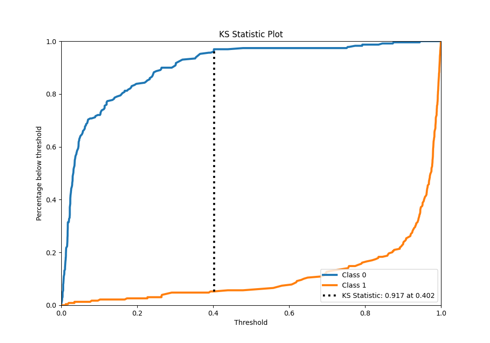
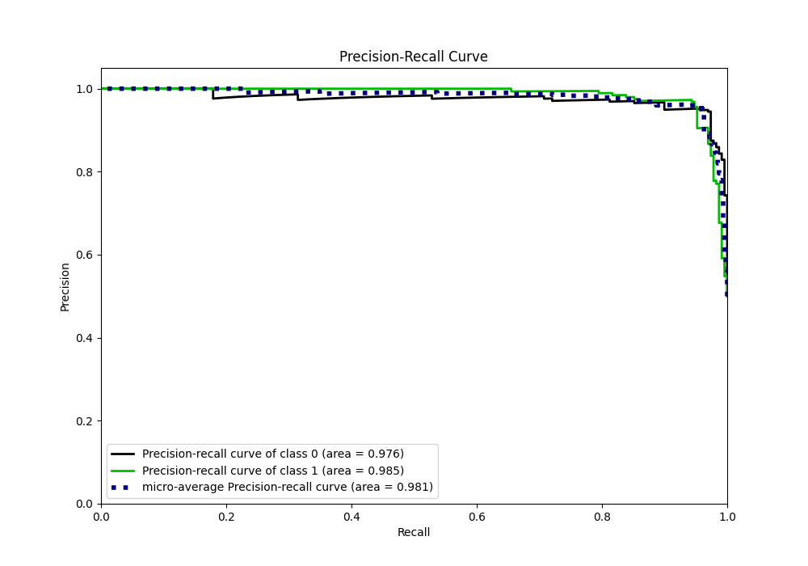
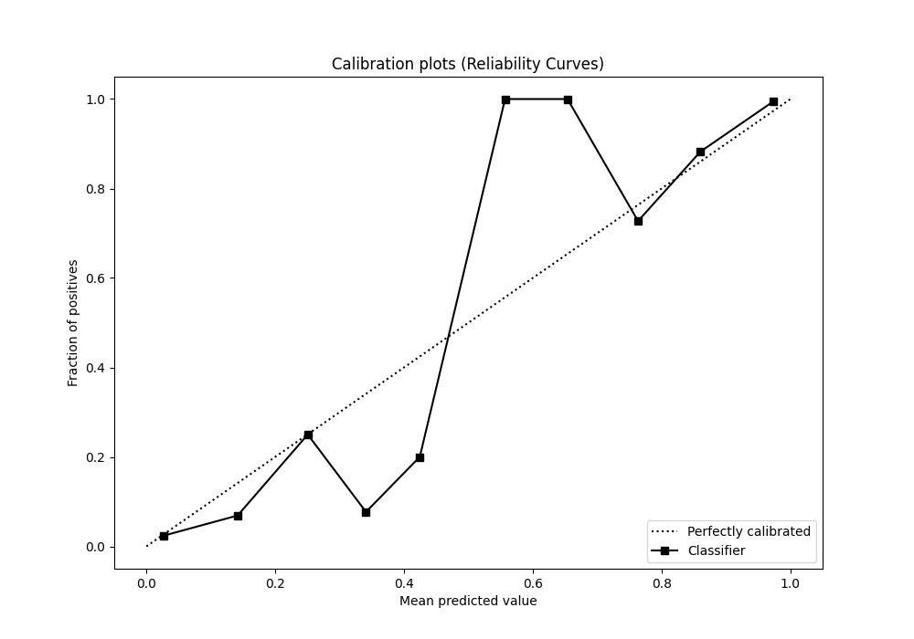
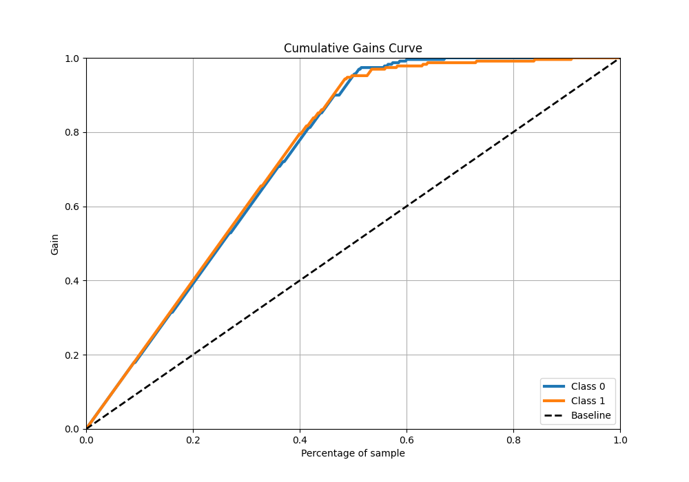
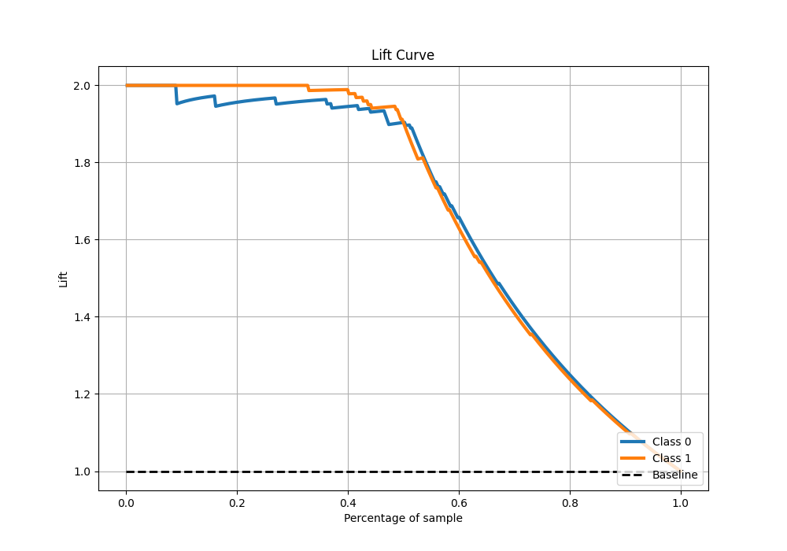

# Summary of 12_Xgboost

[<< Go back](../README.md)

## Extreme Gradient Boosting (Xgboost)
- **n_jobs**: -1
- **objective**: binary:logistic
- **eta**: 0.075
- **max_depth**: 8
- **min_child_weight**: 5
- **subsample**: 1.0
- **colsample_bytree**: 1.0
- **eval_metric**: logloss
- **explain_level**: 0

## Validation
 - **validation_type**: kfold
 - **shuffle**: True
 - **stratify**: True
 - **k_folds**: 10

## Optimized metric
logloss

## Training time

9.4 seconds

## Metric details
|           |    score |     threshold |
|:----------|---------:|--------------:|
| logloss   | 0.163252 | nan           |
| auc       | 0.981637 | nan           |
| f1        | 0.958057 |   0.40206     |
| accuracy  | 0.958515 |   0.40206     |
| precision | 1        |   0.945241    |
| recall    | 1        |   0.000494429 |
| mcc       | 0.917249 |   0.40206     |

## Metric details with threshold from accuracy metric
|           |    score |   threshold |
|:----------|---------:|------------:|
| logloss   | 0.163252 |   nan       |
| auc       | 0.981637 |   nan       |
| f1        | 0.958057 |     0.40206 |
| accuracy  | 0.958515 |     0.40206 |
| precision | 0.96875  |     0.40206 |
| recall    | 0.947598 |     0.40206 |
| mcc       | 0.917249 |     0.40206 |

## Confusion matrix (at threshold=0.40206)
|              |   Predicted as 0 |   Predicted as 1 |
|:-------------|-----------------:|-----------------:|
| Labeled as 0 |              222 |                7 |
| Labeled as 1 |               12 |              217 |

## Learning curves

## Confusion Matrix

## Normalized Confusion Matrix

## ROC Curve

## Kolmogorov-Smirnov Statistic

## Precision-Recall Curve

## Calibration Curve

## Cumulative Gains Curve

## Lift Curve

[<< Go back](../README.md)
