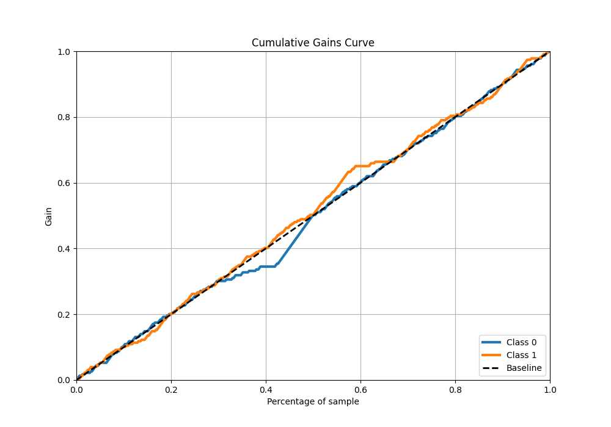

# Summary of 16_Xgboost

[<< Go back](../README.md)

## Extreme Gradient Boosting (Xgboost)
- **n_jobs**: -1
- **objective**: binary:logistic
- **eta**: 0.1
- **max_depth**: 6
- **min_child_weight**: 50
- **subsample**: 0.9
- **colsample_bytree**: 0.7
- **eval_metric**: logloss
- **explain_level**: 0

## Validation
 - **validation_type**: kfold
 - **shuffle**: True
 - **stratify**: True
 - **k_folds**: 10

## Optimized metric
logloss

## Training time

13.4 seconds

## Metric details
|           |      score |   threshold |
|:----------|-----------:|------------:|
| logloss   | 0.693123   |  nan        |
| auc       | 0.503938   |  nan        |
| f1        | 0.666667   |    0.448216 |
| accuracy  | 0.502183   |    0.498018 |
| precision | 0.511111   |    0.500169 |
| recall    | 1          |    0.448216 |
| mcc       | 0.00733531 |    0.498018 |

## Metric details with threshold from accuracy metric
|           |      score |   threshold |
|:----------|-----------:|------------:|
| logloss   | 0.693123   |  nan        |
| auc       | 0.503938   |  nan        |
| f1        | 0.64486    |    0.498018 |
| accuracy  | 0.502183   |    0.498018 |
| precision | 0.501211   |    0.498018 |
| recall    | 0.90393    |    0.498018 |
| mcc       | 0.00733531 |    0.498018 |

## Confusion matrix (at threshold=0.498018)
|              |   Predicted as 0 |   Predicted as 1 |
|:-------------|-----------------:|-----------------:|
| Labeled as 0 |               23 |              206 |
| Labeled as 1 |               22 |              207 |

## Learning curves

## Confusion Matrix

## Normalized Confusion Matrix

## ROC Curve

## Kolmogorov-Smirnov Statistic

## Precision-Recall Curve

## Calibration Curve

## Cumulative Gains Curve

## Lift Curve

[<< Go back](../README.md)
