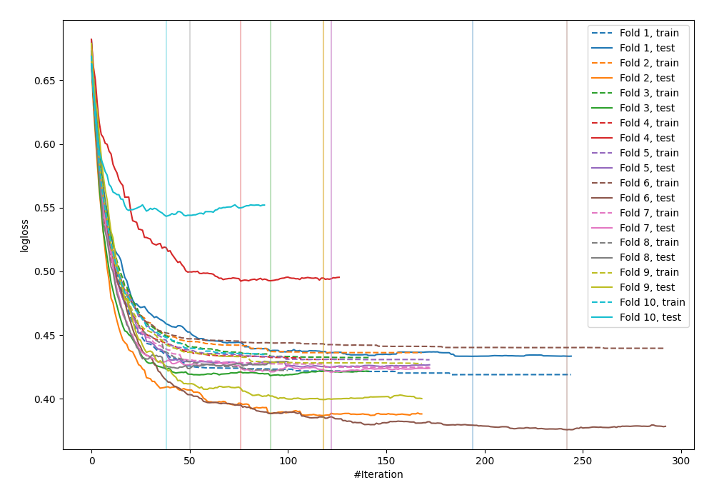
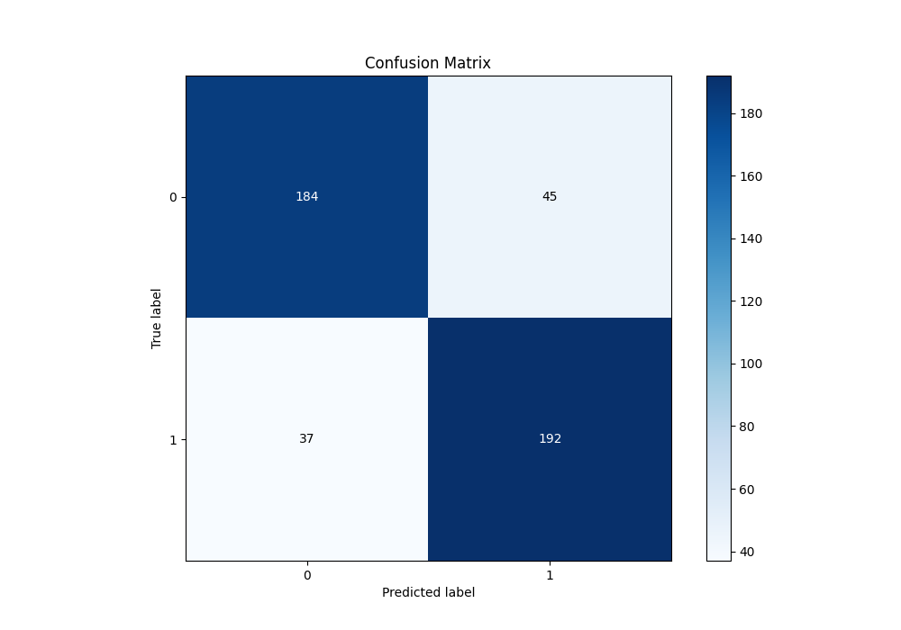
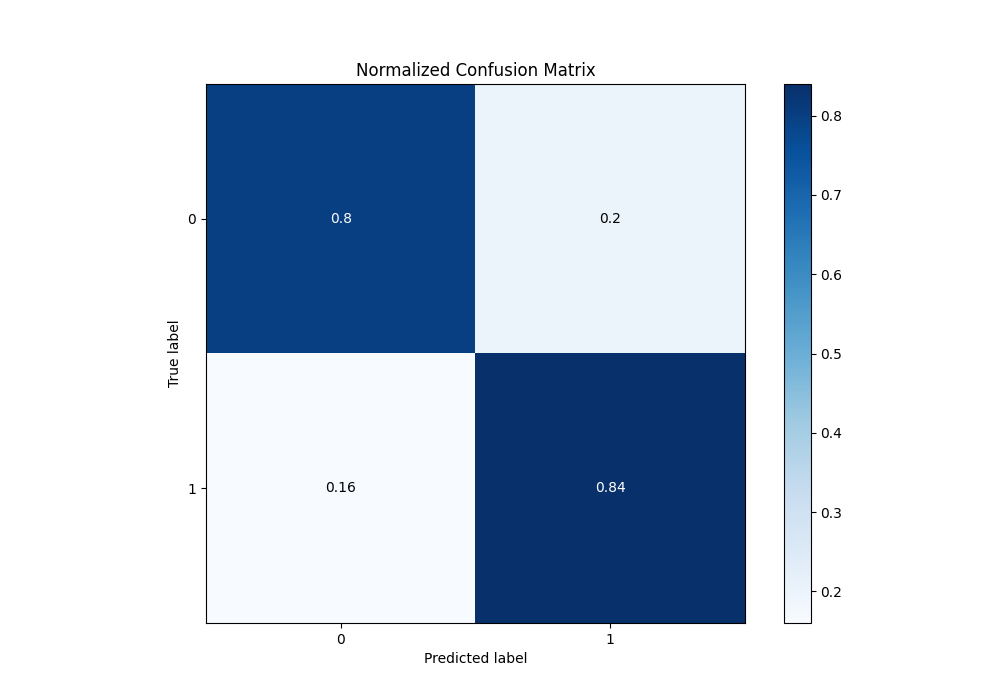
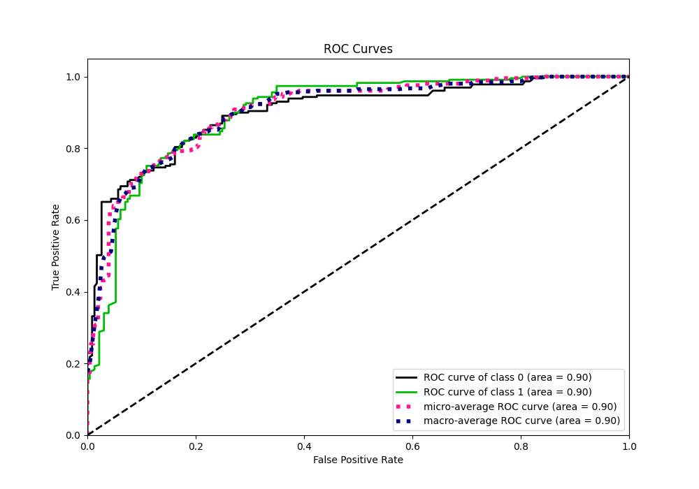
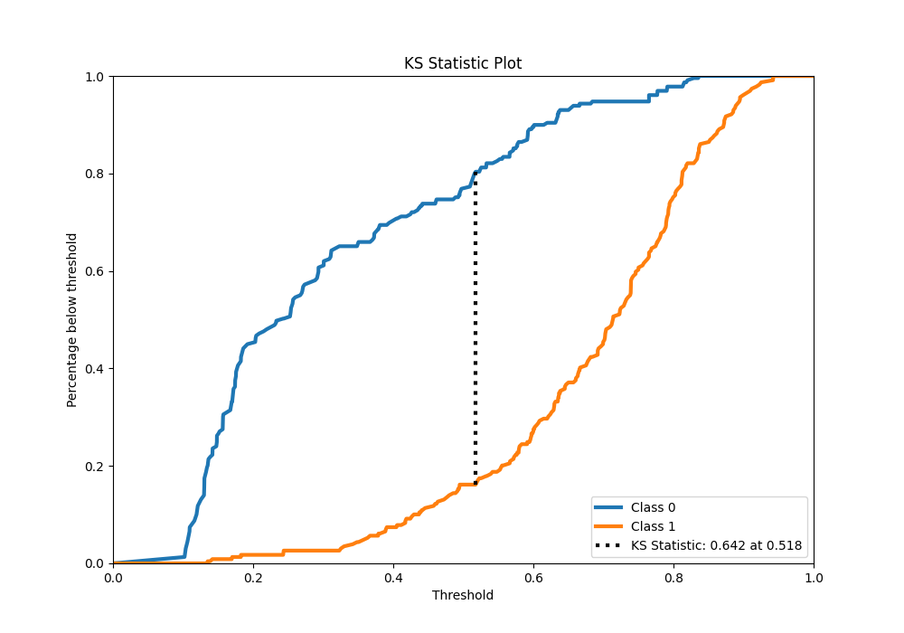
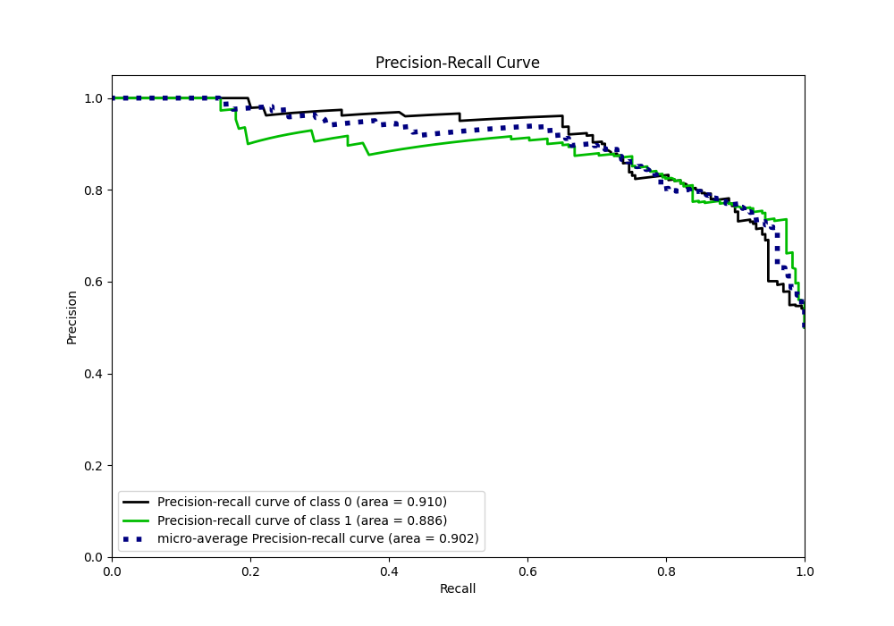
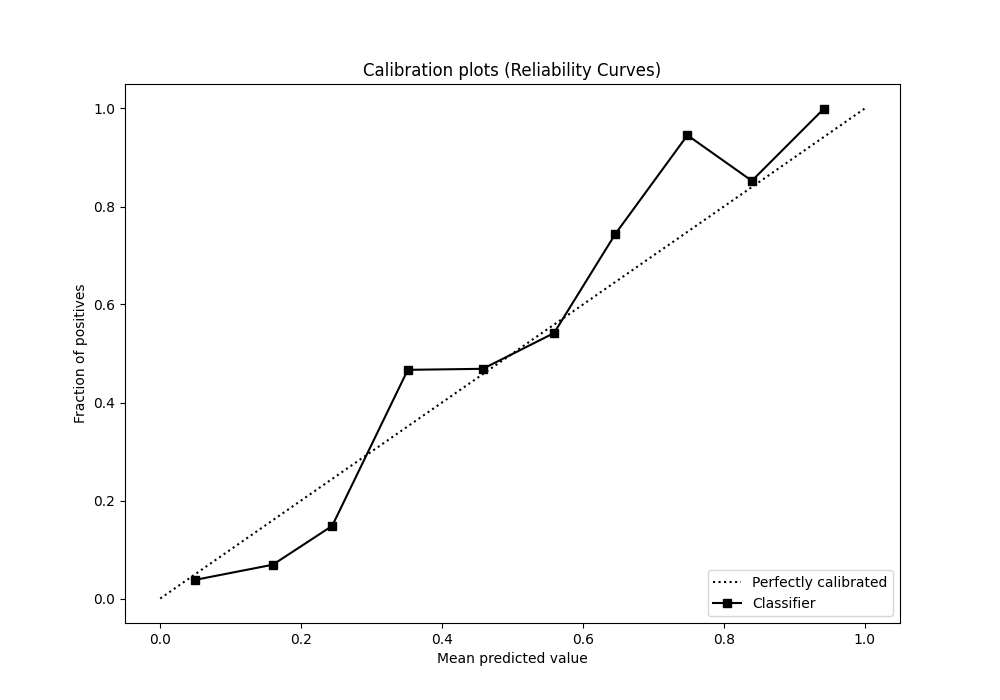
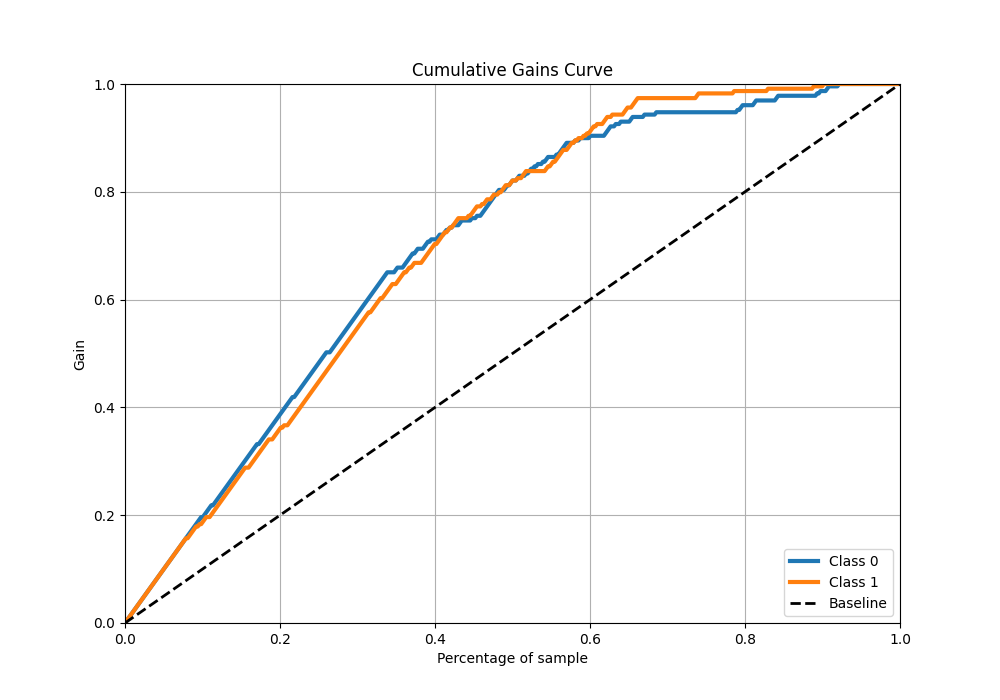
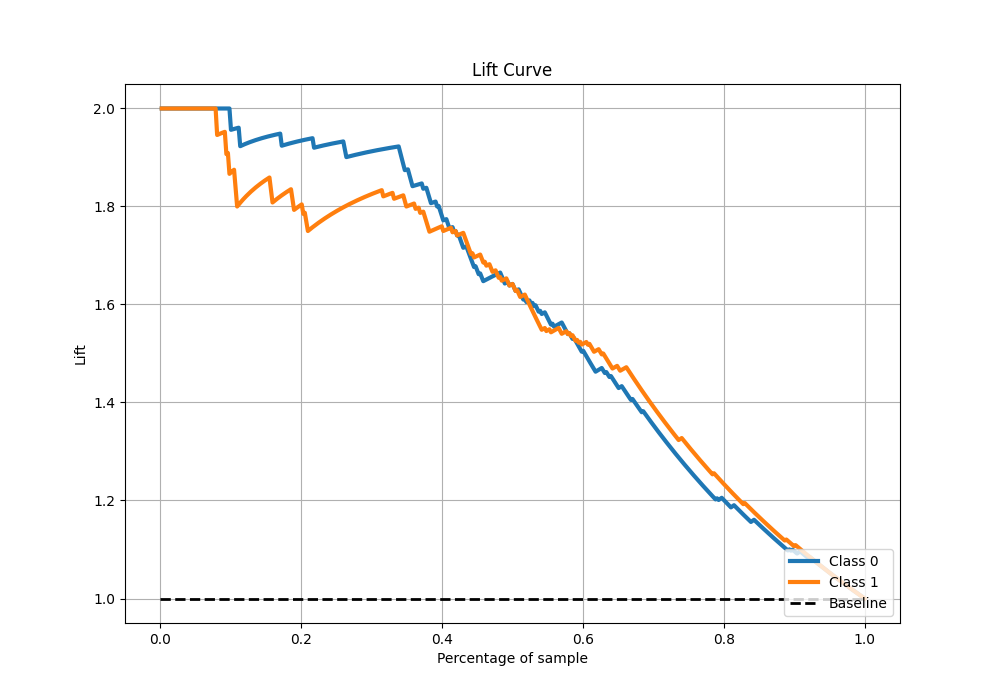

# Summary of 17_Xgboost

[<< Go back](../README.md)

## Extreme Gradient Boosting (Xgboost)
- **n_jobs**: -1
- **objective**: binary:logistic
- **eta**: 0.1
- **max_depth**: 4
- **min_child_weight**: 25
- **subsample**: 0.7
- **colsample_bytree**: 0.7
- **eval_metric**: logloss
- **explain_level**: 0

## Validation
 - **validation_type**: kfold
 - **shuffle**: True
 - **stratify**: True
 - **k_folds**: 10

## Optimized metric
logloss

## Training time

15.3 seconds

## Metric details
|           |    score |   threshold |
|:----------|---------:|------------:|
| logloss   | 0.43164  | nan         |
| auc       | 0.89983  | nan         |
| f1        | 0.836576 |   0.384851  |
| accuracy  | 0.820961 |   0.51912   |
| precision | 0.929577 |   0.791228  |
| recall    | 1        |   0.0919202 |
| mcc       | 0.653014 |   0.384851  |

## Metric details with threshold from accuracy metric
|           |    score |   threshold |
|:----------|---------:|------------:|
| logloss   | 0.43164  |   nan       |
| auc       | 0.89983  |   nan       |
| f1        | 0.824034 |     0.51912 |
| accuracy  | 0.820961 |     0.51912 |
| precision | 0.810127 |     0.51912 |
| recall    | 0.838428 |     0.51912 |
| mcc       | 0.642313 |     0.51912 |

## Confusion matrix (at threshold=0.51912)
|              |   Predicted as 0 |   Predicted as 1 |
|:-------------|-----------------:|-----------------:|
| Labeled as 0 |              184 |               45 |
| Labeled as 1 |               37 |              192 |

## Learning curves

## Confusion Matrix

## Normalized Confusion Matrix

## ROC Curve

## Kolmogorov-Smirnov Statistic

## Precision-Recall Curve

## Calibration Curve

## Cumulative Gains Curve

## Lift Curve

[<< Go back](../README.md)
