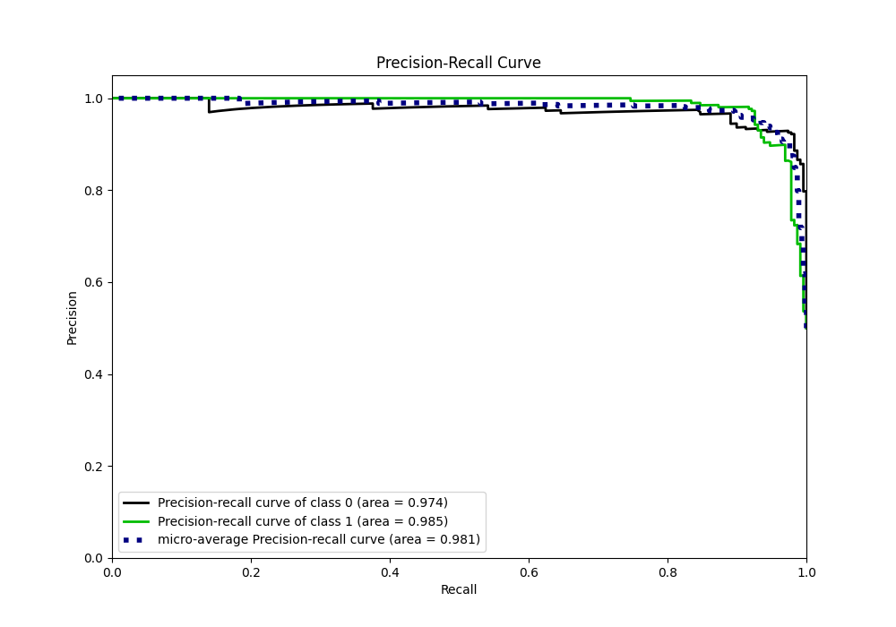

# Summary of 18_Xgboost

[<< Go back](../README.md)

## Extreme Gradient Boosting (Xgboost)
- **n_jobs**: -1
- **objective**: binary:logistic
- **eta**: 0.05
- **max_depth**: 8
- **min_child_weight**: 5
- **subsample**: 0.5
- **colsample_bytree**: 0.8
- **eval_metric**: logloss
- **explain_level**: 0

## Validation
 - **validation_type**: kfold
 - **shuffle**: True
 - **stratify**: True
 - **k_folds**: 10

## Optimized metric
logloss

## Training time

19.0 seconds

## Metric details
|           |    score |    threshold |
|:----------|---------:|-------------:|
| logloss   | 0.1746   | nan          |
| auc       | 0.980979 | nan          |
| f1        | 0.946429 |   0.510883   |
| accuracy  | 0.947598 |   0.510883   |
| precision | 1        |   0.888737   |
| recall    | 1        |   0.00443593 |
| mcc       | 0.89739  |   0.563837   |

## Metric details with threshold from accuracy metric
|           |    score |   threshold |
|:----------|---------:|------------:|
| logloss   | 0.1746   |  nan        |
| auc       | 0.980979 |  nan        |
| f1        | 0.946429 |    0.510883 |
| accuracy  | 0.947598 |    0.510883 |
| precision | 0.968037 |    0.510883 |
| recall    | 0.925764 |    0.510883 |
| mcc       | 0.896051 |    0.510883 |

## Confusion matrix (at threshold=0.510883)
|              |   Predicted as 0 |   Predicted as 1 |
|:-------------|-----------------:|-----------------:|
| Labeled as 0 |              222 |                7 |
| Labeled as 1 |               17 |              212 |

## Learning curves

## Confusion Matrix

## Normalized Confusion Matrix

## ROC Curve

## Kolmogorov-Smirnov Statistic

## Precision-Recall Curve

## Calibration Curve

## Cumulative Gains Curve

## Lift Curve

[<< Go back](../README.md)
