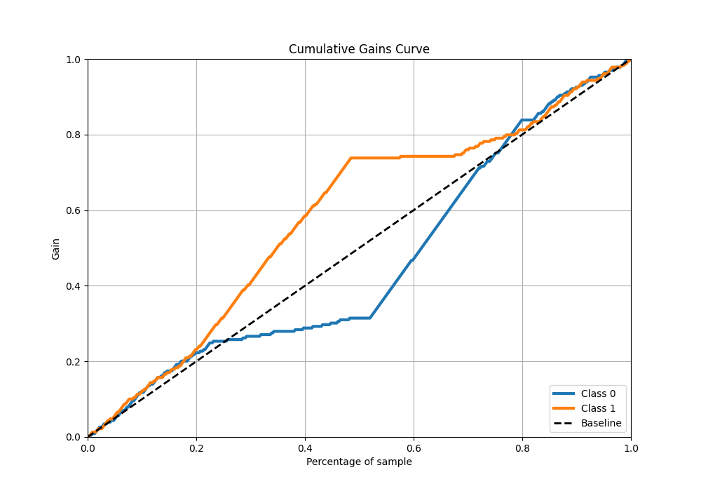
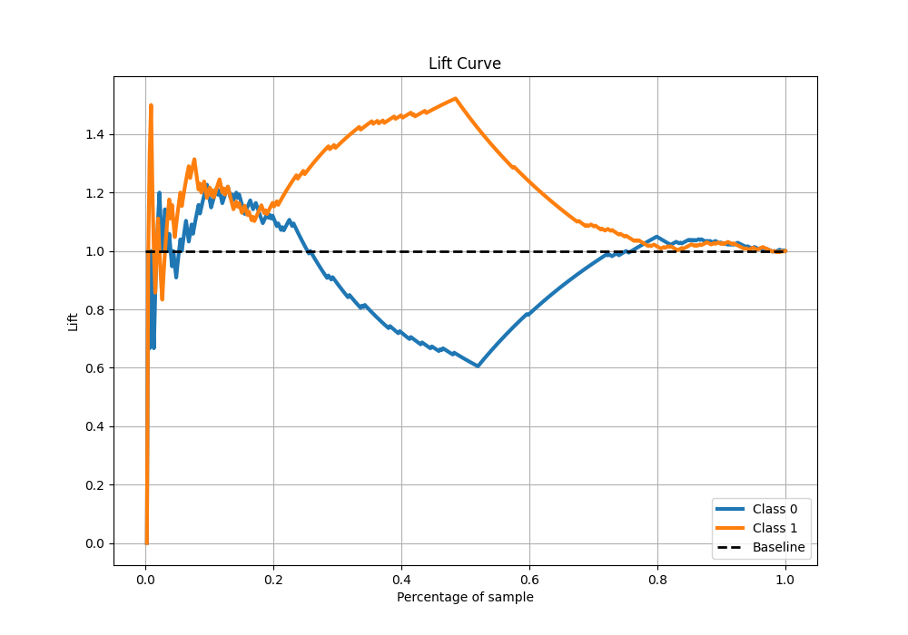

# Summary of 19_Xgboost

[<< Go back](../README.md)

## Extreme Gradient Boosting (Xgboost)
- **n_jobs**: -1
- **objective**: binary:logistic
- **eta**: 0.1
- **max_depth**: 7
- **min_child_weight**: 50
- **subsample**: 1.0
- **colsample_bytree**: 1.0
- **eval_metric**: logloss
- **explain_level**: 0

## Validation
 - **validation_type**: kfold
 - **shuffle**: True
 - **stratify**: True
 - **k_folds**: 10

## Optimized metric
logloss

## Training time

17.6 seconds

## Metric details
|           |     score |   threshold |
|:----------|----------:|------------:|
| logloss   | 0.691893  |  nan        |
| auc       | 0.539053  |  nan        |
| f1        | 0.666667  |    0.416477 |
| accuracy  | 0.524017  |    0.492134 |
| precision | 0.657143  |    0.501211 |
| recall    | 1         |    0.416477 |
| mcc       | 0.0904042 |    0.501211 |

## Metric details with threshold from accuracy metric
|           |     score |   threshold |
|:----------|----------:|------------:|
| logloss   | 0.691893  |  nan        |
| auc       | 0.539053  |  nan        |
| f1        | 0.653968  |    0.492134 |
| accuracy  | 0.524017  |    0.492134 |
| precision | 0.513716  |    0.492134 |
| recall    | 0.899563  |    0.492134 |
| mcc       | 0.0727584 |    0.492134 |

## Confusion matrix (at threshold=0.492134)
|              |   Predicted as 0 |   Predicted as 1 |
|:-------------|-----------------:|-----------------:|
| Labeled as 0 |               34 |              195 |
| Labeled as 1 |               23 |              206 |

## Learning curves

## Confusion Matrix

## Normalized Confusion Matrix

## ROC Curve

## Kolmogorov-Smirnov Statistic

## Precision-Recall Curve

## Calibration Curve

## Cumulative Gains Curve

## Lift Curve

[<< Go back](../README.md)
