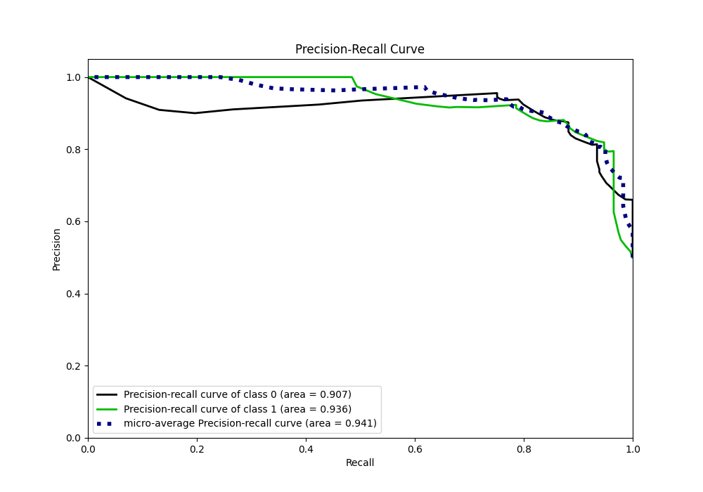

# Summary of 1_DecisionTree

[<< Go back](../README.md)

## Decision Tree
- **n_jobs**: -1
- **criterion**: gini
- **max_depth**: 3
- **explain_level**: 0

## Validation
 - **validation_type**: kfold
 - **shuffle**: True
 - **stratify**: True
 - **k_folds**: 10

## Optimized metric
logloss

## Training time

4.8 seconds

## Metric details
|           |    score |   threshold |
|:----------|---------:|------------:|
| logloss   | 0.295041 |  nan        |
| auc       | 0.930369 |  nan        |
| f1        | 0.878543 |    0.381818 |
| accuracy  | 0.877729 |    0.594595 |
| precision | 1        |    0.931818 |
| recall    | 1        |    0.028481 |
| mcc       | 0.755487 |    0.594595 |

## Metric details with threshold from accuracy metric
|           |    score |   threshold |
|:----------|---------:|------------:|
| logloss   | 0.295041 |  nan        |
| auc       | 0.930369 |  nan        |
| f1        | 0.877193 |    0.594595 |
| accuracy  | 0.877729 |    0.594595 |
| precision | 0.881057 |    0.594595 |
| recall    | 0.873362 |    0.594595 |
| mcc       | 0.755487 |    0.594595 |

## Confusion matrix (at threshold=0.594595)
|              |   Predicted as 0 |   Predicted as 1 |
|:-------------|-----------------:|-----------------:|
| Labeled as 0 |              202 |               27 |
| Labeled as 1 |               29 |              200 |

## Learning curves

## Confusion Matrix

## Normalized Confusion Matrix

## ROC Curve

## Kolmogorov-Smirnov Statistic

## Precision-Recall Curve

## Calibration Curve

## Cumulative Gains Curve

## Lift Curve

[<< Go back](../README.md)
