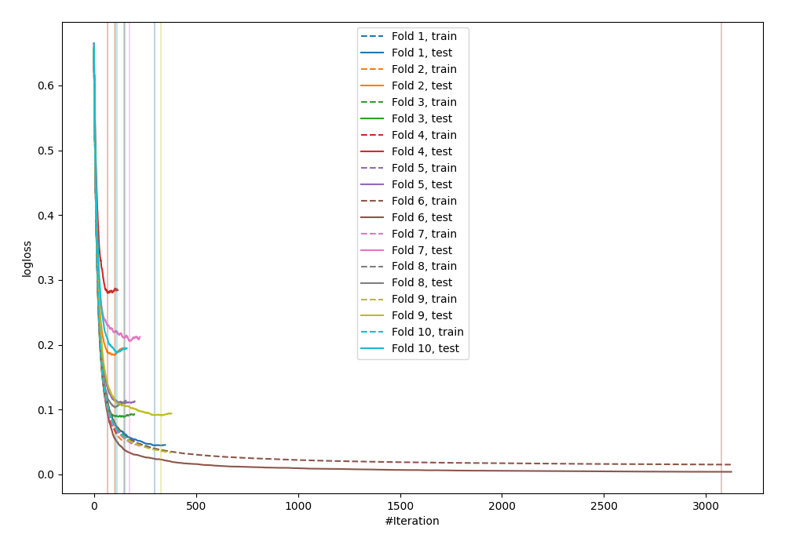
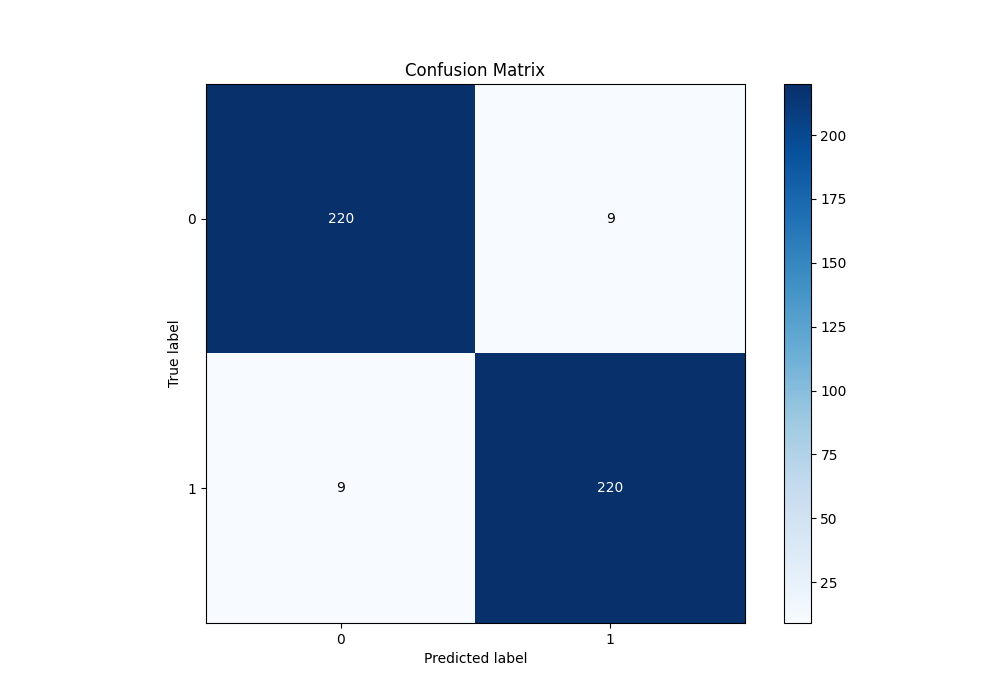
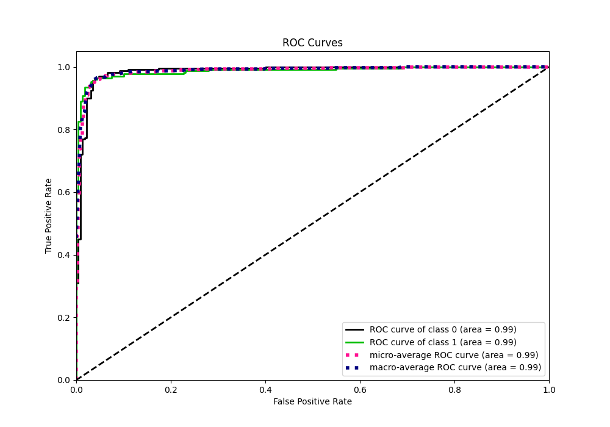
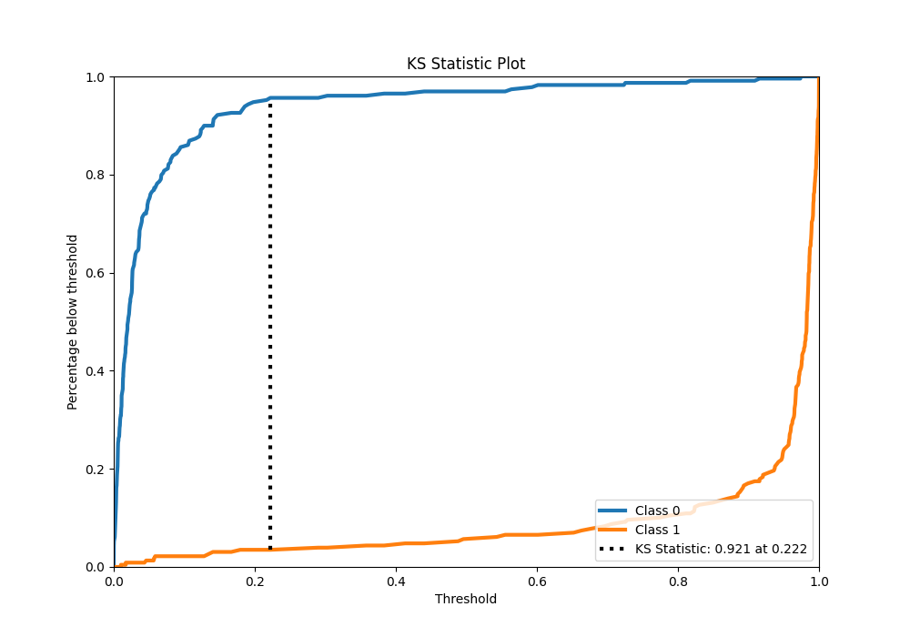
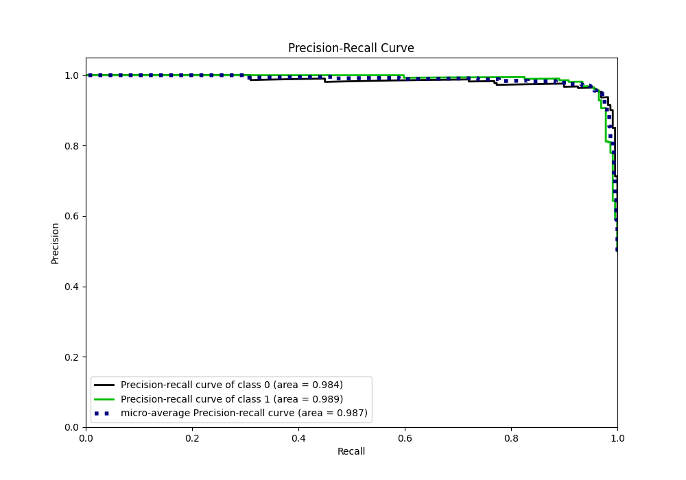
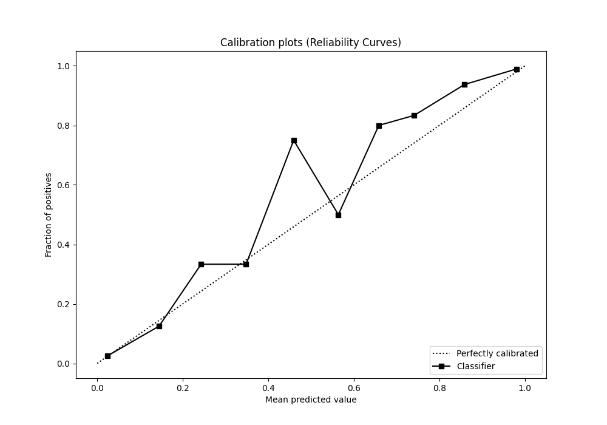
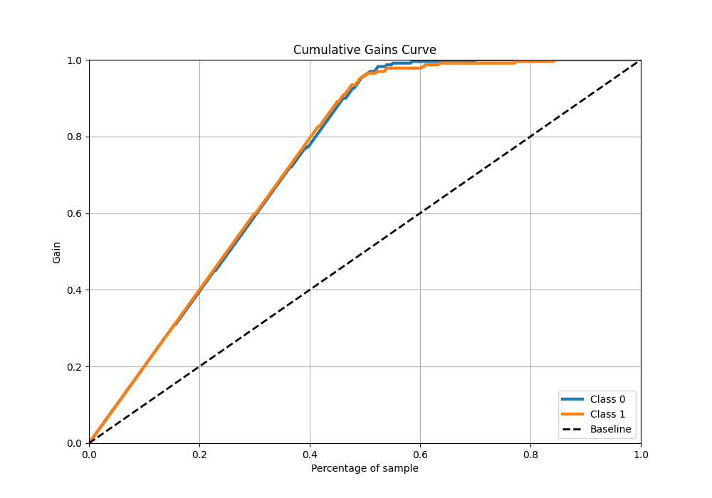
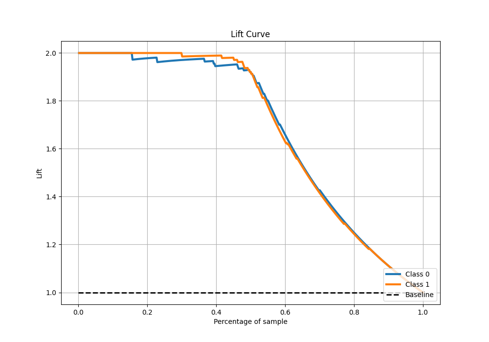

# Summary of 20_Xgboost

[<< Go back](../README.md)

## Extreme Gradient Boosting (Xgboost)
- **n_jobs**: -1
- **objective**: binary:logistic
- **eta**: 0.05
- **max_depth**: 7
- **min_child_weight**: 1
- **subsample**: 0.9
- **colsample_bytree**: 0.9
- **eval_metric**: logloss
- **explain_level**: 0

## Validation
 - **validation_type**: kfold
 - **shuffle**: True
 - **stratify**: True
 - **k_folds**: 10

## Optimized metric
logloss

## Training time

22.8 seconds

## Metric details
|           |    score |     threshold |
|:----------|---------:|--------------:|
| logloss   | 0.129838 | nan           |
| auc       | 0.986861 | nan           |
| f1        | 0.960699 |   0.330348    |
| accuracy  | 0.960699 |   0.330348    |
| precision | 1        |   0.974077    |
| recall    | 1        |   3.12422e-07 |
| mcc       | 0.921538 |   0.464209    |

## Metric details with threshold from accuracy metric
|           |    score |   threshold |
|:----------|---------:|------------:|
| logloss   | 0.129838 |  nan        |
| auc       | 0.986861 |  nan        |
| f1        | 0.960699 |    0.330348 |
| accuracy  | 0.960699 |    0.330348 |
| precision | 0.960699 |    0.330348 |
| recall    | 0.960699 |    0.330348 |
| mcc       | 0.921397 |    0.330348 |

## Confusion matrix (at threshold=0.330348)
|              |   Predicted as 0 |   Predicted as 1 |
|:-------------|-----------------:|-----------------:|
| Labeled as 0 |              220 |                9 |
| Labeled as 1 |                9 |              220 |

## Learning curves

## Confusion Matrix

## Normalized Confusion Matrix

## ROC Curve

## Kolmogorov-Smirnov Statistic

## Precision-Recall Curve

## Calibration Curve

## Cumulative Gains Curve

## Lift Curve

[<< Go back](../README.md)
