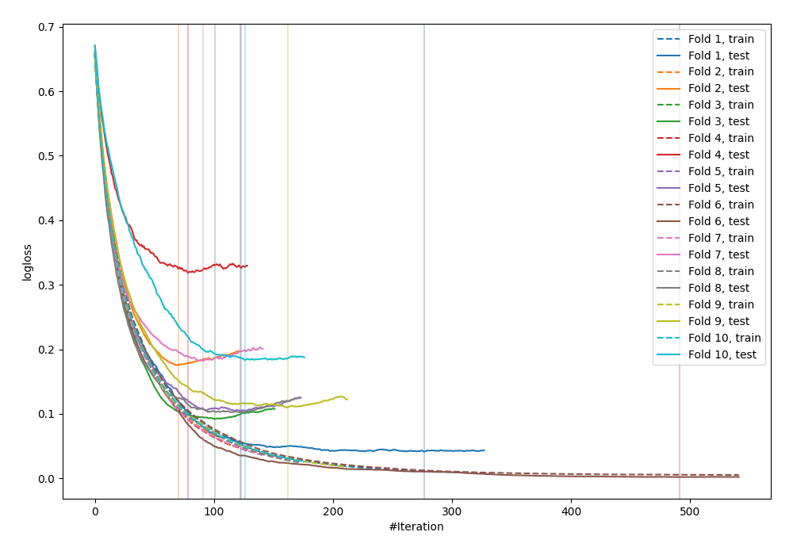
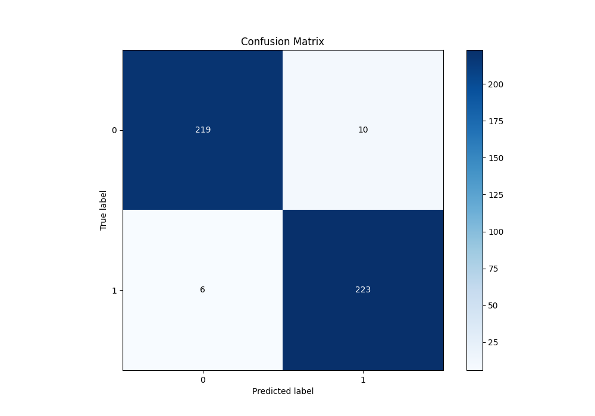
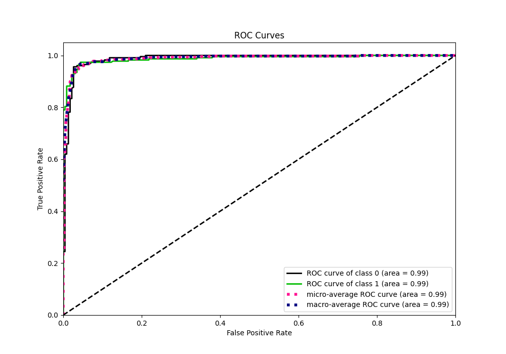
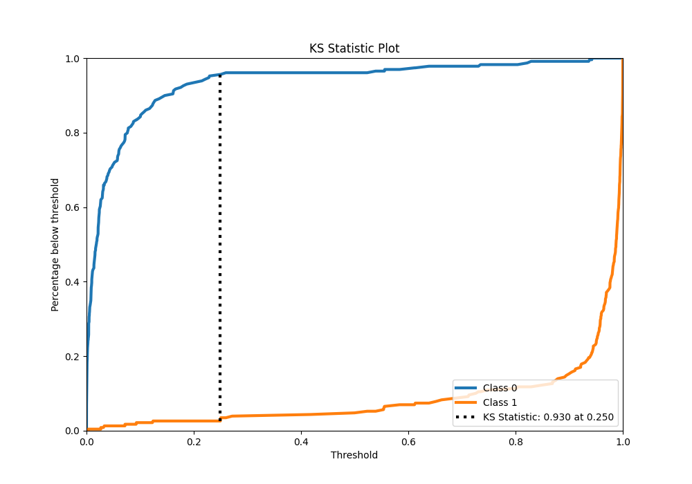
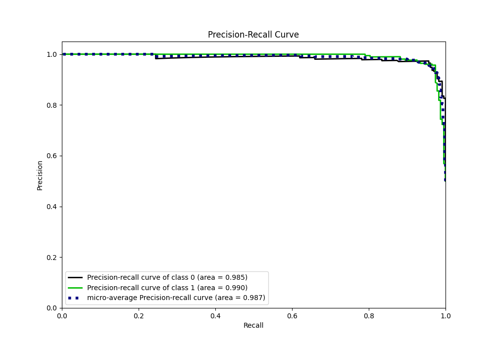
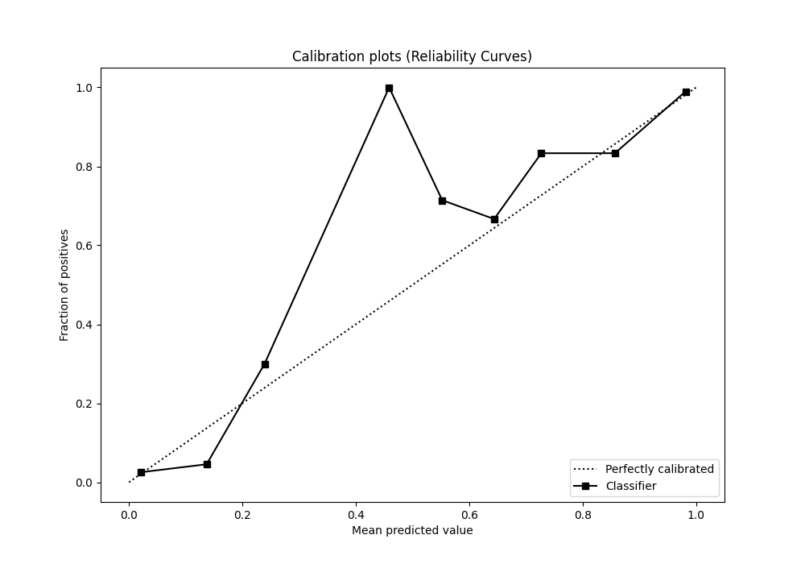
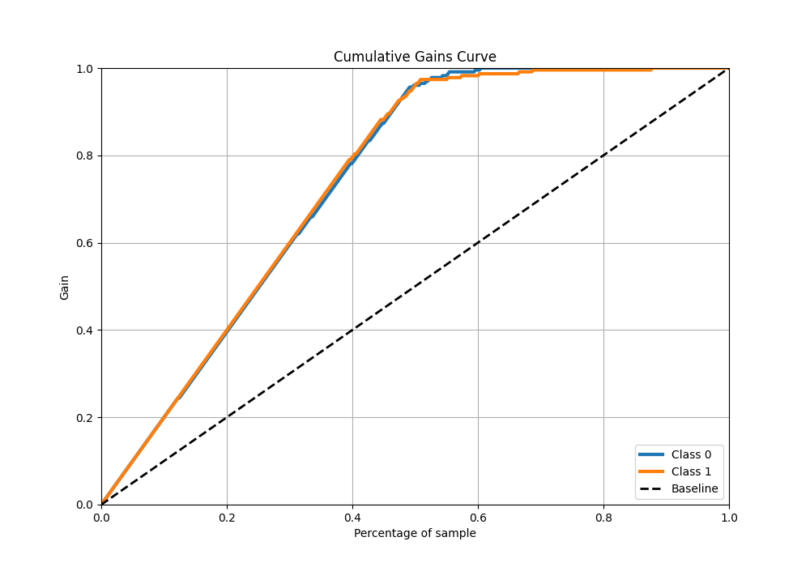
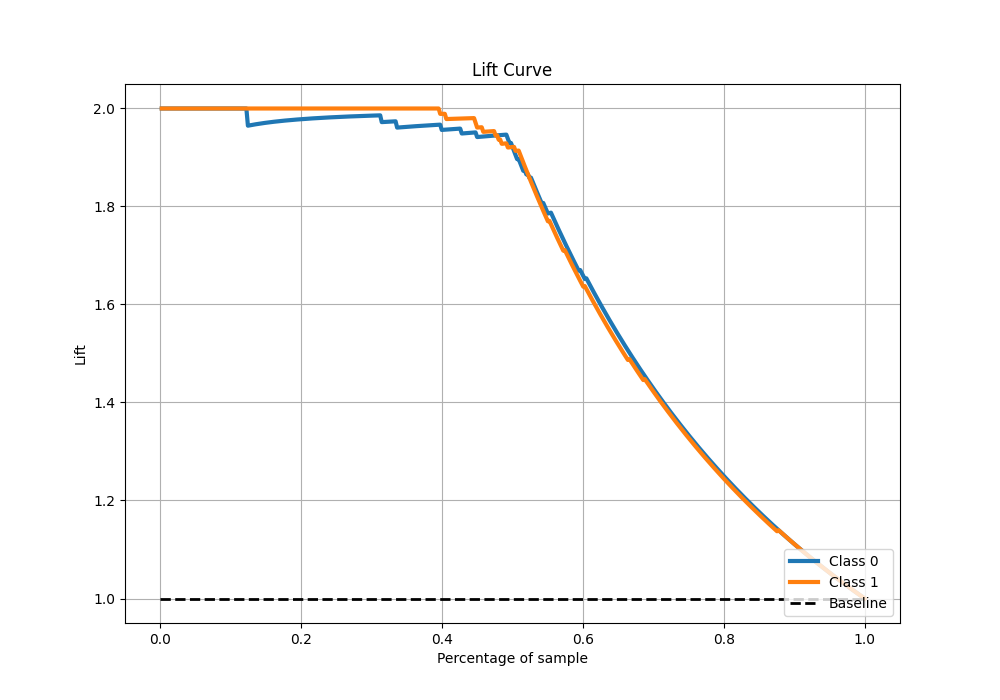

# Summary of 23_LightGBM

[<< Go back](../README.md)

## LightGBM
- **n_jobs**: -1
- **objective**: binary
- **num_leaves**: 63
- **learning_rate**: 0.05
- **feature_fraction**: 0.9
- **bagging_fraction**: 1.0
- **min_data_in_leaf**: 20
- **metric**: binary_logloss
- **custom_eval_metric_name**: None
- **explain_level**: 0

## Validation
 - **validation_type**: kfold
 - **shuffle**: True
 - **stratify**: True
 - **k_folds**: 10

## Optimized metric
logloss

## Training time

14.6 seconds

## Metric details
|           |    score |    threshold |
|:----------|---------:|-------------:|
| logloss   | 0.131008 | nan          |
| auc       | 0.98792  | nan          |
| f1        | 0.965368 |   0.249998   |
| accuracy  | 0.965066 |   0.249998   |
| precision | 1        |   0.943099   |
| recall    | 1        |   4.0149e-09 |
| mcc       | 0.930273 |   0.249998   |

## Metric details with threshold from accuracy metric
|           |    score |   threshold |
|:----------|---------:|------------:|
| logloss   | 0.131008 |  nan        |
| auc       | 0.98792  |  nan        |
| f1        | 0.965368 |    0.249998 |
| accuracy  | 0.965066 |    0.249998 |
| precision | 0.957082 |    0.249998 |
| recall    | 0.973799 |    0.249998 |
| mcc       | 0.930273 |    0.249998 |

## Confusion matrix (at threshold=0.249998)
|              |   Predicted as 0 |   Predicted as 1 |
|:-------------|-----------------:|-----------------:|
| Labeled as 0 |              219 |               10 |
| Labeled as 1 |                6 |              223 |

## Learning curves

## Confusion Matrix

## Normalized Confusion Matrix

## ROC Curve

## Kolmogorov-Smirnov Statistic

## Precision-Recall Curve

## Calibration Curve

## Cumulative Gains Curve

## Lift Curve

[<< Go back](../README.md)
