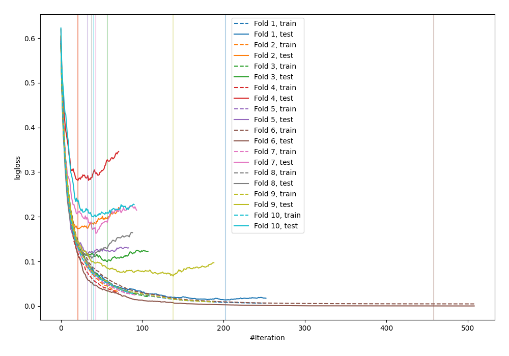
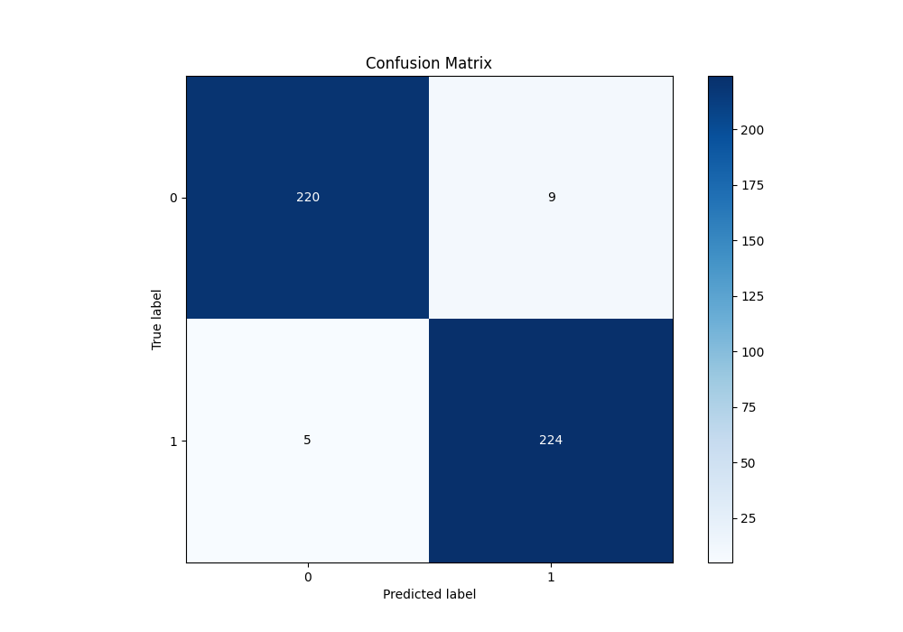
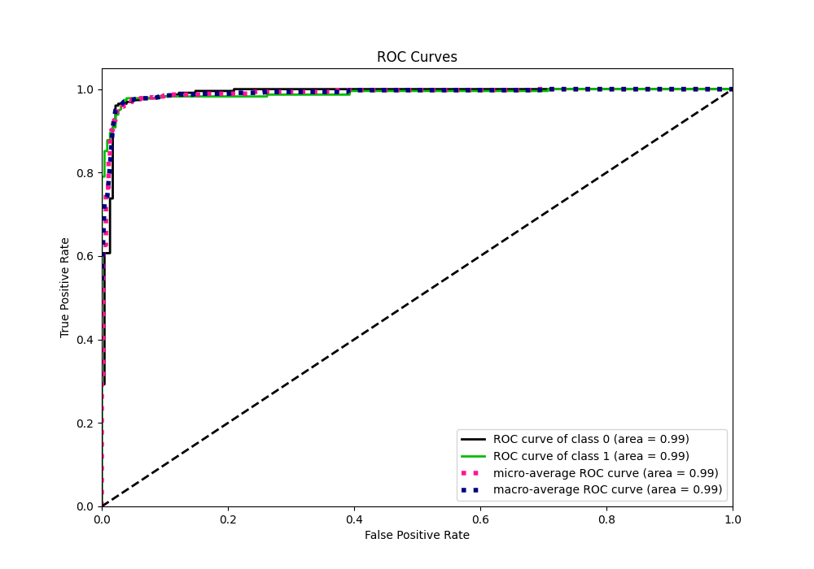
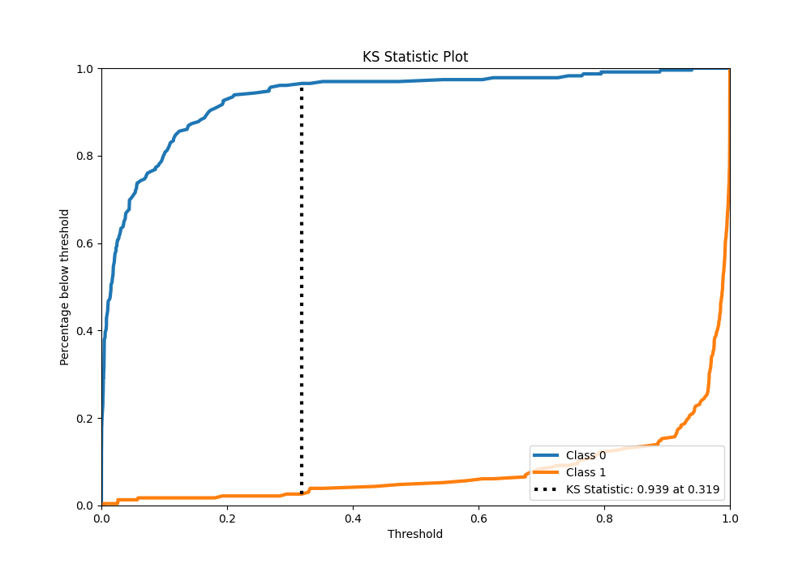
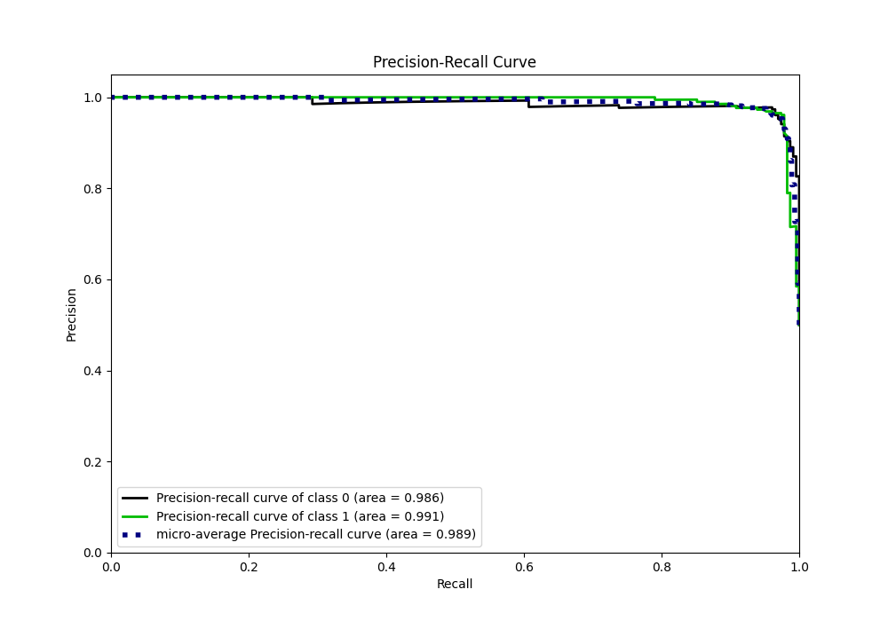
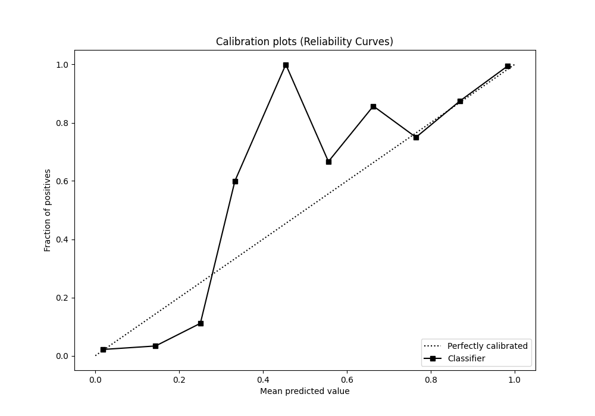
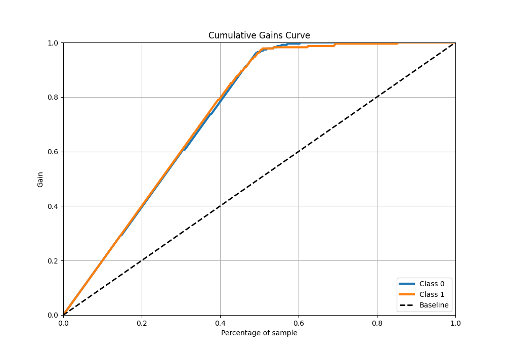
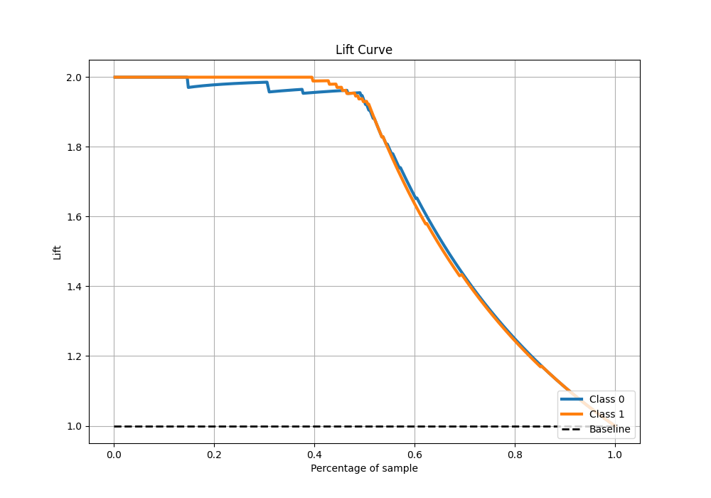

# Summary of 25_LightGBM

[<< Go back](../README.md)

## LightGBM
- **n_jobs**: -1
- **objective**: binary
- **num_leaves**: 63
- **learning_rate**: 0.2
- **feature_fraction**: 0.5
- **bagging_fraction**: 1.0
- **min_data_in_leaf**: 30
- **metric**: binary_logloss
- **custom_eval_metric_name**: None
- **explain_level**: 0

## Validation
 - **validation_type**: kfold
 - **shuffle**: True
 - **stratify**: True
 - **k_folds**: 10

## Optimized metric
logloss

## Training time

14.8 seconds

## Metric details
|           |    score |     threshold |
|:----------|---------:|--------------:|
| logloss   | 0.122106 | nan           |
| auc       | 0.989083 | nan           |
| f1        | 0.969697 |   0.28944     |
| accuracy  | 0.969432 |   0.28944     |
| precision | 1        |   0.941556    |
| recall    | 1        |   2.72276e-13 |
| mcc       | 0.939008 |   0.28944     |

## Metric details with threshold from accuracy metric
|           |    score |   threshold |
|:----------|---------:|------------:|
| logloss   | 0.122106 |   nan       |
| auc       | 0.989083 |   nan       |
| f1        | 0.969697 |     0.28944 |
| accuracy  | 0.969432 |     0.28944 |
| precision | 0.961373 |     0.28944 |
| recall    | 0.978166 |     0.28944 |
| mcc       | 0.939008 |     0.28944 |

## Confusion matrix (at threshold=0.28944)
|              |   Predicted as 0 |   Predicted as 1 |
|:-------------|-----------------:|-----------------:|
| Labeled as 0 |              220 |                9 |
| Labeled as 1 |                5 |              224 |

## Learning curves

## Confusion Matrix

## Normalized Confusion Matrix

## ROC Curve

## Kolmogorov-Smirnov Statistic

## Precision-Recall Curve

## Calibration Curve

## Cumulative Gains Curve

## Lift Curve

[<< Go back](../README.md)
