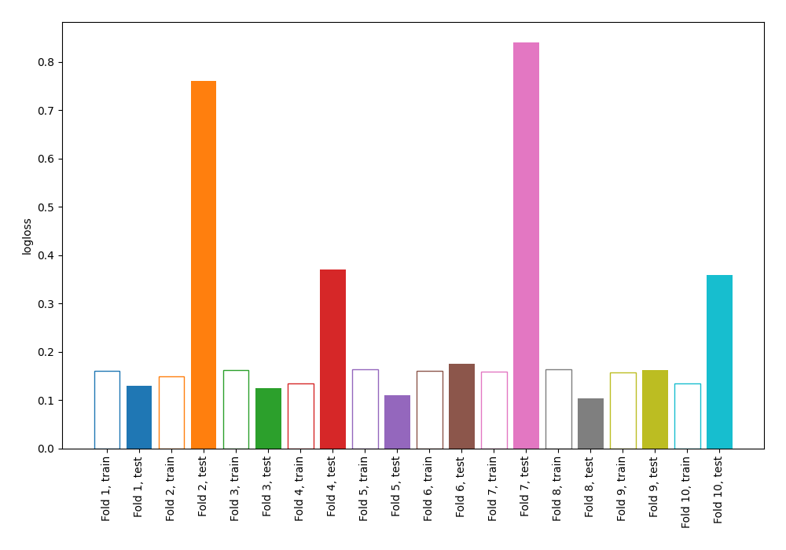
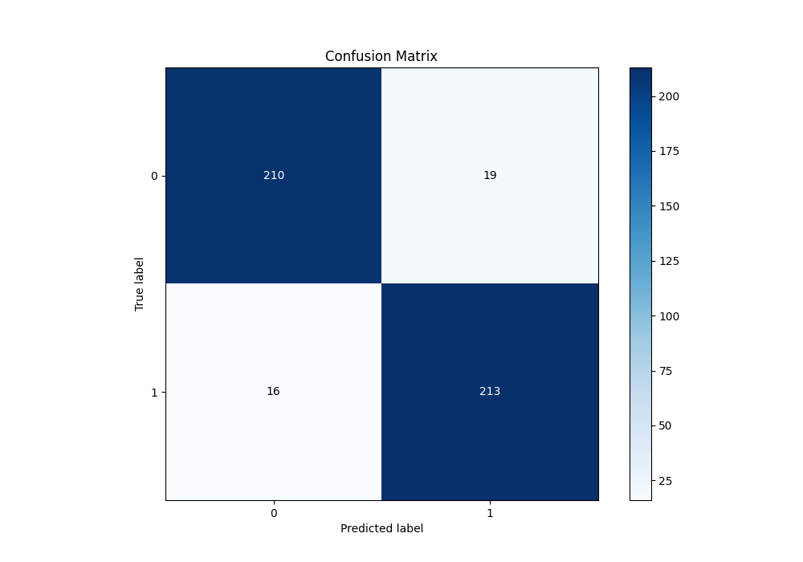
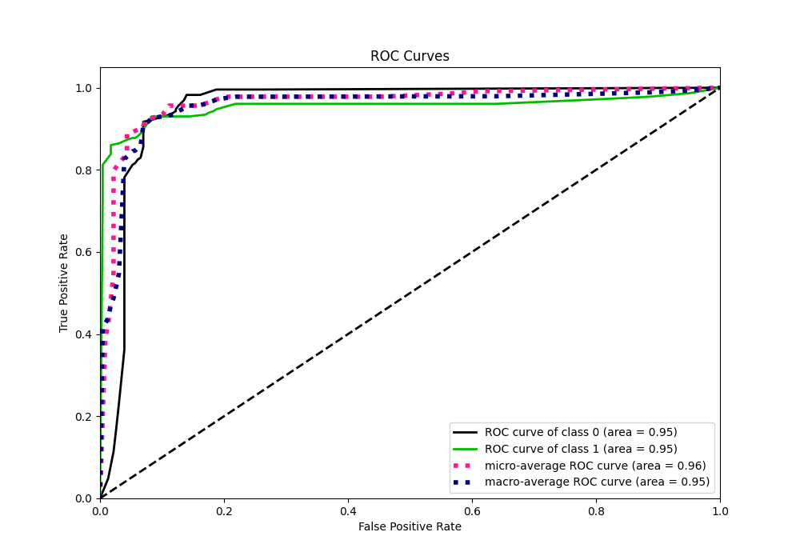
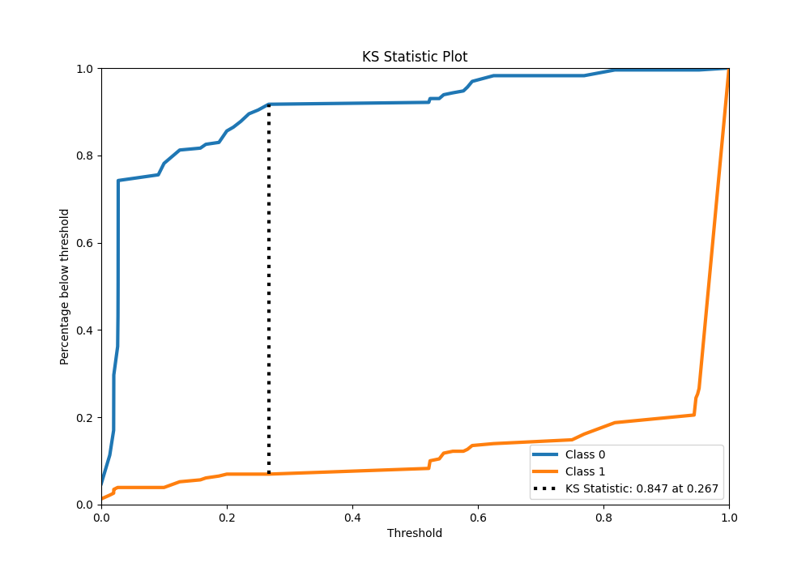
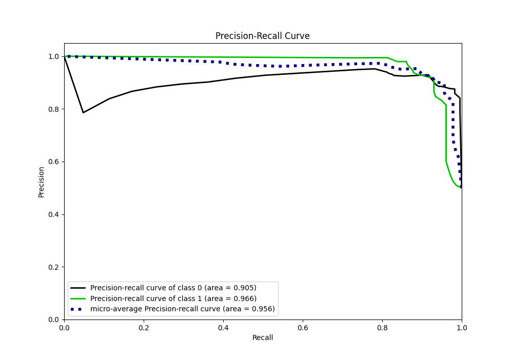
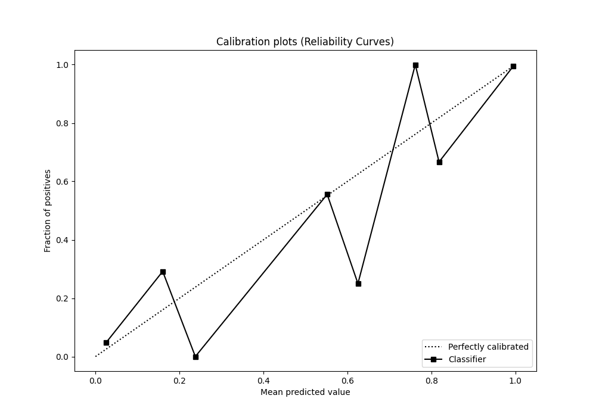
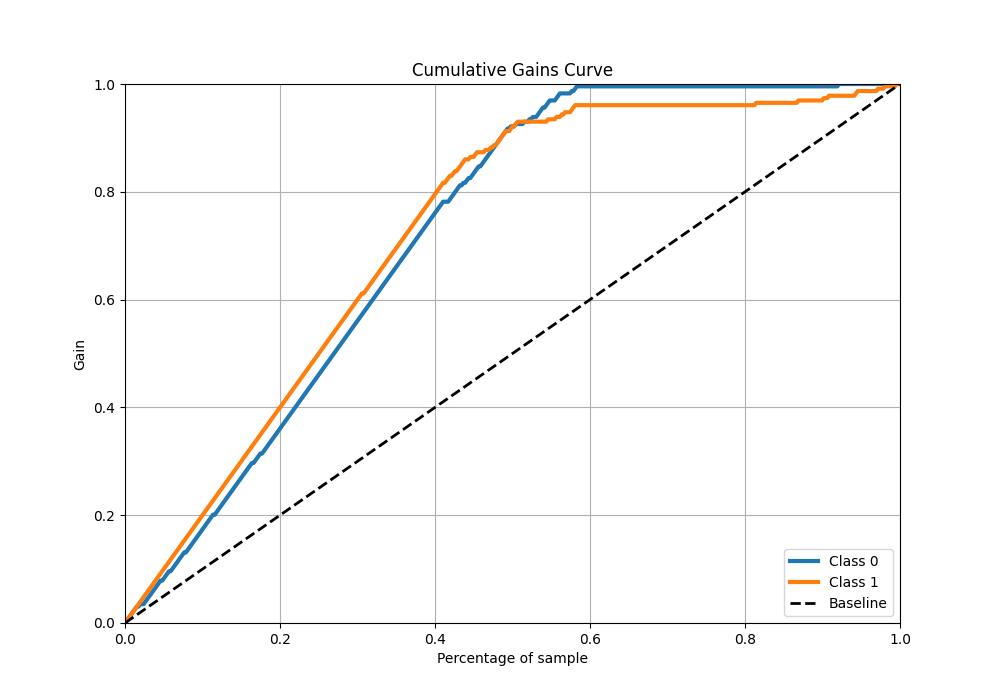
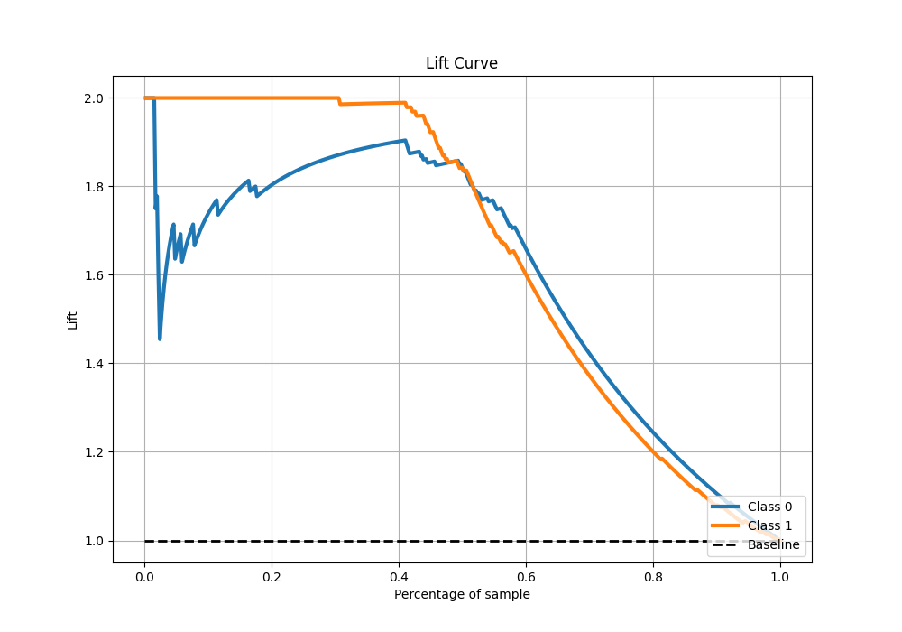

# Summary of 2_DecisionTree

[<< Go back](../README.md)

## Decision Tree
- **n_jobs**: -1
- **criterion**: gini
- **max_depth**: 4
- **explain_level**: 0

## Validation
 - **validation_type**: kfold
 - **shuffle**: True
 - **stratify**: True
 - **k_folds**: 10

## Optimized metric
logloss

## Training time

4.6 seconds

## Metric details
|           |    score |   threshold |
|:----------|---------:|------------:|
| logloss   | 0.313541 |  nan        |
| auc       | 0.95309  |  nan        |
| f1        | 0.924078 |    0.266667 |
| accuracy  | 0.923581 |    0.266667 |
| precision | 0.994652 |    0.818182 |
| recall    | 0.9869   |    0        |
| mcc       | 0.849166 |    0.6875   |

## Metric details with threshold from accuracy metric
|           |    score |   threshold |
|:----------|---------:|------------:|
| logloss   | 0.313541 |  nan        |
| auc       | 0.95309  |  nan        |
| f1        | 0.924078 |    0.266667 |
| accuracy  | 0.923581 |    0.266667 |
| precision | 0.918103 |    0.266667 |
| recall    | 0.930131 |    0.266667 |
| mcc       | 0.847234 |    0.266667 |

## Confusion matrix (at threshold=0.266667)
|              |   Predicted as 0 |   Predicted as 1 |
|:-------------|-----------------:|-----------------:|
| Labeled as 0 |              210 |               19 |
| Labeled as 1 |               16 |              213 |

## Learning curves

## Confusion Matrix

## Normalized Confusion Matrix

## ROC Curve

## Kolmogorov-Smirnov Statistic

## Precision-Recall Curve

## Calibration Curve

## Cumulative Gains Curve

## Lift Curve

[<< Go back](../README.md)
