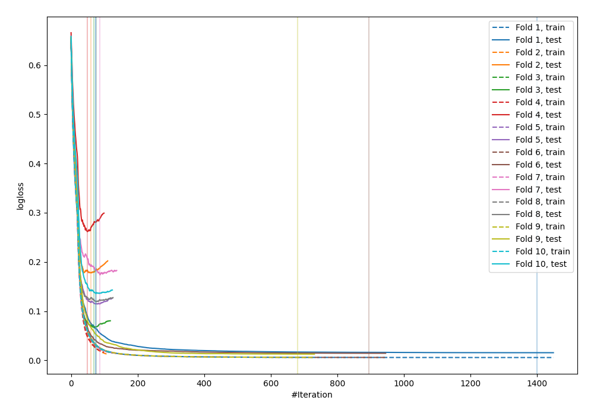
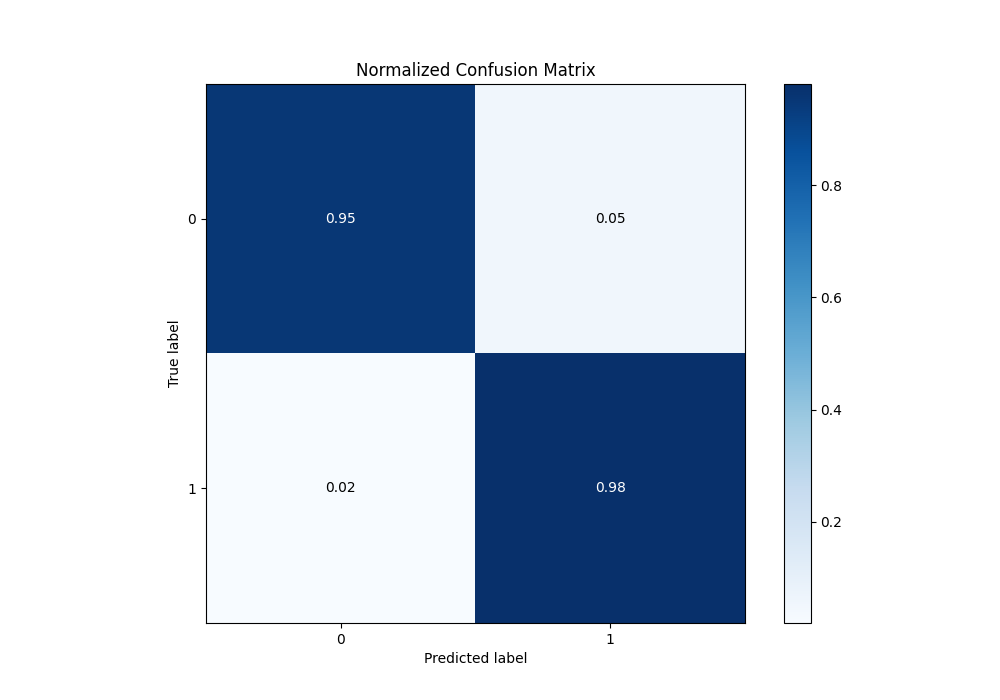
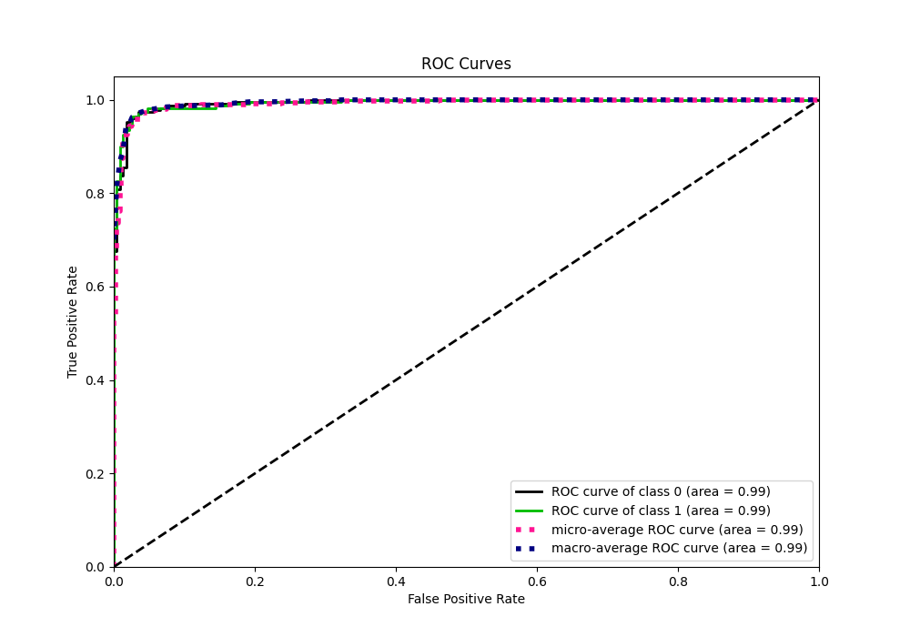
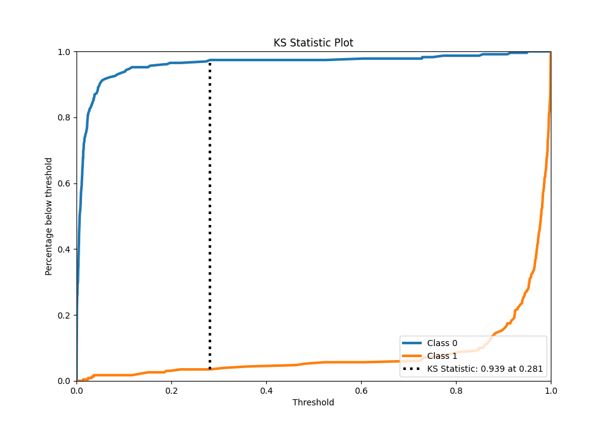
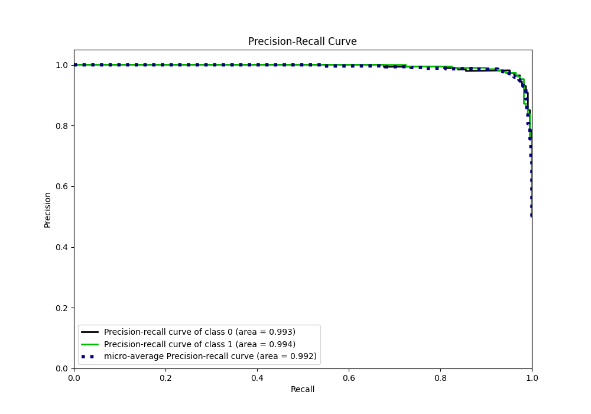
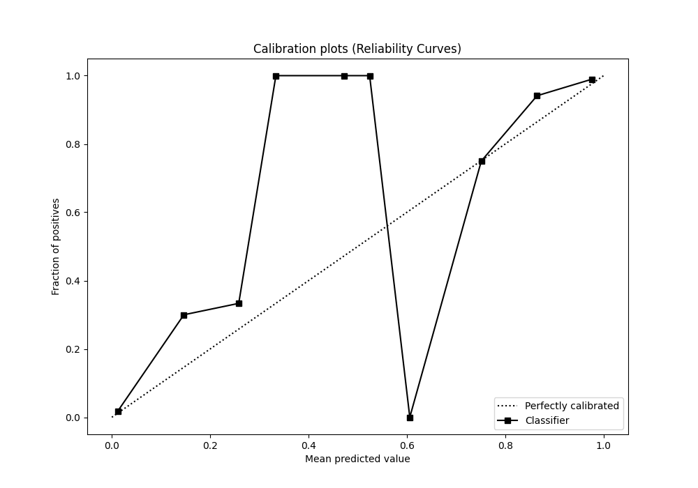
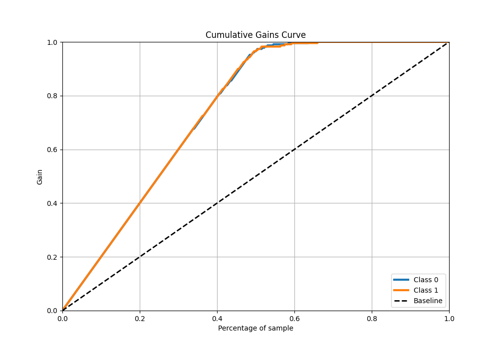
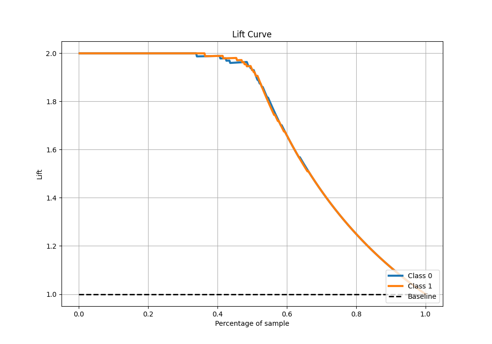

# Summary of 32_CatBoost

[<< Go back](../README.md)

## CatBoost
- **n_jobs**: -1
- **learning_rate**: 0.1
- **depth**: 7
- **rsm**: 1.0
- **loss_function**: Logloss
- **eval_metric**: Logloss
- **explain_level**: 0

## Validation
 - **validation_type**: kfold
 - **shuffle**: True
 - **stratify**: True
 - **k_folds**: 10

## Optimized metric
logloss

## Training time

19.2 seconds

## Metric details
|           |    score |     threshold |
|:----------|---------:|--------------:|
| logloss   | 0.109369 | nan           |
| auc       | 0.993326 | nan           |
| f1        | 0.965665 |   0.114513    |
| accuracy  | 0.965066 |   0.114513    |
| precision | 1        |   0.952774    |
| recall    | 1        |   4.25201e-05 |
| mcc       | 0.930699 |   0.114513    |

## Metric details with threshold from accuracy metric
|           |    score |   threshold |
|:----------|---------:|------------:|
| logloss   | 0.109369 |  nan        |
| auc       | 0.993326 |  nan        |
| f1        | 0.965665 |    0.114513 |
| accuracy  | 0.965066 |    0.114513 |
| precision | 0.949367 |    0.114513 |
| recall    | 0.982533 |    0.114513 |
| mcc       | 0.930699 |    0.114513 |

## Confusion matrix (at threshold=0.114513)
|              |   Predicted as 0 |   Predicted as 1 |
|:-------------|-----------------:|-----------------:|
| Labeled as 0 |              217 |               12 |
| Labeled as 1 |                4 |              225 |

## Learning curves

## Confusion Matrix

## Normalized Confusion Matrix

## ROC Curve

## Kolmogorov-Smirnov Statistic

## Precision-Recall Curve

## Calibration Curve

## Cumulative Gains Curve

## Lift Curve

[<< Go back](../README.md)
