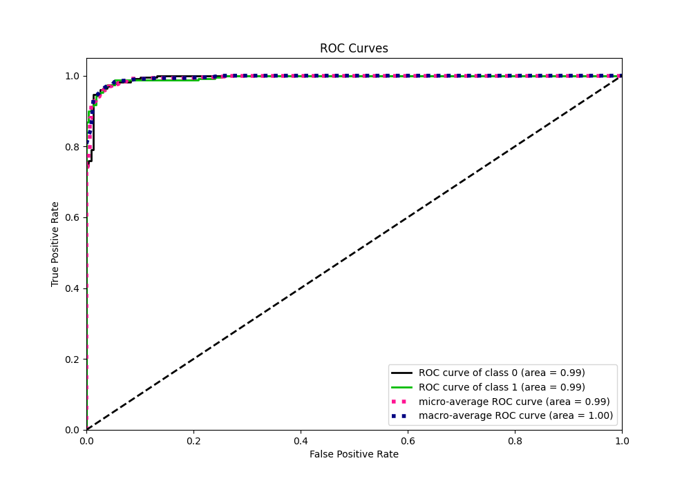

# Summary of 34_CatBoost_KMeansFeatures

[<< Go back](../README.md)

## CatBoost
- **n_jobs**: -1
- **learning_rate**: 0.1
- **depth**: 6
- **rsm**: 0.7
- **loss_function**: Logloss
- **eval_metric**: Logloss
- **explain_level**: 0

## Validation
 - **validation_type**: kfold
 - **shuffle**: True
 - **stratify**: True
 - **k_folds**: 10

## Optimized metric
logloss

## Training time

31.0 seconds

## Metric details
|           |    score |     threshold |
|:----------|---------:|--------------:|
| logloss   | 0.100147 | nan           |
| auc       | 0.994527 | nan           |
| f1        | 0.965368 |   0.193789    |
| accuracy  | 0.965066 |   0.193789    |
| precision | 1        |   0.918829    |
| recall    | 1        |   9.09971e-05 |
| mcc       | 0.930273 |   0.193789    |

## Metric details with threshold from accuracy metric
|           |    score |   threshold |
|:----------|---------:|------------:|
| logloss   | 0.100147 |  nan        |
| auc       | 0.994527 |  nan        |
| f1        | 0.965368 |    0.193789 |
| accuracy  | 0.965066 |    0.193789 |
| precision | 0.957082 |    0.193789 |
| recall    | 0.973799 |    0.193789 |
| mcc       | 0.930273 |    0.193789 |

## Confusion matrix (at threshold=0.193789)
|              |   Predicted as 0 |   Predicted as 1 |
|:-------------|-----------------:|-----------------:|
| Labeled as 0 |              219 |               10 |
| Labeled as 1 |                6 |              223 |

## Learning curves

## Confusion Matrix

## Normalized Confusion Matrix

## ROC Curve

## Kolmogorov-Smirnov Statistic

## Precision-Recall Curve

## Calibration Curve

## Cumulative Gains Curve

## Lift Curve

[<< Go back](../README.md)
