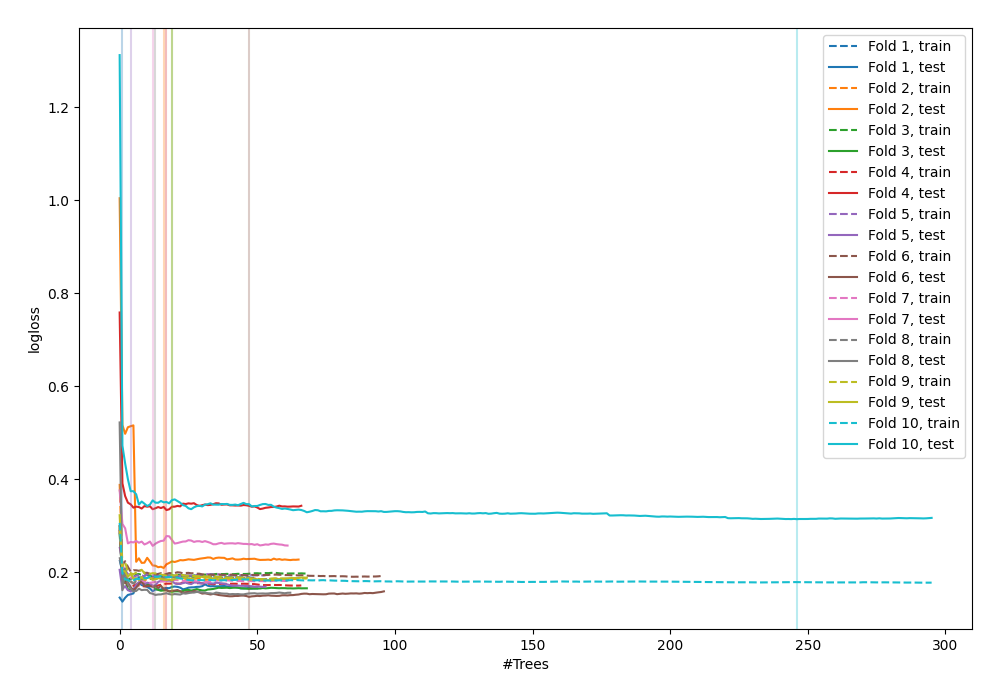

# Summary of 39_RandomForest

[<< Go back](../README.md)

## Random Forest
- **n_jobs**: -1
- **criterion**: gini
- **max_features**: 0.5
- **min_samples_split**: 20
- **max_depth**: 4
- **eval_metric_name**: logloss
- **explain_level**: 0

## Validation
 - **validation_type**: kfold
 - **shuffle**: True
 - **stratify**: True
 - **k_folds**: 10

## Optimized metric
logloss

## Training time

12.6 seconds

## Metric details
|           |    score |   threshold |
|:----------|---------:|------------:|
| logloss   | 0.204734 | nan         |
| auc       | 0.98033  | nan         |
| f1        | 0.946188 |   0.591993  |
| accuracy  | 0.947598 |   0.591993  |
| precision | 1        |   0.88944   |
| recall    | 1        |   0.0182102 |
| mcc       | 0.896428 |   0.591993  |

## Metric details with threshold from accuracy metric
|           |    score |   threshold |
|:----------|---------:|------------:|
| logloss   | 0.204734 |  nan        |
| auc       | 0.98033  |  nan        |
| f1        | 0.946188 |    0.591993 |
| accuracy  | 0.947598 |    0.591993 |
| precision | 0.97235  |    0.591993 |
| recall    | 0.921397 |    0.591993 |
| mcc       | 0.896428 |    0.591993 |

## Confusion matrix (at threshold=0.591993)
|              |   Predicted as 0 |   Predicted as 1 |
|:-------------|-----------------:|-----------------:|
| Labeled as 0 |              223 |                6 |
| Labeled as 1 |               18 |              211 |

## Learning curves

## Confusion Matrix

## Normalized Confusion Matrix

## ROC Curve

## Kolmogorov-Smirnov Statistic

## Precision-Recall Curve

## Calibration Curve

## Cumulative Gains Curve

## Lift Curve

[<< Go back](../README.md)
