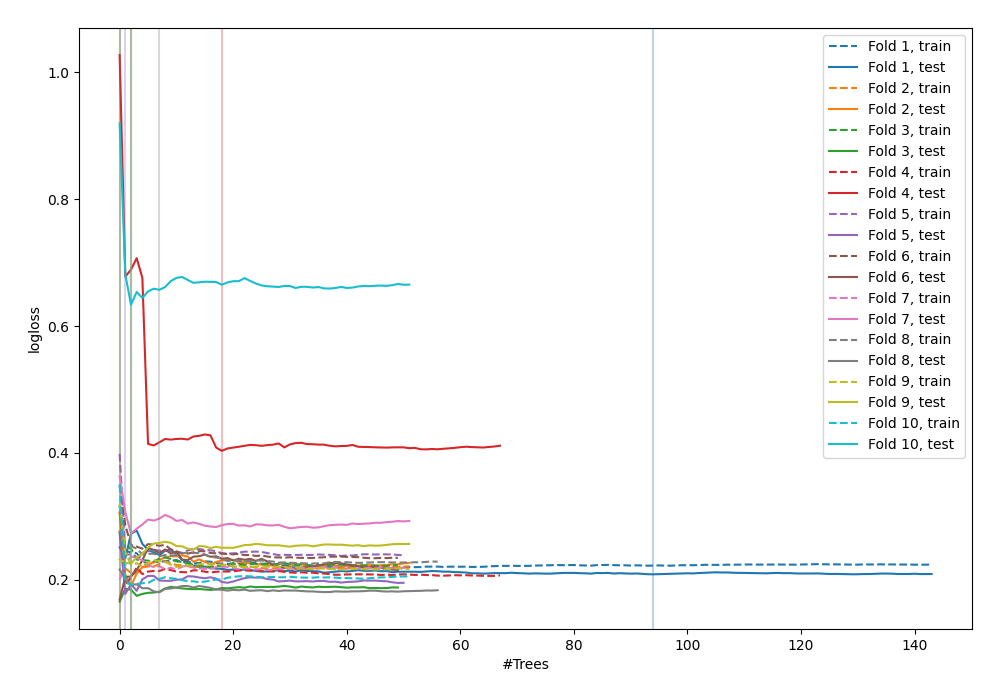
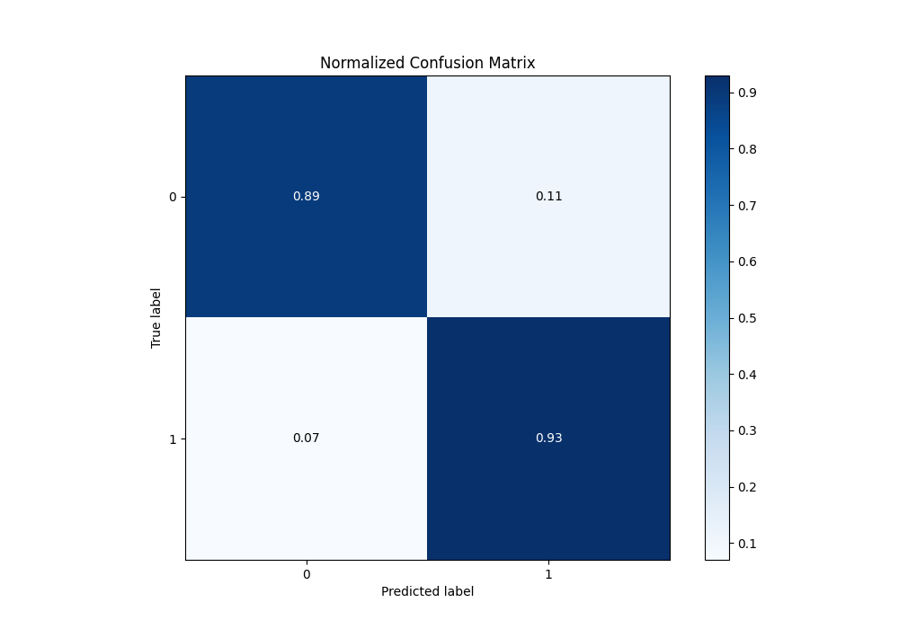
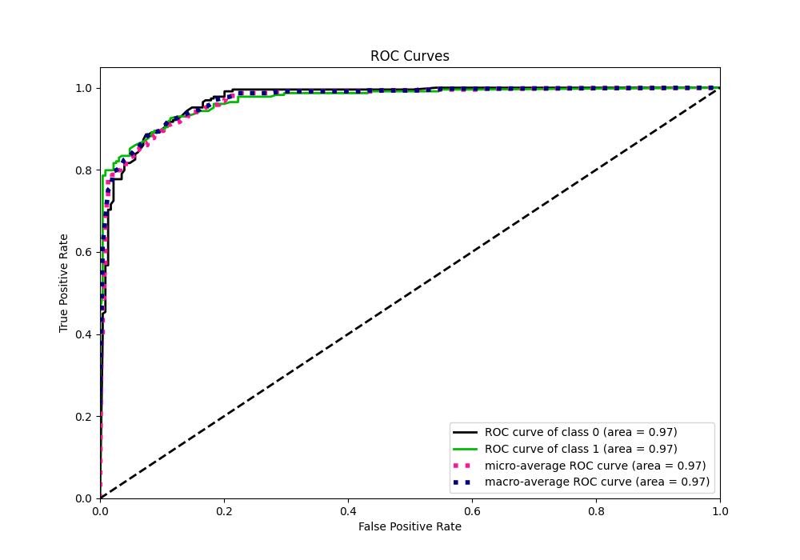
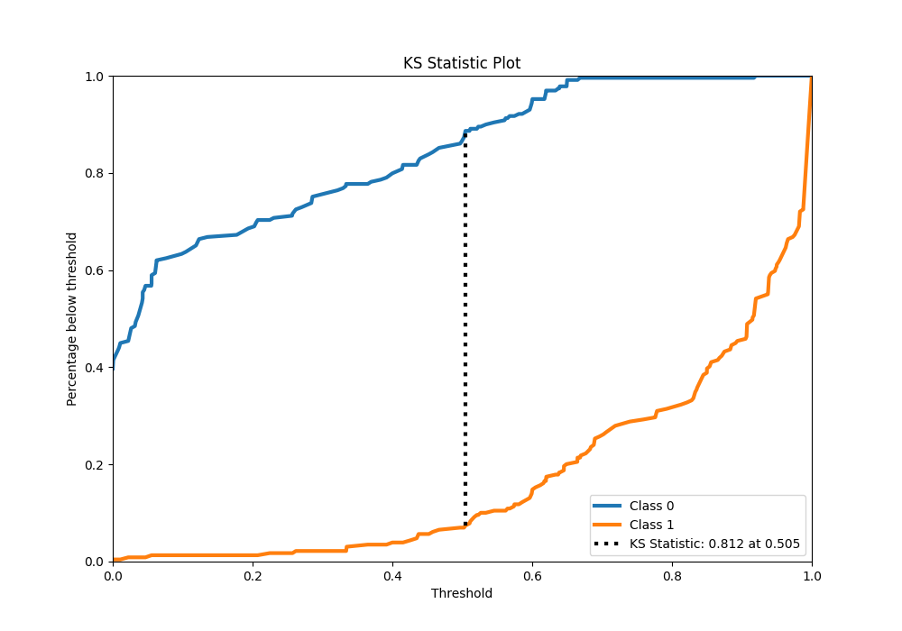
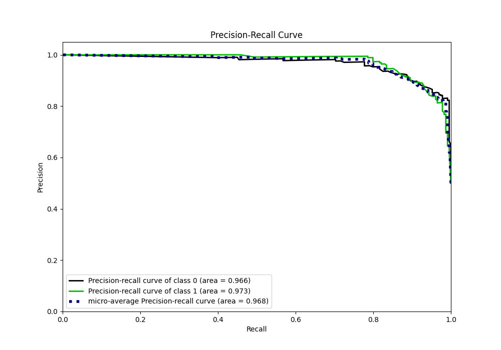
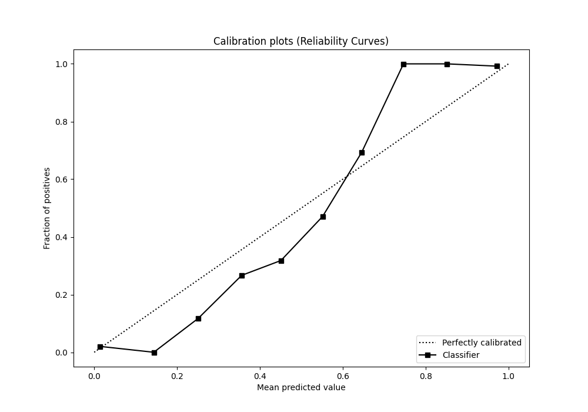
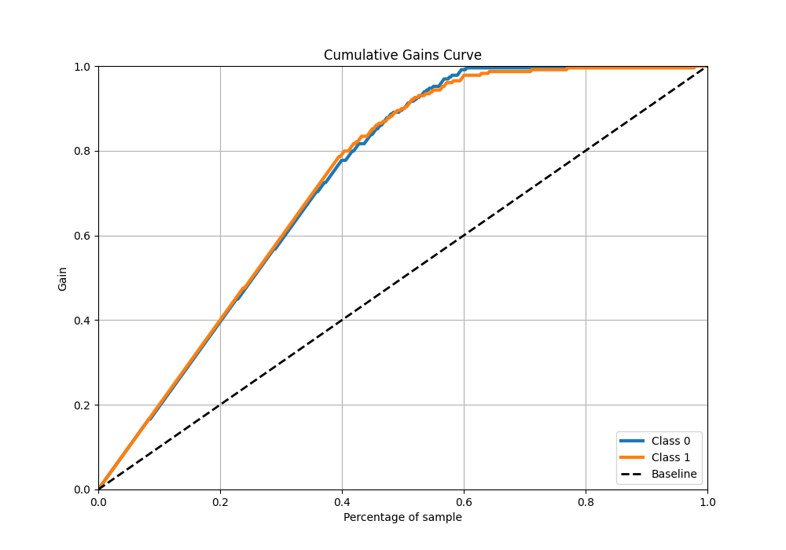
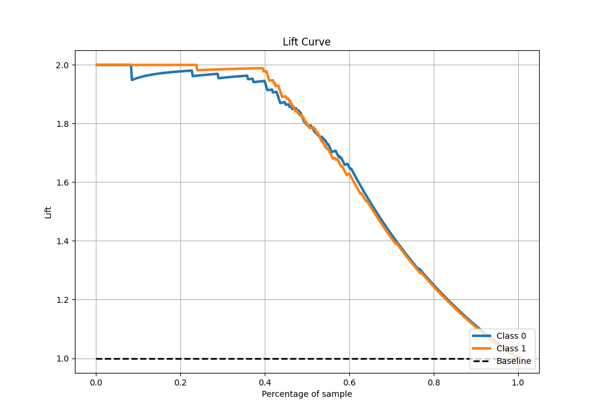

# Summary of 44_RandomForest

[<< Go back](../README.md)

## Random Forest
- **n_jobs**: -1
- **criterion**: gini
- **max_features**: 1.0
- **min_samples_split**: 40
- **max_depth**: 7
- **eval_metric_name**: logloss
- **explain_level**: 0

## Validation
 - **validation_type**: kfold
 - **shuffle**: True
 - **stratify**: True
 - **k_folds**: 10

## Optimized metric
logloss

## Training time

18.2 seconds

## Metric details
|           |    score |   threshold |
|:----------|---------:|------------:|
| logloss   | 0.261804 |  nan        |
| auc       | 0.970586 |  nan        |
| f1        | 0.907923 |    0.504539 |
| accuracy  | 0.906114 |    0.504539 |
| precision | 1        |    0.92     |
| recall    | 0.995633 |    0        |
| mcc       | 0.812855 |    0.504539 |

## Metric details with threshold from accuracy metric
|           |    score |   threshold |
|:----------|---------:|------------:|
| logloss   | 0.261804 |  nan        |
| auc       | 0.970586 |  nan        |
| f1        | 0.907923 |    0.504539 |
| accuracy  | 0.906114 |    0.504539 |
| precision | 0.890756 |    0.504539 |
| recall    | 0.925764 |    0.504539 |
| mcc       | 0.812855 |    0.504539 |

## Confusion matrix (at threshold=0.504539)
|              |   Predicted as 0 |   Predicted as 1 |
|:-------------|-----------------:|-----------------:|
| Labeled as 0 |              203 |               26 |
| Labeled as 1 |               17 |              212 |

## Learning curves

## Confusion Matrix

## Normalized Confusion Matrix

## ROC Curve

## Kolmogorov-Smirnov Statistic

## Precision-Recall Curve

## Calibration Curve

## Cumulative Gains Curve

## Lift Curve

[<< Go back](../README.md)
